# Rapid Reference {#rapid_reference}

```{r}
shock <- readxl::read_excel("data/rapid_reference.xlsx", sheet ="shock")

respiratory <- readxl::read_excel("data/rapid_reference.xlsx", sheet = "respiratory")
```

## Calling for Help

**BCH**

```{r bch, out.width="100%"}

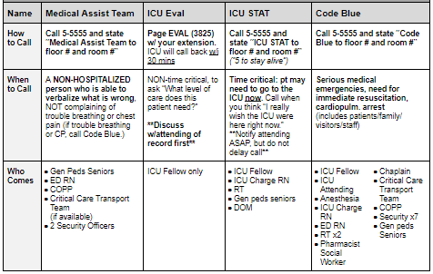

```

**BMC**

```{r bmc, out.width="100%"}
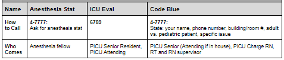
```

## PALS

**PALS Quick References**

Vital Signs in Children

```{r vs_in_children, out.width="100%"}
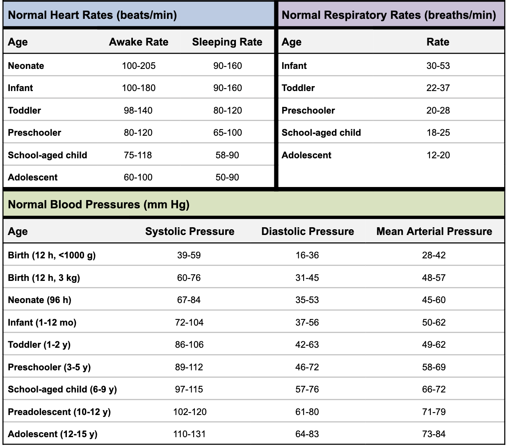
```

**Pediatric Color-Coded Length-Based Resuscitation Tape**

```{r vs, out.width="100%"}
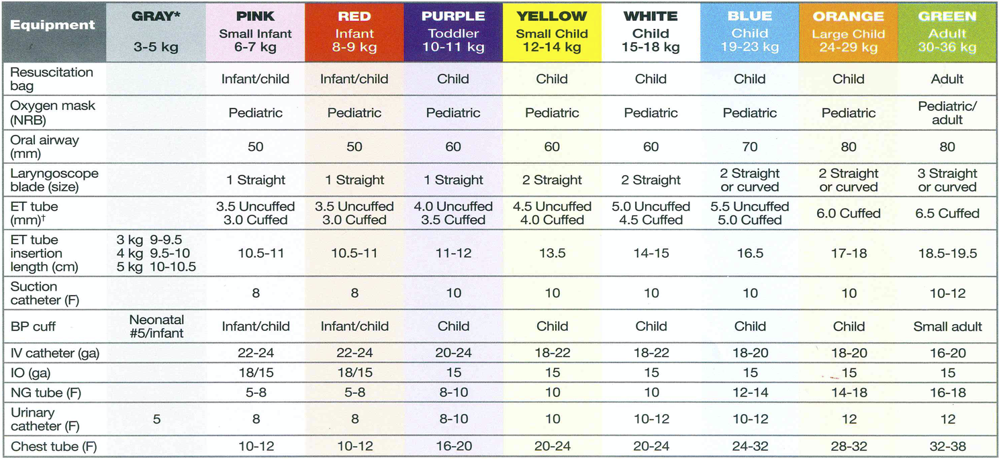
```

**PALS Algorithms**

***PALS Systematic Approach Algorithm***

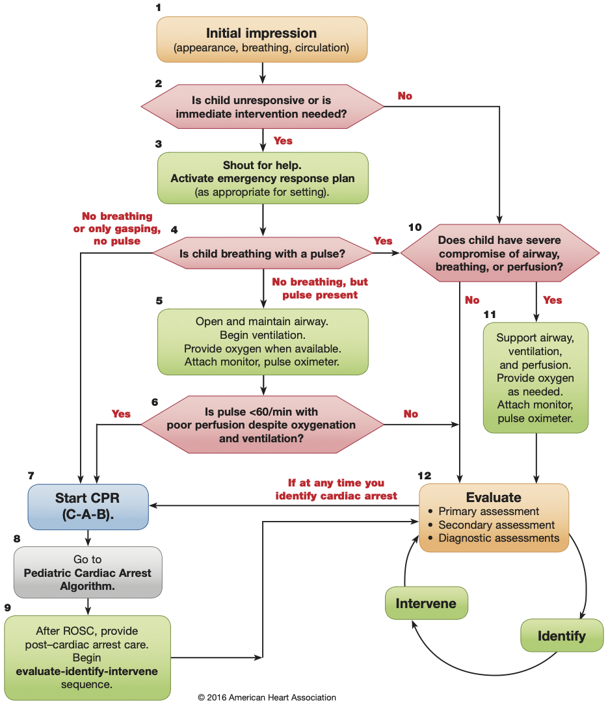

***Bradycardia with a Pulse and Poor Perfusion Algorithm***

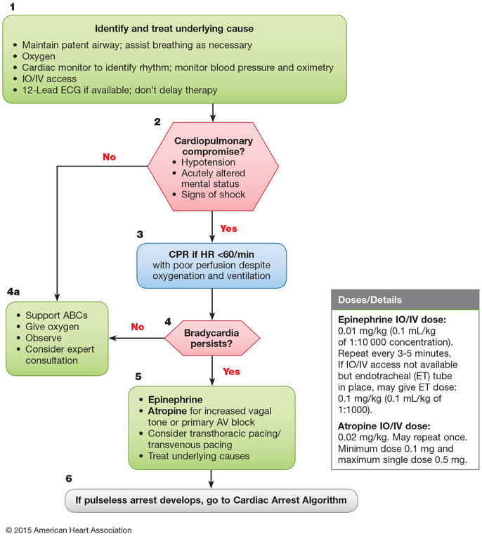

***Tachycardia with a Pulse and Poor Perfusion Algorithm***

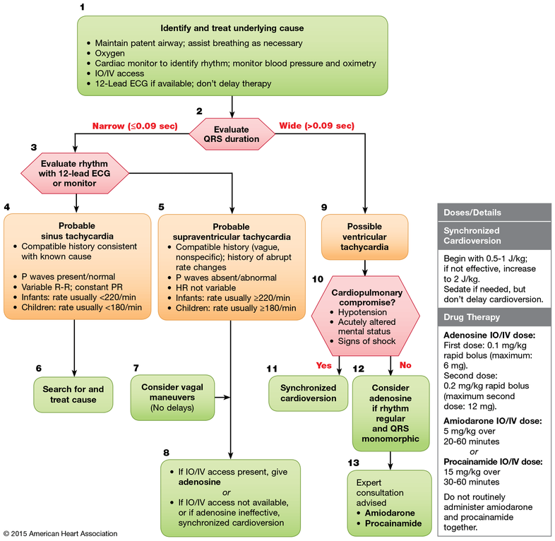

***Cardiac Arrest***

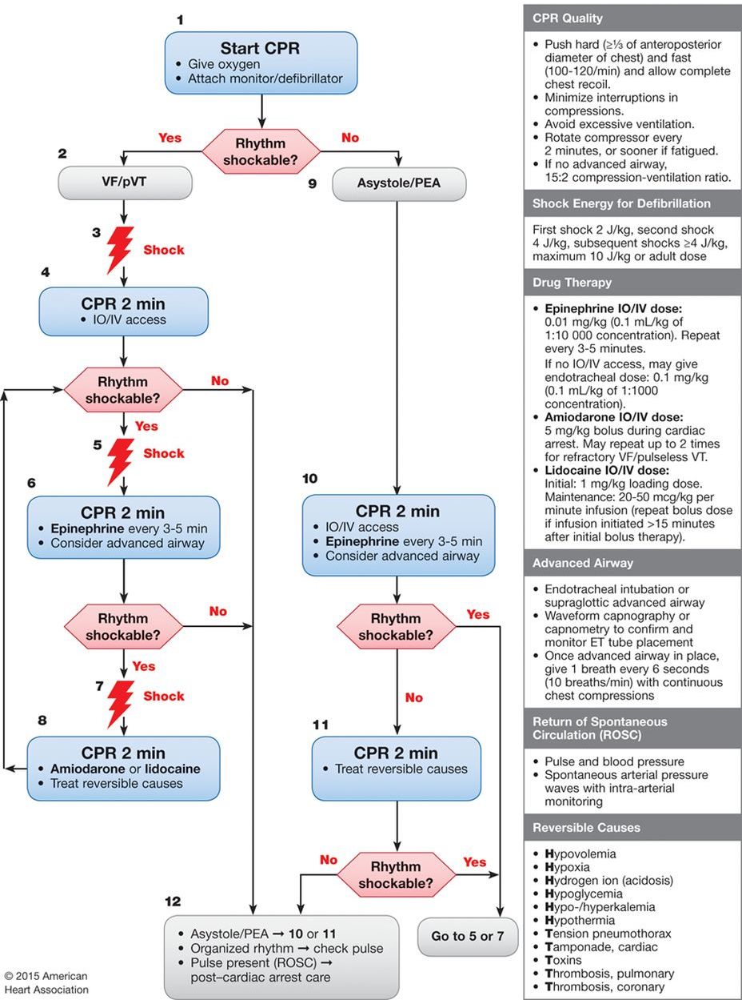 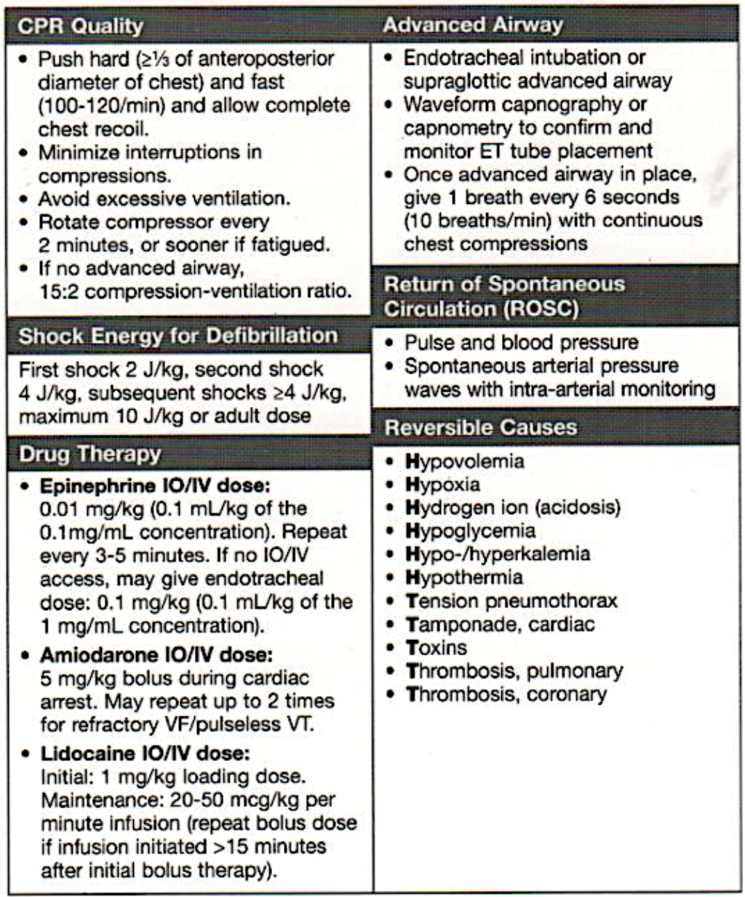

***Management of Shock After ROSC Algorithm***

```{r, out.width="100%"}
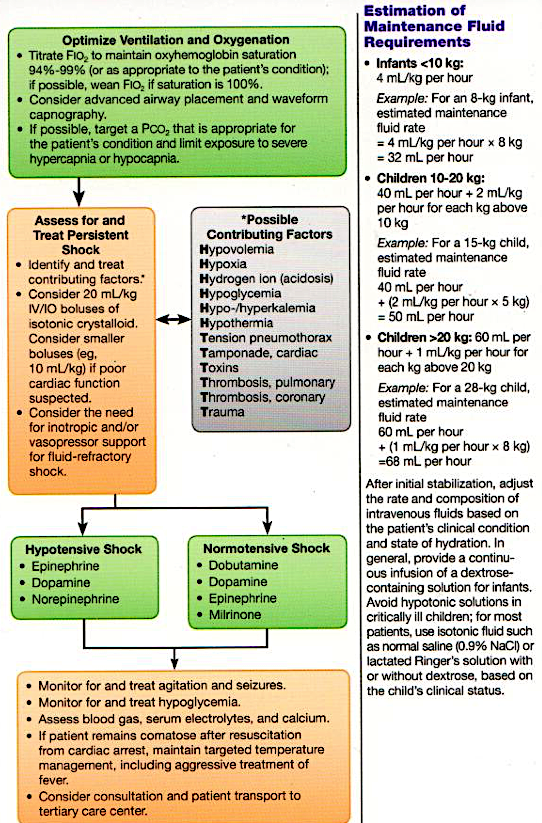
```

***Drugs Used in PALS***

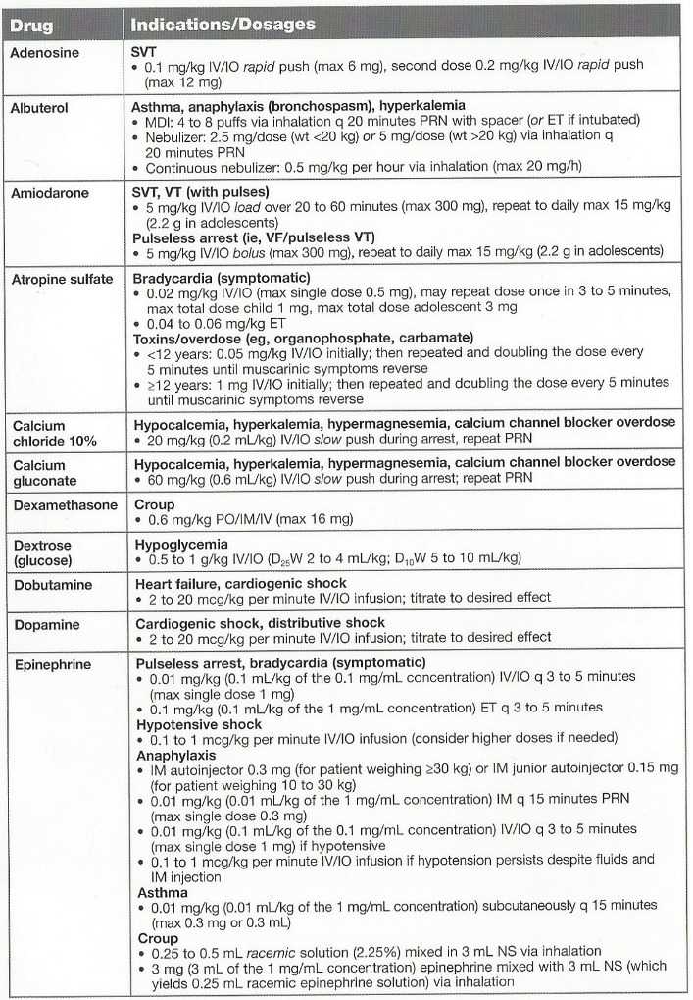 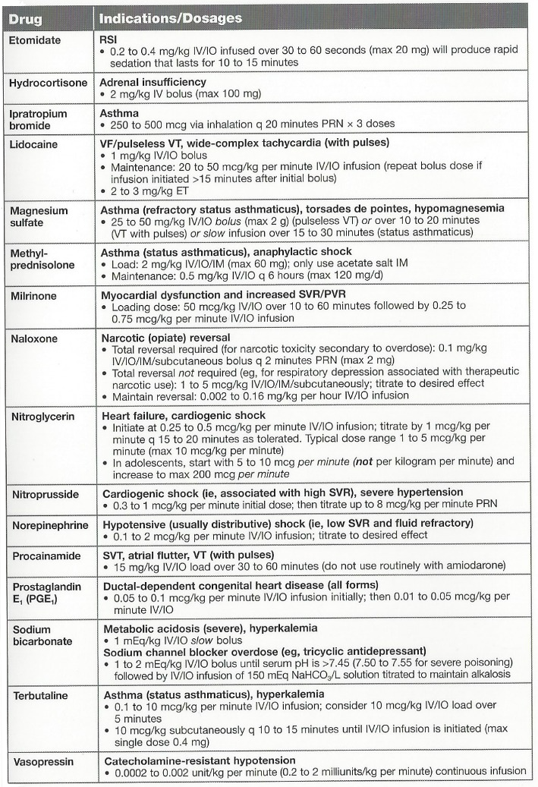

### Shock


**Recognition of Shock**

```{r, out.width="100%"}
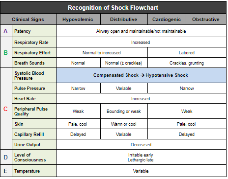
```

***Management of Shock***

-   Oxygen
-   Pulse oximetry
-   ECG monitor
-   IV/IO access
-   BLS as indicated
-   POCT glucose

**Hypovolemic Shock**

```{r hypovolemic_shock, echo=FALSE, warning=FALSE, message=FALSE}

options(knitr.kable.NA = '')

kableExtra::kable(shock) %>%
    kable_styling(bootstrap_options = c("striped", "hover", "condensed", "responsive"))

```

#### Distributive Shock

**Septic**

Management Algorithm: Septic Shock

**Anaphylactic**

- IM epinephrine (or autoinjector)

- Fluid boluses (20mL/kg NS/LR)

- Albuterol

- Antihistamines, corticosteroids

- Epinephrine infusion

**Neurogenic**

- 20mL/kg NS/LR bolus, repeat PRN

- Vasopressor


#### Cardiogenic Shock

**Bradyarrhythmia/Tachyarrhythmia**

**Other**
(e.g. CHD, myocarditis, cardiomyopathy, poisoning)  

- 5 to 10 mL/kg NS/LR bolus, repeat PRN

- Vasoactive infusion

- Consider expert consultation

#### Obstructive Shock


**Ductal-Dependent**
(LV outflow obstruction)

- Prostaglandin E1

- Expert consultation

**Tension Pneumothorax**

- Needle decompression

- Tube thoracostomy

**Cardiac Tamponade**

- Pericardiocentesis

- 20 mL/kg NS/LR bolus

**Pulmonary Embolism**

- 20 mL/kg NS/LR bolus, repeat PRN

- Consider thrombolytics, anticoagulants

- Expert consultation


**Hemodynamic Parameters in Shock**

+------------------+---------------------------------------------------------------------------------+------------------------+--------------------+----------------+------------------------+----------------------------------------------------------------------------------------------------------------------------------------------------------------------------------------+
| Type             | Examples                                                                        | Preload<br>(CVP, PCWP) | Afterload<br>(SVR) | CO<br>(SV\*HR) | Mixed Venous O2 (MVO2) | Management                                                                                                                                                                             |
+==================+=================================================================================+========================+====================+================+========================+========================================================================================================================================================================================+
| **Distributive** | \- Sepsis<br>- Anaphylaxis<br>- Severe neurologic injury (loss of α-1 activity) | ↓                      | ↓                  | ↑ then ↓       | ↑                      | \- **Sepsis:** Crystalloid (20 cc/kg NS, repeat PRN) + abx<br>- **Anaphylaxis:** Epi + crystalloid<br>- **Neurogenic:** Crystalloid + α-active pressors, (norepi \@ 0.05-2 mcg/kg/min) |
+------------------+---------------------------------------------------------------------------------+------------------------+--------------------+----------------+------------------------+----------------------------------------------------------------------------------------------------------------------------------------------------------------------------------------+
| **Hypovolemic**  | \- Blood loss<br>- GI or Renal losses<br>- ↓ intake                             | ↑                      | ↑                  | ↑              | ↓                      | \- **Crystalloid replacement:** 20 cc/kg, repeat PRN<br>- For blood loss: Consider pRBCs                                                                                               |
+------------------+---------------------------------------------------------------------------------+------------------------+--------------------+----------------+------------------------+----------------------------------------------------------------------------------------------------------------------------------------------------------------------------------------+
| **Cardiogenic**  | \- Myocarditis<br>- MI<br>- Dysrhythmia                                         | ↑                      | ↑                  | ↑              | ↓                      | Targeted at etiology: **Inotropes,** revascularization, **anti-arrhythmics,** cardiovert                                                                                               |
+------------------+---------------------------------------------------------------------------------+------------------------+--------------------+----------------+------------------------+----------------------------------------------------------------------------------------------------------------------------------------------------------------------------------------+
| **Obstructive**  | \- Tamponade - PE                                                               | ↑                      | ↑                  | ↑              | ↓                      | **Fix obstruction** (pericardiocentesis, thrombectomy/lysis for PE)                                                                                                                    |
+------------------+---------------------------------------------------------------------------------+------------------------+--------------------+----------------+------------------------+----------------------------------------------------------------------------------------------------------------------------------------------------------------------------------------+

### Respiratory Emergencies

**Medications to Avoid in Children with Neuromuscular Disease**

Recall that the use of succinylcholine for intubation of children w/ neuromuscular diseases may trigger life-threatening conditions, such as hyperkalemia or malignant hyperthermia. Several commonly used drugs, such as aminoglycosides, have intrinsic neuromuscular blocking activity that can worsen respiratory muscle weakness.

**Management of Respiratory Emergencies Flowchart**

Summarizes general management of respiratory emergencies and specific management by etiology. Note that this chart does not include all respiratory emergencies; it provides key management strategies for a limited number of diseases.

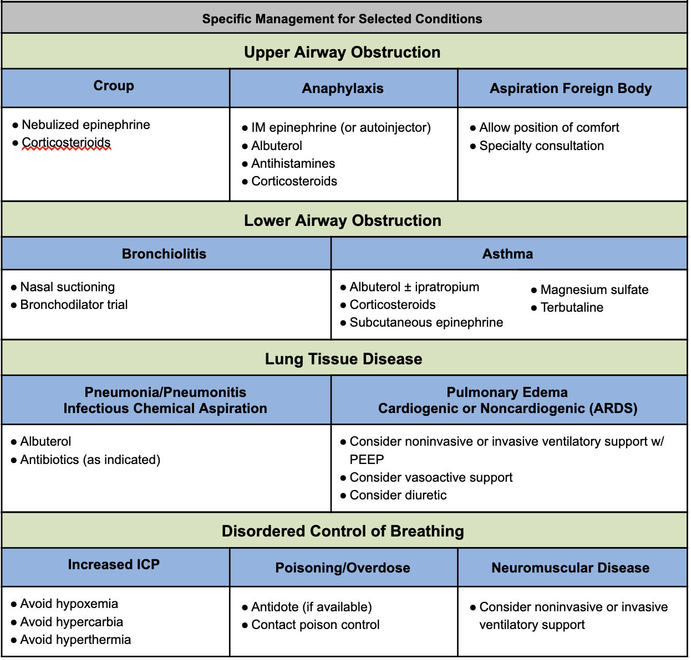

## Infectious Disease

### Sepsis Huddle

**Huddle Steps**

Resident Responsibilities

1.  **Review vital sign trend**
2.  **Examine patient** (especially respiratory, mental status, perfusion)
3.  **Discuss IV access**
4.  **Review antibiotic plan:** New agent(s) needed, delivery priority, need for ID consult
5.  **Consider fluid bolus**
6.  Discuss plan for repeat assessment

***USE SEPSIS POWERPLAN TO ENSURE STAT IV ANTIBIOTICS AND FLUIDS!***

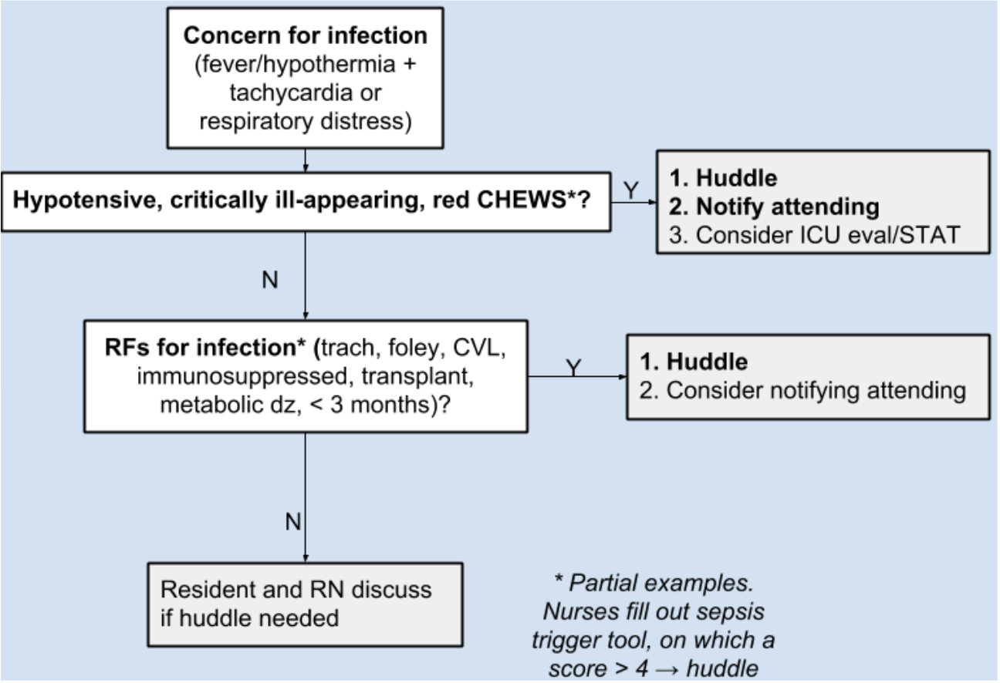

### CSF Analysis

**Age-Based Ranges for CSF Studies**

+------------------+-----------------------------+---------------------------------+---------------------------------+
| Age              | WBC (mm\^3)<br>Mean (Range) | Glucose (mg/dL)<br>Mean (Range) | Protein (mg/dL)<br>Mean (Range) |
+==================+=============================+=================================+=================================+
| **Premature**    | 9                           | 50 (24-63)                      | 115 (65-150)                    |
+------------------+-----------------------------+---------------------------------+---------------------------------+
| **Term newborn** | 8.2 (0-22)                  | 52 (34-119)                     | 90 (20-170)                     |
+------------------+-----------------------------+---------------------------------+---------------------------------+
| **0-4 wks**      | 11 (0-35)                   | 46 (36-61)                      | 84 (35-189)                     |
+------------------+-----------------------------+---------------------------------+---------------------------------+
| **4-8 wks**      | 7.1 (0-25)                  | 46 (29-62)                      | 59 (19-121)                     |
+------------------+-----------------------------+---------------------------------+---------------------------------+
| **\>8 wks**      | 2.3 (0-5)                   | 61 (45-65)                      | 28 (20-45)                      |
+------------------+-----------------------------+---------------------------------+---------------------------------+

#### General Heuristics for CSF Interpretation"

+--------------------------+--------------------------------------------------------+-------------------------+----------------------+------------------+-------------------------------------------------------------------------------------------------------------------+
| Diagnosis                | WBC                                                    | Glucose                 | Protein              | Opening Pressure | Other                                                                                                             |
+==========================+========================================================+=========================+======================+==================+===================================================================================================================+
| **Bacterial meningitis** | ↑, mostly PMNs                                         | ↓ (\<60% serum glucose) | ↑↑                   | ↑                | +CSF Cx / gram stain, often +BCx                                                                                  |
+--------------------------+--------------------------------------------------------+-------------------------+----------------------+------------------+-------------------------------------------------------------------------------------------------------------------+
| **Viral meningitis**     | Slightly ↑, mostly lymphocytes                         | Normal                  | Normal to slightly ↑ | Normal           | HSV may have RBCs in CSF                                                                                          |
+--------------------------+--------------------------------------------------------+-------------------------+----------------------+------------------+-------------------------------------------------------------------------------------------------------------------+
| **TB meningitis**        | ↑ (PMNs → lymphocytes)                                 | ↓ (\<60% serum glucose) | ↑                    | Variable         | +AFB                                                                                                              |
+--------------------------+--------------------------------------------------------+-------------------------+----------------------+------------------+-------------------------------------------------------------------------------------------------------------------+
| **Fungal meningitis**    | ↑, lymphocytes                                         | ↓ (\<60% serum glucose) | ↑                    | Variable         | Fungal Cx                                                                                                         |
+--------------------------+--------------------------------------------------------+-------------------------+----------------------+------------------+-------------------------------------------------------------------------------------------------------------------+
| **GBS**                  | Normal                                                 | Normal                  | ↑↑                   | Normal           | So-called "albumino-cytologic dissociation"                                                                       |
+--------------------------+--------------------------------------------------------+-------------------------+----------------------+------------------+-------------------------------------------------------------------------------------------------------------------+
| **SAH**                  | Normal (accounting for peripheral ratio of RBC to WBC) | Normal                  | ↑                    | Normal to ↑      | Xanthochromia = yellow appearance of CSF, suggests long-term presence of RBCs (to distinguish from traumatic tap) |
+--------------------------+--------------------------------------------------------+-------------------------+----------------------+------------------+-------------------------------------------------------------------------------------------------------------------+

## Respiratory

### Status Asthmaticus

#### A-B-C

**Epinephrine** 0.01 mg/kg IM PRN extremis

#### Initial treatment

-   **PowerPlans & Order Sets:** ED Asthma Status Plan

-   **"Unineb"** = Albuterol + ipratropium combination nebs

    -   *NOTE:* 1x Unineb = 3x Combineb

-   **Steroids** (if no improvement after first neb or if patient on home steroids)

    -   Dexamethasone = dosed q24-48h, 0.6 mg/kg
    -   Prednisone/Prednisolone = dosed q12h, 2mg/kg
    -   Methylprednisolone 2mg/kg

#### If poor response, add

-   **Magnesium sulfate** 40mg/kg (2mg max)

    -   Monitor for hypotension, consider NS bolus

-   **Continuous nebulized albuterol**

    -   Titrate to HR

#### If poor response continues, add

-   **Terbutaline:** Loading dose 5-10 mCg/kg IV/SC over 10m. Infusion 0.4 mCg/kg/min IV.

    -   EKG, troponin, CK q12h

-   Consider **Heliox** 70:30 helium:oxygen mixture

#### If impending respiratory failure

-   **Rapid sequence intubation**
-   **Mechanical ventilation:** Minimize PEEP, maximize E time. Permissive hypercapnia. Anticipate air leak, pneumothorax, bronchospasm, PEA.

#### As patient improves

"Last on, first off" to peel off therapy

### ABGs & VBGs

-   Presented as: **pH / pCO2 / pO2 / HCO3**

-   **Venous pH + 0.035 = Arterial pH**

-   Look at past VBGs for baseline pCO2 (e.g. chronically elevated in ex-preemies w/ CLD)

-   VBGs sufficient to assess acid-base status & clinical response to treatments (in general). **ABG preferred over VBG:**

    -   to accurately determine **PaCO2 in severe shock**
    -   to accurately determine PaCO2 if hypercapnic (i.e. PaCO2 \>45 mmHg)

#### Stepwise Approach to ABG/VBG Interpretation

1.  **Compare pH** to normal range

2.  Identify the **primary process** that led to the change in pH (using PCO2/HCO3)

3.  Calculate the **serum anion gap (SAG)**

    -   **SAG = Na+ - (Cl- + HCO3-).** If **\>12,** there is a primary AG metabolic acidosis

4.  Identify the **compensatory process** (if one is present)

5.  Identify if any other disorders are present or there is a **mixed acid-base process using delta/delta = (AG - 12) / (24 - Bicarb)**

    -   \< 0.4 → pure Non-AG Metabolic Acidosis (NAGMA)
    -   0.4 - 0.8 → mixed NAGMA + High-AG Metabolic Acidosis (HAGMA)
    -   0.8 - 2.0 → a pure HAGMA
    -   \> 2.0 → mixed HAGMA + metabolic alkalosis

#### Normal Blood Gas Values

|                   | Arterial    | Venous      |
|-------------------|-------------|-------------|
| **pH**            | 7.35 - 7.45 | 7.31 - 7.41 |
| **pCO2** (mmHg)   | 35 - 45     | 40 - 50     |
| **pO2** (mmHg)    | 75 - 100    | 36 - 42     |
| **HCO3** (meQ/L)  | 22 - 26     | Same        |
| **BE**            | -2 to +2    | Same        |
| **O2 Saturation** | \>95%       | 60-80%      |

#### Compensation

+---------------------------+--------+-------------------------------------------------------------------------------------------------------------------------+
| Disorder                  | Defect | Compensatory Response\*\*                                                                                               |
+===========================+========+=========================================================================================================================+
| **Respiratory Acidosis**  | ↑ pCO2 | **↑ HCO3**<br>- *Acute* = **+1** MeQ/L HCO3 for +10 mm Hg PaCO2<br>- *Chronic* = **+4** MeQ/L HCO3- for +10 mm Hg PaCO2 |
+---------------------------+--------+-------------------------------------------------------------------------------------------------------------------------+
| **Respiratory Alkalosis** | ↓ pCO2 | **↓ HCO3**<br>- *Acute* = **-2** MeQ/L HCO3 for -10 mm Hg PaCO2<br>- *Chronic* = **-5** MeQ/L HCO3- for -10 mm Hg PaCO2 |
+---------------------------+--------+-------------------------------------------------------------------------------------------------------------------------+
| **Metabolic Acidosis**    | ↓ HCO3 | **↓ pCO2**<br>- pCO2 = 1.5 x HCO3 + 8 +/- 2 (**Winter's Formula**)                                                      |
+---------------------------+--------+-------------------------------------------------------------------------------------------------------------------------+
| **Metabolic Alkalosis**   | ↑ HCO3 | **↑ pCO2**<br>- pCO2 **+ 0.6** for + 1.0 mEq/L HCO3                                                                     |
+---------------------------+--------+-------------------------------------------------------------------------------------------------------------------------+

\*\* HCO3 = kidneys (**days**). CO2 = lungs (**minutes**).<br> \*\*\* **Limits of compensation:** HCO3 = 15-38. CO2 = 10.

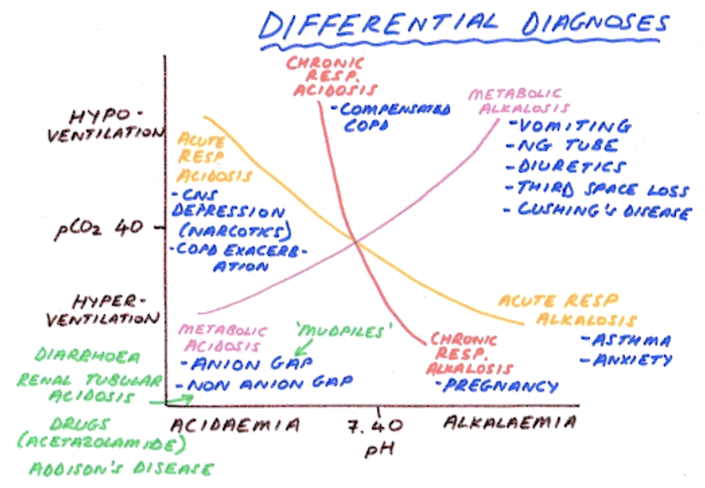

### Respiratory Support for Spontaneously Breathing Patients

+------------------------------------+------------------------------------------------------------------------------------------------+-------------------------------------------------------------------------------------------------------------------------------------------------------------+------------------------------------------------------------------------------------------------------------------------------+---------------------------------------------------------------------------------------+------------------------------------------------------------------------------------+---------------------------------------------------------------------------------------------------------+
| Type                               | O2 Delivery                                                                                    | CO2 Exit                                                                                                                                                    | FiO2                                                                                                                         | Rate                                                                                  | Pros                                                                               | Cons                                                                                                    |
+====================================+================================================================================================+=============================================================================================================================================================+==============================================================================================================================+=======================================================================================+====================================================================================+=========================================================================================================+
| **"Blow By" Oxygen (BBO2)**        | O2 tubing or simple mask held by a child's face                                                | Mouth                                                                                                                                                       | **\<30%** (limited evidence)                                                                                                 | At least 10L/min through a reservoir (such as mask)                                   | Can be used in children who can't tolerate other methods                           | Limited and variable O2 delivery                                                                        |
+------------------------------------+------------------------------------------------------------------------------------------------+-------------------------------------------------------------------------------------------------------------------------------------------------------------+------------------------------------------------------------------------------------------------------------------------------+---------------------------------------------------------------------------------------+------------------------------------------------------------------------------------+---------------------------------------------------------------------------------------------------------+
| **Low Flow Nasal Cannula (LFNC)**  | Through nasal prongs attached to tubing                                                        | Mouth                                                                                                                                                       | **25-40%** (100% O2 delivers variable FiO2 based on placement of nares, patient's inspiratory effort and minute ventilation) | **1-4L/min** (Rates \>2L/min can create Positive airway pressure in newborns/infants) | Mobile, infants can feed w/ low-flow in place, may be better tolerated than a mask | \- Cannot reliably deliver high concentrations of FiO2<br>- Prongs can be difficult to keep in position |
+------------------------------------+------------------------------------------------------------------------------------------------+-------------------------------------------------------------------------------------------------------------------------------------------------------------+------------------------------------------------------------------------------------------------------------------------------+---------------------------------------------------------------------------------------+------------------------------------------------------------------------------------+---------------------------------------------------------------------------------------------------------+
| **High Flow Nasal Cannula (HFNC)** |                                                                                                |                                                                                                                                                             |                                                                                                                              | Up to **8L/min** in infants, up to **60L/min** in children/adults                     |                                                                                    |                                                                                                         |
+------------------------------------+------------------------------------------------------------------------------------------------+-------------------------------------------------------------------------------------------------------------------------------------------------------------+------------------------------------------------------------------------------------------------------------------------------+---------------------------------------------------------------------------------------+------------------------------------------------------------------------------------+---------------------------------------------------------------------------------------------------------+
| **Simple Mask**                    | O2 enters mask through a tube                                                                  | Holes in the side of the mask                                                                                                                               | **35-50%** (Room air can enter through exit holes, mixing w/ delivered O2)                                                   | **6-10L/min**                                                                         | Can deliver higher concentrations of FiO2 than NC                                  | Cannot reliably deliver precise concentrations of O2 because of mixing w/ room air                      |
+------------------------------------+------------------------------------------------------------------------------------------------+-------------------------------------------------------------------------------------------------------------------------------------------------------------+------------------------------------------------------------------------------------------------------------------------------+---------------------------------------------------------------------------------------+------------------------------------------------------------------------------------+---------------------------------------------------------------------------------------------------------+
| **Partial Rebreather**             | O2 enters the mask through a tube as well as from an **attached reservoir**                    | Holes in the sides of the mask. Room air can still enter, but not as much as w/ the simple mask.                                                            | 50-60% O2                                                                                                                    | 10-12L/min                                                                            |                                                                                    |                                                                                                         |
+------------------------------------+------------------------------------------------------------------------------------------------+-------------------------------------------------------------------------------------------------------------------------------------------------------------+------------------------------------------------------------------------------------------------------------------------------+---------------------------------------------------------------------------------------+------------------------------------------------------------------------------------+---------------------------------------------------------------------------------------------------------+
| **Non-Rebreather Mask**            | O2 enters the mask through a tube as well as from an **attached reservoir w/ a one-way valve** | Two exhalation ports; one is fitted w/ a one-way valve and one allows mixing (fail-safe so that if the O2 delivery port blocked, patient doesn't suffocate) | Up to **95% O2**                                                                                                             | **10-15L/min**                                                                        | Max FiO2 administered to a spontaneously breathing patient                         | Stored in the code cart at BCH                                                                          |
+------------------------------------+------------------------------------------------------------------------------------------------+-------------------------------------------------------------------------------------------------------------------------------------------------------------+------------------------------------------------------------------------------------------------------------------------------+---------------------------------------------------------------------------------------+------------------------------------------------------------------------------------+---------------------------------------------------------------------------------------------------------+
| **CPAP/BiPAP**                     | *See Critical Care/ICP chapter*                                                                |                                                                                                                                                             |                                                                                                                              |                                                                                       |                                                                                    |                                                                                                         |
+------------------------------------+------------------------------------------------------------------------------------------------+-------------------------------------------------------------------------------------------------------------------------------------------------------------+------------------------------------------------------------------------------------------------------------------------------+---------------------------------------------------------------------------------------+------------------------------------------------------------------------------------+---------------------------------------------------------------------------------------------------------+

```{r}


respiratory %>% kableExtra::kable() %>%
    kable_styling(c("striped", "hover", "condensed")) %>% scroll_box(width = "100%", box_css = "border: 0px;")
```

### Trach Troubleshooting

#### Tracheostomy Basics

-   **Major types:** Shiley or Bivona (more flexible, better for active children)
-   **Sizes:** A "3.0" trach has an inner diameter of 3.0 mm, sizes vary by age
-   **Cuffed vs. uncuffed:** C**uffs improve air seal and prevent aspiration,** but uncuffed allows spontaneous breathing, improved vocalization, may be appropriate for infants and small children
-   **Outer vs. inner cannula:** Outer cannula holds stoma open, inner cannula can be removed for cleaning
-   **Fenestration:** Improves vocalization
-   **Trach ties:** The part that wraps around the neck to keep trach in place

**Trach Complications**

-   **Plan ahead!**

    -   Differentiate new (\< 7 days) vs. mature stoma (\> 7 days)
    -   Know if your patient can be ventilated "from above" in event of trach malfunction
    -   Know your patient's trach brand, size, features and have replacement trach at bedside, including one size smaller

-   **Decannulation:**

    -   Staff assist, call RT urgently
    -   If new stoma, do **NOT** blindly replace trach, call ORL instead

-   **Obstruction:**

    -   **Mucous plugging** → suction, replace inner cannula, etc.
    -   **Back-walling** = Distal end of trach obstructs against posterior tracheal wall → call RT, reposition trach, may need longer trach
    -   **Tracheal stenosis or granulation tissue** → call ORL, may need to be addressed surgically
    -   Consider deflating cuff and ventilating "from above" if possible

-   **Bleeding:**

    -   Although rare, have high index of suspicion for tracheo-arterial fistula, call ORL
    -   Differentiate blood from trach vs. from stoma/trach site

## Status Epilepticus (SE)

### PowerPlans & Order Sets

Neuro Seizure Admit Plan

### Definition

-   **Neurologic emergency!**
-   Seizure lasting \> 30 min or 2 sequential seizures w/o return to baseline
-   **Refractory SE** is \> 60 min

### Presentation

Generalized SE, focal SE, hemi-convulsive status w/ hemiparesis

### Differential

Sepsis, hypoglycemia, meningitis/encephalitis, skull fracture/trauma, HTN, mass, herniation

### Management

1.  **Step 1** (0-5 min):

    -   **Monitors, O2, IV access, STAT labs** (glucose, CBC, chem10, LFTs, UA/blood/urine cultures if febrile, urine tox screen, AED levels if relevant)

    -   **Lorazepam IV** (0.1 mg/kg/dose. Max 4mg.)

    -   If no access: **Diazepam PR** (0.5 mg/kg if \<5yo; 0.3 mg/kg if 6-11yo; 0.2 mg/kg if \>11yo)

        -   *NOTE:* Rapid redistribution → increased risk of seizure recurrence

2.  **Step 2** (10-15 min):

    -   **REPEAT Lorazepam IV** (0.1 mg/kg/dose. Max 4mg.)

    -   *+* **Fosphenytoin IV** (20mg/kg infused over 7 min)

        -   *NOTE:* Will decrease BP

    -   *or* **Keppra IV** (60 mg/kg IV. Max dose 4500 mg.)

3.  **Step 3** (20-30 min):

    -   Consult Neurology. Consider LP, EKG.

    -   **Phenobarbital IV** (20mg/kg infused over 15-20 min)

        -   *NOTE:* Will decrease RR, be prepared to intubate/bag

## Psychiatric

### Anxiety, Agitation & Delirium

#### Definition

Anxiety, agitation, and delirium can often present together and can be difficult to differentiate in the seriously ill child. Management is often similar.

#### Anxiety

Common among children with chronic or life-threatening illnesses. Difficult to separate from physical symptoms; **may exacerbate physical symptoms (pain, dyspnea, etc).**

#### Agitation

Unpleasant state of arousal → loud speech, crying, ↑ motor activity/autonomic arousal

#### Delirium

An acute-onset **disturbance of consciousness that fluctuates throughout the day**

#### Management

-   **Non-pharmacologic:** Treat underlying cause, meditation, diaphragmatic breathing, massage, biofeedback therapy, **regulate sleep/wake cycle,** frequent **reorientation to time and place,** frequent reassurance, **minimize use of restraints**

-   Pharmacologic

    -   Ask Psych team when to use PO vs. IV/IM

    -   Onset of action:

        -   **PO/enteral:** Usually 30-60 min for beginning of peak effects
        -   **IM:** Usually 15-30 min
        -   **IV:** Usually 5-15 min

+-----------------------------------------------------------------------------------------------------+-------------------------------------------------------------------------------------------------------------------------------+-----------------------------------------------------------------------------------+
| Drug                                                                                                | Dose                                                                                                                          | Notes                                                                             |
+=====================================================================================================+===============================================================================================================================+===================================================================================+
| **Diphenhydramine** (Benadryl)                                                                      | 1 mg/kg per dose PO/IM/IV<br>- *Limits per 24h*: **\<=7yo:** 50-75mg; **8-12yo:** 75-100mg; **Adolescents:** 100-150mg        | \- Anticholinergic<br>- Avoid if dehydrated, CF, asthma, previous paradoxical rxn |
+-----------------------------------------------------------------------------------------------------+-------------------------------------------------------------------------------------------------------------------------------+-----------------------------------------------------------------------------------+
| **Lorazepam** (Ativan)                                                                              | **0.02-0.05 mg/kg q6h PO/SL/IV/SC**                                                                                           |                                                                                   |
+-----------------------------------------------------------------------------------------------------+-------------------------------------------------------------------------------------------------------------------------------+-----------------------------------------------------------------------------------+
| (**8-12yo:** \~0.5mg. **13yo+:** 1mg.)<br>- *Limits per 24h*: **8-12yo:** 2mg; **Adolescents:** 3mg | \- Avoid in delirium<br>- Avoid in pts \<7yo                                                                                  |                                                                                   |
+-----------------------------------------------------------------------------------------------------+-------------------------------------------------------------------------------------------------------------------------------+-----------------------------------------------------------------------------------+
| **Clonidine**                                                                                       | \- **\<=7yo:** 0.025-0.05mg first dose<br>- ***8-12yo*****:** 0.05mg first dose<br> ***13yo+*****:** 0.1mg first dose         | Useful w/ hx of ADHD, PTSD, younger children                                      |
+-----------------------------------------------------------------------------------------------------+-------------------------------------------------------------------------------------------------------------------------------+-----------------------------------------------------------------------------------+
| **Clonazepam**                                                                                      | **0.005-0.01 mg/kg PO q8-12h**<br>- Can increase every 3 days up to 0.05-0.1 mg/kg PO q8-12h (max 0.2 mg/kg/day)              | Avoid in delirium                                                                 |
+-----------------------------------------------------------------------------------------------------+-------------------------------------------------------------------------------------------------------------------------------+-----------------------------------------------------------------------------------+
| **Haloperidol** (Haldol)                                                                            | **0.01-0.02 mg/kg PO q8h** (max 0.5-1 mg)<br>- **Acute agitation:** 0.025 mg/kg PO & can repeat 0.025 mg/kg in 1 hr as needed | IM form for acute agitation, **delirium,** psychosis/mania                        |
+-----------------------------------------------------------------------------------------------------+-------------------------------------------------------------------------------------------------------------------------------+-----------------------------------------------------------------------------------+
| **Risperidone**                                                                                     | **0.25-0.5 mg PO qPM or divided** (max 3 mg/day)                                                                              | Order only w/ Psych input                                                         |
+-----------------------------------------------------------------------------------------------------+-------------------------------------------------------------------------------------------------------------------------------+-----------------------------------------------------------------------------------+
| **Quetiapine** (Seroquel)                                                                           | **25 mg q12h PO,** can increase daily by 25mg/dose, to max 100-200 mg q12h)                                                   | Order only w/ Psych input                                                         |
+-----------------------------------------------------------------------------------------------------+-------------------------------------------------------------------------------------------------------------------------------+-----------------------------------------------------------------------------------+
| **Olanzapine** (Zyprexa)                                                                            | **1.2-2.5 mg PO daily** (max 5 mg/day)                                                                                        | Order only w/ Psych input                                                         |
+-----------------------------------------------------------------------------------------------------+-------------------------------------------------------------------------------------------------------------------------------+-----------------------------------------------------------------------------------+

### Overnight Behavioral Plan

-   **PowerPlans & Order Sets:** Agitation (mild), agitation (moderate), agitation (severe), behavioral health safety plan, behavioral restraints
-   **Err on the side of more restrictive:** When in doubt, put on a 1:1, order suicide precautions including finger foods, "arms length" if any significant concern for active attempts to hurt self, security at door for elopement risk, security in room if needs hands-on (care companion cannot put arms on/only observe and alert RN and team of concerns)
-   **Behavioral Rapid Response (BRR), Call 5-5555:** For active unsafe behaviors. Summons BRT psych RN, on-call psychiatrist (if in-house), ER psych SW (if in-house).
-   Never allow patient to get between you and the exit. Always ask for escort (including BRT clinician or PCS clinician). Put lanyards, long-hair, loose clothing away as able, etc.
-   **PGY-2s and above are the only people allowed to order physical or chemical IM restraints** (must be 1-time orders, cannot write PRN IM psychotropic meds or PRN physical restraints)
