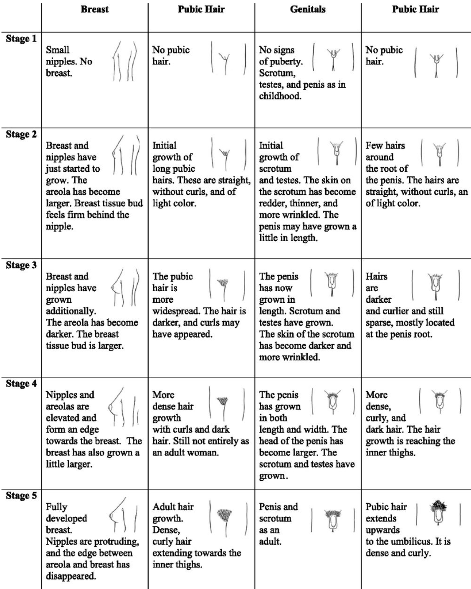
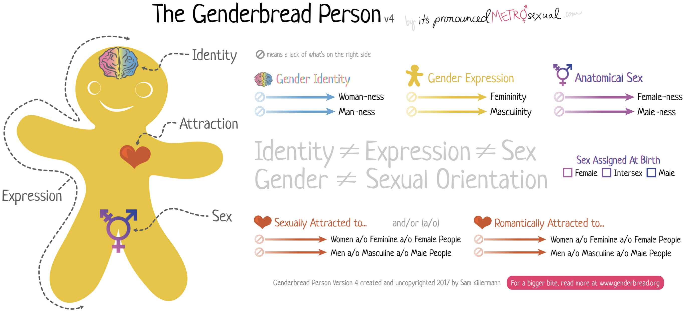

---
output:
  word_document: default
  html_document: default
---
# Adolescent Medicine {#adolescent}

## BCH Wards Tips

#### Primary diagnoses
- Eating disorders
- Anovulatory uterine bleeding
- Some primary care patients admitted for Gen Peds issues

#### Format
- Table rounds. Intern fills out and presents Eating Disorder worksheet (will be reviewed on the first day)
- Do NOT write notes daily, but expected to examine patients daily, present thoughtful plans, and write an event note should something significant happen in a given 24hr period


## Adolescent Clinic Tips

### Overview
- Goal skills
	- Taking an effective social history
	- Addressing confidentiality
	- Discussing topics such as sex, contraception, substance use, and weight
	- Performing respectful genital exams
	- Strength-based approaches to management
- Format
	- Scheduled w/ same preceptor multiple times at BCH and BMC
	- Try to schedule patients for return visits w/ you for continuity

### BCH Adolescent Clinic Specifics
- Population
	- 11-25 yo
	- Primarily from the Greater Boston Area and surrounding suburbs
	- Primary and Subspecialty care for patients with eating disorders, reproductive endocrine concerns, and chronic fatigue
	- Primary languages spoken: English and Spanish
- Resources available:
	- Mental health
	- Psychopharm support
	- Nutrition
	- Resource specialist for social needs
	- On-site sexual health counselling and STD testing (including HIV)

### BMC Adolescent Clinic Specifics
- Population
	- 12-22 yo
	- Primarily from Dorchester, Roxbury, Hyde Park, South Boston, and the South End
	- Primary care, first point of medical contact for adolescents new to the United States, and subspecialty care for teen parents, adolescents with substance use disorders, gender diversity, individuals s/p sexual assault, and menstrual disorders
	- Primary languages spoken: English, Haitian Creole, Spanish, and Cape Verdean Creole
- Subspecialty programs & Resources available
	- CATALYST (for adolescents and young adults w/ substance use)
	- Teen and Tot programs (to serve young parents and their children)
	- CATCH (providing gender affirming care to youth of all ages)
	- Sexual assault follow-up clinic
	- Menstrual Disorders Clinic
	- Integrated behavioral health social workers, patient navigators, and a family planner


## HEEADSSS Assessment[^1]
Parents, family members, or other involved adults should **NOT** be present during the HEEADSSS interview. Addressing this and the need for confidentiality at the beginning of the visit is important. Before asking adults to leave the room, always ask whether they have any concerns to express or questions to ask and assure them of further interaction once the confidential interview is over. Sometimes having a confidential moment with the adult can also be very informative to the patient’s care.

Consider starting your HEEADSSS assessment by asking about the patient’s **strengths**. A simple question such as “What are your greatest strengths” can go a long way in rapport building and eliciting motivations to engage in healthy behavior change.

**Bold** (green) = essential questions <br>
*Italics* (blue) = as time permits <br>
Plain text (red) = optional or when the situation requires

### Home
- **Where do you live? Who lives w/ you?**
- **What are your relationships like at home? Who can you talk to at home?**
- *Is there anyone new at home? Has someone left recently?*
- *Have you moved recently?*
- *Have you ever had to live away from home? (Why?)*
- *Have you ever run away? (Why?)*

### Education and/or Employment
- **Do you go to school? Do you work? Or both?**
- **What are your favorite subjects at school? Your least favorite subjects?**
- **How are your grades? Any recent changes? Any dramatic changes in the past?**
- **What are your future education/employment plans/goals?**
- **Are you working? Where? How many hours per week?**
- **Tell me about your friends at school.**
- **Have you ever had to repeat a class? Have you ever had to repeat a grade?**
- *Have you changed schools in the past few years?*
- *Have you ever been suspended? Expelled? Have you ever considered dropping out?*
- *How well do you get along w/ the people at school? Work?*
- Do you feel connected to your school? Do you feel as if you belong?
- Are there adults at school you feel you could talk to about something important? (Who?)

### Eating
- **Do you have any concerns about your body shape, weight, or size?**
- **Have you ever done anything to try to change your weight or body shape such as dieting, vomiting or taking diet pills/laxatives/supplements?**
- **Have there been any recent changes in your weight?**
- **How many meals/snacks do you eat each day?**
- **What do you think would be a healthy diet? How does that compare to your current eating patterns?**
- *Do you eat in front of the TV? Computer?*
- *Does it ever seem as though your eating is out of control?*

### Activities
- **What do you and your friends do for fun? (w/ whom, where, and when?)**
- **What do you and your family do for fun? (w/ whom, where, and when?)**
- **Do you participate in any sports or other physical  activities that are heart healthy?**
- *How much time do you spend looking at a screen each day (other than doing your homework)?*

### Drugs
- **In the past year, how often have you smoked tobacco or MJ, vaped, or had alcohol?**
	- If any use disclosed, **ask about other substances and do CRAFFT screen**
	- If no use disclosed, **ask the following questions:**
		- **Do any of your friends drink, smoke, vape, or use drugs? Have you ever ridden in a CAR driven by someone (including yourself) who was “high” or had been using alcohol or drugs?**
- *Is there any history of alcohol or drug problems in your family? Does anyone smoke at home?*
- *Do you ever drink or use drugs when you're alone?*
- *(Assess frequency, intensity, patterns of use or abuse, and how youth obtains or pays for drugs, alcohol, or tobacco)*

### Sexuality
- **Do you see yourself as a boy, a girl, something different, or you’re not sure?**
- **Are you attracted to other people? If so: boys, girls, both?**
- **Have you ever had sex with anyone? If so, what kinds of sex? How many people have you had sex with?**
- **Unfortunately some young people are forced to have sex. Has anyone ever forced you to have sex?**
- **What are you doing to prevent pregnancy?**
- **What are you doing to protect yourself from STDs and HIV?**
- **Have you or your partners ever had an STD?**
- *How many sexual partners have you had altogether?*
- *Females: Have you ever been pregnant or worried that you may be pregnant? Males: Have you ever gotten someone pregnant or worried that that might have happened?*
- *What percentage of the time do you use condoms during intercourse?*
- *Does anything ever get in the way of always using a condom?*
- *When you and your partner get into fights, what sort of things happen?*

### Suicide & Depression/Mood
- **PHQ2: Over the past two weeks have you felt down, depressed, or hopeless? Over the past two weeks have you had little interest or pleasure in doing things?**
- **Have you thought about hurting or killing yourself or someone else?**
- IF ANY OF THE ABOVE ARE POSITIVE, **perform full PHQ9**
- *Do you have problems with anxiety?*
- *Some young people have had bad things happen to them, and then they have nightmares, flashbacks or feel on-edge/ hyper-alert. Do you have these symptoms?*

### Safety
- **Do you feel safe at home? At school? In your community? With your friends? In your relationships?**
- **Have you ever been bullied? Have you ever bullied someone else?**
- **Have you ever been seriously injured? (How?) How about anyone else you know?**
- **What percent of the time do you wear a seatbelt in the car?**
- **Do you use safety equipment for sports and or other physical activities (for example, helmets for biking or skateboarding)?**
- **Has anyone ever forced you to have sex with them, or hit, punched, kicked, slapped, or physically or sexually hurt you in any other way?**
- **Is there a gun in your home/ do you have access to a gun?**
- *Have you ever been in a car or motorcycle accident? If so, what happened?*
- *Have you gotten into physical fights in school or your neighborhood? Are you still getting into fights?*
- *Have you ever felt that you had to carry a knife, gun, or other weapon to protect yourself? Do you still feel that way?*


## Adolescent Screening Tools

|             |Screeners|When to use|
|-------------|---------|-----------|
|Depression   |[PHQ-2](https://www.hiv.uw.edu/page/mental-health-screening/phq-2), [PHQ-A](https://www.aacap.org/App_Themes/AACAP/docs/member_resources/toolbox_for_clinical_practice_and_outcomes/symptoms/GLAD-PC_PHQ-9.pdf) = PHQ-9 modified for adolescents, [PSC-17](https://depts.washington.edu/hcsats/FCAP/resources/PSC-17%20English.pdf) (up to age 15)|- Routine Child Health Maintenance visits <br> - Visits for mood follow-up <br> - When you’re concerned about depression and/or suicidality in your patient|
|Anxiety      |[PSC-17](https://www.aacap.org/App_Themes/AACAP/docs/member_resources/toolbox_for_clinical_practice_and_outcomes/symptoms/GLAD-PC_PHQ-9.pdf) (up to age 15), [GAD-7](https://www.integration.samhsa.gov/clinical-practice/gad708.19.08cartwright.pdf), [SCARED](https://www.pediatricbipolar.pitt.edu/sites/default/files/SCAREDChildVersion_1.19.18.pdf)|- Routine Child Health Maintenance visits <br> - Visits for mood follow-up <br> - When you're concerned that anxiety is a problem for your patient|
|Substance Use|[S2BI](https://www.drugabuse.gov/ast/s2bi/#/), [CRAFFT](https://www.integration.samhsa.gov/clinical-practice/sbirt/CRAFFT_Screening_interview.pdf), [BSTAD](https://www.drugabuse.gov/ast/bstad/#/)|- Routine Child Health Maintenance visits <br> - F/u after visits in the ED for acute intoxication <br> - When you're concerned that substance use is a problem for your patient|


## Contraception[^2]

### Emergency Contraception (EC)

|                              |Notes|Access|
|------------------------------|-----|------|
|Ella (ulipristal acetate)|- **Most effective EC pill** to prevent pregnancy **up to 5 days after** unprotected sex <br> - Do NOT give if starting any form of hormonal contraception (ulipristal binds the progesterone receptors and blocks the hormone’s effects)|- **Rx ONLY** <br> - Safe to call in a prescription w/o pregnancy test or seeing patient|
|Plan B One-Step (levonorgestrel 1.5mg)|- Works to prevent pregnancy for the **first 3 days after** unprotected sex <br> - Works less well in patients who are overweight or obese <br> - Discuss with your preceptor if you should recommend a double dose for your overweight patients|- Sold (at cost \$$, w/o Rx) to anyone of any age at most pharmacies, though access is still difficult for adolescents. **Much cheaper w/ Rx.** <br> - Safe to call in a prescription w/o pregnancy test or seeing patient|
|Copper IUD (Paragard)|- **Most effective form of EC** (>99%), effective **up to 7 days after** unprotected sex <br> - Can provide up to 12 years of highly effective contraception after placement|Must be placed in a clinic setting by a trained provider|

**For more information** on emergency contraception (EC), please see the following resources: [Bedsider](https://www.bedsider.org/methods/emergency_contraception), [reproductiveaccess.org](https://www.reproductiveaccess.org/wp-content/uploads/2014/12/emergency-contraception.pdf), [Mass.gov EC site](https://www.mass.gov/info-details/emergency-contraception-get-the-facts)

### Shared Decision Making (SDM)
- Collaborative process, allows patients and their providers to make healthcare decisions together, taking into account the best scientific evidence available, as well as the patient’s values and preferences
- Provider role: knowledge of the medical information
- Patient role: expert regarding their own values and preferences

### Applying SDM Principles to Contraceptive Counseling Visits

#### Establish rapport
- “What brings you in today? What’s happening with your birth control?”
- “Why did you decide to choose ____?”
- Ask interactive open-ended questions. The HEEADSSS assessment is a great way to establish rapport for new patients.

#### Assess patient readiness
- “What are important features that your birth control should have?”
- “What did you like/dislike about the birth control methods you used in the past?”
- “Different types of birth control affect your period differently. Some make your period a bit heavier, lighter, sporadic, or may take your period away. Which do you think will be best for you?”

#### Tailor information and discussion to patient preferences/needs
- Your patient says they want a method where they will still have a regular period. Counsel them on the contraceptive ring, patch, pill, and copper IUD and NOT on the shot, implant, or LNG IUDs.
- Your patient says they want a method that is easy to keep private. Counsel them on the contraceptive implant, shot, IUD, and ring and NOT on the pill or patch.
- Your patient has heavy periods and doesn’t want them to be any heavier. Provide information on any method other than the copper IUD.
- Your patient says they absolutely want to have a period every month. Provide more information on the LNG 15 and 19.5mg IUDs, and Copper IUD, and NOT the LNG 52mg IUD (Mirena).
- Use patient’s identified preferences for discussing particular methods. Being knowledgeable of contraceptive mechanisms of action, side effects, and delivery routes is important to provide this tailored information.

#### Discuss contraception side effects
- “Patients who begin the birth control pill may have breast tenderness or a mild headache during the first month. These usually go away.”
- “With the LNG 52mg IUD, you may have spotting for about 4 months after placement, then your period will become lighter. After a year with the IUD, some patients stop getting their period.”
- Many patients feel they do not receive adequate information about side effects, and that providers often overlook possible side effects in counseling discussions. It is important to discuss the specific side effects that patients should expect with the contraception type that is aligned with their preferences.

#### Identify misconceptions about specific contraception methods
- “I’m sorry that your friend had a bad experience with the vaginal contraceptive ring and weight gain. This isn’t typical with most ring users. I support you in using this method because it aligns with your preferences. If you experience weight gain, you can absolutely choose a different option.”
- “I hear your concern that your friend had worsening acne with her IUD. We usually don’t see this in the majority of patients, so it’s not likely that it will happen to you.”
- Respectfully addressing myths or misconceptions about IUD types helps to keep conversations open, while providing patients with accurate information.

#### Ensure access to method discontinuation at any time
- “If you decide you don’t like this birth control, you can switch to something else at any time.”
- “If you decide that you want to stop your birth control, I’m always here to talk about it and to support you.”
- “If for whatever reason you decide that you don’t want the IUD anymore, I will remove it.”
- Patients should be informed at the time of insertion that they can have their IUD removed at any time, and for any reason.
- IUD removal should be provided with the immediacy as “same-day” IUD placement is provided.

**For more information** on contraceptive methods, minor consent laws, as well as medical eligibility criteria and selected practice recommendations, please see the following resources: [Center for Young Women's Health](https://youngwomenshealth.org/2009/01/28/pros-and-cons-contraceptive-methods/), [Bedsider](https://www.bedsider.org/), [Reproductive Access](https://www.reproductiveaccess.org), [CDC MEC](https://www.cdc.gov/reproductivehealth/contraception/mmwr/mec/summary.html), [CDC SPR](https://www.cdc.gov/reproductivehealth/contraception/mmwr/spr/summary.html), [Guttmacher Institute](http://www.guttmacher.org/state-policy/explore/minors-access-contraceptive-services)


## Tanner Staging[^3]

```{r}

```


## Vaginal Discharge and Infections
\*\* **NOTE: Treatments change frequently! Check the [CDC Treatment Guidelines](https://www.cdc.gov/std/treatment/default.htm) or download the “CDC STD Tx Guide” app.**

|                                     |Signs & Symptoms|Diagnosis|Management|
|-------------------------------------|----------------|---------|---------|
|Physiologic (leukorrhea)|- Clear, white, or grey discharge; no offensive odor <br> - No burning or itching|- pH _<_ 4.5 <br> - Wet mount: epithelial cells w/ no or few leukocytes| Reassurance|
|Candida vaginitis ("yeast infection")|- Odorless curd-like white clumpy discharge <br> - Intense burning and pruritus|- pH < 4.5 <br> - KOH: No fish odor, +budding yeast and pseudohyphae, +WBC <br> - Vaginitis Panel via vaginal swab (tests for BV, Candida Vaginitis, Trich)|- Fluconazole 150 mg PO (single dose) <br> - Miconazole or clotrimazole intravaginal cream|
|Trichomoniasis|- Malodorous, frothy, yellow-green or cream colored discharge <br> - Pruritus, dysuria|- pH > 4.5 <br> - KOH: Fish odor may be present <br> - Wet mount: WBC and pear shaped organism w/ motile flagella <br> - Vaginitis Panel via vaginal swab (tests for BV, Candida Vaginitis, Trich) <br> - NAAT dirty urine collection|- Metronidazole 2g PO (single dose) or 500mg PO BID for 7 days <br><br> **Partner:** treat and refrain from intercourse for 7 days|
|Bacterial vaginosis (BV)|- Malodorous, increased mild grey-white discharge <br> - Mild or absent pruritis or burning|- pH > 4.5 <br> - KOH: +Fish odor <br> - Wet mount: >20% clue cells-epithelial cells covered w/ gram negative rods <br> - Vaginitis Panel via vaginal swab (tests for BV, Candida Vaginitis, Trich)|- Metronidazole 500mg PO BID for 7 days, OR <br> - Metronidazole gel 0.75% one applicator (5g) intravaginally daily for 5 days <br><br> **Partner:** treat if recurrent infection|
|Gonorrhea (GC)|- Majority asymptomatic <br> - Grey-white cervical discharge|GC/CT NAAT vaginal swab or dirty urine|- Ceftriaxone 250mg IM + azithromycin 1g PO (co-tx chlamydia and covers resistant gonorrhea) <br> - Refrain from intercourse x7 days <br><br> **Partner:** Evaluate and treat contacts w/i prior 60 days|
|Chlamydia (CT)|- Majority asymptomatic <br> - Yellowish vaginal discharge|GC/CT NAAT vaginal swab or dirty urine|- Azithromycin 1g PO x1 <br> - If allergic to azithro, can do doxycycline 100mg PO BID x7 days <br> - Refrain from intercourse x7 days <br><br> **Partner:** Evaluate and treat contacts w/i prior 60 days|
|Retained tampon|Malodorous discharge|History and PE|Remove tampon|
|Allergic vaginitis|Local pain, vaginal erythema|History of exposure to deodorant spray, scented tampons, etc.|Cessation of sensitizing agent|


## HIV

### Signs & Symptoms
- **Acute HIV infection:** mono-like illness w/ nonspecific sxs (fever, lymphadenopathy, sore throat, rash, myalgia/arthralgia, diarrhea, mucocutaneous ulcers, weight loss, headache)  usually ~2-4 weeks after exposure, sometimes up to 10 months after exposure
- Early infection is asymptomatic in 10-60% of cases

### Diagnosis
- **Suspected case:**  HIV-1/2 Combo Ag/Ab + RT-PCR HIV viral load test
	- If testing is negative, but very-high risk exposure was recent, repeat test in 1-2 weeks
	- For cases of presumed sexual assault, repeat HIV testing in 6 wks, 3mo and 6mo
- **Routine screening:** Fourth gen HIV-1/2 Combo Ag/Ab reflex to confirmatory subtyping HIV1/HIV2 differentiation immunoassay, followed by viral load testing only if there is a discrepancy

### PEP vs. PrEP

|             |PEP = Post-Exposure Prophylaxis|PrEP = Pre-Exposure Prophylaxis|
|-------------|-------------------------------|-------------------------------|
|EBG          |Sexual Assault EBG             |PrEP EBG                       |
|What is it?  |Always a 3 drug regimen: <br> - **Preferred regimen** (tablets only): Truvada (tenofovir and emtricitabine) + Raltegravir <br> - **Alternative regimen** (if unable to swallow pills): Zidovudine + Lamivudine, + Raltegravir (chewtab) OR Lopinavir/Ritonavir (liquid)|Daily Truvada (tenofovir-emtricitabine)|
|Who's it for?|Consider PEP if the following three statements apply to the patient: <br> - Isolated anal, vaginal, percutaneous or oral exposure to possibly or definitely HIV infected blood or semen <br> - Exposure occurred within 72 hours of presentation <br> - Patient/family will consent to treatment and agree to follow-up|HIV neg Adolescents/Adults weighing >35 kg and meeting one of the following indications: <br> - Men who have sex with men <br> - Person who injects drugs <br> - Heterosexual men and women at substantial risk of acquiring HIV infection (any sex partner w/ HIV or HIV risk factors, hx of bacterial STI, hx injecting drugs, used non-occupational PEP, survival/transactional sex, been in drug tx program, interest in trying to conceive w/ a discordant partner)|


## Genital Ulcers and Warts

|              |Signs & Symptoms|Diagnosis|Treatment|
|--------------|----------------|---------|---------|
|Genital herpes|Grouped vesicles, painful shallow ulcers, tender inguinal adenopathy|- Tzanck smear and viral culture <br> - Antigen testing to determine HSV1 vs. HSV2 can give more information about recurrence prognosis|**First episode:** <br> - Acyclovir 400mg TID x5-10 days, OR <br> - Valacyclovir 1g BID x7-10 days <br><br> **Recurrent episodes:** <br> - Acyclovir 400mg TID x5 days, OR <br> - Valacyclovir 500 mg BID x3 days <br><br> **Daily suppressive (maintenance) therapy:** <br> - Acyclovir 400 PO BID <br> - Valacyclovir 500mg-1g PO daily|
|Genital warts |- Single or multiple soft fleshy papillary or sessile painless growths around genitals <br> - No inguinal lymphadenopathy|- **Initial:** clinical presentation <br> - **Final:** Pap test revealing typical cytologic changes|**Goal:** remove exophytic warts; exclude cervical dysplasia before treatment <br><br> **Medication** (not in preg): <br> - Podophylin 0.5% gel BID x3 days then off x4 days, and repeat up to 4 times; OR <br> - Imiquimod 5% cream 3x/wk on alternate days until resolution (<16 wks) <br><br> **Prevention:** Gardasil 9-valent vaccine (HPV(6, 11, + 7 others)|
|Syphilis      |- **Primary:** Indurated, well defined, usually single painless ulcer “chancre” <br> - **Secondary:** weeks to months later; systemic infection w/ rash, fever, HA, malaise, anorexia, adenopathy <br> - **Latent** → Leads to **Tertiary** in 25%: CNS, cardiac manifestations; gummatous lesions|- **Initial:** FTA-ABS, MHA-TP, dark-field microscopy or DFA test of exudate or tissue <br> - **Final:** VDRL, RPR (reverse sequence screening @ BCH) <br> - False seronegatives seen in first 3 months; presumptive tx recommended|**Primary** and **Secondary:** <br> - Benzathine Penicillin G: 2.4 mil U IM x1 dose <br> - Doxycycline 100mg BID x14 days for allergy/preg <br><br> **Latent:** infected but no sx <br> - Benzathine Penicillin G: 2.4 mil U IM qweekly x3 wks <br><br> **Partner:** evaluate if contact w/i 3 mo for primary, 6 mo for secondary, 1 year for latent|
|Chancroid     |- Multiple, ragged, painful, non-indurated ulcers <br> - Painful suppurative inguinal adenopathy|- **Initial:** clinical presentation, neg syphilis and HSV <br> - **Final:** culture of *haemophilus ducreyi*|- Azithromycin 1g PO x1 dose <br> - Ceftriaxone 250 mg IM x1 dose <br> - Ciprofloxacin 500 mg BID x3 days <br> - Erythromycin 500 mg TID x7 days <br><br> **Partner:** evaluate and treat contacts w/i 10 days of symptoms|


## Pelvic Inflammatory Disease (PID)

\*\* **NOTE: Epididymitis is the male equivalent of female PID!**

### PowerPlans / Order Sets / EBGs
Pelvic Inflammatory Disease EBG

### Pathophysiology
Infection of upper genital tract (cervix, uterus, fallopian tubes, ovaries)

### Etiology
N. gonorrhea, C. trachomatis or other anaerobic organisms

### Clinical Manifestations
Pelvic pain, dyspareunia, vaginal discharge, fever, menstrual irregularities associated w/ lower abdominal tenderness, adnexal tenderness, and/or cervical motion tenderness

### Physical Exam
Uterine, adnexal, or cervical motion tenderness +/-  LQ or RUQ tenderness

### Evaluation
- STI testing (GC/CT, trich, BV, RPR, HIV)
- Consider CBCd, ESR,  urine hCG, UA, UCx

### Management

#### Outpatient
- Ceftriaxone 250 mg IM in a single dose PLUS doxycycline 100 mg PO BID for 14 days w/ or w/o metronidazole 500mg PO BID for 14 days

#### Inpatient
- IV regimen A: cefoxitin 2g IV q6h plus doxycycline 100mg PO BID
- IV regimen B: clindamycin 900 mg IV every 8 hours plus gentamicin 3 mg/kg IV q24h
- Following A, B: doxycycline 100mg PO BID for 14 days. If with pelvic abscess, BV, trich, or recent instrumentation also give 14 days of metronidazole.
- Alternative regimens: Levofloxacin +/- Metronidazole; Ofloxacin +/- Metronidazole; Amp/Sulbactam + Doxy

**Partner:** Evaluation and treatment of contacts w/i prior 60 days recommended. Refrain from intercourse in the meantime


## Heavy or Irregular Menstrual Bleeding

### PowerPlans / Order Sets / EBGs
Heavy/Irregular Menstrual Bleeding EBG

### Definition
Abnormalities in the frequency, duration, volume, and/or timing of menstrual bleeding

### Differential Diagnosis
Anovulatory bleeding (most common cause in adolescents), pregnancy (**must rule out** even w/o report of sexual activity), coagulopathy, recent start/stop of contraception

### Clinical Manifestations
- Menses prolonged or cycle shortened w/ frequent menses (normal menses happen every 21-45 days)
- Flow moderate to heavy
- May present w/ anemia leading to orthostasis, fatigue, tachycardia, syncope/ presyncope  or exercise intolerance 
- Other changes may include: weight change, visual changes, headache, heat or cold intolerance, skin changes (hirsutism or acne), palpitations, cyclic abdominal pain

### Evaluation
- Labs: CBC w/ diff, urine hCG, gonorrhea and chlamydia testing, coagulation studies, von Willebrand panel, TSH, LH, FSH, prolactin, free/total testosterone, DHEAS
- Imaging: Pelvic ultrasound if mass palpable, uterine abnormality suspected, or patient is not responding to typical therapies
- Exam: External GU exam to evaluate for active bleeding, masses, signs of trauma, virilization
- Ask about personal and family history of bleeding

### Management
- Consider NSAID trial (ibuprofen or naproxen), OCPs (screen for estrogen contraindications to determine type of OCP) continuously (occasionally BID-QID) until bleeding stops, daily iron supplements for anemia. 
- Send to ED if vital signs unstable or with severe anemia (for further workup for surgical cause of bleed, possible transfusion, and possible tranexamic acid or aminocaproic acid)
- Antiemetic PRN nausea associated w/ hormone therapy


## Amenorrhea[^4]

### Definition
- **Primary:** Absence of menses by age 15 or absence of menses 3 years following thelarche
- **Secondary:** Absence of menses for three cycles or for three-six months w/ prior normal menses

### Pathophysiology
- **Primary w/o secondary sex characteristics (no breast development) but normal genitalia (uterus and vagina):** Turner syndrome, abnormal X chromosome, mosaicism, pure gonadal dysgenesis, 17 a-hydroxylase deficiency,  hypothalamic failure secondary to inadequate gonadotropin- releasing hormone (GnRH) release, constitutional delay of puberty
- **Primary w/ normal breast development but absent uterus:** Androgen insensitivity, congenital absence of uterus (MRKH)
- **Primary w/ no breast development and no uterus:** 17,20 desmolase deficiency, agonadism, 17 -hydroxylase deficiency w/ 46 XY karyotype
- **Primary and secondary w/ normal secondary sex characteristics:** Hypothalamic causes (idiopathic, phenothiazines, heroin, stress, exercise, weight loss, chronic illness, craniopharyngioma, tuberculous granuloma, meningoencephalitis, polycystic ovary syndrome), pituitary causes (Sheehan’s syndrome, aneurysm, empty sella, tumors), ovarian causes (premature ovarian insufficiency), uterine causes (Asherman syndrome), pregnancy

### Clinical Manifestations
- May see absence of secondary sex characteristics in conjunction w/ amenorrhea

### Physical Exam
- Height, weight
- Signs of malnutrition, androgen excess, thyroid dysfunction
- Tanner stage, breast exam and pelvic exam
- Webbed neck, low set ears, broad shield-like chest in Turner’s syndrome

### Evaluation
- Pregnancy test, TSH, FSH, prolactin, ultrasound to evaluate for presence of uterus 
- **Primary w/o secondary sex characteristics or absent uterus:** Karyotype, FSH, Testosterone level. 
- **Primary and secondary w/ normal secondary sex characteristics:** Urine pregnancy; FSH; Testosterone level; prolactin level – if elevated, need MRI of head to evaluate for prolactinoma; Progestin withdrawal test: Positive response indicates the production of estrogen w/o normal cycling such as in PCOS (if evidence of hyperandrogenism or elevated testosterone). Negative test w/ low FSH suggests low estrogen state as is seen in hypothalamic amenorrhea from nutritional deficiency. Negative test w/ high FSH indicates ovarian insufficiency.

### Management
- **PCOS:** hormonal contraception or cyclical provera 10mg/day x 10d to induce bleeding
- **Irreversible hypopituitarism or ovarian insufficiency:** Premarin 0.625-2.5 mg/day or transdermal estrogen and Provera 10mg/day medroxyprogesterone 10-14 days per month.
- **Hypothalamic amenorrhea related to nutritional deficiency:** energy re-balance/weight restoration


## Gender Affirming Care

### Why
One of our roles as providers of gender diverse youth is to combat the adverse experiences and risk factors for developing mental health disorders **by building safe communities for our patients and adopting a gender affirming approach to care.**

### How
- Call patients by the name and pronouns that they tell you best describe them in all clinical settings.
- Build our lexicon to help lead our co-workers by example in using appropriate and non-stigmatizing language to affirm the child's or adolescent's authentic self and gender identity (see gender-bread person below for review of terminology).
- Ask about gender identity at routine healthcare visits.
- Individuals who identify as transgender have **higher rates** of depression, anxiety, eating disorders, self-harm, and suicide compared to their cis-gendered peers. **Screen** for these when the opportunity arises and provide appropriate referrals/supports PRN.

### Gender Affirming Care Clinics
- At BMC: CATCH
- At BCH: GeMs

### [The Genderbread Person](https://www.genderbread.org/ "Read more at genderbread.org!")


```{r}

```


## Eating Disorders (ED)

### Anorexia Nervosa (AN) {#anorexia_nervosa}

#### PowerPlans / Order Sets / EBGs
- Restrictive Eating Power Plan and Admission Orderset
- Restrictive Eating EBG

#### Definition
- Restriction of energy intake relative to requirements, leading to a significantly low body weight in the context of age, sex, developmental trajectory, and physical health
- Significantly low weight is defined as a weight that is less than minimally normal or, for children and adolescents, less than minimally expected
- Intense fear of gaining weight or of becoming fat, or persistent behavior that interferes w/ weight gain, even though at a significantly low weight
- Disturbance in the way in which one's body weight or shape is experienced, undue influence of body weight or shape on self-evaluation, or persistent lack of recognition of the seriousness of the current low body weight

#### Clinical Manifestations
Weight loss, abdominal pain, bloating, constipation, cold intolerance, lanugo, fatigue, weakness, delayed puberty

#### Physical Exam
Low body temp, bradycardia, low blood pressure, orthostasis, lanugo, dry skin and hair, scalp hair thinning, scaphoid abdomen, palpable stool, breast atrophy, hypoestrogenized vaginal mucosa

#### Evaluation
- **Labs:** CBCd, UA, urine pregnancy, chem 10, LFTs, TFTs, and EKG
- **Weight:** Compared to prior growth charts; calculate IBW based off of 50% BMI for age (unless previously tracking on different percentile)

#### Inpatient Management
- Restrictive Eating protocol
	- If 18yo+, then must sign contract in ED agreeing to protocol
- Goal is to medically stabilize (weight >80% of IBW), VSS (HR >50, no longer orthostatic), electrolytes stable (monitor potassium, phos and mag)
- Refeed gradually to target meal plan while monitoring for refeeding syndrome (watch for edema, low phos)
- Weight increase of 0.2kg/day, supplement if not gaining weight; 1750-2000kcal diet to be increased by 250 kcal per day until goal calories met, meals per EBG (set time for meal, replace w/ 120% ensure if <75% complete (either PO or via NG))
- Check electrolytes daily and supplement w/ PhosNaK and/or MVI if abnormal (at BCH the protocol is to start both supplements on admission)
- Activity: Bed rest while orthostatic. No physical activity while inpatient; can earn wheelchair rides, bathroom  privileges, etc.
- Consults: Psychiatry, Nutrition
- Supervision: Sitter if active SI, Security if elopement risk

### Bulimia Nervosa (BN)

#### Definition
- Recurrent episodes of binge eating. An episode of binge eating is characterized by both of the following:
	- Eating, in a discrete period of time (eg, w/i any two-hour period), an amount of food that is definitely larger than most people would eat during a similar period of time and under similar circumstances
	- A sense of lack of control over eating during the episode (eg, a feeling that one cannot stop eating or control what or how much one is eating)
- Recurrent inappropriate compensatory behavior to prevent weight gain, such as self-induced vomiting; misuse of laxatives, diuretics, enemas, or other medications; fasting; or excessive exercise
- The binge eating and inappropriate compensatory behaviors both occur, on average, at least once a week for three months
- Self-evaluation is unduly influenced by body shape and weight
- The disturbance does not occur exclusively during episodes of anorexia nervosa

#### Clinical Manifestations
[See AN](#anorexia_nervosa), PLUS: Esophagitis and cavities

#### Physical Exam
[See AN](#anorexia_nervosa), PLUS: Calluses on fingers, cavities, and tooth decay

#### Evaluation
[See AN](#anorexia_nervosa)

#### Inpatient Management
[See AN](#anorexia_nervosa), PLUS: Purge precautions (no bathroom privileges (use bedside commode), room searches)

### Acute Refusal of Food Intake Disorder (ARFID)

#### PowerPlans / Order Sets / EBGs
ARFID protocol and PowerPlan

#### Definition
- Persistent failure to meet appropriate nutritional and/or energy needs associated w/ one (or more) of the following:
	- Significant weight loss  
	- Significant nutritional deficiency
	- Dependence on eneteral feeding or oral nutritional supplements
	- Marked interference w/ psychosocial functioning
- Disturbance not better explained by lack of available food
- **No evidence of a disturbance in body image**

#### Pathophysiology
- Patients w/ autism, ADHD, and intellectual disabilities are more likely to develop ARFID
- Often have co-occurring anxiety disorder; high risk for other psychiatric disorders

#### Clinical Manifestations
[See AN](#anorexia_nervosa), PLUS: Fear of choking or vomiting, limited range of preferred foods becomes narrower over time, will only eat certain textures of food, etc.

#### Evaluation
[See AN](#anorexia_nervosa)

#### Inpatient Management
- ARFID protocol
- Often requires enteral nutrition (many patients will go home on enteral feeds)


## References

[^1]: Goldenring JM, Rosen DS. [Getting into adolescent heads: an essential update](http://peds.arizona.edu/sites/default/files/curriculum-files/headss.pdf). Contemp Pediatr. 2004;21:64.

[^2]: Mays A. IUD Counseling: What’s choice got to do with it? In: Optimizing IUD Delivery for Adolescents and Young Adults. Coles MS, Mays A, editors. New York, NY: Springer; 2019.

[^3]: Morris  NM, Udry  JR. Validation of a self-administered instrument to assess stage of adolescent development. J Youth Adolesc. 1980;9(3):271–280pmid:24318082.

[^4]: Welt, C. Etiology, diagnosis, and treatment of secondary amenorrhea. www.uptodate.com. Literature review current through: Feb 2019. | This topic last updated: Mar 21, 2018.

**Additional Resources:**  

[Society for Adolescent Health & Medicine Resident Curriculum](https://www.adolescenthealth.org/Training-and-CME/Adolescent-Medicine-Resident-Curriculum.aspx)
