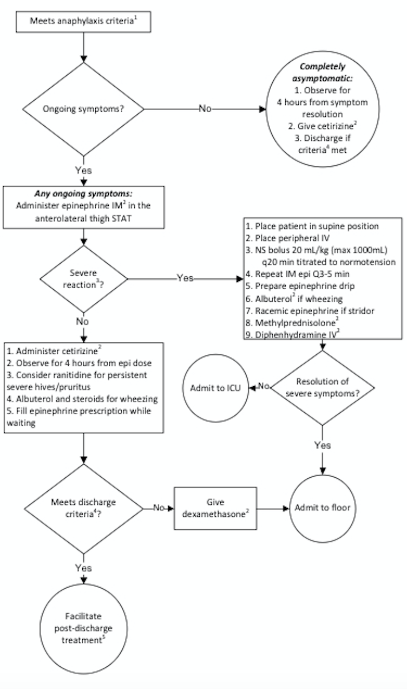
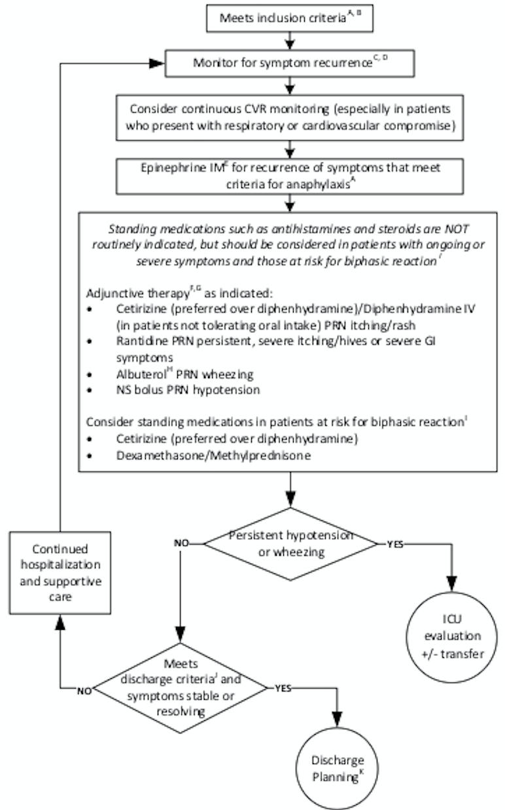

# Allergy and Immunology {#allergy}

## Adverse Drug Reactions

### Type A

- Predictable, dose dependent (ex overdose, SEs, drug interactions. 85-95%

### Type B

- Unpredictable hypersensitivity reactions (intolerance, idiosyncracy, immunologic). 10-15%. 

I

- Immediate (mins-hrs)
- IgE mediated
- Anaphylaxis, angioedema, hives, hypotension, N/V/D 
  
II 

- Delayed (variable)
- Cytotoxic
- Hemolysis, thrombocytopenia, neutropenia 

III

- Delayed (weeks)
- Immune-complex
- Serum sickness, arthus reaction, vasculitis

IV

- Delayed (days to weeks)
- Cell-mediated
- Contact dermatitis, SJS/TEN, DRESS

### Organ-specific ADRs

| Type | Manifestation | Example drugs |
| --- | ---- | ---- |
| Exanthems | Diffuse fine macules/papules days after drug initiation | Allopurinol, aminopenicillins, cephalosporins, AEDs, sulfonamides |
| Urticaria / Angioedema | W/in minutes of drug initiation | B-lactam antibiotics, ACEi |
| Fixed Eruption | Hyperpigmented plaques that recur in same site | Tetracyclines, NSAIDs, carbamazepine |
| Pustules | Acneiform, Acute generalized eczematous pustulosis | Steroids, sirolimus, antibiotics, CCBs |
| Bullous | Tense or flaccid blisters | Furosemide/vanco, capropril/penicillamine |
| SJS | Fever, erosive stomatitis, ocular involvement, purpuric macules (face, trunk) w/ <10% epidermal detachment | Sulfa antibiotics, AEDs, oxicam NSAIDs, and allopurinol |
| TEN | Similar to SJS but w/ > 50% epidermal detachment | Same as SJS, mortality as high as 50% |
| Lupus (skin) | Erythematous / scaly plaques in photodistribution | Hydrochlorothiazide, CCB, ACEis |
| Hematologic | Hemolytic anemia, thrombocyto/granulocytopenia | Penicillin, quinine, sulfonamides |
| Hepatic | Hepatitis, cholestatic jaundice | acetaminophen, sulfonamides |
| Pulmonary | Pneumonitis, fibrosis | Bleomycin, Nitrofurantoin, MTX |
| Renal | Interstitial nephritis, MGN | Penicillin, sulfonamides, allopurinol |


### Multiorgan ADRs

| Type | Manifestation | Example drugs |
|----|-----|------|
| Anaphylaxis | Urticaria/angioedema, bronchospasm, GI sx, hypoTN | B-lactam antibiotics, monoclonal Abs |
| DRESS | Cutan. eruption, fever, eosinophilia, hep. dysfunction, LAD | AEDs, sulfonamides, minocycline, allopurinol |
| Serum Sickness | Urticaria, morbiliform rash, arthralgias, fever | Heterologous abs, infliximab, bactrim, PCN |
| SLE | Arthralgias, myalgias, fever, malaise | Hydralazine, Procainamide, Isoniazid |
| Vasculitis | Cutaneous or visceral vasculitis | Hydralazine, penicillamine, propylthiouracil |


**Desensitization Definition:** give increasing doses over hours

- Mast cells and basophils unreactive to Ag activation (only for Type I HSRs)

**Result:** Temporary tolerance

- patient can receive the drug at usual intervals. When drug is stopped, desensitization ends (d-wk)

## Anaphylaxis

**Definition** Acute, life threatening systemic HSR (min-hrs) w/ \>= 1/3 of the following criteria:

**Hives plus another system**: acute onset illness (mins-hrs) involving skin/mucosa, or both, and \>= 1 of the following: respiratory compromise, reduced BP or symptoms of end-organ dysfunction

**Two systems involved**: \>= 2 of the following must occur rapidly after exposure to a likely allergen (mins-hrs): skin-mucosal involvement, respiratory compromise, reduced BP or associated symptoms of end-organ dysfunction, persistent GI symptoms

**Hypotension**: reduced BP after exposure to known allergen (mins-hrs)

### Allergens

- Meds (B-lactams, ASA/NSAIDs), food, insects, cold/heat, exercise, latex

### Clinical

- Skin involvement in 90%, respiratory in 70%, CV (hypotension) in 45%, GI in 45%
- Monitor for biphasic reaction (4-25% occurrence)
- sx recur w/in 10h (but up to 72h)

### Severe Reaction

- Hypotension w/ wide PP, AMS/confusion, syncope, cyanosis, dyspnea, hypoxia

### Management **Emergent**

```{r}

```

**Inpatient**

```{r}

```

### Med Dosing

- Epinephrine IM (1 mg/mL)
- 0.01 mg/kg (\<10 kg), 0.15 mg/kg (10-25kg), 0.3 (\>25 kg)
- Cetirizine - 2.5 mg (6mo-2 yrs), 5 mg (2-5 yrs), 10 mg (≥6 yrs)
- Diphenhydramine - 1 mg/kg IV/PO (max 50 mg)
- Dexamethasone 0.6 mg/kg (max 16 mg) OR methylprednisolone 1 mg/kg (max 60)
- Ranitidine - 2 mg/kg PO (max 150 mg) OR 1 mg/kg IV (max 60 mg)

### ED Discharge Criteria

No hypotension, resolved wheezing, ≤ 2 doses of Epi

### Post-discharge Treatment

3 days of Cetirizine daily, consider ranitidine, f/u with PCP/Allergy

## Primary Immunodeficiencies

### Pathophysiology

- Genetic defects in the adaptive (B- or T-cell) or innate (phagocytes, complement) immune systems lead to recurrent infections
- Over 200 distinct disorders: B cell defects (65%), combined B and T cell deficiencies (15%), phagocytic disorders (10%), T cell deficiencies (5%), and complement deficiencies/others (5%)

### Epidemiology

The overall incidence is 1:10000, and overall prevalence is 1:2000.

**Clinical** Can be nonspecific and broad

**Constitutional**: Poor growth, failure to thrive

**GI**: chronic diarrhea.

**Derm**: Atopic and non-atopic dermatitis, severe diaper rash, neonatal rash, anhydrosis, as well as delayed separation of the umbilical cord (LAD)

**Immuno**: Recurrent infections, autoimmunity Family history of consanguinity or family history of immunodeficiency or unexplained childhood deaths puts a child at higher risk of having or developing a primary immunodeficiency

### **Physical Exam**

**Vital signs**: Growth parameters

**General exam**: Note dysmorphisms, including teeth and hair (abnormal in NEMO). Look for infectious sources (sinusitis, otitis, pneumonia, thrush, diaper rash)

**HEENT exam**: Note tonsils (absent in XLA) and examine for thrush and other signs of infection such as sinusitis or recurrent otitis media

**CV exam**: Note any cardiac anomalies including heart sounds, pulses, perfusion, and overall volume status as cardiac anomalies can be a part of certain syndromes associated w/ immunodeficiency syndromes (e.g.: DiGeorge Syndrome)

**Respiratory**: Note symmetry of lung exam, quality of air entry, and lung sounds as pulmonary anomalies may be a manifestation of immunodeficiency syndromes

**GI**: A thorough GI exam including abdominal exam for elements like hepatosplenomegaly and rectal exam for possible anal atresia is important

**GU**: Primary immunodeficiencies can also lead to GU anomalies; assess for absence/presence of appropriate male/female organs in the correct number

**Derm exam**: Skin exam for eczema/dermatitis (i.e. WAS, SCID, hyper IgE syndrome) as well as erythroderma (Omenn Syndrome). Note telangiectasia (AT), warts, granulomas, poor wound healing or ulcers

**Neuro**: A thorough neuro exam may also hint at the etiology of an immunodeficiency (ataxia-telangiectasia), an infection such as meningitis, or may help elucidate an alternate cause of symptoms

### Diagnosis

**Initial labs**: CBC w/ differential (note especially lymphopenia), chem7, albumin, urinalysis, ESR, CRP, quantitative immunoglobulins (IgG, IgA, IgM, IgE), specific vaccine antibody studies (tetanus, HiB, pneumococcal).

**Follow-up labs**: HIV testing. B- and T-cell subset, complement screening (C3, C4, AH50, CH50), vaccine challenge (administer pneumococcal or other vaccine and measure titers 4-6 weeks later), Dihydrorhodamine (DHR) assay (CGD). Leukocyte adhesion defect testing (LAD).

**Advanced lab analysis**: T cell proliferation studies (mitogen, antigen), T and B cell memory panels, NK cell function assays, Toll-like receptor assays. Immunodeficiency genetic panel. Whole exome or whole genome sequencing.

### Treatment

Varies widely based upon the deficiency. Common therapies include prophylactic antibiotics, IVIG, bone marrow transplant.

## Indications for a Primary Immunodeficiency Evaluation

- ≥8 ear infections w/i one year
- \>2 serious sinus infections w/i one year
- \>2 pneumonias w/i one year - FTT, poor weight gain, or abnormal growth parameters
- Abnormal physical exam suggestive of syndrome
- Recurrent skin or organ abscesses
- Persistent thrush (mouth/skin), at \>12 months of age
- Severe or overwhelming infection
- Infection w/ unusual organisms
- Need for intravenous antibiotics to clear infections
- Infections w/ opportunistic organisms (Aspergillus, Pneumocystis)
- Severe forms of viral infections (HSV, VZV, EBV)
- Complications from a live vaccine
- A family history of primary immunodeficiency
- Abn. TRECs on newborn screen x2
- Abn. screening CBC (profound leukopenia, lymphopenia, eosinophilia)

## Diagnostic Approach to Primary Immunodeficiencies

### Initial Labs (most cases)

- CBC w/ differential - Quantitative immunolgobulins (IgG, IgA, IgM, IgE)

- Specific antibody studies (tetanus, HiB (PRP), pneumococcal)

### Next Step

(include w/ initial labs if suspicious of specific disorder)

- B- and T-cell subsets

- T cell proliferation studies (mitogen, antigen)

- Complement screening (CH50, AH50, C3, C4)

- DHR (dihydrorhodamine assay for CGD)

### Advanced (Depending on specific history)

- T and B cell memory panels
- NK cell function assay
- Toll-like receptor studies
- Specific genetic testing

## Classification of Primary Immunodeficiencies

### B-cell (Humoral): decreased B-cell numbers and/or impaired antibody production

**Diseases**

- X-linked agammaglobulinemia
- Transient hypogammaglobulinemia of infancy
- IgA or IgG selective Ig deficiency

**Clinical Manifestations**

- Presents \<12 mo old (3-6 mo, due to loss of maternal antibody)
- Bacterial infxn (sinusitis, otitis, pneumonia)
- Chronic diarrhea, FTT - Bronchiectasis
- Enteroviral meningoencephalitis (chronic)

**Organisms**

- Encapsulated: S. pneumo, HiB, N. meningitidis, S. typhi
- GI: Giardia, Campylobacter
- Also: S. Aureus, Pseudomonas, Enteroviral meningoencephalitis

**Vaccine Issues**

Do not give live vaccines for severe defects. Vaccination is not necessary if on IgG replacement. Effectiveness of other vaccines is uncertain

### T-cell Defects

(Cellular): lack of or decreased number of T-cells

**Diseases**

DiGeorge Syndrome, SCID (T-/B+)

**Clinical Manifestations**

- Presents at birth/early infancy
- Mucocutaneous candidiasis
- Severe viral infections
- Bacterial, fungal, opportunistic infections
- Warts or severe eczema
- Chronic diarrhea, FTT

**Organisms**

- Candida, PJP, Mycobacterium, S. typhi
- VZV, HSV, CMV

**Vaccine Issues**

Do not give live virus vaccines if substantial T cell defect

### Combined B/T Cell Defect

#### Diseases

- SCID (T-/B-)
- CVID
- Wiskott-Aldrich syndrome
- Ataxia-telangiectasia
- X-linked lymphoproliferative disease (XLP)
- Hyper IgE syndrome
- DOCK8 deficiency
- ZAP70 deficiency

#### Clinical Manifestations

- Presents during 1st year of life. XLP/CVID can present as teens/adults
- Infections (sinusitis, otitis, pneumonia)
- Abscesses (recurrent)
- Chronic diarrhea, gastroenteritis, FTT
- Mucocutaneous candidiasis
- Viral/opportunistic/fungal infections
- Increased cancer risk

**Organisms**

- Candida, PJP, Mycobacterium, encapsulated bacteria

- VZV, HSV, CMV infections

**Vaccine Issues**

Do not give live vaccines (OPV, BCG, smallpox, YF, live influenza, MMR, MMRV, rotavirus). Effectiveness of other vaccines is uncertain.

### Phagocytic Defects

#### Diseases

- Chronic granulomatous disease (CGD)
- Leukocyte adhesion deficiency (LAD)
- Chediak-Higashi syndrome (CHS)

#### Clinical Manifestations

- Typically presents in infancy
- Poor wound healing
- Delayed separation of the umbilical cord (LAD)
- Lymphadenitis/abscesses
- Catalase (+) bacterial infections (CGD)
- Candidiasis
- Chronic gingivitis, oral disease
- Hepatosplenomegaly

#### Organisms

- Catalase (+) bacteria:
  - S aureus
  - Pseudomonas
  - Burkholderia cepacia
  - Nocardia
  - Enterobacteria erratia and Klebsiella
- Fungal infections:
  - Aspergillus
  - Candida albicans

#### Vaccine Issues

- Live viral vaccines contraindicated in CH & LAD, but OK in CGD
- Live bacterial vaccines are contraindicated. Other vaccines are safe/ effective

### Complement Defects

#### Diseases Classical pathway:

- C1q, Cqr, C1s, C2, C4
- Hereditary angioedema (C1-est)
- C2: most common in Causasians

Lectin pathway: - MBL, M-/L-/H-ficolin, CL-11, MASPs

Alternative pathway: - Factors D, B, and properdin

#### Clinical Manifestations

- Can present at any age
- Angioedema of the face, lips, hands, feet, GI tract, throat (C1-inh)
- Recurrent sinopulmonary infections
- Bacteremia/pyogenic bacterial infections
- Meningitis - Autoimmune disease (lupus-like)
- Often autosomal dominant inheritance
- Associated w/ atypical HUS

#### Organisms Encapsulated bacteria, Neisseria

#### Vaccine Issues

- No vaccine contraindications
- Refer to CDC guidelines re: additional vaccinations for protection against encapsulated bacteria

## Selected Primary Immunodeficiencies

| Disorder | Cell | Gene | Age | Presentation | Labs |
|---|---|---|---|---|---|
|  Chediak-Higashi Syndrome (CHS) | Phagocyte | CHS1, AR | Infancy | -Oculocutaneous albinism, recurrent pyogenic infections (S. aureus) -May present with accelerated phase or HLH: fever, jaundice, hepatosplenomeglay, lymphadenopathy, bleeding, neurologic changes -Lysosomes unable to fuse with phagosomes to lyse bacteria | -Neutropenia -Giant lysosomal granules in neutrophils -Impaired T/NK cell function |
| Chronic Granulomatous Disease (CGD) | Phagocyte | Multiple phagocyte oxidases (gp91phox), X-linked/AR | Infancy-adult, most <5yo | -Recurrent bacterial/fungal infections, often w/ encapsulated and catalase-positive organisms -Granulomas and cold abscesses, both superficial and deep -Inability of neutrophils to generate oxidative burst, but chemotaxis and phagocytic function intact | -Normal neutrophil count -Reduced superoxide production when stimulated in vitro -DHR assay |
| Selective IgA Deficiency | B-cell | - | >4yo | -Most patients (85-90%) are asymptomatic -Recurrent sinopulmonary infection (H. influenzae, S. pneumo), Giardia lamblia infections, autoimmune disease -Increased risk of anaphylaxis to blood products | -Low IgA, normal IgG/M |
| X-linked Agammaglobulinemia (XLA) | Complete absence of mature B-cells | BTK, X-linked recessive | 3-18mo | -Recurrent bacterial infections: sinuses, ear, lung (S. pneumo, HIB, S. pyogenes, Pseudomonas) -Exam: absent tonsils and adenoids | -Low levels of IgG, IgM, IgA -Reduced/absent CD19/20 B-cells |
| DiGeorge Syndrome | Normal to severe T-cell immunodef | Del. 22q11.2 & 10p13-14 | Infancy | -Triad: hypoplastic thymus, conotruncal cardiac/aortic arch defects, hypoparathyroidism -Characteristic faces: low set ears, ocular hypertelorism, bulbous nasal tip | -Hypocalcemia -Reduced CD3+ T cells -Abnormal cardiac echo |
| Ataxia Telangiectasia (AT) | B- and T-cell | ATM, AR | >1yo | -Progressive cerebellar ataxia, oculocutaneous telangiectasia, diminished/absent deep tendon reflexes -Recurrent sinopulmonary infections -Increased risk of malignancy | -Selective IgA deficiency -Low T-cell numbers -Elevated serum AFP |
| Common Variable Immunodeficiency (CVID) | Impaired T-cell function, B-cell maturation | - | Childhood-Adolescence | -Recurrent sinopulmonary infections, autoimmunity, chronic lung disease -Poor response to protein, polysaccharide vaccines (tetanus, PCV) | -Significantly reduced IgG -Reduced IgA and/or IgM |
| Hyper IgE Syndrome | B- and T-cell | STAT3, AD | First wks of life | -Papulopustular rash, skin abscesses (S. aureus), eczema, retained primary teeth -Coarse/thickened facial features, frontal bossing, wide alar base of nose | -Eosinophilia -Elevated IgE |
| Severe Combined Immunodeficiency (SCID) | B- and T-cell, depending on the type | Multiple (RAG1, RAG2, ADA, Artemis, IL2RG) | Part of newborn screen | -Persistent mucocutaneous candidiasis, FTT, recurrent fevers, chronic diarrhea -Infections with adenovirus/CMV/EBV/RSV can be fatal -Live-attenuated vaccines can be fatal -Immunologic emergency: positive pressure room, urgent work-up and evaluation for bone marrow transplant | -NBS: low TRECs -CXR: absence of thymic shadow -Absolute T-cell count <300, abnormal T-cell proliferation studies, presence of maternal T-cells in circulation |


## Selected Immunodeficiencies

| Disorder | Cell | Gene | Age | Presentation | Labs |
|---|---|---|---|---|---|
| Wiskott-Aldrich Syndrome | B- and T-cell | WAS X-linked | Infancy | -Triad: thrombocytopenia (small platelets), eczema, immunoglobulin abnormalities -Chronic otitis media/sinusitis, infection with encapsulated organisms | -IgG nml, IgM low, IgA/E elevated -Decreased number of T cells -Thrombocytopenia |  
| X-linked Lymphoproliferative Disease (XLP) | T- and B-cell | XLP/SH2D 1A, X-linked R | Childhood | -Fulminant EBV infection (often w/ hepatitis, hepatosplenomegaly, liver failure), often causing secondary hemophagocytic lymphohistiocytosis or aplastic anemia -Inc risk of malignancy, especially lymphoma | -B/T cell numbers normal; function is abnormal -IgG is low, IgM is increased -Anemia, thrombocytopenia |


## Specific Antibody Deficiencies

| | Presentation | IgG | IgA | IgM | IgG subclass | Vaccine response | B cells |
|------------------------------|-----------------------------------------------------------------------------|-----|-----------|------------|-------------------|------------------|---------|
| Subclass deficiency | Recurrent severe infections (controversial) | NL | NL | NL | At least 1 is low | LOW | NL |
| Selective IgA Deficiency | Asymptomatic or associated w/ autoimmune, GI, atopic disorders | NL | LOW | NL | NL | NL OR LOW | NL 
| Hyper IgM Syndrome | Severe infections, including PJP | LOW | LOW | NL OR HIGH | LOW | LOW | NL |
| Specific Antibody Deficiency | Often asymptomatic, inadequate antibody response to polysaccharide antigen | NL | NL | NL | NL | LOW | NL |
| CVID | Recurrent infections | LOW | NL OR LOW | NL OR LOW | LOW | LOW | NL |


## Characteristics of Selected SCID disorders

### T-, B+, SCID

#### Gene defects

- IL2RG (most common form, X-linked)
- JAK3
- IL7RA
- IL2RA
- CD3D/E/Z
- PTPRC
- CORO1A
- ZAP70

#### Treatment Bone marrow transplant or gene therapy (IL2RG)

### T-, B-, SCID

#### Gene defects

- RAG1/RAG2 (common)
- Artemis (common)
- Adenosine deaminase (ADA, common)
- PRKDC
- AK2
- LIG4
- Cernunnos (NHEJ1)

#### Treatment

- Bone marrow transplant or gene therapy (ADA)

- ADA can be treated w/ gene therapy or enzyme replacement

## General Approach to the Immunodeficient Patient

Approaching the immunodeficient patient in clinic:

- See indications for testing/tests above.
- Is antibiotic prophylaxis indicated?
- Can they receive immunizations? If they can, have they mounted a sufficient immune response to vaccines (ie. do they need vaccine titers)?
- Low threshold for antibiotic use in the event that infection is suspected.

Managing a sick immunodeficient patient:

- Obtain blood culture and labs.
- Give antibiotics/antivirals promptly.
- Determine whether imaging/surgery is indicated (ie. drain an abscess).
- Be aware of blood products given. Blood may need to be from CMV negative donors, filtered to remove WBCs, and irradiated.
- Replace missing immune components (ie. IVIG)
