# Cardiology {#cardiology}

## Cardiology Rotation Tips

#### Team Structure
- **1 Fellow:** Should be your first stop for everything. **Trust them!** They are fantastic and want to teach.
- **4 Residents:** One will be on outpatient, one post-call (but will round), two there all morning
- **Attendings** (usually 4-5 of them):
	- **General Cardiology:** Most patients are usually on this team.
	- **Heart Failure/Transplant:** You will always round w/ the attending on this team, sometimes there will be a fellow too.
	- **BACH:** Adult congenital. You will round w/ the BACH attending and fellow.
	- **Electrophysiology (EP):** You should see the fellow every day.
	- **Pulmonary Hypertension:** You will occasionally have patients on this service and will round w/ the attending.
	- **Primary Attending:** Cardiology is a team sport, meaning there are multiple physicians on the care team. This is the patient’s longitudinal cardiologist who will check in periodically.
- Of note, there is also an **NP team.** This team is separate from the MD team during the day, but **you will cross-cover them overnight and on weekends/holidays** (which means when you are overnight, you will need to signout to the NP team in the morning).

#### Admissions
You will have a few types of admissions. The main ones will be from the CICU, from the ED, and post-cath:

- **CICU admission:** Go with fellow to 8S (bring a COW) to get sign-out directly from the team caring for the patient. Write transfer note, enter transfer accept order, and perform transfer med rec.
- **ED admission:** Just like any other admission, except the cardiology fellow sees them in the ED and there is a consult note
- **Post-cath:** Usually you won’t get signout on this patient. The fellow will get some signout from the patient’s primary cardiologist. Ask them for more information and do some chart review for more information.

#### Resources
- **Medical Team Coordinator:** Should be your first stop for questions on basically everything non-medical. This includes scheduling a procedure, getting prior authorization for medications, discharge planning, how to put in a specific order, where the food is - really, anything and everything. They are AMAZING.
	- Will also send you a welcome email before the rotation w/ excellent resources. Try to read them!
- **Fellow:** Cardiology is a great time to learn and the fellows are excited about the heart and want to teach. Don’t be afraid to ask them questions about the physiology and pathophysiology.
- **Attendings:** Similarly excited to teach. Many of them will bring a whiteboard on rounds and draw out the physiology of the patient. Feel free to ask them to do so if you want to learn more!

## Disaster Planning

#### Know and use your resources!!!
- **Fellow:** Should always be your first call. Run the list w/ them multiple times a day and at night. Before they go lie down, “disaster round” w/ them and ask all the questions you have about what to do if X happens to Y patient.
- **Nurses:** They have been doing this for longer than we have and know these patients incredibly well. Ask them for tips as well. On midnight rounds, always say hello and ask them what they are worried about for each patient.
- **Code cards:** Carry them w/ you. They have lots of great information on them!
- **CICU:** They are right next door and can get over to the general cardiology floor very quickly. Don’t be afraid to call them. Always better to over call than under call them.

## EKG Approach

- **Paper speed:** Standard 25mm/s → Small box = 0.04s, Big box = 0.2s
- **Standardization marker:**
	- 2 big boxes tall = “full standard” and 10 mm = 1 mV
	- 1 big box tall = “half standard” and 5 mm = 1 mV
	- Limb leads can be in full standard while the precordial are in half standard

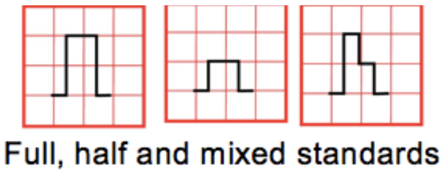

### Ventricular Rate
- 300-150-100-75-60-50 rules if the rhythm is regular, OR
- Count the number of QRS complexes in the rhythm strip (10 seconds) and multiply by 6 (works even if the rhythm is irregular)

### Rhythm

- **Sinus rhythm** = (1) P before every QRS, (2) QRS after every P, and (3) Normal P axis (0-90°, upright P waves in I and aVF)

### QRS Axis
- **Determine axis** by looking at leads I and aVF:
	- ↑ in I, ↑ in aVF = axis between 0 and +90°
	- ↑ in I, ↓ in aVF = axis between -90 and 0°
	- ↓ in I, ↓ in aVF = axis between -90 and 180°
	- ↓ in I, ↑ in aVF = axis between +90 and 180°
- Once you’ve identified axis quadrant, **find the most isoelectric limb lead:**
	- The QRS axis is 90° away from the most isolelectric lead
	- Normal axis varies w/ age (newborn = rightward b/c RV dominance in utero, childhood = leftward b/c LV becomes dominant)
	- Superior axis = AV canal defects, tricuspid atresia and large VSD or left anterior hemiblock
	- Leftward axis in a cyanotic newborn is highly suggestive of tricuspid atresia

### Intervals & Segments

#### PR interval
Atrial depolarization (P wave) and delay at AV node (PQ segment)

- The normal PR interval increases w/ age 
- Prolonged PR intervals are seen in AV nodal block (heart block)
- Short PR intervals are seen in pre-excitatory conditions such as WPW
- Variable PR interval can be seen in wandering atrial pacemaker, multifocal atrial tachycardia and Wenkebach-type 2nd degree heart block
- Depressed PR segment may be seen in pericarditis

#### QRS interval
Ventricular depolarization

- The upper limit of normal increases w/ age (0.07 s in newborns to 0.12 s in adults)
- A wide (prolonged) QRS is indicative of depolarization which proceeds independent of the His-Purkinje system or in which depolarization via the His-Purkinje system is aberrant
- This is seen in ventricular arrhythmias, pre-excitation, IV conduction delays and BBB

#### QT interval
Ventricular depolarization (QRS) and repolarization

- QTc normalizes QT interval accounting for HR, calculated w/ Bazett formula: QT (sec) / √RR(sec)
- A normal QTc in the newborn = 0.47 s, it shortens in older children to 0.44, and then elongates to the normal adult values of approximately 0.45 s in men and 0.46 s in women
- Prolonged QTc is seen in congenital long QT syndrome, electrolyte derangements (hypokalemia, hypomagnesemia and hypocalcemia), hypothermia and is caused or worsened by many medications

#### Q wave
Ventricular septal depolarization, which proceeds from left-to-right and inferior-to-superior

- Small q waves should be seen in the inferior and left-facing leads (I,II,V5,V6 and III and aVF). 
- Duration should not exceed 0.04 sec and amplitude should not exceed 25% of QRS wave in height
- Abnormally tall or long Q-waves may represent ischemia
- Q waves in V1 and V2 are **always abnormal**

#### U wave
Small deflection often seen closely following the T wave, which may represent repolarization of the Purkinje fibers or after depolarizations w/i the ventricle

- A U wave is a normal finding if it is small (<25% the amplitude of the T wave), there is an isoelectric segment between the T wave and U wave, and if the U wave is upright
- If any of these features are not met, the U wave may be pathologic
- Prominent U waves are seen most often seen in hypokalemia, but can also be seen in other electrolyte derangements, ventricular hypertrophy, LQTS and w/ antiarrhythmic therapy
- Inverted U waves are concerning for ischemia, ventricular hypertrophy or cardiomyopathy
- U waves are often more prominent at slow heart rates (<65 bpm)
- If U waves are large (>25% of the T wave amplitude) and there is no isoelectric segment between the T wave and U wave, they should be included in the QTc calculation (which becomes the QTUc)

#### ST segment
Ventricular repolarization

- Elevation or depression >1mm in limb leads or >2mm in precordial leads is abnormal and is concerning for ischemia if seen in a territorial distribution (especially w/ reciprocal changes in other territories) or pericarditis if diffuse
- Concave “smiling” ST-elevation is often normal, as seen in benign early repolarization, however convex “frowning” ST-elevation is ominous

#### R/S progression
R/S ratio represents the ratio of left to right ventricular forces. R waves in the right precordial leads represent depolarization of the right ventricle, and S waves in these leads represent depolarization of the left ventricle. Pattern reversed in left precordial leads.

- In newborn period of a FT infant, the RV is dominant and as such the R wave in lead V1 should be greater than the S wave
- As a child ages, the LV becomes progressively more dominant until late adolescence when an adult-type R/S progression is seen w/ small R waves and large S waves in V1 w/ large R waves and small S waves in V6

#### T waves
- Normal T wave pattern varies w/ age
	- At birth, all T waves should be upright
	- Over the first days of life, leads V1-V3 invert (V1 first, V3 last) and after 7-10 days of life it is pathologic for there to be upright T waves in lead V1 and represent RV strain if present
- It is normal for the T waves in leads V1-V3 to be inverted in children, and between the ages of ~8-20yo these T waves start to become upright (V3 first, V1 last)
	- However, it is not abnormal for T wave inversion to persist into an individual’s 20s, and this is called a persistent juvenile T wave
- It is **always abnormal** to see an inverted T waves in leads V5 + V6 (ischemia or ventricular strain)
- Peaked T-waves are seen in hyperkalemia and elevated ICP and abnormally flat in hypokalemia

### Chamber Size

#### R atrial enlargement (RAE)
P wave height >2.5 mm (2.5 small boxes) in lead II or tall initial positive portion in V1

#### L atrial enlargement (LAE)
P wave duration >2.5 small boxes (100 msec) in lead II. Notched in lead II or deep/wide terminal negative portion of p-wave in V1.

#### L ventricular hypertrophy (LVH)
- R wave > 98th% in I, II, aVL, V5, V6
- S-wave > 98th% in V1
- Supported by:
	- Inverted T in V5 or V6 (strain pattern)
	- Left axis deviation
	- Left atrial enlargement

#### R ventricular hypertrophy (RVH)
- R wave >98th% in aVR,  V1, V2, V4R (or pure R wave > 10 mm)
- S wave >98th% in I, V5, V6
- qR pattern in V1
- Upright T in V1 (pre-adol.) suggests RV strain
- Right axis deviation

#### Strain
QRS-T angle > 90° (diff. between QRS / T axes)

### Normal EKG values by age[^1]
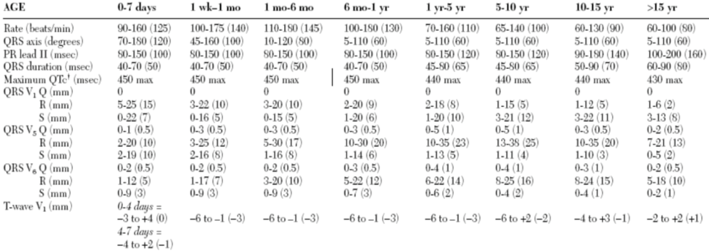

## Other Cardiac Work-Up

### Chest X-Ray (CXR)
- **Heart size:** >50-60% of thorax is abnormal on PA film (confounded by: poor inspiration, AP technique, thymic shadow)
- **Lung fields:** increased pulmonary blood flow (increased pulm. vasc. markings, engorged vessels) = sign of overcirculation
	- Decreased vascular markings indicate decreased pulmonary blood flow
	- Pulmonary edema and effusions may indicate CHF or left-sided obstructive disease
- **Thymic shadow:** lack of a thymic shadow in neonates should raise suspicion for 22q11 del. and associated cardiac defects
- **Aortic arch:** sidedness (left-sided aortic arch is normal)
- **Heart border:** Left or right atrial enlargement 
- **Rib notching:** suggests the presence of collateral vessels, as can be seen in coarctation

### What to do next...
- 4-extremity BP: Upper > Lower (or less commonly R arm > L arm) suggests obstruction of the aorta (e.g. interrupted arch, coarctation)
	- Exception to the rule: L arm > R suggests aortic obstruction w/ aberrant right subclavian
- Pre- and post-ductal O2 sats (measure on R arm and either foot)
- Hyperoxia Test:
	- PaO2 < 100 mm Hg on 100% RA suggests cyanotic congenital heart disease, >200 suggests pulmonary etiology
	- Pulse oximetry can be used as approximation if unable to obtain ABG.
- Consult Cardiology!

### When to start prostaglandins
- After work-up, if high suspicion for cyanotic heart disease, start PGE1 (alprostadil) 0.01 mcg/kg/min as soon as possible
- Monitor for apnea and hypotension
- Consider securing airway if patient requires transport

## Common Cardiology Concerns

### Hyperlipidemia (HLD)
**See Weight Management EBG**

#### Screening
- When?
	- Screen all kids once at ages 9-11 and again from age 17-21
	- If pt has _>_ 1 CVD risk factor, screen every 1-3 years
		- **CVD risk factors:** Dyslipidemia, obesity, HTN, DM, FH of premature CVD, smoking exposure
- How?
	- Fasting lipid panel: Total cholesterol, TG, HDL, LDL-c (not reliable if TG >400)

#### Diagnosis
- TC _>_ 200 (borderline is 170-199)
- LDL _>_ 130 (borderline is 110-129)
- TG _>_ 100 (age 0-9), TG _>_ 130 (age 10-19)
- HDL < 45

#### Management
- Repeat and confirm abnormal value in 2 weeks to 3 months (including borderline values)
- Lifestyle changes: Diet changes (+/- nutrition consult, preventative cardiology referral), weight loss, increase exercise
- Consider statin therapy if no response in 6 months (referral to preventative cardiology clinic)
- If high risk for CVD (genetic familial hypercholesterolemia, DM, ESRD, KD, solid-organ transplant recipient, childhood cancer survivor or moderate risk with add’l risk factors), start statin with goal LDL <100

### Hypertension (HTN)

**See Hypertension EBG**

**[See Nephrology chapter](#nephrology)** for further details, including BP percentiles, discussion of causes of secondary HTN, and treatment

**[See Critical Care/ICP chapter](#critical_care)** for discussion of Hypertensive Emergency

#### Screening
- All Well-Child Visits > 3yo
- All Well Child Visits < 3yo with HTN risk factors (see EBG)
- All Visits for >3yo with risk factors:
	- BMI >95%ile, renal disease, diabetes, coarctation, hx arch obstruction, known HTN, taking meds known to increase BP

#### Diagnosis
- Children < 13yo: Automatic BP _>_ 90%ile for age. Repeat manually. If persistently abnormal, follow EBG.
- Children _>_ 13yo: Automatic BP _>_ 120/80 mmHg. Repeat manually. If persistently abnormal, follow EBG.

#### Management
- **Elevated BP:** Repeat 6mo → 6mo → further work-up (see below), referral, and/or treatment if abnormal
- **Stage I HTN:** Repeat 1-2wks → 3mo → further work-up, referral, and/or treatment if abnormal
- **Stage II HTN:** Referral (Renal or Cards) and work-up
	- Send to ED if symptomatic (headache, visual changes)

#### Work-up
- Additional history, chem10, UA, fasting/non-fasting cholesterol (total/HDL) 
- If <6yo or evidence of abnormal UA or renal function → renal US with doppler
- If Obese, HbA1c and ALT
- Optional: Glucose, fasting lipids, TSH, drug screen, sleep study, CBC

### Evaluating Murmurs (including in a newborn)

#### History
Complete history, family history of murmur/CHD. Symptoms include respiratory difficulty, diaphoresis with exertion or feeds, poor growth. Evaluate if murmur was previously documented.

#### Physical Exam
Pulses, palpation of chest, and auscultation- describe position that is loudest, quality of sound, radiation, presence of thrill. Grades:

- Grade 1: barely audible 
- Grade 2: soft, but audible in a busy room
- Grade 3: loud, but without thrill
- Grade 4: loud and thrill present
- Grade 5: very loud, heard with stethoscope partially of of the chest
- Grade 6: very loud, heard with stethoscope off of the chest

#### Is it innocent or pathologic?
- **Features of innocent murmurs:** Grade _<_ 2, softer when sitting than supine, short and systolic, minimal radiation, musical or vibratory quality
- **Features of pathologic murmurs:** Grade _>_ 3, holosystolic (septal defects, MR, TR), harsh or blowing quality, abnormal S2 (wide splitting, fixed splitting, paradoxical splitting, single S2, loud S2), systolic click (MVP), diastolic murmur (always pathologic), louder in seated/upright position, gallop rhythm, friction rub

#### Work-up
If concerned for pathologic murmur based on above criteria, then obtain: EKG, four-extremity BPs, Cardiology consult for echo

#### Common Innocent Murmurs

- **Vibratory/Still’s murmur:** LLSB/LMSB, musical; age 3-6 most commonly (infant to adolescent)

- **Pulmonary ejection murmur:** LMSB/LUSB, crescendo-decrescendo; all ages

- **Peripheral pulmonary stenosis (PPS):** <1yo, heard at LUSB with radiation to back/axilla

- **Venous hum:** continuous murmur, loudest over the lower neck, age 3-8 yo, disappears when supine

## Arrhythmias & Pacemakers

### Causes of Palpitations

#### Cardiac
PACs, PVCs, sustained or non-sustained tachyarrhythmias

#### Non-cardiac
Hypoglycemia, toxic exposures, pheochromocytoma, increased metabolic demand (fever, anemia), catecholamine response (anxiety, emotional arousal), hyperventilation, POTS, hyperthyroidism

### Premature Ventricular Contractions (PVCs)

#### Presentation
Ranges from asymptomatic → **palpitations, lightheadedness.** Irregular pulse on exam.

#### Presentation
Ranges from asymptomatic → **palpitations, lightheadedness.** Irregular pulse on exam.

#### Pathophysiology
Enhanced automaticity, triggered activity

#### Work-up
- EKG, 24-48hr Holter, chem10, TFTs
- May require echo or exercise testing (dependent upon severity)
- PVCs not coming from the RVOT (which should have a LBBB pattern with an inferior and leftward axis) should raise concern for underlying pathology)

#### Treatment
Usually none

- Treat underlying cause (if one exists, e.g. a drug)
- Beta blockers or CCBs if symptomatic
- If refractory and associated with depressed cardiac function, radiofrequency catheter ablation

### Premature Atrial Contractions (PACs)

#### Presentation
Range: asymptomatic → **palpitations, lightheadedness.** Irregular pulse on exam.

#### Pathophysiology
Enhanced automaticity, triggered activity

#### Work-up
Similar to work up for PVCs

#### Treatment
Rarely required. Beta-blockade can be considered for symptomatic PACs.

### Sinus Bradycardia

#### Presentation
Usually asymptomatic; lightheadedness, SOB, exercise intolerance or syncope and cardiovascular collapse; poor feeding, irritability and/or respiratory abnormalities in infants. By age:

- Newborn to 3 years: < 90-100 bpm 
- 3-9 years: < 60 bpm
- 9-16 years: < 50 bpm
- Well trained adult athletes: < 40 bpm

#### Pathophysiology
Conditioning (athletes), increased ICP, medications (beta blockers, digoxin, CCBs, steroids, analgesics and sedatives as well as alpha 2 blockers), structural CHD with sinus node dysfunction, anorexia

#### Work-up
Assess for **perfusion,** history for causes including meds; **EKG.**

#### Treatment
- Observation if asymptomatic
- Treat underlying causes
- Consider pacemaker if symptomatic

### AV Block

|Degree|PR Interval|Pathophysiology|
|------|-----------|---------------|
|1st degree AV block|**Prolonged PR interval**   Birth - 4 wks: 0.08-0.12   1-3 mos: 0.08-0.13   3-12 mos: 0.08-0.14   1-3 yrs: 0.08-0.15   3-5 yrs: 0.1-0.15   5-8 yrs: 0.09-0.16   8-12 yrs: 0.1-0.17   12-16 yrs: 0.1-0.18   Adult: 0.12-0.20|Increased vagal tone, idiopathic, acute rheumatic fever (ARF), Lyme dz, hypothermia, cardiomyopathy, electrolyte disturbances (hyperkalemia)|
|2nd degree AV block, Mobitz I (Wenkebach)|Progressive lengthening of PR → non-conducted P wave|- Usually AT the level of the AV node (does not progress to complete heart block)   - Healthy individuals during sleep|
|2nd degree AV block, Mobitz II|No lengthening of PR interval followed by sudden non-conducted P-wave|Usually BELOW level of AV node (e.g., His bundle pathology)→ may progress to complete heart block|
|3rd degree AV block (Complete)|Complete AV dissociation|- Narrow QRS (junctional beats) vs. wide QRS (ventricular beats) → may cause hemodynamic collapse   - Congenital heart block in infants of mothers w/ SLE (anti-Ro/anti-La Ab), L-TGA, heterotaxy   - Acquired heart block: myocarditis, Lyme dz, ARF, MI|

### Supraventricular Tachycardia (SVT)

#### Presentation
Paroxysmal palpitations, chest pain, shortness of breath, dizziness or syncope w/ sudden onset and sudden resolution. HR characteristically invariable and is generally > 220 bpm in infants and > 180 bpm in children

#### Work-up
EKG in SVT shows a (usually) narrow complex QRS, regular rate, +/- retrograde P-waves. SVT with abberancy or antidromic AVRT can be wide complex.

#### Treatment
- **Vagal maneuvers** (ice to face for babies, Valsalva maneuvers, blowing through a straw)
- Give **adenosine** 0.1 mg/kg (max dose 6-12 mg) as a rapid IV push through an IV as close to the heart as possible, followed by very rapid NS flush (this may be repeated at 0.2 mg/kg)
	- Do **NOT** give adenosine if rate is **irregular** at all!
- Immediate **synchronized cardioversion** is indicated if the patient is unstable

### Wolff-Parkinson-White Syndrome

#### Presentation
Episodes of paroxysmal supraventricular tachycardia or asymptomatic/incidental finding on EKG

#### Pathophysiology
Early conduction of atrial impulses to the ventricle defined by short PR interval, wide QRS, delta wave. Creates risk for SVT as well as pre-excited atrial tachycardias which can be life-threatening.

#### Work-up
Echo to r/o structural heart disease (i.e. Ebstein’s anomaly); exercise testing

#### Treatment
Catheter ablation is curative; antiarrhythmic medications prior to ablation

### Ventricular Tachycardia (VT/VTach) and Ventricular Fibrillation (VF/VFib)

#### Presentation
Range: asymptomatic → palpitations, chest pain, dizziness or syncope →  hemodynamic collapse and rapid death

#### Pathophysiology
Drugs, electrolyte abnormalities that prolong QT, underlying cardiac disease, inherited arrhythmia syndromes including LQTS, Brugada syndrome, CPVT and ACM can also predispose to these rhythms. Atrial tachycardias in patients with WPW can degenerate into VF. There are also **“benign”** varieties which can occur in young people with structurally normal hearts.

#### Work-up
EKG, electrolytes, blood gas, and tox screen

#### Treatment
- **VTach w/ a pulse:**
	- Consult Cardiology, follow **PALS** algorithm (consider antiarrhythmic medications)
	- **Synchronized cardioversion** 0.5-1 J/kg initially, repeat w/ up to 2 J/kg. May be used w/ or instead of medical therapy
- **VFib or pulseless VTach:**
	- **CPR** immediately
	- **Defibrillate** initially w/ 2 J/kg, repeat at 4 J/kg w/ a maximum of 10 J/kg every 2 mins
	- If not converted, use **epinephrine** (0.01 mg/kg = 0.1 ml/kg of 1:10,000 IV), may repeat every 3-5 mins
	- Consider lidocaine, amiodarone and magnesium sulfate in consultation with Cardiology

### Long QT Syndrome

#### Presentation
Range: incidental findings, family history → syncope, palpitations, arrhythmia, seizures, or sudden death. Often provoked by exercise, strong emotions or diving into cold water.

#### Pathophysiology
- **Congenital:** Ion channelopathies (most common are LQTS1, 2 and 3; autosomal recessive version is called Jervell and Lange-Nielsen syndrome and is associated with sensorineural hearing loss)
- **Acquired:**
	- **Electrolyte abnormalities:** Hypokalemia, hypomagnesemia and hypocalcemia)
	- **Meds:** Macrolides, quinolones, metronidazole, multiple antifungals, most anti-emetics, SSRIs and TCAs, many antipsychotics, multiple antiarrhythmics, methadone and diphenhydramine). See a full list of QT-prolonging meds [here](https://www.crediblemeds.org/drugsearch)

#### Work-up
- EKG w/ prolonged QTc (upper limit of normal 450-460 ms), T-wave alternans, notched T-waves or low resting HR; electrolytes
- Genetic testing may be indicated

#### Treatment
- Adequate magnesium, potassium and calcium level
- Avoid any [medications that may prolong QTc](https://www.crediblemeds.org/drugsearch) or activities known or suspected to provoke it
- Beta blockers, ICD placement and left thoracic sympathectomy are options for high-risk patients

### Pacemakers

#### Positions
Describe how the pacemaker functions and is programmed:

- **Position 1:** The chamber being paced (A = atrium, V = ventricle, D = dual
- **Position 2:** The chamber being sensed (A, V, D or O = no sensing)
- **Position 3:** Response to a particular sensed event
	- I = a sensed event inhibits pacemaker output
	- T = a sensed event triggers pacemaker output
	- D = dual modes of response (i.e. a sensed event in the atrium inhibits pacemaker output in the atrium, but triggers ventricular pacemaker output w/ a programmed delay to mimic intrinsic AV delay)
	- O = no response to sensed events)

#### Settings
- **AAI:** Atrial demand pacing and is an appropriate mode for patients w/ sinus node dysfunction, but should not be used for patients w/ AV node dysfunction
- **VVI:** Ventricular demand pacing and is used quite uncommonly -- results in loss of AV synchrony and can result in a type of cardiomyopathy called pacemaker syndrome (signs and symptoms similar to heart failure)
- **DDD:** Dual chamber pacing- provides more physiologic pacing w/ preserved AV synchrony and may be used in patients w/ both sinus node and AV node dysfunction. This mode of pacing can result in four different rhythms:
	- Normal sinus rhythm (pacemaker does not fire)
	- Atrial pacing w/ a native QRS (pacemaker provides atrial impulse only)
	- AV sequential pacing (pacemaker provides atrial impulse w/ a programmed PR interval mimicking AV node function followed by ventricular impulse)
	- Atrial sensing and ventricular pacing (pacemaker provides ventricular impulse only at intervals mimicking AV node function)

## Acyanotic Congenital Heart Disease (CHD)

### Atrial Septal Defect (ASD)

#### Lesion
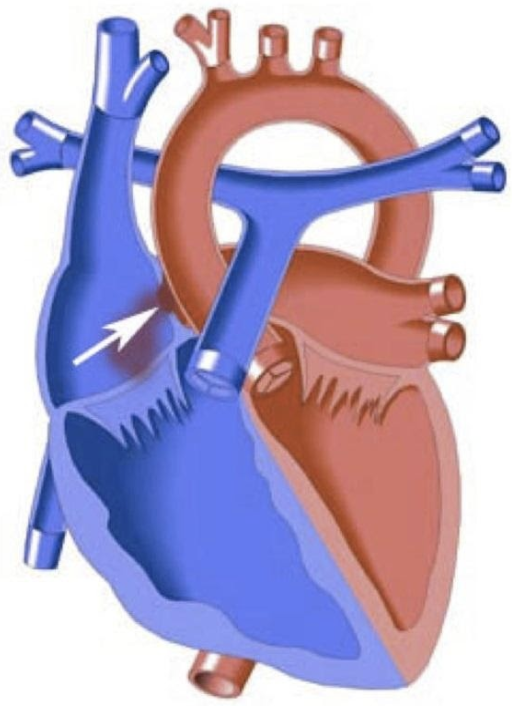

#### Basics
- **Volume** overload
- 4 types based on location and embryologic origin:
	1. Ostium primum: low in septum; can involve AV valve
	2. Ostium secundum: most common; near foramen ovale
	3. Sinus venosus: may involve connection w/ SVC, IVC, often associated PAPVC
	4. Coronary sinus (defect between CS and LA, not truly in atrial septum)
- Amount of L → R shunt depends on side of defect, SVR relative to PVR, relative LV and RV compliance
- PAPVC has similar hemodynamic consequences as ASDs

#### Presentation
- **Hx:** Often asymptomatic, may result in poor growth. When causing significant overcirculation, causes fatigue, dyspnea, CHF and can lead to pulmonary vascular disease (Eisenmenger syndrome). Paradoxical emboli.
- **PE:** Fixed and widely split S2. SEM caused by increased flow across PV, not flow through septal defect. Diastolic rumble if significantly increased volume of flow across the tricuspid valve.

#### Studies
- **EKG:** Enlargement of right-sided chambers, RBBB, RAD. Superior axis in primum ASD.
- **CXR:** Often normal. Overcirculation (increased pulmonary vascular markings). Cardiomegaly.

#### Treatment
- Secundum defects may close spontaneously
- Surgery indicated if symptomatic or is Qp:Qs > 1.5:1. Surgical or transcatheter closure.
- **Surgical goal:** Close the defect and avoid development of irreversible pHTN/Eisenmenger’s syndrome

### Ventricular Septal Defect (VSD)

#### Lesion
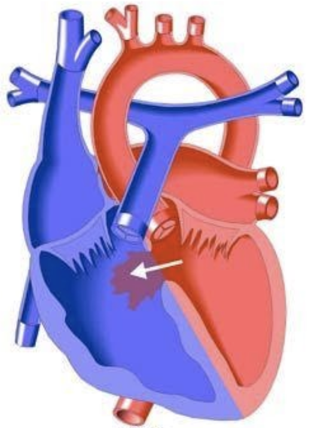

#### Basics
- **Volume** overload and possible **pressure** overload
- Opening in ventricular septum occurs in 1 of 4 locations:
	1. AV canal septum
	2. Conal septum
	3. Membranous septum
	4. Muscular septum
- Degree of shunting determined by size of defect and relative SVR/PVR:
	- If small in size (and pressure restrictive) may not be hemodynamically significant
	- If moderate in size, can cause pulmonary overcirculation and left-sided volume overload
	- If large can expose RV to systemic pressure in addition to volume overload

#### Presentation
- **Hx:** Depends on size. Symptoms occur as PVR decreases during first weeks of life and flow across the defect increases. Sx of CHF include, tachypnea, poor growth, sweating, feed fatigue, dyspnea.
- **PE:** Early or holosystolic regurgitant-type murmur. Smaller defects are louder because of higher pressure gradient across lesion. Large defects may cause very quiet murmurs (may only heard a loud S2). Volume overload can produce a left-sided heave.

#### Studies
- **EKG:** Normal or LAE, LVH, sometimes RVH if defect is large and RV is exposed to systemic pressure OR if pulmonary vascular disease has developed due to chronic overcirculation
- **CXR:** Can be normal, +/- mild cardiomegaly or increased pulmonary blood flow

#### Treatment
- May spontaneously close on its own, especially small muscular types
- Surgery if symptomatic or persistently elevated PVR; otherwise, may observe
- Repair is surgical patch closure or cath device closure
- **Surgical/cath goal:** Close the defect

### Patent Ductus Arteriosis (PDA)

#### Lesion
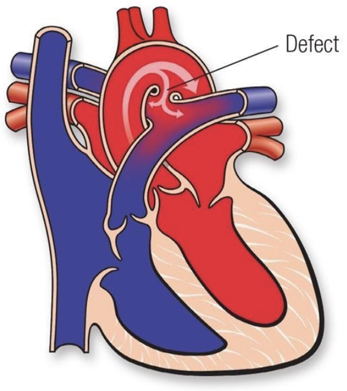

#### Basics
- **Volume** overload
- Common in premature newborns
- Can be asymptomatic, or can cause pulmonary overcirculation, CHF and systemic hypoperfusion

#### Presentation
- **Hx:** Respiratory distress, feeding fatigue, poor growth, CHF
- **PE:** Continuous “machine-like” murmur at LUSB (though murmur can also be systolic only), wide pulse pressure, bounding or palmar pulses

#### Studies
- **EKG:** Often normal, can have LVH or RVH
- **CXR:** Normal, +/- increased vascular markings, +/- cardiomegaly

#### Treatment
- Indomethacin, ibuprofen or acetaminophen in preemies. Less likely to be successful in non-preemies.
- Surgical ligation or cath device occlusion
- **Surgical/cath goal:** Close the duct

### AV Canal Defects (AVCD)

#### Lesion
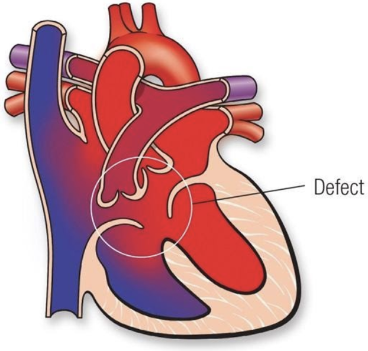

#### Basics
- **Volume** overload
- Components:
	1. Primum ASD
	2. AV-canal type VSD
	3. AV valve defects
- Occurs on a spectrum:
	1. Partial AV canal (ASD, cleft MV)
	2. Transitional AV canal (Cleft MV, ASD and small VSD)
	3. Complete AV canal (ASD, VSD, common AV valve)
- Common in T21
- Can be balanced (equal sized ventricles) or unbalanced (unequal sized ventricles)

#### Presentation
- **Hx:** Presentation similar to that of VSD w/ CHF: poor growth, sweating, feed fatigue, dyspnea. Severity depends on type of defect.
- **PE:** Murmurs of ASD, VSD, MR +/- gallop

#### Studies
- **EKG:** Superior axis; +/- RVH, LVH
- **CXR:** cardiomegaly +/- increased vascular markings

#### Treatment
- Surgery often required before in 1st year of life
- Patch closure of septal defects, often involves valvuloplasty
- **Surgical goal:** Closing defects and achieving AV valve competency
- **Complications:** AV valve regurgitation and stenosis after repair
- Single ventricle palliation may be required for severely unbalanced defects

### Congenital Corrected TGA

#### Lesion
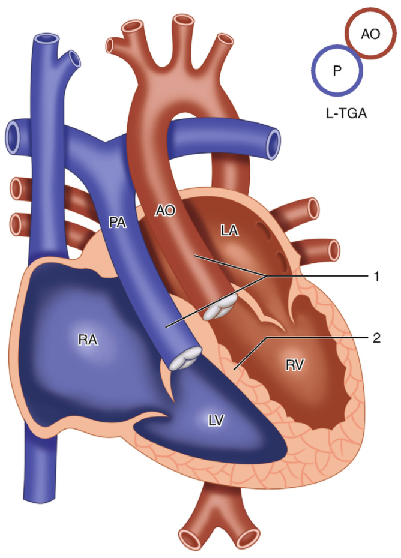

#### Basics
- Transposed great arteries (PA off LV, Ao off RV)
- Segmental anatomy is {S,L,L} or, less commonly, {I,D,D}
- **Blood flow:** LA → RV → aorta → body → IVC/SVC → RA → LV → PA → lungs → pulmonary veins → LA
- \>90% associated w/ other cardiac defects (often a VSD, LVOT obstruction, Ebstein-like TV)
- Can have coronary anomalies
- High risk for spontaneous or post-surgical AV block

#### Presentation
- **Hx:** No cyanosis unless other cyanotic defects present. Can present w/ R heart failure in early adulthood as RV cannot tolerate work load as systemic ventricle.
- **PE:** Dependent on associated defects. May have stigmata of right heart failure. May have loud S2 due to anterior position of AoV.

#### Studies
- **EKG:** Q waves in right precordial leads, no Q waves in left-sided leads. Often have conduction system abnormalities including bradycardia and AV block.
- **CXR:** Dextrocardia or mesocardia may be present

#### Treatment
- Conventionally, only associated defects were repaired
- The newer anatomic approach involves the “double switch” operation, which involves an arterial and atrial level switch via baffling or a Mustard-Rastelli procedure if significant PS is present
- Often “training” of the LV w/ PA banding before the LV is made the systemic ventricle is required, unless significant PS or a large VSD is present
- Timing of surgery is a major challenge

### Valvar Pulmonary Stenosis

#### Lesion
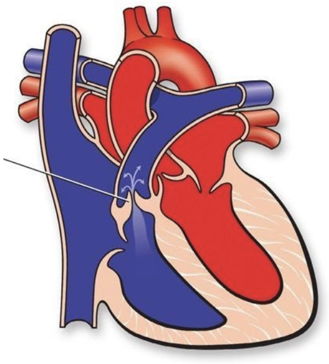

#### Basics
- **Pressure** overload
- Stenotic pulmonary valve, causing increased pressure on RV, TR, may be transmitted to RA
- **Critical** if ductal patency is required for pulmonary blood flow (these children require prostaglandins and early intervention)

#### Presentation
- **Hx:** If mild/moderate, asymptomatic. If severe, RV dysfunction and TR, hepatomegaly.  If critical, can present w/ cyanosis.
- **PE:** SEM at LUSB, ejection click, +/-TR murmur. Often worsens in first few months of life, then stabilizes.

#### Studies
- **EKG:** Normal to RAD, RVH. +/- RV strain pattern.
- **CXR:** +/- ↓ vasc markings

#### Treatment
- **If critical,** start PGE
- Repair is balloon valvuloplasty in cath lab. Surgical repair if severely thickened valve, or muscular subpulmonary stenosis.
- **Surgical/cath goal:** Relieve obstruction, will often have some degree of PR afterward

### Valvar Aortic Stenosis

#### Lesion
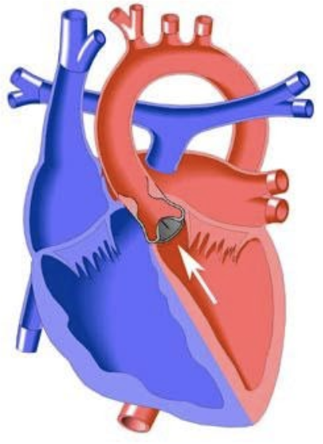

#### Basics
- **Pressure** overload
- LVOT obstruction LVH, systolic and diastolic dysfunction, CHF, MR. Severe LVOTO causes decreased CO.
- **Critical** if ductal patency is required for systemic blood flow
- Supravalvar stenosis common in William’s Syndrome

#### Presentation
- **Hx:** Infants often asymptomatic. Stenosis worsens w/ age, causing CHF or even cardiogenic shock.
- **PE:** Harsh SEM at base radiating to neck, ejection click w/ valvar stenosis, LV heave or tap

#### Studies
- **EKG:** LVH +/- strain pattern
- **CXR:** Normal to cardiomegaly; pulmonary edema possible

#### Treatment
- **If critical,** start PGE to maintain CO
- Repair is cath balloon valvuloplasty or surgical aortic valvuloplasty or valve replacement
- **Surgical goal:** Relieve obstruction, avoid AR

### Coarctation of the Aorta

#### Lesion
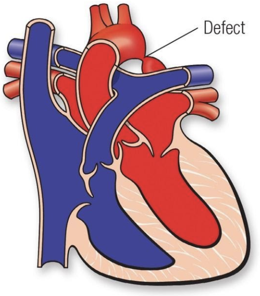

#### Basics
- **Pressure** overload
- Narrowing of the aorta near the aortic isthmus (juxta-ductal)
- If **critical,** requires PGE for systemic blood flow
- Common in Turner Syndrome

#### Presentation
- **Hx:** In infants, often presents as PDA closes: poor growth, sweating, feed fatigue, dyspnea and can present as cardiogenic shock
- **PE:** Upper extremity HTN, w/ drop in lower extremity BPs. SEM at LUSB radiating to back, BP gradient between R arm and legs, brachiofemoral delay and/or decreased/absent femoral pulses.

#### Studies
- **EKG:** RVH in infancy, LVH in children
- **CXR:** Cardiomegaly “3 sign," rib notching in older children (collateral vessels eroding bone)

#### Treatment
- **Infants:** PGE if signs of shock to maintain CO
- Repair is surgical coarct excision and anastomosis or cath balloon dilation and possibly stenting in older children
- **Surgical goal:** Relief of obstruction
- **Complications:** Re-coarctation

## Cyanotic Congenital Heart Disease (CHD)

### Tetralogy of Fallot (ToF)

#### Lesion
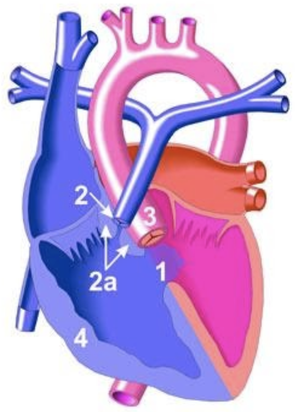

#### Basics
- Anterior malalignment of the conal septum, causing:
	1. Large anterior malalignment VSD
	2. RV outflow obstruction
	3. Overriding aorta
	4. RV hypertrophy
- Degree of cyanosis depends on amount of RVOT obstruction:
	- “Pink Tets” have minimal RVOT obstruction (VSD-like physiology)
	- “Blue Tets” have significant RVOT obstruction
- Pulmonary Atresia and Major Aorto-Pulmonary Collateral Arteries (TOF/PA/MAPCAs) is the most severe variant
- **Hypercyanotic episode (“Tet Spell”)** occurs due to: (1) dynamic worsening of RVOT obstruction, (2) increased PVR, and (3) decreased SVR. Results in  cyanosis and, if persistent, acidosis 2/2 right-to-left shunting.

#### Presentation
- **Hx:** May have **“Tet Spells”**
	- Symptoms can range from severe cyanosis to predominantly pulmonary over circulation and volume overload resulting in heart failure depending on degree of RVOTO
	- **“Balanced” tets** (moderate PS, Qp:Qs close to 1) may present only w/ a murmur
- **PE:** SEM at LUSB (2/2 RVOT obstruction, VSD does not cause murmur), absent or soft P2

#### Studies
- **EKG:** RAD, RVH, RAE, RBBB
- **CXR:** “Boot-shaped” heart. Decreased pulmonary markings. +/- right-sided aortic arch. Look for absent thymic shadow (seen in patients w/ 22q11 deletion).
- Coronary artery anomalies are common, may have absent ductus arteriosus

#### Treatment
- PGE if neonatal cyanosis to preserve ductal patency and pulmonary blood flow
- **Acute hypercyanotic episode:**
	1. Decrease PVR: Supplemental O2, morphine, bicarb
	2. Increase SVR: Knees to chest, alpha-1 agonists
	3. Increase systemic venous return
- Beta blockers may be used to prevent infundibular spasm
- **Surgical repair:** Patch closure of VSD and relieve RVOT obstruction (may require muscle bundle resection, patch augmentation of RVOT which may be valve-sparing or a transannular patch). Unifocalization for TOF/PA/MAPCAs. Will often have PR after repair.
- **Surgical goal:** Close VSD, relieve RVOT obstruction

### Transposition of the Great Arteries (TGA)

#### Lesion
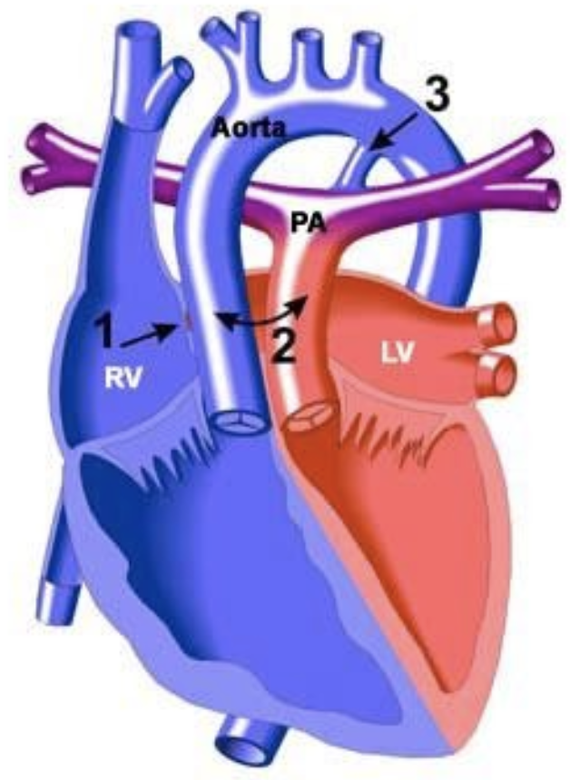

#### Basics
- Aorta arises from RV, pulmonary artery arises from LV w/ D-looped ventricles. May also have a VSD.
- Results in two parallel circulations and severe cyanosis unless **mixing** occurs at the atrial or ventricular level (PDA alone is not sufficient)

#### Presentation
- **Hx:** Profound cyanosis and tachypnea at birth. If large VSD, can have comfortable dyspnea.
- **PE:** Often no murmur if no VSD. +/- single S2.

#### Studies
- **EKG:** May be normal
- **CXR:** “Egg on a string” heart, increased pulmonary vascular markings

#### Treatment
- PGE in newborns
- Often emergent balloon atrial septostomy to ensure mixing of the two parallel circulations
- **Surgical repair:** Arterial switch w/ transfer of the coronary buttons. Older surgeries involved atrial switch (i.e. Mustard, Senning)
- **Surgical goal:** Restore normal connections between ventricles and great vessels

### Total Anomalous Pulmonary Venous Return (TAPVR)

#### Lesion
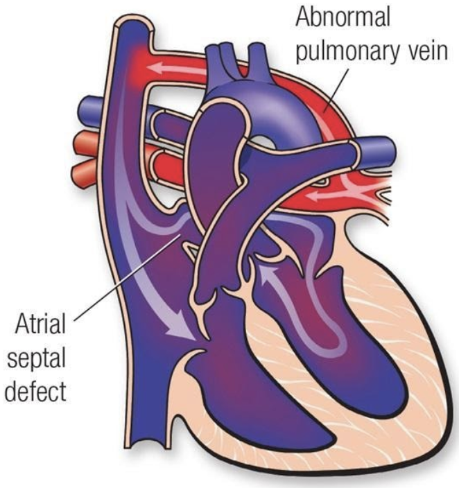

#### Basics
- Pulmonary veins do not return to LA
- Four types:
	1. Supracardiac
	2. Intracardiac
	3. Infradiaphragmatic
	4. Mixed
- Cyanosis is due to **mixing** of oxygenated and deoxygenated blood or pulmonary edema if veins are obstructed (common in infradiaphragmatic type)
	- **Must** have mixing lesion to survive (i.e. ASD)
	- Anomalous connection causes L → R shunt and there is shunting of mixed blood R → L at the atrial or ventricular level, causing cyanosis

#### Presentation
- **Hx:** Can mimic RDS if pulmonary venous obstruction is present. Can present w/ signs of RV volume overload if obstruction is not significant (similar to other left-to-right shunt lesions).
- **PE:** If vein obstruction, single loud S2. If no obstruction, increased RV impulse, SEM at LUSB, diastolic TV rumble. +/- fixed split S2.
- Cyanosis may be mild if Qp:Qs is high and there is no obstruction

#### Studies
- **EKG:** RAD, RVH, +/-RAE
- **CXR:** If pulm vein obstruction, pulm edema (similar to RDS). “Snowman sign” in supracardiac type.

#### Treatment
- Emergent surgery if severe vein obstruction: anastomose pulm venous confluence to LA and close ASD
- Supportive care including O2, inotropes, mechanical ventilation, ECMO as needed
- PGE may worsen cyanosis if there is pulmonary venous obstruction
- **Surgical goal:** Connect pulm veins to LA and close mixing lesion

### Tricuspid Atresia

#### Lesion
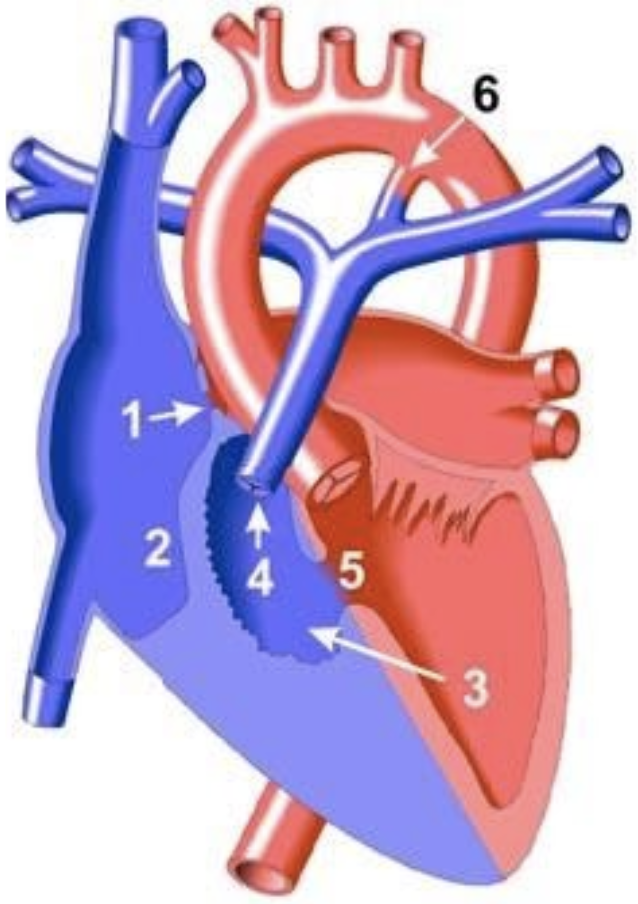

#### Basics
- No outlet from RA → RV. Supply to LA via PFO or ASD.
- Classified based upon great arterial relationship (d-TGA in type II), presence of VSD and degree of PS
	- If no VSD, will have hypoplastic RV and pulmonary atresia
	- If + VSD, variable severity of RV and PA hypoplasia
- Pulmonary blood flow may be PDA dependent

#### Presentation
- **Hx:** Variable timing depending on size of VSD and degree of PS. Usually cyanotic by 2 months w/ cyanosis, tachypnea.
- **PE:** +/- VSD murmur.  Single S2.

#### Studies
- **EKG:** RAE, LVH, LAD w/ left/superior axis (distinguishes TA from most other forms of cyanotic disease)
- **CXR:** Usually decreased  pulmonary vascular markings. Can have increased if TGA.

#### Treatment
- PGE if cyanotic, to maintain pulm flow
- Some neonates require atrial septostomy
- Manage CHF if present
- **Surgical repair:** Staged palliation: BT shunt → bidirectional Glenn → Fontan
- **Surgical goal:** Make two separate circulations w/ passive blood flow to the lungs and LV-driven systemic flow

### Ebstein's Anomaly

#### Lesion
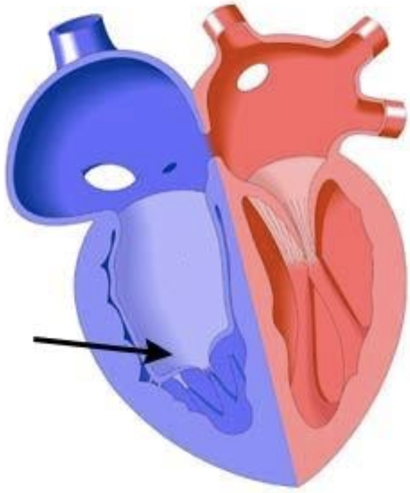

#### Basics
- Tricuspid valve is apically displaced into RV w/ leaflets adherent to RV wall, ASD present. Causes atrialization of the RV and RA enlargement.
- Impaired RV output 2/2 TR, RV dysfunction, possible RVOTO from redundant valve tissue
- Can cause a “circular shunt” in utero (Ao → ductus → retrograde PA → RA → PFO → LA → LV → Ao) and hydrops
- Frequently associated w/ WPW

#### Presentation
- **Hx:** Variable presentation from cyanosis in delivery room and early right heart failure to adults w/ murmurs, arrhythmia or incidental EKG findings based upon degree of TV displacement
- **PE:** Systolic murmur 2/2 TR. Often has gallop.

#### Studies
- **EKG:** RAE, RBBB. May have WPW and may present in AVRT.
- **CXR:** Cardiomegaly, which can be massive and box-like 2/2 RAE. Decreased pulmonary vascular markings can be normal.

#### Treatment
- Consider PGE in neonates w/ severe cyanosis
- Improves as PVR falls
- **Surgical repair:** Variable depending on severity, but may include TVplasty (Cone procedure) or replacement, reduction atrioplasty and ventricular plication. If severe, may require palliation down single ventricle pathway.
- **Surgical goal:** Improve RV function, reduce TR

### Hypoplastic Left Heart Syndrome (HLHS)

#### Lesion
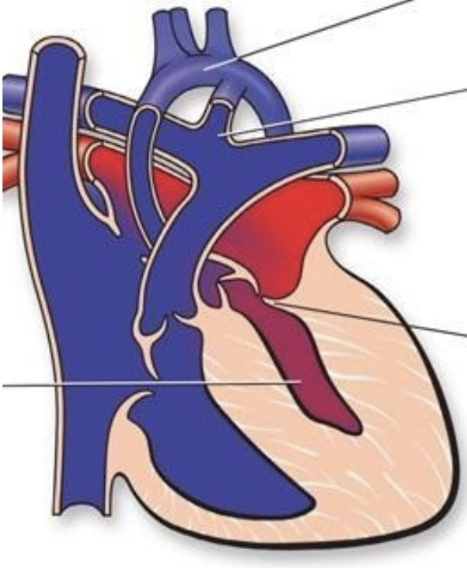

#### Basics
- Group of left-sided obstructive anomalies characterized by underdevelopment of the left heart thought to be secondary to reduced in utero blood flow
- Requires PDA and ASD for survival
- Three types:
	1. MS/AS
	2. MS/AA
	3. MA/AA
- Further classified based upon presence or absence of unrestrictive atrial septal defect
	- If atrial septum is intact (IAS) or restrictive, outcome is poor

#### Presentation
- **Hx:** Presents w/ cyanosis secondary to left atrial hypertension and pulmonary edema if atrial septum intact or restrictive. Presents w/ cardiogenic shock and CHF if atrial septum unrestrictive as PDA closes.
- **PE:** Increased RV impulse, single S2, often no murmur, poor pulses, cool extremities

#### Studies
- **EKG:** RVH, reduced left-sided forces
- **CXR:** Cardiomegaly, ↑ pulm markings

#### Treatment
- PGE to preserve ductal patency and systemic perfusion
- Balloon atrial septostomy if IAS
- **Surgical repair:** Three-stage univentricular palliation:
	1. Atrial septectomy, creation of neoaorta, modified BT-shunt or Sano shunt v. Hybrid procedure
	2. Bidirectional Glenn (superior cavopulmonary anastomosis)
	3. Fontan (total cavopulmonary shunt)
- **Surgical goal:** Separation of pulmonary and systemic circulation w/ passive pulm return and RV-generated systemic flow

### Double Outlet Right Ventricle (DORV)

#### Lesion
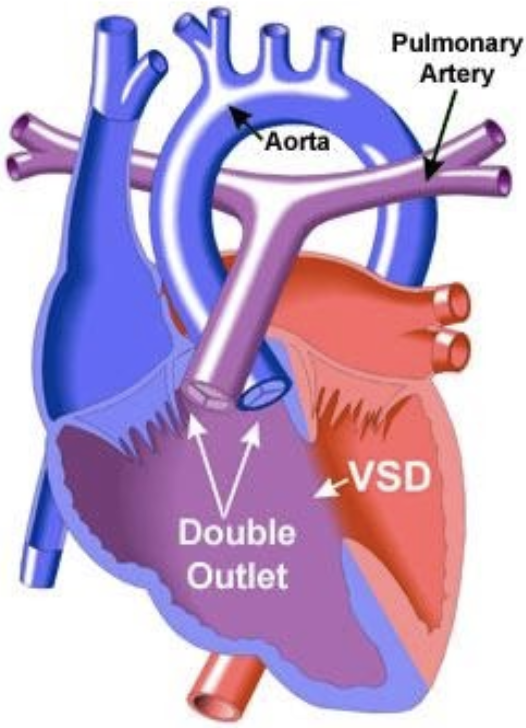

#### Basics
- Family of lesions where both great vessels arise from RV
- VSD always present
- Multiple “types” (dependent on relationship of VSD to great arteries):
	1. TOF-type: Sub-aortic VSD with PS (blood from LV goes predominately into LV)
	2. VSD-type: Sub-aortic VSD with no PS
	3. D-TGA type: Sub-pulmonary VSD
	4. Can also have a “doubly-committed” or “non-committed” VSD

#### Presentation
- **Hx:**
	1. TOF presents like TOF
	2. TGA-type presents like TGA, but usually w/ better mixing
	3. VSD type like VSD
- **PE:** Variable, based on type of DORV

#### Studies
- **EKG:** No hallmark EKG, because of variety of physiology types
- **CXR:** Cardiomegaly and pulm flow depend on degree of PS present

#### Treatment
- Medical management determined by Qp:Qs
- Treat CHF if present
- **Surgical repair:** Depends on physiology
- **Surgical goal:** Separation of pulmonary and systemic circulations versus single ventricle repair

### Truncus arteriosus

#### Lesion
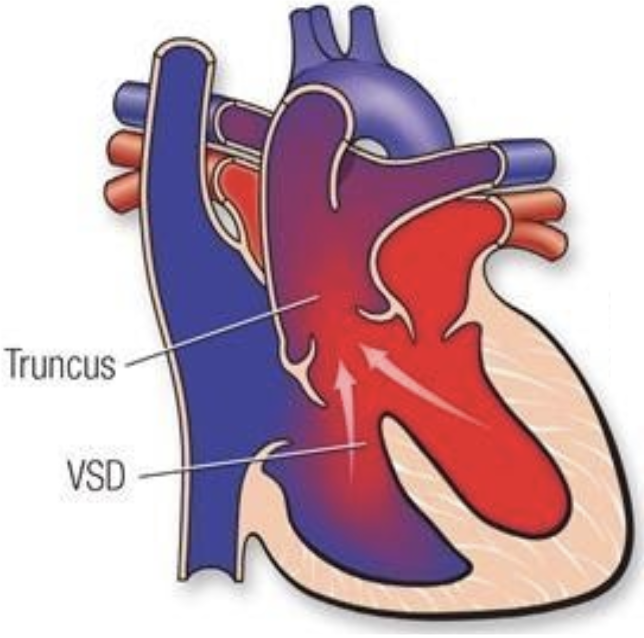

#### Basics
- Failure of embryonic truncus arteriosus to septate
- Associated w/ a VSD, aortic arch and coronary anomalies
- Several subtypes depending on how PAs come off the truncus
- Cyanosis is secondary to **mixing**
- Both ventricles feed both arteries, pulmonary overcirculation worsens as PVR falls
- Associated w/ 22q11 syndrome

#### Presentation
- **Hx:** CHF over first few weeks as PVR falls and dependent on degree of truncal valve regurgitation
- **PE:** loud single S2, ejection click. SEM at LUSB. Diastolic decrescendo murmur from truncal regurgitation. Bounding pulses from diastolic runoff.

#### Studies
- **EKG:** LVH, RVH
- **CXR:** Cardiomegaly. Increased  pulmonary vascular markings. +/- right-sided aortic arch.

#### Treatment
- Treat CHF if present
- **Surgical repair:** Division of pulmonary arteries from truncus and placement of RV-PA conduit. Closure of VSD (i.e. Rastelli operation).
- **Surgical goal:** Establishing separated pulmonary and systemic circulations

### Pulmonary atresia with IVS

#### Lesion
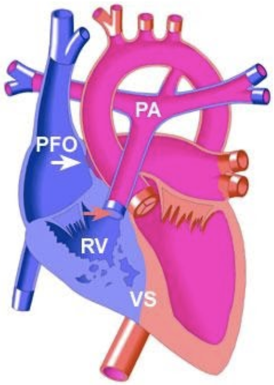

#### Basics
- Either membranous (valve leaflets are fused) or muscular (no valve tissue)
- Pulm flow depends on PDA
- R → L shunt via atrial
- Results in varying degrees of RV hypoplasia
- Can result in RV-dependent coronary circulation wherein large portions of coronaries are supplied by high-pressure RV cavity instead of from aorta

#### Presentation
- **Hx:** Cyanosis at birth that worsens as PDA closes
- **PE:** PDA murmur

#### Studies
- **EKG:** Mild LAD from weak right side, RAE
- **CXR:** ↓ pulm markings

#### Treatment
- PGE in newborns
- Cannot decompress RV if RVDCC → single ventricle palliation
- If non-RVDCC, can establish RV-PA continuity in cath lab or OR, some get “1.5 V” repair if RV hypoplastic

## Surgical Repair of CHD

### Stage 1 Operation (aka Norwood Operation)

#### Indications
Single ventricle heart disease with obstruction to systemic blood flow and hypoplastic aortic arch (prototype HLHS)

#### Goals
1. Establish systemic blood flow (DKS anastomosis creates neo-aortic valve from pulmonary valve, AscAo anastomosed end-to-side to provide coronary blood flow), aortic arch repair
2. Provide pulmonary blood flow:
	3. mBTS (continuous flow, results in diastolic hypotension)
	4. Sano shunt (RV-PA conduit, less diastolic run off, but requires right ventriculotomy
3. Provide adequate mixing at atrial level/left atrial decompression (atrial septectomy)

#### Post-op Sats
75-85%

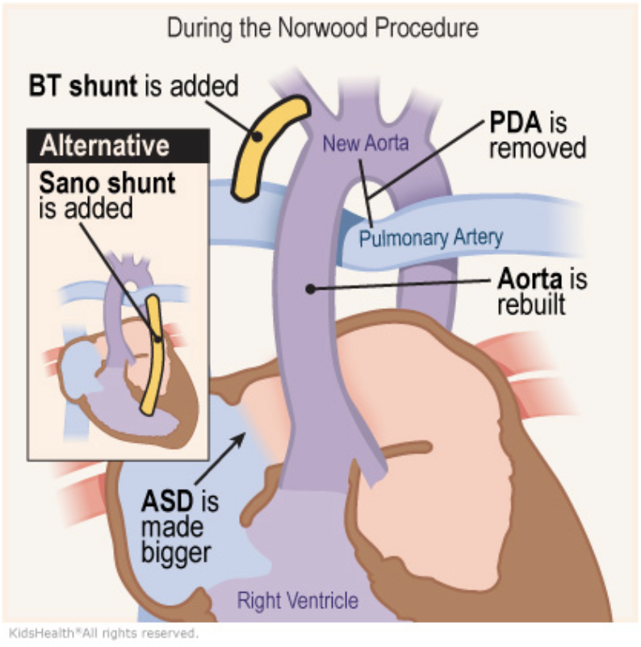

### Bidirectional Glenn

#### Indications
Intermediate step in single ventricle palliation (may be second operation for some (i.e. HLHS)), or first operation for others (i.e. some types of tricuspid atresia)

#### Goals
1. Provide passive pulmonary blood flow (anastomose SVC to RPA)
2. Volume-unload systemic ventricle (takedown mBTS or Sano)

#### Post-op Sats
80s

#### Complications
Results in no hepatic blood reaching the lungs and can lead to pulmonary AVMs

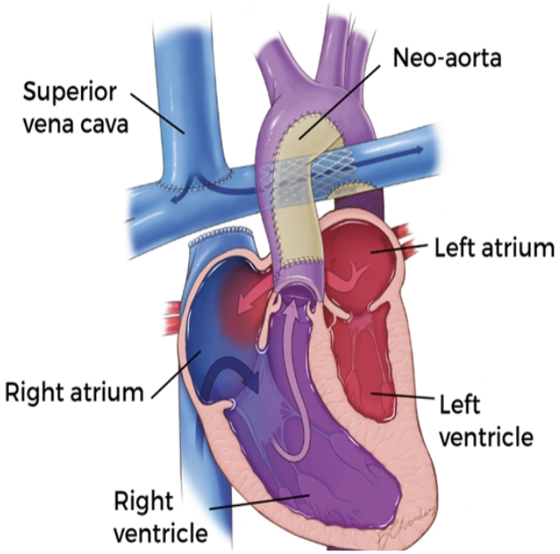

### Fontan

#### Description
Can be “lateral tunnel” (Fontan pathway within lateral atrium) or extra-cardiac. Usually “fenestrated” (small hole connecting Fontan pathway to systemic atrium: obligate right-to-left shunt).

#### Indications
Last stage of single ventricle palliation (common pathway for heterogenous group of conditions)

#### Goals
Increase pulmonary blood flow and provide “hepatic factor” to the lungs to prevent AVMs (IVC connected to PAs via Fontan pathway)

#### Post-op Sats
\>90%

#### Complications
Results in elevated CVP and chronic low CO, leads to a host of end organ problems including Fontan-associated liver disease, plastic bronchitis and PLE

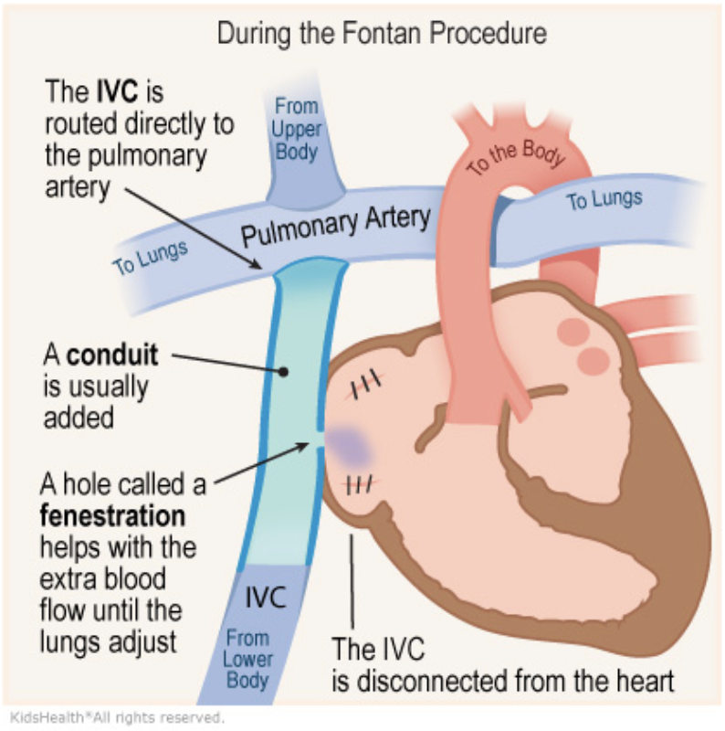

### Arterial Switch Operation

#### Indications
May be used as one component of the “double switch operation” for congenitally corrected TGA, or in some types of DORV

#### Goals
Create circulation that is “in series” rather than “parallel” by connecting translocating aorta and MPA above the valves (coronaries are moved as “buttons” with the aorta)

#### Complications
Post-op issues can include coronary obstruction and supravalvar PS/AS

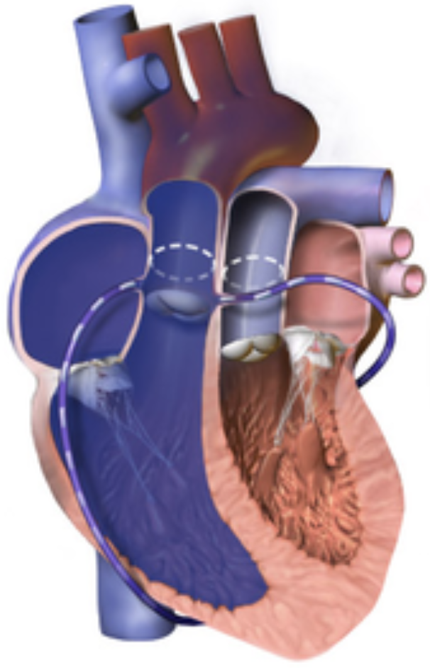 

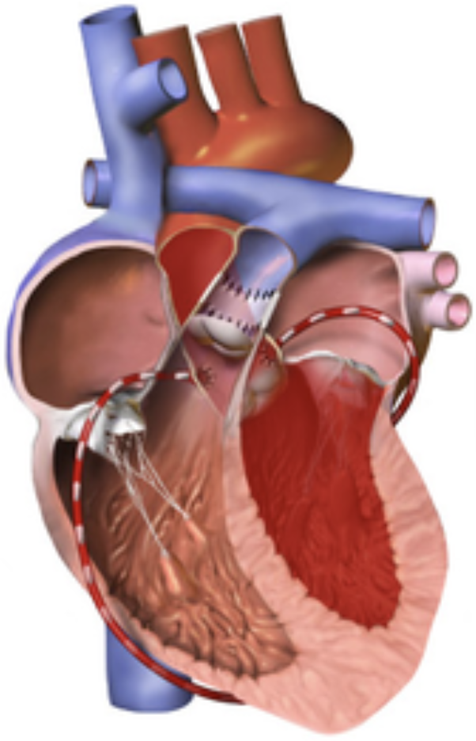

## Catheterization & Caring for the Post-Cath Child

1. Inspect access site (usually femoral or neck) for bleeding or hematoma formation
2. Assess distal pulses and ensure they are intact and equal bilaterally
3. Compare lower extremity warmth, edema and skin color:
	4. Signs of venous thrombus include edema, increased warmth and erythema
	5. Signs of arterial thrombus include pain, pallor, paresthesia/numbness, poor pulses and cool extremities
4. Listen to heart and lung sounds and think about what you should be hearing given what procedures were performed
5. Most patients will require at least one hemoglobin/hematocrit check to ensure they are not bleeding
6. Some patients will require a chest x-ray to ensure they have not developed a pneumothorax and to ensure their device has not migrated

#### Complications
Hematoma, pulseless limb, pulmonary hemorrhage, PTX, bowel ischemia, stroke

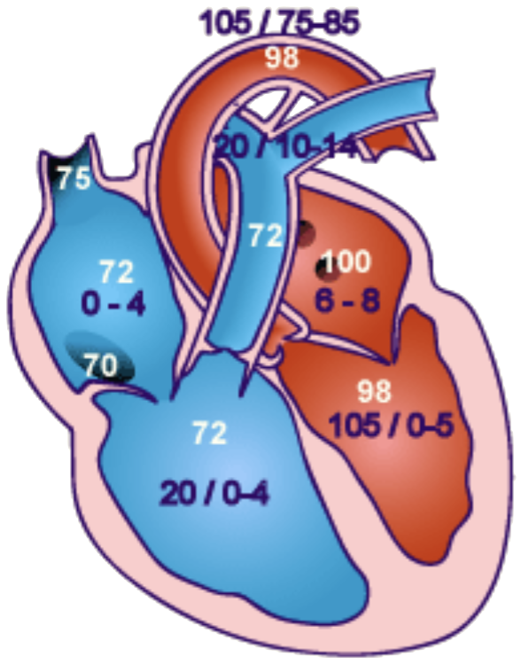

## Cardiomyopathy

### Hypertrophic Cardiomyopathy (HCM)

#### Presentation
Often discovered incidentally on EKG (LVH, T-wave abnormalities) or as part of familial screening. If symptomatic: Dyspnea, exertional chest pain, fatigue, presyncope, syncope, palpitations, ventricular arrhythmias and sudden death

#### Physical Exam
Left-sided heave and lateral displacement of the PMI; audible S4 and a harsh mid to late systolic murmur at the mid to lower left sternal border that is louder while standing as well as w/ the Valsalva maneuver (as decreased LV volume worsens the obstruction)

#### Pathophysiology
Autosomal dominant inheritance of mutation in sarcomeric proteins. Myofibrillar disarray and hypertrophy of the LV, most commonly the interventricular septum → LVOT obstruction and diastolic dysfunction (though other patterns of hypertrophy are seen). Associated with some syndromes (i.e. Noonan syndrome).

#### Work-up
- **EKG** may show left axis deviation, LVH w/ or w/o strain, and pathologic septal Q waves in the inferior and lateral leads +/-  LA enlargement
- **Echo** w/ diagnostic LV and septal hypertrophy
- +/- Cardiac MRI (to assess tissue characteristics and risk stratify), catheterization, EP studies, genetic testing

#### Treatment
- ICD if high-risk features of history of arrhythmia
- Beta-blockers or calcium channel blockers reduce obstruction and have antiarrhythmic properties
- Septal or left ventricular myomectomy and septal alcohol ablation are sometimes utilized
- Severe cases may require heart transplant

### Dilated Cardiomyopathy

#### Presentation
Signs of right-sided heart failure (peripheral edema, hepatomegaly, JVD) and left-sided heart failure (pulmonary crackles, cold extremities and weak pulses); often tachycardic, tachypneic, DOE

#### Physical Exam
Systolic murmur (representing AV valve regurgitation) may be present w/ an audible S3 or S4

#### Pathophysiology
Systolic dysfunction w/ enlargement of ventricles. Often  idiopathic but can be secondary to myocarditis, thyroid disease, metabolic disease, nutrient deficiencies (selenium, carnitine, thiamine), drugs (especially anthracyclines), toxins, radiation, infiltrative processes, muscular dystrophies, familial DCM syndromes.

#### Work-up
- **CXR** w/ cardiomegaly, pulmonary vascular congestion/edema
- **EKG** w/ sinus tachycardia and may show LVH and non-specific ST-T changes; may be low voltages and atrial enlargement; arrhythmias may be present
- **Echo** w/ LV chamber dilation and poor contractility

#### Treatment
Diuretics, ACE inhibitors, digoxin. May require mechanical support (VAD, ECMO) or heart transplant.

### Arrhythmogenic Cardiomyopathy

#### Presentation
Predominately symptoms attributable to ventricular tachyarrhythmia (syncope, SCD, presyncope, palpitations), or less commonly signs of heart failure

#### Pathophysiology
Fibrofatty replacement of the ventricular myocardium leading to dangerous ventricular dysrhythmias (and less often SVT) and ventricular dysfunction. Both ventricles can be involved (RV-dominant, LV-dominant, and biventricluar phenotypes)

#### Work-up
EKG, echocardiogram, EP studies, MRI and genetic testing

#### Treatment
- Beta-blockers, restriction from sports
- If history of VT or VF or have certain high-risk features, should have an ICD placed

### Restrictive Cardiomyopathy

#### Presentation
Signs and symptoms of heart failure (see CHF section below)

#### Pathophysiology
Non-compliant ventricular tissue → **diastolic** dysfunction and atrial enlargement w/ relatively normal ventricular dimensions

#### Work-up
Echo, cardiac cath, +/- cardiac MRI, consider genetic testing

#### Treatment
Heart failure management (see CHF section below). May require heart transplant.

### Left Ventricular Non-Compaction Cardiomyopathy (LVNC)

#### Presentation
Signs and symptoms of heart failure (see CHF section below)

#### Pathophysiology
During fetal cardiac development, the ventricular myocardium begins as a spongy, highly-trabeculated tissue that should become “compacted” ventricular cavity becomes relatively smooth, especially w/i the LV, which doesn’t happen in patients w/ this In patients w/ LVNC

- Can have predominately dilated, predominately restrictive or mixed phenotypes

#### Work-up
Echo, cardiac MRI, cardiac cath, consider genetic testing

#### Treatment
Heart failure management (see CHF section below)

## Congestive Heart Failure (CHF)

#### Presentation
- **Infants:** Tachycardia, tachypnea, feeding difficulty, diaphoresis (particularly w/ feeding) and poor growth
- **Children and adolescents:** Shortness of breath, orthopnea, cough, peripheral edema

#### Physical Exam
Gallops, murmurs (MR/TR), hepatomegaly, edema of ankles or eyelids, tachypnea, tachycardia, crackles, cool extremities, delayed cap refill, weak pulses

#### Pathophysiology
Multiple etiologies, including structural heart disease, arrhythmia, ischemia, cardiomyopathies, myocarditis, severe hypertension, and systemic issues (including severe anemia and severe thyroid disease)

#### Work-up
- **CXR:** Cardiomegaly and pulmonary edema, Kerley B lines
- **EKG:** Atrial or ventricular enlargement, ischemia, arrhythmia
- **Echo:** Depressed systolic function, +/- ventricular dilation and/or hypertrophy
- **Labs:** If severely depressed cardiac output, may have acidosis, elevated lactate, elevated BNP, abnormal electrolytes, and elevated CK and troponin (if myocardial injury is present). If right sided, may have abnormal liver studies.

#### Treatment
- **Diuresis:** Furosemide or other loop diuretic are first-line. Thiazide diuretics and spironolactone also may be used, usually in chronic CHF.
- **Inotropes:** Digoxin increases contractility. Dopamine or epinephrine may be used in sicker ICU patients.
- **Afterload reduction:** ACE inhibitors decreased SVR and may positively impact cardiac remodeling. Milrinone infusion has a similar effect and may be used in sicker patients. 
- **Other measures:** O2 and correction of anemia aid O2 delivery. Salt restriction aids diuresis. Treating underlying illness (e.g. infection, arrhythmia, acidosis) can improve contractility. Sedation and mechanical ventilation can decrease demand on the heart.

## Coronary Artery Anomalies

### Anomalous Left Coronary Artery off the Pulmonary Artery (ALCAPA)

#### Presentation
Recurrent episodes of irritability and emesis, as well as **signs of congestive heart failure in infants** (diaphoresis, tachycardia, tachypnea, respiratory distress, weak peripheral pulses and cool extremities +/- gallop or MR murmur)

#### Pathophysiology
Left coronary artery arises from the pulmonary artery rather than left coronary cusp of aortic valve → massive ischemia once PVR falls (reversal of flow from coronaries into PA)

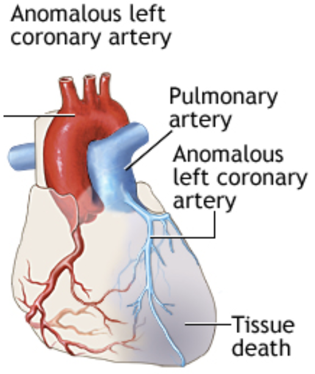

#### Work-up
- **CXR:** Cardiomegaly, pulmonary edema
- **EKG:** Signs of anterolateral ischemia manifest as pathologic Q waves (often very deep, but fairly narrow), inverted T waves and ST-segment elevation in leads I, aVL and V4-V6. Prolonged QTc may also be seen
- **Echo** is definitive, may confirm w/ MR/CT/angiography

#### Treatment
Surgery to reimplant LCA to aorta and patch pulmonary artery

### Anomalous Aortic Origin of a Coronary Artery (AAOCA)

#### Presentation
Range: asymptomatic → massive ischemia and sudden death

#### Pathophysiology
Variation in the number, shape or location of the ostia (origin) of the coronary arteries, usually non pathologic.  LCA or LAD arising from the right coronary cusp leads the anomalous vessel to course anteriorly around the aortic valve, placing the vessel between the aorta and pulmonary artery and at risk for compression during times of peak cardiac output.

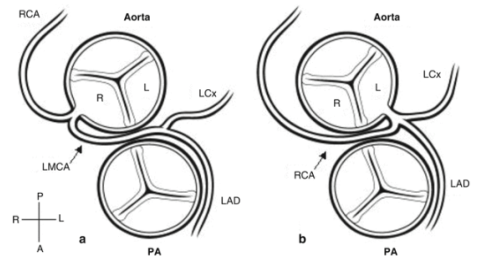

#### Treatment
- Anomalous LCA from the right coronary cusp (picture on L) is always treated w/surgery, even if asymptomatic, due to high risk of sudden death
- Anomalous RCA from the left coronary cusp (picture on R) is also associated w/ increased frequency of sudden death, though to a lesser extent; treatment is controversial

## Pulmonary Hypertension (pHTN)

#### Presentation
**Acute** → sx of R heart failure. **Chronic** → dyspnea w/ exertion and fatigue.

- Can lead to hemoptysis and sudden death from acute R heart failure from pulmonary hypertensive crisis
- May become cyanotic with acute increases in PVR if ASD present (which can preserve CO)

#### Physical Exam
RV heave, +/- TR murmur, cyanosis, clubbing, RHF signs such as JVD, hepatomegaly, peripheral edema

#### Pathophysiology
Mean pulmonary atrial pressure >20 mmHg. Causes are:

- Pulmonary arterial HTN
- Left heart dysfunction/obstruction
- Lung pathology or hypoxemia
- Chronic thromboembolism
- Multifactorial

#### Work-up
- **EKG:** RV hypertrophy often w/ accompanying strain (excessive right-sided forces for age w/ QRS-T angle > 90 degrees). In children, upright T-waves in V1 after 7-10 days of life suggests this diagnosis as can a qR pattern in V1.
- **CXR:** May show mildly enlarged cardiac chambers, underlying lung disease, and prominent proximal pulmonary arteries w/ diminished distal pulmonary vasculature
- **Echo:** May show enlarged or hypertrophied right-sided chambers. Position of the interventricular septum (which should bow into the usually low pressure RV) may flatten or bow into the LV. If present, the TR jet can estimate systolic RV pressure using the Bernoulli equation (upper limit of normal is ~25mmHg).  Septal defects may also be used in this manner.
- **Cardiac catheterization** is definitive diagnosis. Mean PA pressures >20 mmHg are diagnostic. Often performed w/ pulmonary vasodilator testing to assess response to potential therapies.

#### Treatment
- Correct underlying cause!
- Counseling to avoid strenuous activity (esp. isometric exertion), avoid alpha adrenergic meds
- **Pulmonary vasodilators** can be used: Remodulin (IV infusion of trepostinil), Bosentan (endothelin receptor antagonist), Sildenafil (phosphodiesterase inhibitor), nifedipine (calcium channel blocker), iNO, supplemental oxygen

## Cardiac Infections

### Myocarditis

#### Presentation
Range: asymptomatic → chest pain, palpitations, syncope, CHF w/ DOE and fatigue

#### Physical Exam
Fever, tachycardia, ventricular arrhythmias, new murmur or cardiogenic shock (poor pulses, hypotension, cool extremities)

#### Pathophysiology
Usually due to **viruses** (coxsackie B, adenovirus and enterovirus, and more recently HHV6 virus and parvovirus B19, measles, mumps, rubella, CMV, HIV, arboviruses, parvovirus, and influenza) or **inflammatory conditions** (Kawasaki disease, ARF)

#### Work-up
- **Labs:** CBC, inflammatory markers, cardiac enzymes, viral serologies, +/- rheumatologic screening if a systemic inflammatory process is suspected
- **CXR:** May show cardiomegaly and pulmonary vascular congestion/edema
- **EKG:** Non-specific. May show sinus tachycardia, arrhythmia, heart block, prolonged QT-interval, bundle branch blocks, abnormal QRS axis, diffusely low voltage QRS complexes (<5 mm in full standard across the limb leads), non-specific ST-T changes, and diffuse ST elevations w/ PR depression if there is coincident pericarditis
- **Echo:** Useful for evaluating cardiac function and ruling out other causes of cardiac dysfunction, but cannot definitively diagnosis myocarditis
- **Gadolinium-enhanced cardiac MRI** that shows late gadolinium enhancement is suggestive of myocarditis, though is somewhat non-specific
- **Endomyocardial biopsy** via right heart cath may be diagnostic, but has low sensitivity due to sampling error

#### Treatment
Largely supportive:

- Tx CHF w/ diuretics, ACE inhibitors, +/- milrinone (can worsen hypotension), inotropes, +/- antiarrhythmics, anticoagulant
- IVIG used but data is limited
- Fulminant myocarditis may require mechanical support with ECMO or VAD

### Endocarditis

#### Presentation
- **Subacute:** Low-grade fevers, myalgias, fatigue, weight loss, exercise intolerance
- **Acute:** Rapid, fulminant, high fevers, toxic appearance (usually *S. aureus*)

#### Physical Exam
Tachycardia, new murmur, splenomegaly, **Roth spots** (retinal lesion), **Janeway lesions** (palms/soles), **Osler nodes** (painful fingers and toes), **splinter hemorrhages**

#### Pathophysiology
Bacteria (usually *S. aureus,* viridans strep, coag neg staph) that damage endothelium and set off clotting cascade leading to fibrin deposition over valve

#### Work-up
- **Labs:** BCx x3 initially, then daily if persistently febrile. CBC w/ elevated WBC, +/- anemia. Elevated ESR and CRP. Microscopic hematuria due to renal emboli.
- **CXR:** May show evidence of CHF or septic emboli
- **EKG:** May show AV conduction defects if vegetation involves conduction system
- **Echo:** TTE is adequate in most kids; TEE indicated only if TTE inadequate. Absence of vegetations on echo does not exclude a clinical dx of endocarditis.

#### Diagnosis
- Pathologic criteria: Pathologic lesions on histology (vegetation/abscess w/ active IE), OR microorganism identified on histology or culture of vegetation/abscess
- Clinical criteria (**Modified Duke Criteria**): 2 major, OR 1 major + 3 minor, OR 5 minor:
	- **Major Criteria:** (1) _>_ 2 blood cultures w/ typical organisms (or persistently positive); (2) Endocardial involvement (vegetation, abscess, new valvular regurgitation)
	- **Minor Criteria:** (1) Predisposition; (2) Fever; (3) Vascular phenomena (septic emboli, mycotic aneurysm, ICH, Roth spots, Janeway lesion); (4) Immunologic phenomena (GN, RF+, Osler nodes)

#### Treatment
- **Antibiotics:** Empirically cover *Staph, Strep, Enterococci* (e.g. vanc) → tailor based on sensitivities; generally x4-6 wks
- **Surgery:** If persistent bacteremia despite adequate abx therapy, heart failure, progressive valvular dysfunction, conduction tissue involvement, or large lesion at high risk of embolizing

#### Complications
Heart failure (most common indication for surgery), perivalvular abscess (suspect if new conduction abnormality or persistent bacteremia), pericarditis, septic emboli, metastatic abscess, embolic stroke, renal infarction

### Pericarditis

#### Presentation
Chest pain (often relieved by leaning forward) +/- tachypnea and dyspnea

#### Physical Exam
Friction rub, weak apical impulse, poor perfusion, hepatomegaly

#### Pathophysiology
**Infectious** (bacterial, viral (Coxsackie), fungal, parasitic, TB), **inflammatory** (ARF, SLE, uremia, radition, drugs), traumatic, oncologic, chronic (constrictive pericarditis)

#### Work-up
**EKG** w/ decreased precordial voltages indicate **effusion**; diffuse ST elevation w/ PR depression is seen in **pericarditis**. Electrical alternans may manifest as QRS of alternating amplitude or axis, and is seen in pericardial **effusion.** There may be diffusely low voltage (< 5mm in full standard) QRS complexes in the limb leads.

#### Treatment
NSAIDs and colchicine, treat underlying cause

## References

[^1]: Keane et al. *NADAS' Pediatric Cardiology.* 2006.
