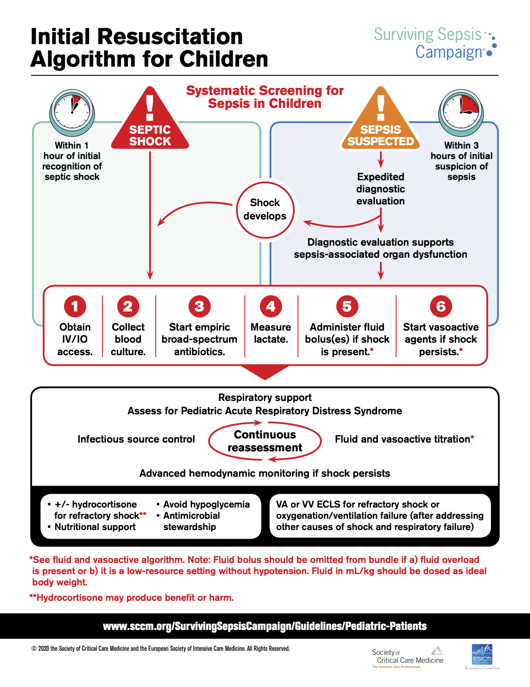
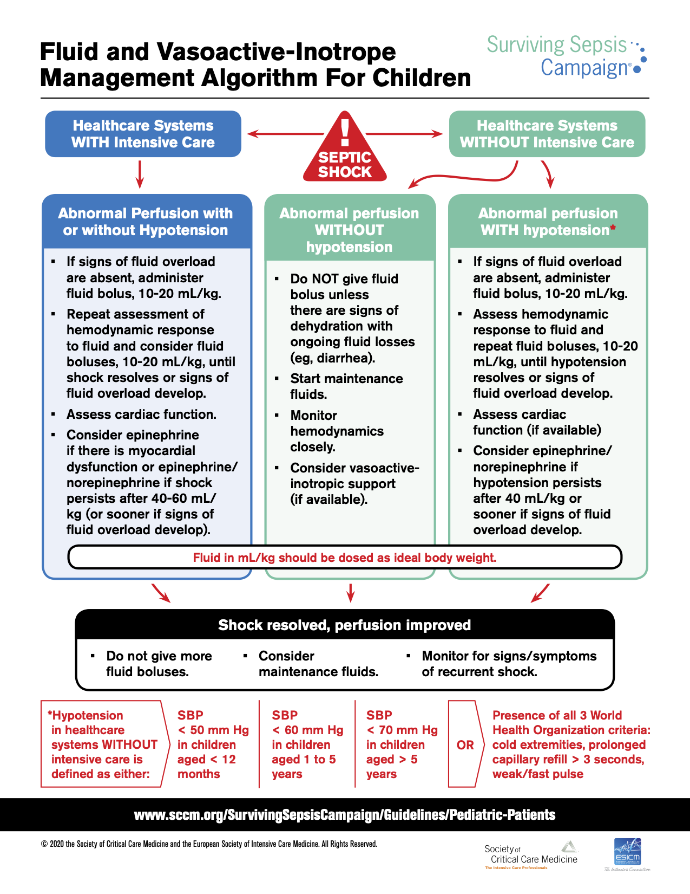

# Critical Care & ICP {#critical_care}

## Vasopressors & Inotropes
- Dopamine
	- Dosing
		- 1-20 mcg/kg/min (1-5 mostly affects DA; 6-10 β1; 11-20 α1)
	- Mechanism
		- DA, β1, α1
	- Considerations
		- Lower doses primarily cause inotropy & chronotropy (β1); DA-mediated splanchnic vasodilation of uncertain clinical significance
		- Higher doses will increase SVR and chronotropy, could decrease CO if afterload-sensitive
		- Can be used w/ norepinephrine for distributive or hypovolemic shock as higher doses increase SVR
- Epinephrine (EPI)
	- Dosing
		- 0.05-1 mcg/kg/min
	- Mechanism
		- β1, β2 > α1
	- Considerations
		- Increases CO, SVR w/ effects on CO > effects on SVR
		- Due to strong inotropic effects, preferred agent for cardiogenic shock
- Norepinephrine (NE)
	- Dosing
		- 0.01-1 mcg/kg/min
	- Mechanism
		- α1 > β1 > β2
	- Considerations
		- Primarily increases SVR, minimal change to HR
- Milrinone
	- Dosing
		- 0.25-1 mcg/kg/min
	- Mechanism
		- Phospho-diesterase (PDE) inhibitor
	- Considerations
		- Positive inotrope and decreases SVR (SVR effect more prominent - BP likely to decrease even if CO increases)
	- Useful for cardiogenic shock (CHF) w/ normal or high BP to reduce afterload and increase CO

## Shock

#### Definition
Metabolic demands of body > delivered oxygen to tissues

- Oxygen delivery (DO2) = content of arterial oxygen (CaO2) x cardiac output (CO)
- CaO2 = (1.34 x Hgb x % O2 Sat) + (0.003 x PaO2)
- CO = SV x HR, SV determined by preload, afterload, and contractility

#### Labs
- **Blood gas** w/ **lactate**
	- Assess pH and bicarb to determine degree of metabolic acidosis due to anaerobic metabolism - note, bicarb on blood gas is calculated based on the pH and pCO2 - obtain chemistry to measure directly
	- Increased lactate associated w/ inadequate tissue O2 delivery in shock states (but can also be elevated if not cleared appropriately, for example in liver failure)
- **Mixed venous saturation (ScvO2) / arterial-venous O2 difference**
	- Normal is 70-75%, normal AVO2d is 25-30%. ScvO2 often low in shock (inadequate delivery for utilization), can be high with hyperdynamic circulation, or may suggest impaired o2 utilization by cells due to injury (usually a bad sign)
	- Most useful from central line terminating in distal SVC, preferably RA; not useful from peripheral VBG
	- True pulmonary arterial saturation (SvO2) no longer routinely utilized
- **CBC** and **blood culture**
	- WBC count to assess infection
	- Hemoglobin to assess oxygen carrying capacity (see CaO2 above)
- **Chem 10** w/ **LFTs**
	- Chemistry to assess solutes (Na, K, Cl, gluc), bicarb, renal function (BUN/Cr), intravascular volume status (BUN:Cr ratio) 
	- LFTs to assess liver damage(transaminase/GGT/bilirubin elevations)

### Types of Shock
- Hypovolemic
	- Causes
		- Dehydration, hemorrhage, osmotic diuresis, third-spacing fluid, burns
	- Physiology
		- Not enough fluid in vasculature → decreased preload & CVP → low CO → decr. O2 delivery
	- Findings
		- Dry mucous membranes, oliguria, weak pulses w/ delayed capillary refill
	- Management
		- Fluid resuscitation, stop fluid losses if possible (e.g. treat bleeding)
		- Rapid transfusion protocol if hemorrhage
		- Rapid infuser in ICUs, ED, OR
- Distributive (septic, anaphylactic, neurogenic)
	- Causes
		- **Septic & anaphylactic:** Vasodilation & increased capillary permeability)
		- **Neurogenic:** Loss of sympathetic innervation to vascular tone)
	- Physiology
		- Poor tone and/or leaking of vasculature → low SVR → relative hypovolemia/ preload, low DBP. Contractility may be depressed later in sepsis presentation, CVP will vary.
	- Findings
		- Bounding pulses & brisk capillary refill if capillaries are leaky → warm extremities (**NOT** always true in pediatric septic shock!)
		- Low DBP (especially in neurogenic), widened pulse pressure
	- Management
		- **Vasopressors:** New guidelines are **EPI for “cold”** and **NE for “warm,”** may also see dopamine and vasopressin)
			- Anaphylactic → EPI
			- Neurogenic → NE
- Cardiogenic
	- Causes
		- Arrhythmias, myocarditis, CHF, cardiomyopathy, trauma, **cardiac tamponade, pulmonary embolism**
	- Physiology
		- Poor contractility or ability to relax → ineffective systolic output → decreased CO w/ initial low CVP and high SVR
	- Findings
		- Weak pulses w/ narrow pulse pressure (due to low SBP), pallor, cold extremities, delayed capillary refill, **signs of heart failure** (respiratory distress, hepatomegaly, JVD)
	- Management
		- LIMIT fluid resuscitation (5-10cc/kg)
		- Inotropic agents (low dose dopamine, or epinephrine, less commonly dobutamine)
		- Can consider milrinone if BP normal to decrease afterload
- Obstructive
	- Causes
		- Pulmonary embolism, cardiac tamponade
	- Physiology
		- Ability to produce adequate CO is impaired because of obstruction
	- Findings
		- Tamponade - Pulsus paradoxus or electrical alternans, narrow pulse pressure w/ increased diastolic
	- Management
		- Specific to the underlying cause

### Septic Shock Treatment Algorithm[^1]

## Analgesia, Sedation & Paralysis

### Analgesics
- **Morphine**
	- Pharmacokinetics
		- Onset: 20 min
		- Duration: 3-5 hrs
	- Bolus Dose
		- IV: 0.05-0.1 mg/kg/dose q1-2h
	- Considerations
		- Can be associated w/ histamine release leading to hypotension, pruritus, flushing
- **Hydromorphone (Dilaudid)**
	- Pharmacokinetics
		- Onset: 15 min
		- Duration: 5 hrs
	- Bolus Dose
		- IV: 0.015 mg/kg/dose q3h
	- Considerations
- **Fentanyl**
	- Pharmacokinetics
		- Onset: Immediate
		- Duration: 30-60 min
	- Bolus Dose
		- IV: 1-2 mcg/kg/dose q1h 
	- Considerations
		- Minimal hemodynamic instability w/ bolus doses
		- Large/rapid bolus doses can lead to muscle rigidity, interfering w/ ventilation → administer NMB or naloxone, support breathing

### Sedatives
- **Dexmedetomidine**
	- Pharmacokinetics
		- Onset: 5 min
		- Duration: 1-2 hrs
	- Dose
		- 0.2-2 mcg/kg/hr
	- Considerations
		- Dose-dependent bradycardia is common
		- Can also cause hypertension or hypotension 
- **Midazolam (Versed)**
	- Pharmacokinetics
		- Onset: 1-5 min
		- Duration: 2-6 hrs
	- Dose
		- IV: 0.05-0.1 mg/kg/dose q1-2h
	- Considerations
		- Dose-dependent hypotension and respiratory depression
- **Lorazepam (Ativan)**
	- Pharmacokinetics
		- Onset: 15-30 min
		- Duration: 8-12 hrs
	- Dose
		- IV: 0.05 mg/kg/dose q4h-q12h
	- Considerations
		- Same adverse effects as midazolam, longer duration of action
- **Ketamine**
	- Pharmacokinetics
		- Onset: 30 sec
		- Duration: 5-10 min
	- Dose
		- **Intubation:** IV:1-2 mg/kg/dose (load) + 0.5 mg/kg/dose q5min PRN
		- **Conscious sedation:** IV: 0.2 - 1 mg/kg (load) + 0.5 mg/kg q10min PRN
	- Considerations
		- Dissociative (causes trance-like state associated w/ amnesia, but patients still move). Mild analgesic.
		- Myocardial depressant, but also increases catecholamine release
		- Bronchodilator
- **Propofol**
	- Pharmacokinetics
		- Onset: 60 sec
		- Duration: 3-10 min
	- Dose
		- 25-150 mcg/kg/min, bolus 1-2 mg/kg
		- Only credentialed ICU/anesth in non-intubated patients. Attgs can bolus (or fellow under direct supervision). Infusion not to last longer than 12 hrs in children.
	- Considerations
	- Dose-dependent hypotension (vasodilation and myocardial depression)
	- Prolonged/high dose infusions increase risk of propofol infusion syndrome (cardiac failure, arrhythmias, rhabdo, lactic acidosis, among other problems). Children at higher risk.

### Paralytics
- **Rocuronium**
	- Pharmacokinetics
		- Onset: 60-90 sec (high dose); 2-3 min (low dose)
		- Duration: 30-60 min
	- Dose
		- IV: 0.6-1.2mg/kg/dose
	- Considerations
		- High dose (1.2mg/kg) has more rapid onset but also longer duration, can be used for rapid sequence intubation
- **Vecuronium**
	- Pharmacokinetics
		- Onset: 1-2 min
		- Duration: 20-60 min
	- Dose
		- IV: 0.1 mg/kg/dose, or infusion of 0.1mg/kg/hr
	- Considerations
- **Cisatracurium**
	- Pharmacokinetics
		- Onset: 1-3 min
		- Duration: 25-44 min
	- Dose
		- IV: 0.2 mg/kg/dose, or infusion
	- Considerations
		- Undergoes non-enzymatic degradation in circulation, thus duration of action remains same in patients w/ liver/renal dysfxn
- **Succinylcholine**
	- Pharmacokinetics
		- Onset: 30-60 sec
		- Duration: 5-10 min
	- Dose
		- IV: 1-2 mg/kg 
	- Considerations
		- See below

## Rapid Sequence Intubation (RSI)
**NOTE:** Pre-oxygenate w/ 100% O2 for 2-5 min whenever possible!*

### Pre-Med ("Appetizer" 🥗)
- **Atropine**
	- Dosing & Pharmacokinetics
		- 0.02 mg/kg IV/IO (min 0.1mg, max 0.5mg)
	- Considerations
		- **PRO:** Prevents vagal response
		- ***Use if <1yo or <5yo if using succinylcholine!***
- **Lidocaine 2%**
	- Dosing & Pharmacokinetics
		- 1 mg/kg IV
		- Give 2-5 min prior to paralysis
	- Considerations
		- **PRO:** Likely ↓ ICP, RAD

### Induction ("Main Course" 🍔)
- **Ketamine**
	- Dosing & Pharmacokinetics
		- 1-2 mg/kg IV
		- **Duration:** 30-60 min
	- Considerations
		- **PRO:** Bronchodilator, ↑ BP
		- **CON:** ↑ ICP, dysphoria, sialogogue, cardiodepressant
		- ***Contraindications: ↑ ICP, globe injury, psychosis***
- **Propofol**
	- Dosing & Pharmacokinetics
		- 1-4 mg/kg IV
		- **Onset time:** 60 sec
		- **Duration:** 3-10 min
	- Considerations
		- **PRO:** ↓ ICP, anti-emetic
		- **CON:** ↓↓↓ BP, ↓ cardiac output
		- ***Contraindications: Shock, cardiac dysfunction, hypersensitivity***
- **Midazolam**
	- Dosing & Pharmacokinetics
		- 0.1 mg/kg IV/IO
	- Considerations
		- **PRO:** Short-acting 
		- **CON:** ↓ BP, respiratory depression
		- ***Contraindications: HD instability***
- **Fentanyl**
	- Dosing & Pharmacokinetics
		- 2-4 mcg/kg IV/IO
		- **Onset time:** 90 sec
		- **Duration:** 30-60 min
		- ***Give slowly!***
	- Considerations
		- **PRO:** Short-acting opiate, hemodynamically neutral
		- **CON:** Apnea, chest wall rigidity
		- ***Contraindications: Hypersensitivity***
- **Etomidate**
	- Dosing & Pharmacokinetics
		- 0.3 mg/kg IV
	- Considerations
		- **PRO:** Best agent for HD stability
		- **CON:** Adrenal suppression, clonic movements
		- ***Contraindications: Septic shock***

### Paralysis ("Dessert" 🍰)
- **Succinylcholine**
	- Dosing & Pharmacokinetics
		- 1-2 mg/kg IV
		- **Onset:** 60 sec
		- **Offset:** 5-10 min
	- Considerations
		- Depolarizing agent
		- **PRO:** Good for laryngospasm
		- **CON:** Not reversible, can provoke hyperkalemia or malignant hyperthermia in susceptible individuals , 
		- ***Contraindications:*** 
			- ***↑ K+: Renal failure, burns, crush injury, neuromusc. dz, paraplegia***
			- ***Malignant hyperthermia (hx or risk)***
			- ***Pseudocholinesterase deficiency (will prolong effect)***
			- ***Known difficult intubation/upper airway obstruction (can’t be reversed)***
			- ***Globe injury, glaucoma***
- **Rocuronium**
	- Dosing & Pharmacokinetics
		- 1.2 mg/kg IV 
		- **Onset:** 2 min
		- **Offset:** 30 min
		- Hepatic > renal excretion
	- Considerations
		- **PRO:** Safe alternative agent, reversible with neostigmine or sugammadex
		- **CON:** Longer onset/offset, transient HTN, hypotension also possible

## Respiratory Support: Ventilation & Oxygenation

### High-Flow Nasal Cannula (HFNC)

#### Definition
Delivery of heated and humidified air and oxygen at rates that exceed spontaneous inspiratory flow

#### Indications & Contraindications
- Indications
	- Respiratory distress/dyspnea to offload work of breathing 
	- Asthma 
	- Bronchiolitis
	- Tracheomalacia
	- Preoxygenation/apneic oxygenation prior to and during intubation 
- Contraindications
	- Hypercarbic respiratory failure 
	- Inability to protect airway
	- Impaired or absent spontaneous respiratory drive
	- Facial anomalies or injuries that preclude nasal cannula fit 
	- Excessive oral or nasal secretions 
	- Active vomiting 
	- Bowel obstruction 
	- Existing air leak (pneumothorax/pneumomediastinum)
	- Agitation or confusion predicting inability to tolerate 

#### Bronchiolitis HFNC Pathway
- Inclusion criteria: Age <2yo w/ dx of bronchiolitis, hypoxia requiring >2L/min LFNC or 35% FiO2, or persistent increased WOB
- Initiate at 1 L/kg/min and adjust FiO2 to goal SpO2 >90% 
- Reassess hourly to determine if can wean or need to escalate:
	- **Weaning:** Wait until patient has achieved 8 hr period of stability on current flow rate and FiO2 has been weaned to 21%-30%
		- If current support 1L/kg/min, turn HFNC off and transition to LFNC if still requiring FiO2
		- If not 1 L/kg/min, decrease flow to 1L/kg/min and then turn HFNC off after 8 hr period of stability 
		- Monitor patient in setting that can restart HFNC for 8-12 hrs after discontinuation 
	- **Escalation:** If no clinical improvement or increased WOB, escalate to 2 L/kg/min and continue to reassess hourly 
		- If clinical improvement, can advance to **weaning** pathway 
		- If no clinical improvement, consider transition to **NIPPV** 

### Non-Invasive Positive Pressure Ventilaion (NIPPV)

#### Interface
Nasal mask, facemask, RAM nasal cannula depending on patient

- Consult w/ RT at BCH or BMC to evaluate patient early for best interface for NIPPV

#### Continuous Positive Airway Pressure (CPAP)
- Provides continuous airway pressure (**PEEP**). FiO2 can be adjusted to improve oxygenation as well.
- **Mechanism:** Alveolar recruitment improved, which improves oxygenation through better V/Q matching
- **Indications:** Hypoxic respiratory failure, obstructive sleep apnea, upper airway obstruction
- **Considerations:** No “breaths” delivered, so patient **MUST** be spontaneously breathing

#### Bilevel Positive Airway Pressure (BiPAP)
- Provides inspiratory pressure (**IPAP**) (compared to PIP), and expiratory pressure (**EPAP**) (compared to PEEP). Can also adjust FiO2 to improve oxygenation.
- **Mechanism:** In addition to alveolar recruitment, delta pressure (IPAP - EPAP) influences tidal volume to improve ventilation (Minute Ventilation = Tidal Volume x Respiratory Rate). IPAP can also reduce work of breathing.
- **Indications:** Hypoxic, hypercarbic or mixed respiratory failure
- **Considerations:** Although you can set a mandatory breath rate in certain BiPAP modes, machine breaths that are not aligned w/ patient efforts do not result in good tidal volumes due to the noninvasive interface; therefore **not a good choice** for patients w/ inconsistent respiratory drive. **Relatively contraindicated** in patients w/ altered mental status or who cannot protect their airway (ie. no cough or gag) from aspiration.  

#### Weaning NIV Support
Refer to ICP SCAMP for pathway

- Criteria for **weaning** (must meet 4/5):
	- CV stability (HR and BP wnl for age or at patient baseline)
	- Work of breathing none to mild
	- FiO2 _<_ 40%
	- tcCO2 or pCO2 at baseline or wnl
	- Afebrile

- Criteria for **sprinting** from NIV:
	- Clinical stability on goal setting for 4 hrs 
	- Tolerating airway clearance measures/suctioning

- Markers of **intolerance to sprinting** (if at any time 2 or more markers shown, resume NIV):
	- Tachypnea increased
	- tcCO2, etCO2 or pCO2 increased by 10
	- Work of breathing increased from none/mild to moderate or severe 
	- FiO2 increased to _>_ 50% or NC >2 LPM from time of initiation of sprint

### Mechanical Ventilation (MV)

#### Glossary
- **MBR** (mandatory breath rate): # of breaths the ventilator will deliver to patient per minute (vent will ensure patient receives breaths if patient not spontaneously triggering the ventilator)
- **RR:** MBR plus whatever spontaneous breaths the patient takes (breaths above MBR may or may not be supported depending on mode)
- **PIP** (peak inspiratory pressure): Highest pressure the patient will see during the respiratory cycle
- **PEEP** (positive end expiratory pressure): Pressure the lungs see during expiration (helps keep the alveoli open during expiration and prevent atelectasis)
- **TV** (tidal volume): Max volume delivered to the patient during inspiration
- **IT** (inspiratory time): Time over which tidal volume is delivered
- **ET** (expiratory time): Time when inspiratory flow is not being delivered, generally longer than IT (basically what is left over after you have a certain number of breaths per minute w/ a certain Ti)
- **MAP** (mean-airway pressure): (Ti x PIP) + (Te x PEEP) / (Ti + Te)

#### General Principles of Mechanical Ventilation
- Improve **oxygenation** (increase **PaO2**) by recruiting alveoli and optimizing V/Q matching
	- Usually done by optimizing PEEP, MAP, I:E ratio. Can also increase inspired O2 concentration by increasing FiO2.
	- Both atelectasis and overdistension must be avoided
- Improve **ventilation** (decrease **PaCO2**) by increasing alveolar ventilation
	- Adjust variables that influence RR, TV
	- Remember: Lungs need to empty in order for new air from outside (pCO2 = 0) to enter (particularly in patients w/ obstructive physiology (asthma), which may require longer expiratory times)

#### Modes of Ventilation
1. **AC (Assist-Control)**
	- Every breath is machine supported and has the same parameters (PIP, PEEP, Ti), whether patient-triggered or machine-triggered
	- Breaths can be triggered by patient (assisted breaths) or elapsed time if patient not able to trigger (controlled breaths)
	- Risk of overventilation if patient’s spontaneous respiratory rate is high for other reasons (fever, agitation) or if ventilator is inappropriately triggering 
	- Can set to pressure control or volume control
2. **SIMV (Synchronized Intermittent Mandatory Ventilation)**
	- Machine will synchronize breath delivery to align w/ patient’s effort, but if patient is not triggering breaths frequently enough, machine provides mandatory breath rate to patient
	- Often paired w/ pressure support ventilation (SIMV + PSV) to support breaths above mandatory breath rate
	- Can set to pressure or volume control:
		- **Pressure Control:** Set pressure, tidal volume changes based on compliance (∆V/∆P)
		- **Volume Control:** Set volume, pressure changes
3. **PRVC (Pressure-Regulated Volume Control)**
	- Ventilator adjusts pressure depending on exhaled tidal volume every 3rd breath
	- Optimizes lowest pressure possible to achieve set tidal volume by constant automated adjustments
4. **PS (Pressure Support)**
	- No mandatory breath rate, no set inspiratory time 
	- When patient triggers a breath, machine delivers a set level of pressure above PEEP
	- Inspiratory time of breath determined by patient-driven inspiratory flow (flow cycling) - if patient is “satisfied” (inspiratory flow drops below a certain threshold from peak, because the patient stops actively inhaling), the ventilator will cycle into exhalation

#### Troubleshooting Desaturations on a Ventilator ("DOPE")
- **D**islodgement (of ETT): Mask ventilate, call staff assist
- **O**bstruction (mucus plug): Suction, call nursing & RT
- **P**neumothorax: Obtain CXR, consider needle decompression if concern for tension physiology 
- **E**quipment failure: Bag-ETT to ventilate, call RT

## Extracorporeal Membrane Oxygenation (ECMO)

#### Definition
An extracorporeal circuit designed to provide prolonged pulmonary (**VV ECMO**) or cardiopulmonary (**VA ECMO**) support by removing blood from the native vascular system, performing gas and heat exchange and reinfusing the oxygenated blood into the body.

- **Venovenous (VV ECMO):** Drains systemic venous deoxygenated blood, oxygenates it and removes carbon dioxide, and returns oxygenated blood to the systemic venous system. Provides pulmonary support (blood still goes through native heart and lungs) and is effective in respiratory failure w/ **intact cardiac function**.
- **Venoarterial (VA ECMO):** Drains systemic venous deoxygenated blood, oxygenates it and removes carbon dioxide, and returns oxygenated blood to systemic arterial system. Provides cardiopulmonary support (some blood bypasses native heart and lungs)  and is effective in patients w/ **cardiopulmonary failure**.

#### Indications & Contraindications
- Indications
	- Hypoxemic respiratory failure w/ PaO2/FiO2 < 100 or Oxygenation Index (OI) > 40 despite optimized ventilator settings (PIP > 35 cm H20, PEEP > 10 cm H20, MAP > 18 cm H20; failure of high frequency ventilation) (OI = FiO2 * Mean Airway Pressure * 100/PaO2, note, multiply by 100 if (correctly) expressing FiO2 as a decimal; if using percent O2, don’t multiply by 100))
	- Persistent hypercapnic respiratory failure w/ arterial pH < 7.2 refractory to all ventilation modes.
	- Refractory cardiogenic shock
	- Cardiac arrest
	- Failure to wean from intraoperative cardiopulmonary bypass
	- VA ECMO or ventricular assist device (VAD) may be used as a bridge to cardiac transplant
	- VV ECMO is potential bridge to lung transplant in certain circumstances
- Contraindications
	- Lack of reversible etiology of critical illness
	- Irreversible, progresive, severe neurologic compromise
	- Large intracranial hemorrhage prior to ECMO
	- Severe bleeding
	- Severe coagulopathy or refractory thrombocytopenia
	- Unwitnessed out-of-hospital cardiac arrest
	- Presence of Do Not Resuscitate (DNR) Order
	- Pre-existing multiorgan failure

#### Pre-ECMO Initiation
1. Type and cross, arterial blood gas, electrolytes, CBC, coags, lactic acid, LFTs, chem 10
2. Head US in neonates to rule out severe IVH
3. Echocardiogram to evaluate cardiac function and for structural CHD

#### Titration
- Titrate to achieve an **arterial O2 saturation** >90% for VA ECMO and >80% for VV ECMO (there is mixing of oxygenated and deoxygenated blood w/i the RA during VV ECMO), and **mixed venous O2 saturation** of >70% for VA ECMO
- Target normal lactates and arterial BP (measures of perfusion)

#### Complications
- **Bleeding** is the most common complication (30-40% by some estimates), can be life-threatening. May require immediate surgical intervention, brief cessation of heparin infusion or use of plasminogen inhibitors (i.e. aminocaproic acid).
- **Thromboembolism** is infrequent, but can be catastrophic, especially in VA ECMO where embolization is systemic
- **Vessel perforation, dissection, or occlusion,** resulting in **distal ischemia** (latter can be seen in femoral arterial cannulation, treated w/ placement of a distal perfusion cannula)

## Acute Respiratory Distress Syndrome (ARDS)

#### Definition
- Acute respiratory failure not fully explained by cardiac etiology or fluid overload
	- Excludes patients w/ perinatal pulmonary disease
- CXR w/ pulmonary infiltrates (does not have to be bilateral)
- Increased oxygenation index

#### Pathophysiology
- No unifying pathophysiology for ARDS - can be direct injury (pneumonia, traumatic contusion) or indirect (systemic inflammation from sepsis)
- Overall, insult causes alveolar cell damage filling of airspaces w/ exudate. Over ~3 wks, granulation tissue formation occurs which leads to remodeling and fibrosis.
- Alveolar collapse leads to V/Q mismatch

#### Clinical Manifestations
- Respiratory distress out of proportion to underlying disease
- Hypoxemia
- Decreased lung compliance

#### Diagnostic Studies
- CXR: Commonly see bilateral infiltrates, although not required for diagnosis
- ABG: High A-a gradient
- PaO2 to FiO2 ratio is < 300

#### Management
Lung protective ventilatory strategies to reduce ventilator-induced lung injury

- Maintain TV 4-6cc/kg, use PEEP to improve oxygenation (continue increasing PEEP if FiO2 > 0.6 and not hyperinflated). Target SpO2 88-94% (wean if >98%), goal FiO2 < 0.6.
- Permissive hypercapnia (pH 7.15-7.30), PaCO2 60s

## Hypertensive Crisis

#### Definitions
- **Hypertensive Urgency:** Severe elevation in BP WITHOUT evidence of acute end-organ damage
- **Hypertensive Emergency:** BP >Stage II HTN for age WITH evidence of **acute end-organ damage**

#### Etiology
- **Neonates:** Renovascular disease, congenital renal anomalies, BPD, coarctation
- **Children:** Renovascular disease, glomerulonephritis, endocrine disease
- **Adolescents:** Renovascular disease, drugs (cocaine, amphetamines, Serotonin Syndrome)

#### Clinical Manifestations
- **Hypertensive encephalopathy:** Headache, altered MS, vision changes, seizures, acute stroke
- **Myocardial ischemia:** Acute chest pain, dyspnea, orthopnea, cough. Can hear diffuse, fine crackles at lung base, S3 gallop.
- **Aortic dissection:** Chest & abdominal pain, end-organ dysfunction
- **Retinal hemorrhages** and exudates
- **Malignant nephrosclerosis:** Leading to acute renal failure, hematuria, and proteinuria
- **Posterior Reversible Encephalopathy Syndrome (PRES):** Encephalopathic or seizing patient in setting of acute hypertensive crisis w/ neuroimaging findings of reversible vasogenic subcortical edema w/o infarction. Edema usually seen in parietal and occipital lobes.

#### Diagnostic Studies
- 4-extremity BPs
- Fundoscopic exam
- Chem 10 to evaluate for renal impairment
- CBC +/- reticulocyte count and smear to look for microangiopathic anemia
- UA to look for hematuria, proteinuria
- EKG to look for evidence of LVH or myocardial ischemia
- CXR if chest pain or SOB (look for cardiac enlargement, pulmonary edema)
- Head CT or MRI if abnormal neurologic exam or mental status
- Consider tox screen, pregnancy test, endocrine testing to look for underlying cause

#### Management
- **Hypertensive Urgency:** Reduce BP slowly over 24-48 hrs
	- IV Hydralazine/Labetalol OR PO Isradipine/Clonidine
- **Hypertensive Emergency:** Reduce BP by 10-20% over 1st hr, reduce by no more than 25% in first 8 hrs
	- IV Hydralazine or Labetalol bolus, followed by Nicardipine or Labetalol infusion

##### Medications for Management of Hypertensive Crisis
- **Hydralazine**
	- Dosing
		- Start at 0.1-0.2 mg/kg/dose (max 20mg), max 0.5 mg/kg q4h
		- Onset 10 min, duration 4-6 hrs
	- Indications
		- Short-term control of symptomatic hypertension
	- Considerations
		- Not for use in LV dysfunction
		- Potential exists for prolonged hypotension
- **Labetalol**
	- Dosing
		- 0.25-1 mg/kg/dose (max 40mg) as frequently as q5-10min, or continuous 0.25-1 mg/kg/hr
	- Indications
		- Short-term control of symptomatic hypertension
		- For **pheochromocytoma**, use after initiation of an alpha blocker so as to not precipitate hypertensive crisis
	- Considerations
		- Not for use in myocardial dysfunction
- **Nicardipine**
	- Dosing
		- Loading dose 5-10 mcg/kg, then 0.5-3.5 mcg/kg/min
		- Peak effect at 30 min, lasting up to 4 hrs
	- Indications
		- Consider using w/ renal dysfunction
	- Considerations
		- Not for acute heart failure or coronary ischemia
		- **Caution** in infants w/ calcium-dependent myocardium

## Diabetic Ketoacidosis (DKA)

#### Order Set
- DKA ICP Order Set → Look for Excel calculator hyperlink for 2-Bag Method
- Yellow DKA Card

#### Definition
Plasma glucose >200 + Acidosis (pH <7.3 or venous HCO3 <15) + Ketonuria or ketonemia 

#### Clinical Manifestations
- Hyperglycemia, vomiting, abdominal pain, dehydration, altered mental status 
- History of Type 1 Diabetes or weight loss, polyuria, polydipsia 

#### Diagnostic Studies
- **Initial:** Chem 10, beta-hydroxybutyrate, VBG, HgbA1c, consider pancreatic autoantibody panel, TFTs, c-peptide, insulin, urine ketones 
- While on **insulin infusion:**
	- Point of care glucose q1h
	- Chem 10, beta-hydroxybutyrate, VBG q2h
- While on **subcutaneous insulin:**
	- Point of care glucose before meals/bed and q2am
	- Chem 10, beta hydroxybutyrate, VBG only PRN

#### Management
1. **FLUIDS:**
	- **NS Bolus:** 10 cc/kg IV x1, may repeat with caution 
	- **2-Bag Method** for fluid management (defer if serum K >5 mEq/L)
		- 1.5-2x maintenance rate - use excel calculator to titrate Bag #1 and 2 rates
		- Bag #1 = NS + K Acetate 20 mEq/L + K Phos 20 mEq/L 
		- Bag #2 = D12.5W + NS + K Acetate 20 mEq/L + K Phos 20 mEq/L 
	- **Goal Dextrose Content** in infusion (based on blood glucose) 
		- Greater than 300 = 0% 
		- 276-300 = 5% 
		- 251-275 = 7.5% 
		- 201-250 = 10% 
		- Less than 200 = 12.5% 
2. **INSULIN INFUSION:** Start after 1hr of fluid administration) 
	- Start infusion at 0.1 units/kg/hr (for mild DKA, can use 0.05 unit/kg/hr)
3. **SUBCUTANEOUS (subQ) INSULIN:** Start when patient can tolerate PO, vpH >7.3, HCO2 >15, and/or anion gap 14)
	- Give the first rapid- and long-acting subQ insulin 15 min pre-meal. Stop IVF & insulin drip 30 mins after subQ dose.
	- Calculate **total daily dose (TDD)** based on chart in DKA card and per Endocrine consult
	- **Basal-Bolus regimen** = ½  of TDD as Lantus or Tresiba once daily + ½ TDD as Humalog divided in meals

#### Complications
- **CEREBRAL EDEMA:** Headache, emesis, increased BP, change in consciousness/responsiveness, delirium, confusion, unequal/dilated pupils, cranial nerve palsy, papilledema, incontinence, bradycardia, respiratory irregularity or arrest, sudden polyuria
	- Decrease IV rate, raise HOB to 30°
	- Mannitol 1 g/kg IV over 15 min, follow UOP and VS
	- Consider ETT placement for airway control & hyperventilate to pCO2 patient had prior to intubation → slowly normalize over 12-24 hrs
	- Consider STAT head CT once airway is stabilized
- **HYPOPHOSPHATEMIA:** Metabolic encephalopathy (irritability, paresthesias, confusion, seizure, coma), ileus, dysphagia, proximal myopathy, hemolysis
- **HYPONATREMIA:** Presentation varies based on measured sodium (**Na 115-120** = seizure, coma, respiratory arrest. **Na 120-125** = lethargy, headache, obtundation. **Na 125-130** = nausea and malaise.)
	- If symptomatic, infuse 3% hypertonic saline 5 mL/kg IV over 15 min, stop when symptoms resolve
- **HYPOGLYCEMIA:** If BG <200 and anion gap is near to normal, reduce insulin to 0.075 cc/kg/hr, then to 0.05 unit/kt/hr. Discuss with Endocrine prior to decreasing.
- **HYPOKALEMIA:** If symptomatic, give 0.5-1 mEq/kg IV over 2 hrs with goal K=3.5 to 4.5
- **HYPOCALCEMIA:** Decreased BP, tetany, laryngospasm. May result with excess phosphate administration.

## References
[^1]: Society of Critical Care Medicine (SCCM). Surviving Sepsis Campaign, [Guidelines for Pediatric Patients](https://www.sccm.org/SurvivingSepsisCampaign/Guidelines/Pediatric-Patients)
