# Dermatology

## Key Questions for Taking a Dermatologic HIstory
- When did it start? (ask for timepoints, i.e., “before Christmas?”)
- Does it itch, burn, or hurt?
- When was the first episode?
- Where on the body did it start? Was it present at birth?
- How has it spread (pattern of spread)?
- How have individual lesions changed? (Size, shape, color, itch, bleeding?)
- Is there a family history? (eczema, acne, psoriasis, autoimmune disease)
- What has made it worse or triggered it?
- What have you tried for it? Did it help?
- Hx of atopic triad (asthma, allergies, atopic dermatitis)?
- New exposures: Medications? (Look at external med rec) Travel? Environmental?
- Ask if they brought the medications they are using

## Describing Dermatologic Lesions

### Primary Lesion

|   |Description of the "family" of a lesion|Appearance|
|---|---------------------------------------|----------|
|Macule|Flat, not palpable; color change; <1cm (e.g., freckle, labial macule)|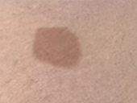|
|Patch|Flat, not palpable; color change; >1cm (e.g., congenital nevus or large birthmark)|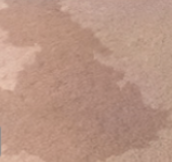|
|Papule|Raised; <1 cm (e.g. mole, acne)|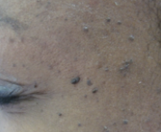|
|Plaque|Raised; >1 cm usual flat topped (e.g. psoriasis)|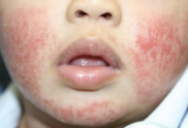|
|Nodule|Raised; round-topped lesion w/ depth; >0.5cm up to 1 cm (e.g. acne)|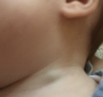|
|Tumor|Very large, round-topped lesion w/ depth, exophytic, endophytic or level w/ skin surface ; >1cm (e.g. strawberry hemangioma of infancy)|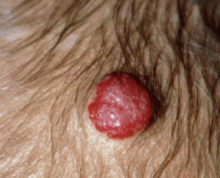|
|Wheal|Edematous, raised, hive-like|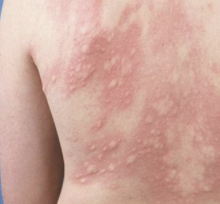|
|Vesicle|Small fluid-containing blister <1cm  (e.g. chickenpox, shingles zoster)|   |
|Bulla|Large fluid-containing blister > 1cm (e.g. bullous pemphigoid)|   |
|Pustule|Exudate filled; <1cm; can develop into furuncle, then abscess (e.g. pustular psoriasis)|   |
|Telangiectasia|Dilated superficial capillaries|   |
|Verrucae|Soft, tan-colored, cauliflower-like papules (e.g. warts caused by HPV)|   |

### Secondary Changes
Describe the changes that occur superimposed upon the primary lesion

- **Scale:** Flakes of “dead skin”; thickening of outermost layer (stratum corneum)
- **Crust:** Adherent, dried serum, exudate or blood on the skin
- **Desquamation:** Thicker scale that is shedding off
- **Erosion:** Loss of superficial layers of skin (epidermis only involved, does not scar); erosions lead to ulcerations
- **Ulceration:** Loss of deeper layers of skin (extends to dermis, scars)
- **Fissure:** Deep linear cracks in skin
- **Atrophy:** Thinning of skin; can be in the epidermis, dermis, or subcutaneous fat
- **Excoriation:** Erosions due to scratching
- **Lichenification:** Thickened, leather-like skin, normal skin lines accentuated
- **Scar/keloid:** Permanent fibrotic changes that result from damage extending into the dermis, keloids extend beyond the borders of the original defect
- **Umbilicated:** Centrally indented

### Color Descriptor
- **Erythematous:** Blanchable red or pink hue in the skin, indicates vascular dilation; erythema is not a color per se
- **Purpuric:** Violaceous color due to blood pigment
- **Petechial:** Pinpoint, non-blanching bleeding into the skin from capillaries
	- **Purpura** = 1cm, **ecchymoses** > 1cm
- **Hyperpigmentation:** Darker than normal skin color
- **Hypopigmentation:** Lighter than normal skin color

### Lesion Shapes
- **Annular:** Ring-shaped lesion 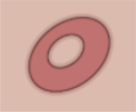
- **Nummular/discoid/round:** Coin-shaped lesion 
- **Arcuate:** Arc-shaped lesion 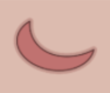
- **Linear** Forming a line 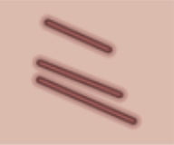
- **Serpiginous:** Wavy like a snake 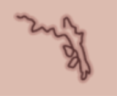
- **Figurate/polycyclic:** Lots of different ring shapes, rings within rings 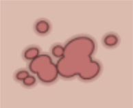
- **Retiform/reticulate:** Web or net-like, following vasculature 
- **Targetoid:** Lesions with a bull’s eye, or concentric rings or varying colors 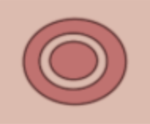

### Distribution
- **Clustered (agminated):** Grouped together in a bunch but not running together
- **Discrete/scattered:** Lesions are separate from one another
- **Acral:** Over distal portions of limbs: finger tips, knuckles, elbows, knees, buttocks, toes, heels
- **Generalized:** Throughout body
- **Photodistributed:** Sun-exposed areas
- **Coalescing:**

## Newborn Derm

### Neonatal Rashes

|Condition|Description|Appearance|
|---------|-----------|----------|
|Sebaceous hyperplasia|Minute, profuse yellow-white papules frequently on forehead, nose, lip, and cheeks|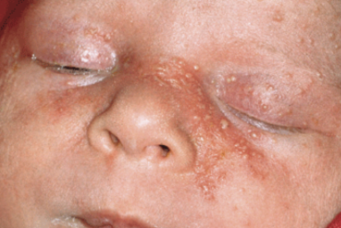|
|Milia/miliaria|1-2 mm pearly, opalescent cysts|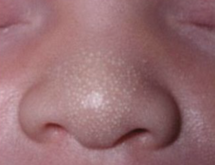|
|Neonatal acne (neonatal cephalic pustulosis)|Inflammatory papules and pustules usually w/o comedonal lesions|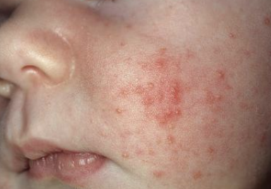|
|Sucking blisters|Solitary or scattered superficial bullae on upper limbs of infants at birth (presumed in utero sucking)|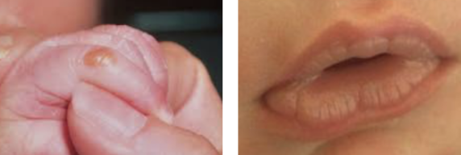|
|Cutis marmorata|Evanescent, lacy, reticulated red and/or blue cutaneous pattern when exposed to low environmental temperatures|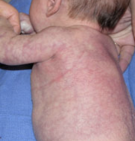|
|Harlequin color change|When infant (usually immediate newborn period and in low birth weight infants) is laying on side, dependent area is deep red and upper half (longitudinally) is pale|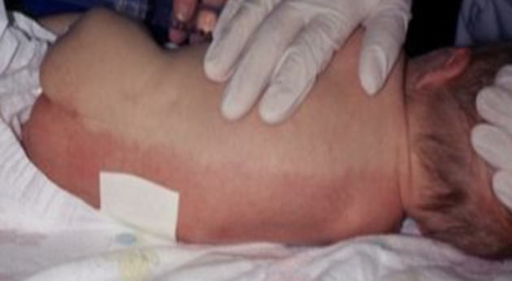|
|Nevus simplex ("salmon patch," "stork bite," "angel's kiss")|Small, pink, ill-defined vascular macule usually on glabella, eyelids, upper lip and nuchal area|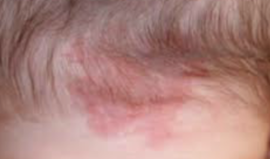|
|Erythema toxicum neonatorum (e tox)|Benign, self-limited evanescent eruption usually in term infants presenting w/ firm, yellow-white papules and pustules w/ a surrounding erythematous flare; palms and soles are almost never affected|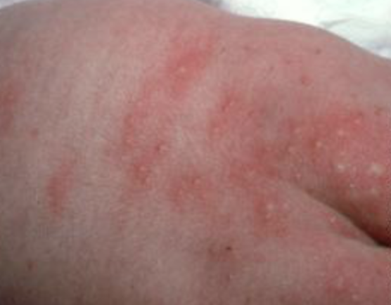|
|Transient neonatal pustular melanosis (TNPM)|Superficial pustules, ruptured pustules w/ a fine scale, and hyperpigmented macules|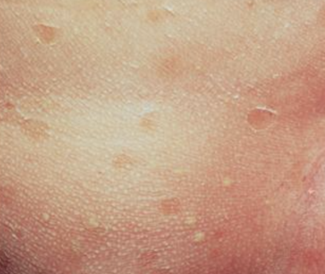|
|Seborrheic dermatitis|Erythema and greasy scales usually on the scalp ("cradle cap"), face, forehead,  trunk, intertriginous and flexural  areas including diaper|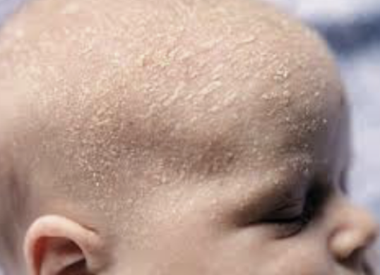|

### Neonatal Birthmarks

|Condition|Description|Appearance|
|---------|-----------|----------|
|Congenital melanocytic nevus (CNM, moles)|- Often benign neoplasms composed of melanocytes - Small and medium sized CMN have less than 1% risk of malignant transformation; large and giant lesions the risk is higher, ranging from 0-7.6%|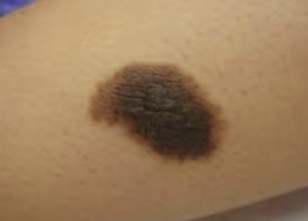|
|Nevus sebaceous (organoid hamartoma)|- Overgrown epidermis, sebaceous glands, hair follicles, apocrine glands and connective tissue that occurs primarily on scalp or face - Presents as solitary, smooth, yellow-orange hairless patch, often oval or linear. Often becomes more pronounced in adolescence, appearing bumpy, warty, scaly.|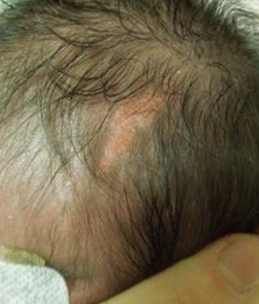|
|Aplastic cutis congenita|- Absence of skin present at birth that can be localized or widespread - Can be an isolated finding or associated with other developmental anomalies - Large scalp defects should be imaged to r/o underlying bone, vascular, or soft tissue defects|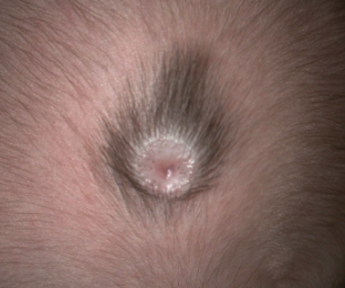|
|Congenital dermal melanocytosis (CDM; slate gray patch, Mongolian spot)|Blue or slate-gray macular lesions - Important to always point out to parents and to counsel them to point out to caretakers / daycare, as they can be mistaken for bruises|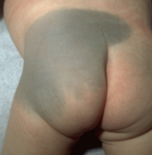|
|Vascular tumors|- Infantile hemangioma, congenital hemangioma, pyogenic granuloma - Hemangioma red flags: Beard distribution (evaluate airway), periocular (ophtho), paraspinal midline, hemangiomatosis (multiple small hemangiomas → evaluate for parenchymal hemangiomas, especially hepatic and CNS), very large hemangioma, associated thrill or bruit, head tilting|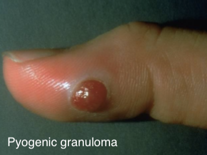|
|Vascular malformations|Capillary malformation (nevus flammeus/Port wine stain), lymphatic malformations, cutis marmorata telangiectatica congenita (CMTC)|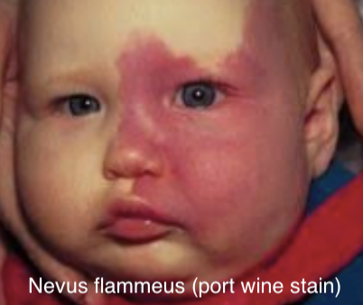|

### Diaper Dermatitis

|   |Contact/Irritant Dermatitis|Candida Dermatitis|
|---|---------------------------|------------------|
|Epidemiology|Most common cause|2nd most common cause|
|Physical Exam|Spares creases/skin folds 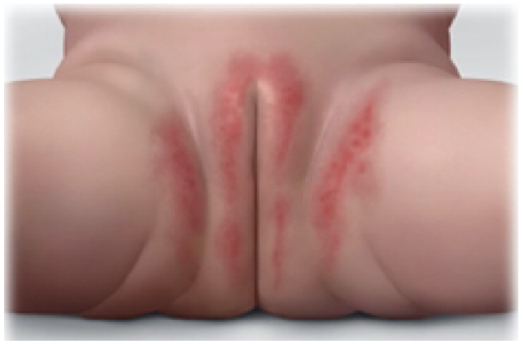|"Beefy" red rash involving skin folds w/ satellite lesions 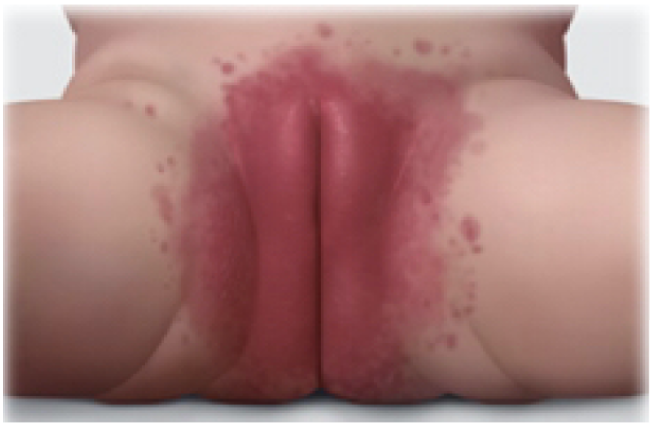|
|Management|Topical barrier ointment/paste (petrolatum, zinc oxide)|Topical antifungal (nystatin)|

## Dermatologic Emergencies

### Stevens Johnson Syndrome (SJS)

#### Definition
Skin + 2 or more mucosa. 10-30% BSA.

#### Etiology
Infection & meds (sulfonamides anticonvulsants, NSAIDs, allopurinol, dapsone)

#### Presentation
Mucosal involvement, prodromal fever, sore throat, HA, malaise, erythematous target like lesions forming blisters that rupture

#### Management
- Treat/discontinue underlying cause
- Magic mouthwash for stomatitis, artificial tears for ocular involvement
- Care to avoid scarring and adhesions 
- Hospitalize, treat like a burn patient (fluids, electrolytes, pain, prevent infection)

### Toxic Epidermal Necrolysis (TEN)

#### Definition
Skin + 2 or more mucosa. >30% BSA.

#### Etiology
As above in SJS

#### Presentation
Extensive skin and mucosal involvement (conjunctival, oral, genital, pulmonary), large bullae that rupture and leave large erosions (Nikosky +)

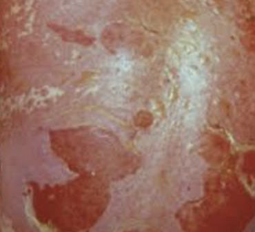

#### Management
- See SJS management above
- Consider IVIG

### Drug Reaction with Eosinophilis and Systemic Symptoms (DRESS)

#### Definition
Potentially life-threatening adverse drug-induced reaction characterized by skin rash, hypereosinophilia, liver involvement, fever, and lymphadenopathy

#### Etiology
Meds (carbamazepine, allopurinol, sulfasalazine, phenobarbital, lamotrigine, nevirapine, etc). Can also be associated w/ some viral infxns (HHV6, EBV, CMV).

#### Presentation
- Onset is usually 2-6 wks after initiation of drug tx
- Rash is often morbilliform or exfoliative and may be associated w/ facial edema
- Systemic symptoms: Fever, lymphadenopathy
- Lab abnormalities: Hypereosinophilia, liver involvement

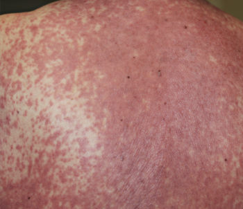

#### Management
- Discontinue offending medication 
- Coticosteroids and IVIG may improve sx but evidence is not definitive
- Recovery is prolonged (6+ wks) and may have intermittent flare-ups, 10% mortality rate

### Staph Scalded Skin Syndrome (SSSS)

#### Definition
Exfoliative toxin-producing S. aureus

#### Presentation
Fever, irritability, skin tenderness → diffuse erythema and flaccid blisters → scaling and desquamation

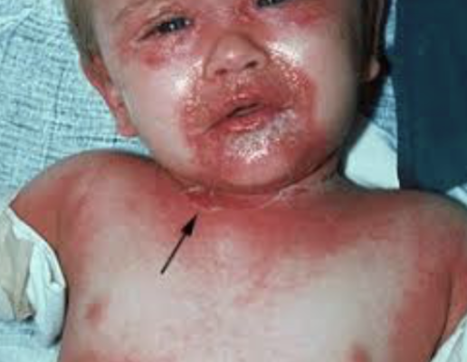

#### Management
Case dependent: Oxacillin, Nafcillin, or Vancomycin

## Common Dermatologic Conditions

### Acne

#### Pathophysiology
Obstruction of pilosebaceous unit by abn keratinization and sebum w/ bacterial proliferation (P. acnes) and inflammation

#### Management
- Depends on type:
	- **Comedonal:** (1) Topical retinoids, (2) benzoyl peroxide and topical abx
	- **Papulopustular:** (1) Maximize topical tx, (2) oral antibiotics, (3) hormonal therapy
	- **Nodulocystic:** Isotretinoin 
- Antibiotics: Tetracycline, Doxycycline, Minocycline, Erythromycin
- Tips:
	- Use topical abx in conjunction w/ benzoyl peroxide (to avoid P. acnes resistance)
	- Benzoyl peroxide inactivates tretinoin, so apply benzoyl peroxide in AM and tretinoin in PM
	- OCPs and spironolactone can be considered in female pts 
	- May take 6-8 weeks to see improvement
	- Rx: 30-60 gm w/ refills

### Atopic Dermatitis (Eczema)

#### Definition
Chronic inflammatory condition leading to pruritic, erythematous, and scaly lesions

#### Presentation
- Usually presents before 2yo
- Infants (scalp, face, extensor surfaces), children (flexural surfaces)
- Often associated w/ **allergic triad** (w/ asthma + allergic rhinitis)
- Also associated w/ **keratosis pilaris** (hyperkeratotic follicular papules, usually on back of arms but also frequently on lateral cheeks of infants and younger children) and **pityriasis alba** (hypopigmented, flat, indistinct border, usually face)

#### Complications
Superinfection w/ staph and strep (weeping, crusting, pustules) or herpes simplex (vesicles)

#### Management
- **Clinical Pathway:** [Eczema](https://bchfit.tch.harvard.edu/ebg-services/component/pdfAlgorithm?algCode=45612&algVersion=1.3&accessCode=null)
- **Lifestyle:** Eliminate allergens, short baths w/ warm water and mild soap
- **Bleach baths** (decrease bacteria):
	- For a full bathtub of water, add 1/2 cup of bleach
	- For a half-full tub of water, add 1/4 cup of bleach
	- For a baby tub, add 1 teaspoon of bleach per gallon of water
- **Emollients:** Hydrolated Petrolatum, Vaseline™, Eucerin™, Cetaphil™
- **Topical steroids:** (see chart below at end of chapter)
- **Topical immunomodulators:** Calcineurin inhibitors (Tacrolimus ointment (Protopic) 0.03%, 0.1%; Pimecrolimus (Elidel) 1%): used on facial lesions, less risk of tissue injury; approved for >2 years of age
- **Anti-Staph antibiotics** (if bacterial infection): Cephalexin, Trimethoprim-sulfamethoxazole, Mupirocin
- **Antipruritic medication:** Diphenhydramine or Hydroxyzine

### Erythema Multiforme

#### Definition
Usually skin only (minimal mucosa). <10% BSA.

#### Etiology
Infection (HSV, mycoplasma PNA), medications (Penicillins, sulfonamides, NSAIDs, barbiturates)

#### Presentation
Erythematous papules expanding to target-like plaques w/ dusky violaceous centers, found symmetrically on distal extremities and progress proximally

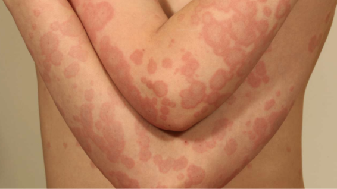

#### Management
Treat/discontinue underlying cause. Supportive care.

### Impetigo

#### Definition
- Contagious superficial skin infection
- Can be primary (direct infection of previously normal skin) or secondary (infection of skin that has already been disrupted)

#### Presentation
- Classified as bullous vs. non-bullous (70%) 
	- **Non-bullous impetigo:** Usually occurs on traumatized skin, S aureus (coagulase+) and S pyogenes (GABHS), spread by contact, non-pruritic, no constitutional sx 
	- **Bullous impetigo:** More common in infants and young children, caused by S aureus (coagulase+ (same types as TSS and SSSS), bulla develop on intact skin

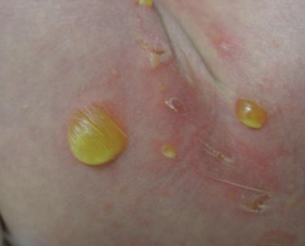 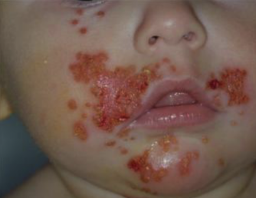

#### Management
- Mupirocin (Bactroban) TID x 7-10 days 
- May need oral abx for widespread disease
- If MRSA consideration, clindamycin should be used

### Erysipelas

#### Definition
Infection involving upper dermis and superficial lymphatics, usually from S. pyogenes

#### Presentation
Well-defined demarcation between infected and normal skin

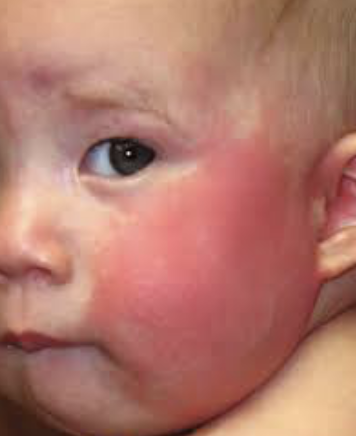

#### Management
- **Localized lesions:** Topical mupirocin 2% ointment
- **Extensive lesions:** Cephalexin, dicloxacillin, clindamycin or erythromycin if PCN-allergic

### Molluscum Contagiosum

#### Definition
Wart-like lesion caused by DNA poxvirus

#### Presentation
- Small flesh-colored, dome shaped, umbilicated papules
- Most common in school aged children. Immunocompromised patient may have extensive disease.
- Transmitted by fomites/close contact. If molluscum in genital area of child, must consider possible sexual abuse.

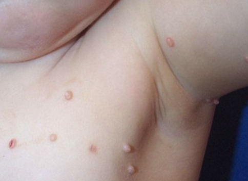

#### Management
Self-limited

### Pityriasis Rosea

#### Presentation
- Single erythematous herald patch followed by collection of smaller patches
- Typically in pts ages 10-35
- Usually lasting between 2-12 weeks

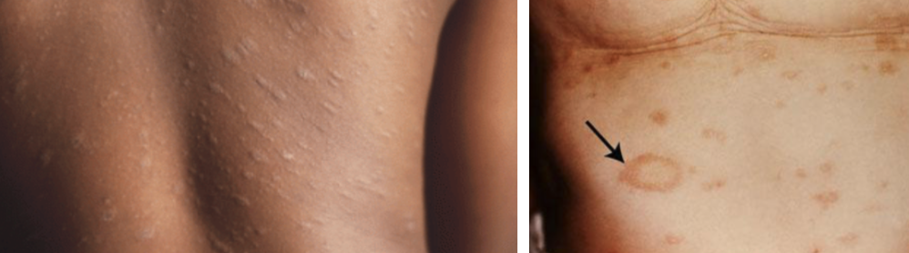

#### Management
- Self-limited 
- Counsel patient and family of long duration

### Scabies

#### Definition
Mite infection transmitted by contact

#### Presentation
Rash and severe itching (delayed type IV hypersensitivity) w/ papules, nodules, scaling, and sometimes linear distribution

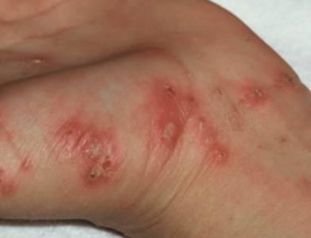

#### Management
- Permethrin (single application has 90-95% cure rate, do not use <2 mos old, can reapply in 7 days) 
- Treat all family members and wash clothes and bed linens 

### Lice

#### Presentation
Diagnosis usually made by nits (eggs) on hair shafts, adult lice may be difficult to see

#### Management
- 1% Permethrin rinse (Nix) and Pyrtherin (Rid) 
- Do not use shampoo/conditioner prior to tx
- Requires retreatment 7-10 days later (not ovicidal) 
- Additional methods: Wet combing. Butter, olive oil, mayo, petroleum jelly to suffocate lice.
- Tx of family not usually indicated  

### Tinea Corporis

#### Definition
Superficial dermatophytosis

#### Presentation
Scaly erythematous pruritic patch w/ centrifugal spread and subsequent central clearing w/ raised annular border

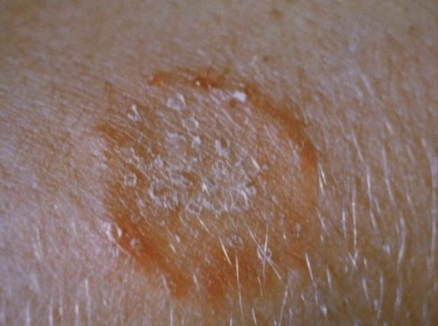

#### Management
- **1st line/localized:** Topical antifungal (may take several weeks to clear) 
- **2nd line/extensive:** Oral antifungals (terbinafine, griseofulvin)

### Tinea Capitis

#### Definition
Superficial dermatophytosis

#### Presentation
Scaly erythematous patch that can progress to alopecia w/ inflammation

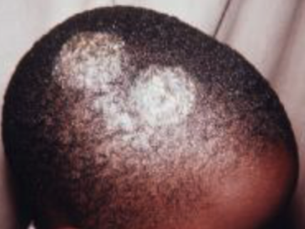

#### Management
Oral griseofulvin or terbinafine

## Cutaneous Signs of Systemic Disease
- **SLE:** Erythematous patches in photodistribution, “malar” face
- **Discoid Lupus:** Annular, scaly plaques, atrophy, and dyspigmentation in photodistribution
- **Juvenile Dermatomyositis:** Erythematous/violaceous scaly, macules, overlying knuckles, face and extensor surfaces
- **HSP:** Purpuric papules and plaques on buttocks and lower extremities
- **Kawasaki Disease:** Erythematous maculopapular to urticarial plaques, edema, desquamation
- **IBD:** Aphthae; erythema nodosum; pyoderma gangrenosum, thrombophlebitis, perianal fissures
- **Graft vs. Host:** Acute onset erythema, papules, vesicles, bulla
- **DRESS:** Diffuse erythema, urticarial macules and plaques

## Drug Eruptions
- **Urticaria:** Penicillins, cephalosporins, sulfonamides, aspirin/NSAIDS, radiocontrast, TNF inhibitors
- **Angioedema:** Aspirin/NSAIDS, ACEi
- **Serum-Sickness Reaction:** Cephalosporins, penicillins, minocycline, bupropion, sulfonamides
- **Exanthematous:** Any drug
- **DRESS:** Phenytoin, phenobarbital, carbamazepine, lamotrigine, allopurinol, sulfonamides, dapsone, minocycline
- **Pustular (acute generalized exanthematous pustulosis):** Beta-lactams, macrolides, clindamycin, terbinafine, calcium channel blockers, antimalarials
- **Acneiform:** Corticosteroids, androgen, lithium, iodines, phenytoin, isoniazid, tetracycline, B vitamins, azathioprine 
- **Vasculitis:** Penicillins, NSAIDs, sulfonamides, cephalosporins 
- **SJS/TEN:** Sulfonamides anticonvulsants, NSAIDs, allopurinol, dapsone
- **Drug-induced Lupus:** Minocycline, procainamide, hydralazine, isoniazid, penicillamine, carbamazepine, chlorpromazine, infliximab

## Principles of Dermatologic Therapy
The efficacy of any topical medication is related to:

- Active ingredient (inherent strength)
- Concentration of medication
- Anatomic location
- Vehicle (mode in which it is transported)
	- **Ointment:** (e.g. Vaseline). Lubricating, semi-occlusive, greasy, does not sting. Useful for smooth, non-hairy skin, dry, thick or hyperkeratotic lesions.
	- **Cream:** Less greasy, not occlusive, may sting, could cause irritation, vanish when rubbed in. Useful for acute exudative inflammation, intertriginous areas.
	- **Lotion:** Less greasy, less occlusive, may sting, pourable liquid. Useful for acute exudative inflammation (e.g. acute contact dermatitis) and on hairy areas.
	- **Oil:** Less stinging, keratolytic (removes scale). Useful for the scalp, especially for people with coarse or very curly hair.
	- **Gel:** May sting, greaseless, least occlusive, dries quickly. Useful for acne and on scalp/hairy areas without matting.
	- **Foam:** Spreads readily, easier to apply, more expensive, cosmetically elegant. Useful for hairy areas and inflamed skin.
	- **Spray:** Aerosols (rarely used), pump sprays

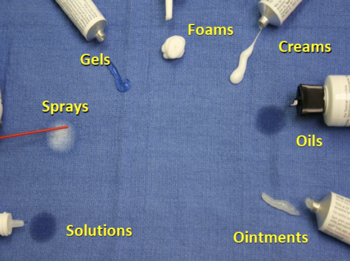

### Quantities of Topicals to Prescribe
- When deciding how much topical to prescribe, think in terms of lesion size and body surface area (BSA)
	- 1 Finger Tip Unit (FTU) = 0.5 grams topical medication dispensed from a 5mm nozzle placed on pad of index finger from distal tip to DIP joint = 2 adult palms =  2% BSA
		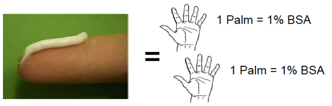
		- *Example:* How much topical medication should you Rx for 2% BSA BID x30 days?
			- 1 FTU = 0.5 grams = 2% BSA
			- 0.5 grams x 2 times per day = 1 gram
			- 1 gram x 30 days = 30 grams
	- Remember that children, especially infants, have a high BSA to volume ratio, which puts them at risk for systemic absorption of topically applied medications

## Topical Steroids

### Classes of Topical Steroids

|Potency Class|Common Examples|
|-------------|---------------|
|**Class 1:** Superpotent|Betamethasone 0.05% G/O/L, Clobetasol 0.05% C/O/G/S/F, Diflorasone 0.05% O, Halobetasol 0.05%|
|**Class 2:** Potent|Betamethasone 0.05% C, Desoximetasone 0.25% C/ 0.05% G, Fluocinonide 0.05% C/O/G/S|
|**Class 3:** Upper Mid|Betamethasone valerate 0.1%/0.12%F, Diflorasone 0.05% C, Triamcinolone 0.1% O|
|**Class 4:** Mid-Strength|Fluocinolone 0.025% O, Hydrocortisone 0.2% O, Mometasone 0.1% C/L, Triamcinolone 0.1% C|
|**Class 5:** Lower Mid|Desonide 0.05% O, Fluocinolone 0.025%, Hydrocortisone 0.2% C, Triamcinolone 0.025% O/L|
|**Class 6:** Mid|Betamethasone 0.1% C, Desonide 0.05% C, Fluocinolone 0.01% C/S, Triamcinolone 0.025% C|
|**Class 7:** Least Potent|Hydrocortisone 1%-2.5%|
C = cream, G = gel, L = lotion, O = ointment, S = solution, F = foam

- **Potency:** Ointment (thickest, most potent) > Gel > Cream > Lotion (liquidy, easier to spread)
	- Look at the CLASS, not the percentage (e.g. clobetasol 0.05% is much stronger than HC 1%)
- **Uses:**
	- **Class 1** uses: Severe dermatoses over non-facial/non-intertriginous areas, especially good for palms and soles
	- **Class 2-4** uses: Mild-to-moderate non-facial/non-intertriginous dermatoses, okay to use on flexural surfaces for limited periods
	- **Class 5-7** uses: Consider when treating large areas (given likelihood of systemic absorption), also for eyelid/genital dermatoses

### Side Effects of Topical Steroids
- **Local side effects** of topical steroids: Skin atrophy, telangiectasias, striae, acne or rosacea-like eruptions, allergic contact dermatitis, hypopigmentation
- **Systemic side effects** of topical steroids (rare d/t low percutaneous absorption): Glaucoma, HPA suppression, Cushing’s syndrome, hypertension, hyperglycemia
	- Exercise caution w/ widespread use and occlusive methods (e.g. plastic wrap, bandages)
- For all steroids, **do not use for more than 14 days per month.** Instruct patients to use in pulse (a few days at a time) manner. 

## Sun Protection

### Types of Sunscreen

|Physical Blockers|Chemical Sunscreens|
|-----------------|-------------------|
|- Blocks and scatters UV and visible light - Active ingredients include zinc oxide, titanium dioxide, iron oxide - Less irritating to sensitive skin and immediately effective|- Absorbs light and re-emits energy as insignificant quantities of heat - Active ingredients are benzophenone, avobenzone, oxybenzone - Not as messy, easier to apply, less apparent white sheen|

### Choosing Sunscreen
- Sunscreens are best for protection against UVB and UVA rays
- “Broad spectrum” sunscreens are the best
- SPF 30 blocks 97% of sun’s rays
- “Water resistant” sunscreens need to be re-applied q2h
- Sun’s rays are strongest between 10AM - 4PM
- Good rule of thumb: “If your shadow appears to be shorter than you are, seek shade”
- Avoid sunscreen use in infants less than 6 months of age. Instead use protective clothing, such as long sleeve clothing and  a hat w/ brim.

## References

### Additional Dermatology Resources
- [American Academy of Dermatology Basic Dermatology Curriculum:](https://www.aad.org/education/basic-derm-curriculum) Three-Week Pediatrician Rotation for Pediatricians
- [LearnDerm by VisualDx](https://www.visualdx.com/learnderm)
