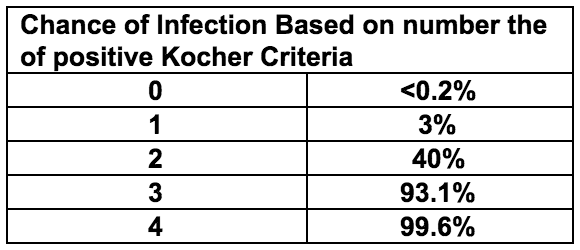
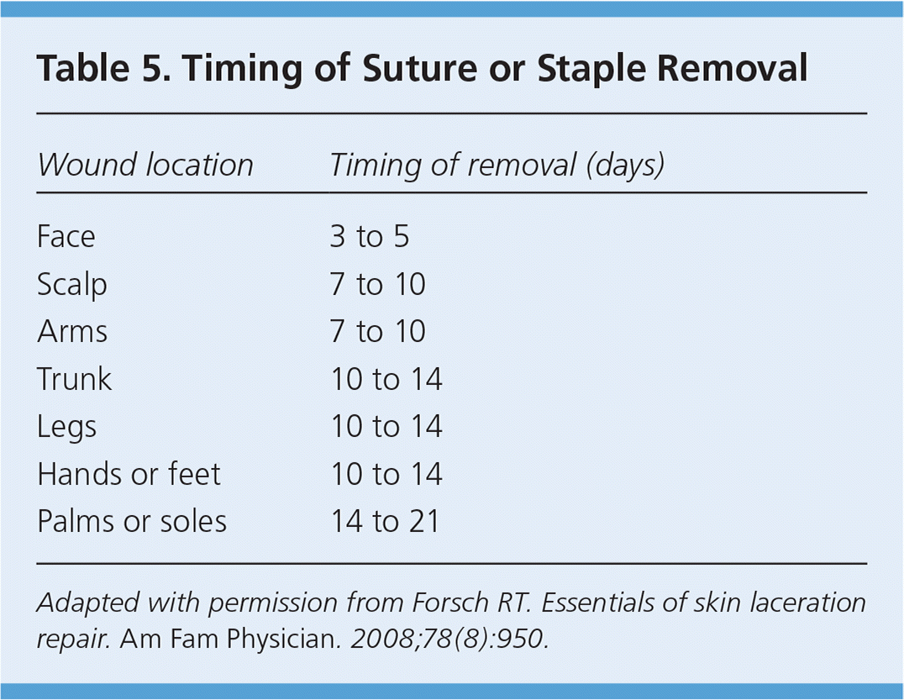

# Emergency Medicine {#ed_chapter}

## Acute Abdominal Pain

### Differential

**GI**
Appendicitis, trauma, pancreatitis, intussusception, malrotation ± volvulus, inflammatory bowel disease, gastritis, bowel obstruction, irritable bowel syndrome, abscess, hepatitis, perforated ulcer, Meckel diverticulum, cholecystitis, choledocholithiasis, constipation, gastroenteritis (particularly with associated mesenteric adenitis)

**Renal**
Urinary tract infection, pyelonephritis, nephrolithiasis

**GU**
Ectopic pregnancy, ovarian cyst/torsion, tubo-ovarian abscess, pelvic inflammatory disease, testicular torsion 

**Oncologic**
Wilms tumor, neuroblastoma, rhabdomyosarcoma, lymphoma

**Other**
Henoch-Schonlein purpura, lower lobe pneumonia, sickle cell anemia, diabetic ketoacidosis, juvenile idiopathic arthritis, incarcerated hernia, Streptococcal pharyngitis

### Workup

**History**

Course and characterization, diarrhea, constipation, emesis, melena, hematochezia, fever, last oral intake, menstrual history, vaginal symptoms, urinary symptoms, respiratory symptoms, travel history, diet, pertinent family history

**Physical Exam**

- Vital signs, toxic appearance, rashes, arthritis, jaundice

- Thorough abdominal exam, not through clothes - need to visualize abdomen (if concern for appendicitis, check for psoas sign, obturator, Rovsing’s)

- Rectal exam with stool Hemoccult

- Bimanual exam in sexually active females

- Genital exam

**Studies**

- KUB to assess for obstruction, free air; should be done in toxic patients

- Abdominal/pelvic ultrasound

- Consider abdominal CT

- Pelvic MRI for appendicitis if institutionally available

**Labs**

CBC with differential, chemistry, liver and kidney function, ESR, CRP, amylase, lipase, Gonorrhea/Chlamydia/Trichomonas, urine pregnancy

**Treatment**

- NPO, fluids

- “GI cocktail” - multiple antacids

- Consider nasogastric decompression

- Serial abdominal exams

- Surgical/gynecologic/GI evaluation

- Pain control and antibiotics as indicated

## Altered Mental Status

**Differential**

Important to maintain a broad differential diagnosis and think systematically. 
Can use the mnemonic **VITAMINS**:

- **Vascular**: Stroke, cerebritis, migraine, vasculitis
- **Infection**: Encephalitis, meningitis, brain abscess, sepsis
- **Toxins/Trauma**: Environmental/Medication toxins, head trauma
- **Accident/Abuse**: Epidural hematoma, large subdural, TBI (diffuse axonal injury)
- **Metabolic**: Hypoglycemia, DKA, thyroid dysfxn, electrolyte abnormality, inborn error of metabolism, hypoxia, hypercarbia, renal, hepatic, endocrine
- **Intussusception**: Somnolent variant
- **Neoplasm**: Intracranial neoplasm, paraneoplastic syndrome
- **Seizure**: Active seizure, subclinical status epilepticus, postictal state
  
Suspicion guided by age and history. Acute-onset altered mental status in an adolescent has a strong probability of being toxin-related.

**Approach**

Initial evaluation and stabilization:

- Place on monitors, consider access

- Primary Survey (ABCDE), point-of-care glucose

- Secondary Survey (AMPLE History)
 
  - Allergies, Medications, PMHx, Last meal, Events preceding presentation
 
  - Acute vs chronic change? How quickly did this occur?

- Continue to obtain more detailed history (including exposures, recent travel, possible medications in home, drug use, recent illnesses, possible inciting events, etc) while stabilizing

- GCS < 8 often suggests the need for airway management and mechanical ventilation, but decision is case by case

**Physical Exam**

- Thorough head to toe examination (including ABCs as above)

- Detailed neurologic exam including fundoscopic exam if possible, mental status

- Cardiorespiratory exam

- Abdominal exam

- Skin exam looking for rashes, signs of trauma

**Studies**

***Broad initial workup can include the following, but is strongly guided by history or lack thereof***:

- CBC/d

- BMP

- LFTs

- Ammonia

- Drug screening: Urine Tox (extended opioid), urine marijuana, serum tox, APAP/ASA/EtOH levels

- VBG

***Other workup can be tailored to H&P and PE***:

- Blood culture, LP if concerned for infection and/or fever (*see Neuro section for meningitis management)

- Abd US if concerned for intussusception

- Head CT if concerned for trauma, acute hemorrhage, stroke, increased ICP

- Consider coags and other tests for possible medication exposures

- Detailed metabolic workup if concerned for underlying inborn error

- EEG for seizure or subclinical status (though only useful in active seizure, manage ABCs are the priority)

## Blunt Abdominal Trauma

Sources: **BCH EBG** (Trauma, abdominal), **CHOP Clinical Pathway**, Fleisher GR, Ludwig S, eds. (2010) Textbook of Pediatric Emergency Medicine. 6th ed. Philadelphia: Lippincott Williams & Wilkins.

**Assessment**

1. Abdominal wall abrasion, erythema, ecchymosis or seat belt sign
2. Any abdominal tenderness/pain
3. Evidence of thoracic wall trauma
4. Absent or decreased breath sounds
5. Vomiting

**If 1 or >2 of the above present**

- FAST sensitivity limited compared to adults but is specific (i.e. positive is valuable)

- Abdominal CT with IV contrast

- Labs: CBC. Can consider LFTs, amylase/lipase, UA, type and screen

- Surgical consult

### Treatment
- Any traumatic findings: admit to trauma surgery service, as a normal CT does not rule out duodenal hematoma which can lead to perforation
- No traumatic findings: observe 4 hrs after CT, reevaluate including: PO challenge, vital signs, repeat abdominal/thoracic exams
- If symptoms worsening, consider imaging or trauma consult if not already obtained
- If symptoms improved, discharge to home with return instructions

## Appendicitis

Sources: **BCH EBG** (appendicitis), **CHOP Clinical Pathway**

### Definition

Inflammation of the appendix caused by obstruction of the lumen

### Pathophysiology

- The appendix is a blind pouch in the RLQ that can become obstructed with a fecalith or lymph tissue. Once it becomes obstructed, it becomes inflamed and edematous which eventually leads to necrosis and perforation.

- Inflammation can also occur as a result of bacterial invasion without obstruction.

### Clinical

- Pain begins in periumbilical region (referred pain) and then moves to RLQ

- Anorexia, nausea, vomiting, and fever 

- Young children may not have classic signs and therefore many present with perforation

- Perforation can occur between 24-72 hours after symptom onset if not diagnosed.
  - Perforation can present with high fevers, peritoneal signs, and/or sepsis 

### Physical Exam

- Pain on palpation in periumbilical region that migrates to RLQ 

- Rovsing’s sign: palpation of LLQ causes pain in RLQ 

- Psoas sign: increased abdominal pain when patient flexes right hip against resistance 

- Obturator sign: increased abdominal pain when patient’s right leg is raised with knee flexed and then internally rotated at the hip. 

- Rectal exam: may have tenderness if appendix is retrocecal. 

- If perforated: guarding and/or rebound, or may paradoxically be quite benign

### Studies

- If female, obtain urine HCG 

- CBC: poly-predominant leukocytosis (WBC>9, PMN>65%)  is strongly associated with appendicitis

- UA may show mild pyuria

- KUB: not indicated in most. may show fecalith, localized ileus, free air (if perforated), SBO in young child without prior surgical history is appendicitis unless proven otherwise

- US recommended if moderate to high risk (based on PAS):
  - US: Positive if hyperemia, thickened wall, echogenic fat, fecalith. Interpretation heavily influenced by pre-test probability. Can be fooled into interpreting as positive if a blind end is not visualized

  - CT with IV contrast or MRI: increased diameter, fat streaking 
  
### Treatment
- Risk stratify based on WBC and U/S findings

- NPO 

- Consult surgery 

- Antibiotics once confirmed: Cefoxitin 40mg/kg for uncomplicated, Zosyn 75mg/kg if abscess present

- Urgent appendectomy 

- If perforated: antibiotics with interval appendectomy

## Acute Chest Pain

Sources: BCH EBG (chest pain), CHOP Clinical Pathway, Uptodate

### Differential

**Can’t miss**
Acute coronary syndrome, myocarditis, pneumothorax, pulmonary embolism, aneurysm

**MSK**
Costochondritis, musculoskeletal strain/trauma, precordial catch (Texidor’s twinge), rib fracture

**Cardiac (1% of children)**

- Ischemia: severe aortic and pulmonary stenosis, hypertrophic or dilated cardiomyopathy, history of Kawasaki disease and subsequent coronary thrombosis, anomalous coronary arteries, familial dyslipidemia, medication or drug induced vasospasm (i.e. cocaine abuse)

- Arrhythmia: SVT or ventricular tachyarrhythmias

- Inflammatory: myocarditis, pericarditis

- Mitral valve prolapse

- Aortic dissection (consider in Marfan, Ehlers-Danlos, Turner, or Noonan) 

**Pulmonary**
Pneumonia, asthma, upper respiratory infection causing coughing, hyperventilation, pneumothorax, pleuritis, pulmonary embolism

**GI**

GERD, esophagitis, esophageal spasm. Also consider foreign body ingestion, gastritis, pancreatitis, cholecystitis, peptic ulcer disease, Mallory-Weiss tears, Boerhaave syndrome and hiatal hernias

**Psych**

Anxiety, panic attacks

**ID**
Shingles (herpes zoster infection)

**Heme**
Severe anemia, Sickle cell anemia-related VOE or acute chest syndrome

### History

- Location, chronicity, duration, frequency, severity, quality, radiation of pain

- Precipitating or alleviating factors

- Association with exertion, syncope, or palpitations

- History of inflammatory disorders, hypercoagulable states, connective tissue disease

- Family history of early thromboembolic disease, sudden death, drowning, or congenital heart disease

### Physical Exam

- Complete cardiorespiratory and abdominal exam

- Examination of skin overlying area of pain

- Palpation for reproducible pain

- Concerning findings:
  - Non-innocent heart murmurs (>III/VI in intensity, diastolic, harsh quality, no positional change, louder standing than supine)

  - Clicks, rubs or gallops

  - Abnormal S2

  - Stigmata of connective tissue disease

  - Hepatomegaly

  - Pallor, diaphoresis, or poor perfusion

### Studies

- EKG

- CXR for suspected pulmonary or cardiac disease

- CT w/PE protocol if high suspicion for PE

- Consider CBC, inflammatory markers, D-dimer, troponin, BNP, tox screen as indicated

- Cardiology consult in ED if high risk history, concerning exam findings, abnormal EKG	

## Acute Scrotal Pain

Sources: **BCH EBG** (Acute Scrotal Pain), **CHOP Clinical Pathway**, Brenner, JS, Ojo A. UpToDate: Causes of scrotal pain in children and adolescents

### History

- Pain (Onset, Duration, Location, Migration, Severity)

- Anorexia/Nausea (Last meal)

- Vomiting (Time of onset, Last episode, Number of episodes)

- Urine (Dysuria, Quantify urine output, Hesitancy, Urgency, Hematuria)

- Sexual History (Sexually active?, History of STIs, Urethral discharge)

- Fever

- Trauma

### Physical Exam

- Abdomen (Focal tenderness, Guarding/rebound, CVA tenderness)

- Genital (Tanner stage, Inguinal canal abnormality, Scrotal tenderness, Lie of testicles, Tenderness of testicles, Abnormal color of scrotum, Differences in size, Presence/absence of cremasteric reflex)

### Studies

- Imaging: Scrotal US with doppler

- Labs: UA and UCx if fever, dysuria, or concern for epididymitis; GC/CT in sexually active patients.

- Urgently consult urology if suspicion for torsion (TWIST score ≥2), without waiting for imaging results

| Condition                           | Definition/Pathogenesis                                                                                                                                          | Clinical Presentation                                                                                                                       | Treatment                                                                                                                                                                             |
|-------------------------------------|------------------------------------------------------------------------------------------------------------------------------------------------------------------|---------------------------------------------------------------------------------------------------------------------------------------------|---------------------------------------------------------------------------------------------------------------------------------------------------------------------------------------|
| Testicular Torsion                  | Rotation of the spermatic cord of the testis → diminished blood flow → infarction - ~30% of acute scrotal pain is testicular torsion                              | - Acute, severe pain <br> - Swollen, high-riding testis, diffusely tender, possibly w/ horizontal lie <br> -Absent cremastmeric reflex <br> - Overlying edema | - Surgical emergency: surgical exploration, detorsion, and fixation of the bilateral testes <br> - Pain control                                                                              |
| Torsion of the testicular appendage | Rotation of appendix testis (small vestigial structure on the anterosuperior aspect of the testis) → localized infarction                                        | - Localized pain to upper pole of the testes only <br> -Classic "blue dot" sign                                                                   | - Pain medication, scrotal support, and rest <br> - Pain should resolve in a few days, if not patient needs re-evaluation                                                                    |
| Epididymitis                        | Inflammation of the epididymis                                                                                                                                   | - Indolent pain and swelling of epididymis <br> -Dysuria <br> - Penile discharge <br> -Fever <br> -US: Increased blood flow                                       | - Supportive care <br> -Sexually active adolescents: treat like STD <br> - In prepubertal children, may be bacterial or aseptic (traumatic, viral), refer to urology <br> - Antibiotics if UCx positive |
| Orchitis                            | Inflammation of the testes <br> - Viral (mumps, rubella, coxsackie, echovirus, lymphocytic choriomeningitis virus, parvovirus) and bacterial (brucellosis) infections | - Generalized scrotal swelling, pain, and tenderness <br> -Erythema and shininess of the overlying skin <br> -Increased blood flow on US               | - Supportive care <br> -Support of the inflamed testis <br> - NSAIDs and ice packs <br> -Mumps testing if unimmunized                                                                                  |
| Trauma                              | Blunt vs. penetrating trauma → can cause hematocele, hematoma, testicular rupture, or traumatic epididymitis                                                     | -Swelling, pain, and tenderness <br> -Bruising or abrasions <br> -High index of suspicion for concomitant torsion                                     | -Penetrating wounds, rupture, or large hematoceles require surgical repair (Urology) <br> -Antibiotics for wounds <br> -Otherwise, supportive care                                              |
| Vasculitis                          | Occasionally occurs as part of IgA vasculitis or HSP                                                                                                             | -Acute or insidious pain <br> -Signs of systemic illness (fever, abd pain, rash) <br> -US can distinguish from torsion                                | -Supportive care <br> -NSAIDs and ice packs <br> -Steroids helpful in severe HSP                                                                                                                |
| Incarcerated Inguinal Hernia        | Herniation of bowel or omentum into the scrotum                                                                                                                  | -Pain and scrotal mass <br> -Audible bowel sounds <br> -US shows herniated bowel                                                                      | -Attempt manual reduction immediately <br> -Surgical intervention <br> -Pain control                                                                                                            |

## Atraumatic Limp
Sources: **BCH EBG** (limp/irritable hip), **CHOP Clinical Pathway** (septic arthritis), UpToDate: Approach to the child with a limp, UpToDate: Overview of the causes of limp in children, Kocher MS, Zurakowski D, Kasser JR. Differentiating between septic arthritis and transient synovitis of the hip in children: an evidence-based clinical prediction algorithm. J Bone Joint Surg Am 1999; 81:1662

### Differential Diagnoses

**“Big Four” inflammatory causes**

Septic Arthritis, Transient Synovitis, Lyme Arthritis, Osteomyelitis

**Other inflammatory causes**

Myositis, Oncologic, Abscess, Appendicitis, JIA

**Non-inflammatory causes**

Toddler’s fracture, Legg-Calvé-Perthes disease, Slipped capital femoral epiphysis (SCFE), Overuse injuries (Osgood-Schlatter, Sinding-Larsen-Johansson, Patellofemoral syndromes), Torsion of the testicle, Foot foreign body, Poor shoe fit 

**Red flags**

Pain at rest, non-weight bearing, pain at night, and pain away from joints; systemic symptoms such as weight loss, fevers; anemia or petechiae 

### Workup

**General approach**
Exam → XR any suspected joint → if XR negative, consider labs and use Kocher Criteria to determine hip US or not

**Physical Exam**

- Evaluate for swelling, erythema, fluctuance, point tenderness

- Evaluate ROM or pain on ROM

- Observe how the child naturally holds the leg

- Observe gait

- Rule out foreign body on the sole of the foot

**Imaging**

- X-ray films

- US if hip source suspected and 2+ of Kocher criteria + CRP>2

**Labs**

If fever, inability to weight bear, or clinical 
concern for septic arthritis: 

- CBC, ESR/CRP, BCx, Lyme Titers

**Kocher Criteria**

- Fever > 38.5

- Non-weight bearing

- ESR >40

- WBC >12K

```{r, ed_kocher_criteria}

```

### Management

**Kocher scores 0-1 generally indicate transient synovitis**

**If Kocher criteria >1, consult ortho and consider tapping joint**

- Clinically apparent knee/ankle effusion -> tap joint

- Irritable hip -> hip ultrasound -> if effusion, tap joint

- If no effusion -> MRI to look for osteomyelitis

**Analyze Joint Fluid**

- Labs: WBC and differential, Gram Stain, Culture

- Greater than 50k WBC or gram stain positive → treat as septic arthritis 

- 25k-50k WBC → possible septic joint, could also be Lyme arthritis, synovitis, other causes 

- Less than 25k WBC → transient synovitis

### Discharge Criteria

- Non-toxic appearing 

- Weight bearing, with rare exception

- Have discussed cases of diagnostic uncertainty with orthopedics 

- Reliable caretaker and ability to return if needed

- Discharge with: NSAIDs, signs/symptoms warranting return, 24hr follow-up

## Animal Bites

Sources: AAP Red Book, UpToDate

### Bacteria

- **Cat/Dog**: Pasteurella, anaerobes

- **Cat**: Bartonella henselae

- **Human**: Strep, Staph, anaerobes, Eikenella


### Clinical Presentation

- **Dog**: abrasions, lacerations, puncture wounds, tissue avulsion, or crush injuries

- **Cat**: abrasions, scratches, lacerations, or deep puncture wounds

- **Human**: bruising, abrasions, lacerations in pattern of human teeth; in adolescents, often occur with closed-fist injury

- **Snake**: varies by species, fang marks with evidence of local envenomation (redness, swelling, oozing) or venom spreading (lymphadenopathy, remote swelling, systemic toxicity)

- **Rodent**: similar to cat injuries

### Workup

- Wound cultures are not indicated in clinically uninfected bite wounds

- Gram stain, aerobic/anaerobic wound Cx from the depth of an infected puncture or laceration

- Aerobic/anaerobic BCx in patients with an infected bite wound and evidence of systemic infection

- Plain films to identify bone or joint disruption in deep bite wounds, or to identify subcutaneous gas and/or bony/soft tissue changes if wound is infected

- Head CT for deep bite wounds to the scalp, especially in children <2 yrs of age

- For snake bites, urgently consult Poison Control (1-800-222-1222) and toxicology

### Management and Treatment

Wound care

- Control bleeding, assess neurovascular status

- Apply local anesthetics for cleaning and closure

- Clean with 1% povidone iodine or 1% benzalkonium chloride and irrigate with copious amounts of saline

Primary closure (laceration repair) if:

- Dog bite or other cosmetically important bite (face)

- Clinically uninfected

- <12 hours old on body, <24 hours old on face

- NOT located on hand or foot

- Sutures needed for hemostasis

Secondary closure (no repair) for all other bite wounds (i.e. cat or human, puncture wounds, and wounds in immunocompromised hosts). Do NOT use adhesive to close bite wounds.

Antibiotic prophylaxis for all animal bites:

- PO: Augmentin, 

- IV: Unasyn, Zosyn, TMP-SMX+clindamycin

- Human: 5-7 days

- Cat/dog: 7-10 days

Assess tetanus status

- Give tetanus Ig+toxoid if <2 primary immunizations

- Give tetanus toxoid if completed primary series but no booster >5 years

- Rabies prophylaxis for bites by wild animals or if high prevalence of rabies

## Brief Resolved Unexplained Event (BRUE)

Sources: BCH EBG (BRUE), CHOP Clinical Pathway

### Presentation
Report of 1 or more of the following symptoms that are now resolved:

- Cyanosis or pallor

- Absent, decreased, or irregular breathing

- Marked change in tone (hyper- or hypotonia)

- Altered level of responsiveness

### Workup

- History of eye deviation, responsiveness, rhythmic movements → consider Neurology consult

- New murmur → EKG, CXR → if abnormal, consult cardiology

- Family history of long QT syndrome, sudden cardiac or unexplained death in 1st or 2nd degree relative before age 35, unexplained drowning or car accident, sibling with h/o SIDS, ALTE, or BRUE → EKG → if abnormal, consult cardiology

- History of paroxysmal cough, pertussis exposure → CBC, pertussis PCR

- Weight concern → further workup for FTT as indicated, consider checking NBS

- NAT concern → see Suspected Child Abuse section

### Management and Treatment

Determine if patient meets low risk criteria:

- Age >60 days

- Born >or= 32 weeks GA and corrected GA >or= 45 weeks

- No CPR by trained provider performed

- Event <1 min

- First event

- No concerning H&P as above

**Low risk** → ED observation on continuous CV monitor and pulse ox for at least 1 hour including 2 observed feedings by RN or MD

**High risk** → Admit to inpatient, continuous CV monitor and pulse ox for at least 6 hours (no more than 24 hours) including 2 observed feedings by RN or MD and 2 sleep/awake cycles

Provide CPR training kit to parents/guardians on discharge

## Burns
Sources: CHOP clinical pathway

### Classification: 1st degree

Definition: superficial (epidermis)

Symptoms: Erythema, pain

Description/Treatment: 

- Includes sunburn, minor scalds

- Does not require fluid replacement; not included in estimate of surface area burned

- Usually heals without scarring in 3-5 days

### Classification: 2nd degree

**Superficial partial thickness**

Symptoms: Intense pain, blisters, pink to cherry-red skin, moist, weepy

Description/Treatment:

- Nails, hair, sebaceous glands, nerves intact

- Can progress to deep partial or full-thickness burns

- Spontaneous re-epithelialization in 2-3 weeks

**Deep parital thickness**

Symptoms: Intense pain, dry and white in color

Description/Treatment: Disruption of nails, hair, sebaceous glands, nerves. Skin grafting may be required based on size

### Classification: 3rd Degree

**Full Thickness**

Symptoms: Charred black color ± areas dry or white. Pain intense or absent, depending on nerve involvement

Treatment: Skin grafting required

### Pathogenesis

Burn injury -> increased capillary permeability -> third spacing, edema, fluid loss

### Estimating Burn Size

- Estimate proportion of total body surface area involved 

- Rule of 9’s for adults and older adolescents:
  - 9% for each arm
  - 18% for each leg
  - 9% for head
  - 18% for front torso
  - 18% for back torso

- Rule of 9’s does not apply to children due to differing body proportions, see modification for children below

- Palm of child’s hand = 0.5% of total body surface area, can use to estimate burn size:

**Modified Lund and Browder Chart**

```{r, ED_modified_Lund_Browder_chart}

```


### Workup

- Mechanism of burns (flame, chemical, electrical)

- Closed vs. open space exposure

- Condition of other victims, such as death at the scene

- Duration of exposure

- Associated trauma, such as falls

- Tetanus immunization status

- Always consider non-accidental trauma (See Suspected Child Abuse)	

### Treatment
Treatment is based on the depth of burn, proportion of TBSA involved, and if there is airway involvement or other injuries:

**Airway**
- Assess for signs of inhalation injury or respiratory distress, snoot in nares, carbonaceous sputum, stridor

- Consider intubation for >30%TBSA burned

**Breathing**

- Assume carbon monoxide poisoning with severe/closed space burns

- Assess stability of the airway

- If airway injury, early intubation (use smaller cuffed ETT than necessary for age given continued swelling that will occur)

**Circulation**

- For burns >15%BSA or any evidence of inhalation → Parkland formula

- Initial bolus of 20 cc/kg NS

- Parkland fluid resuscitation formula: good estimate for losses, but underestimates needs of young children <5yo. Provides fluid requirements to be added in addition to normal maintenance fluid requirements

- [TBSA burned (%)] x [wt (kg)] x [4mL] = total mL resuscitation required over first 24 hrs → Give 1⁄2 in 1st 8 hours, remainder in next 16 hrs

**Assess urine output**: 

- Urine output <1mL/kg/hr → 20 mL/kg bolus of crystalloid

- Urine output = 1-3 mL/kg/ht → continue parkland formula

- Urine output >3 mL/kg/hr →decrease rate to 2/3 Parkland formula

**Pain control**

IV narcotic therapy often necessary (can give IM morphine or IN fentanyl prior to placing IV)

**Wound care**:

- Cleanse affected area with lukewarm sterile water. 

- Wipe away loose tissue with sterile gauze

- Leave unruptured bullae intact (do not rupture)

- Topical antibiotics (Silvadene, Bacitracin) applied directly to burns

Admit if: partial thickness burns of >10% TBSA or > 2% full-thickness burns, hands, joints

## Deep Space Neck Infections

### Peritonsillar Abscess {#peritonsillar_abscess}

Sources: CHOP Clinical Pathway

*Definition*
Suppurative collection in tonsils with extension into the peritonsillar space

*Epidemiology*
Most common in adolescents

*Etiology*
Polymicrobial, S. pyogenes is most common, less common – anaerobes, S. aureus

*Pathogenesis*
Pharyngitis → progresses to abscess

*Clinical*
Fever, pharyngitis, unilateral pain, muffled (hot potato) voice, trismus, drooling

#### Workup

**History**: Fever duration, neck ROM, PO intake, foreign body, trauma hx, recent ENT surgery, recent abx

**Exam**: Peritonsillar fullness. Drooling, displacement of uvula away from affected side, peritonsillar fluctuance, ipsilateral cervical lymphadenopathy

**Labs**: Not routinely indicated

**Imaging**: Not routinely indicated

#### Treatment

Drainage by ORL:

- Bedside needle aspiration in older children may be appropriate

- Incision and drainage

Antibiotics: Clindamycin or Ampicillin-Sulbactam	

#### Complications

Airway obstruction, aspiration PNA, sepsis, jugular vein thrombosis or thrombophlebitis (Lemierre syndrome), carotid rupture, other deep neck space infections, mediastinitis

### Parapharyngeal Abscess 

*Definition*
Suppurative collection in the area of the lateral neck from the skull to the hyoid bone.

*Etiology*
Polymicrobial, S. pyogenes, S. aureus, anaerobes.

*Pathogenesis*
Spread of infection into lateral aspect of neck from pharyngitis, tonsillitis, parotitis, otitis, mastoiditis and dental infections

*Presentation*
Symptoms can be subtle. Fever, pharyngitis, neck stiffness, dysphagia/odynophagia, muffled (hot potato voice) trismus, drooling, respiratory distress or stridor.

#### Workup

**History**: Fever duration, neck ROM, PO intake, foreign body, trauma hx, recent ENT surgery, recent abx, chest pain

**Exam**: Induration and swelling below the angle of the mandible, medial bulging of the pharyngeal wall, torticollis or difficulty with neck rotation

**Labs**: CBC w/diff, aerobic and anaerobic BCx, rapid strep and throat culture, chem if decreased PO, fluid culture if abscess drained

**Imaging**: 
Low suspicion → XR lateral neck → If normal, does not rule out infection
High suspicion → Neck CT with contrast (only way to diagnose parapharyngeal abscess)

#### Treatment
- Airway compromise → secure airway, emerg. surgical drainage, IV antibiotics
- Mature abscess (>2.5 cm2) → surgical drainage + IV antibiotics
- Phlegmon → IV antibiotics, re-image in 24-48 hours
- Antibiotics: Ampicillin-sulbactam + vancomycin (severe) or clindamycin (non-severe)

#### Complications
See [Peritonsillar Abscess](#peritonsillar_abscess) 

### Retropharyngeal Abscess

Sources: **CHOP Clinical Pathway**, UpToDate: Retropharyngeal infections in children, UpToDate: Peritonsillar cellulitis and abscess

*Definition*
Deep neck abscess in the potential space between the posterior pharyngeal wall and the deep cervical fascia
- Occurs in young children (<5 years)
- Retropharyngeal lymph nodes regress as children age, making RPA unlikely in older children

*Etiology*
S. pyogenes, S. aureus, anaerobes

*Pathogenesis*
Spread of infection from nasopharynx via lymph system to retropharyngeal lymph nodes → phlegmon → abscess formation

*Presentation*
Fever, decreased PO, pharyngitis, drooling, dysphagia, neck stiffness (refusal to extend or pain with neck extension), torticollis, trismus

#### Workup

History, Physical, Labs: See “Parapharyngeal Abscess” above

**Imaging**:

- Low suspicion → XR lateral neck

- Greater than 7 mm at C2 (roughly 1⁄2 the width of the vertebral body) or 14 mm at C6 in children

- Greater than 22 mm at C6 in adults

- High suspicion → Neck CT with contrast

#### Treatment

- Airway compromise → secure airway (highly morbid, prepare for surgical airway concurrently), emergency surgical drainage, IV antibiotics

- Mature abscess (>2.5 cm2) → surgical drainage + IV antibiotics

- Phlegmon → IV antibiotics, re-image in 24-48 hours

- Antibiotics: Ampicillin-sulbactam + vancomycin (severe) or clindamycin (non-severe)

#### Complications
See [Peritonsillar Abscess](#peritonsillar_abscess) 

## Dehydration
Sources: **BCH EBG** (Gastroenteritis), **CHOP Clinical Pathway**

### Definition

- Dehydration = cellular water loss

- Hypovolemia or volume depletion = reduced effective circulating volume	

### Presentation
Mottled cool extremities, sunken fontanelle in infants, receded eyes, hyperpnea; sensorium usually remains intact until moderate dehydration; weak cry or stupor suggests shock. 

Symptoms of underlying etiology will be present (diarrhea, fever, etc.)

Regarding dehydration specifically, fussiness, thirst, and lethargy may be present.

See table below for additional physical examination findings.


### Physical Findings of Volume Depletion

| Findings        | Mild (3-5%)        | Moderate (6-9%)  | Severe (>10%)     |
|-----------------|--------------------|------------------|-------------------|
| Pulse           | Full, normal rate  | Rapid            | Rapid/weak/absent |
| Systolic Press. | Normal             | Normal to low    | Low               |
| Respirations    | Normal             | Deep (rate ↑)    | Deep, tachypnea   |
| Buccal mucosa   | Tacky/slightly dry | Dry              | Parched           |
| Ant. fontanelle | Normal             | Sunken           | Markedly sunken   |
| Eyes            | Normal             | Sunken           | Markedly sunken   |
| Skin turgor     | Normal             | Reduced          | Tenting           |
| Skin            | Normal             | Cool             | Cool/mottled      |
| Urine output    | Normal/mildly dec  | Markedly reduced | Anuria            |
| Systemic signs  | Increased thirst   | Listlessness     | Grunting, coma    |

### Differential

- ↑ output (gastroenteritis (most common), diabetes mellitus, diabetes insipidus)

- ↓ intake (gingivostomatitis, viral or bacterial pharyngitis, nausea/vomiting)

- ↑ insensible losses/metabolic demand (bacterial infections with fever such as PNA, meningitis, UTI)

### Workup

Important to establish degree of dehydration: mild (3-5%), moderate (6-9%), or severe (>10%) to guide therapy

BCH/CHOP guidelines provide an **Assessment Tool**
10-point (1 point each):

- Ill-appearing or decreased activity

- Tachycardia for age

- Tachypnea or abnormal respirations

- Decreased urine output

- Sunken eyes

- Decreased or absent tears

- Dry mucous membranes

- Abnormal pulses/perfusion

- Cap refill >2 sec

- Decreased skin turgor

Scoring: <3 = mild, 3-6 = moderate, >6 = severe

**Labs**

- Mild or moderate dehydration → may not require laboratory testing 

- Moderate or severe dehydration → D-stick, chemistry, UA (for urine spec grav)

- Low serum bicarbonate useful for determining whether starvation ketosis is present (if anion gap elevated) or excessive diarrhea (if anion gap not present)

### Treatment

#### Mild
Initiate oral rehydration therapy (ORT)

- 5-10 mL every 3-5 minutes via bottle, cup, syringe

#### Moderate
Initiate ORT, consider IVF

- Similar outcomes but fewer complications and higher satisfaction with ORT in RCTs comparing IV fluids and ORT groups

- If ORT fails → obtain D-stick* → 2x 20 mL/kg NS boluses -OR- 20 mL/kg D5NS bolus + 20 mL/kg NS bolus → start 1.5-2x mIVF → transition back to ORT as tolerated

#### Severe
Initiate IVF

- Goal 40 mL/kg total within 1 hour: obtain D-stick* → 2x 20 mL/kg NS boluses -OR- 20 mL/kg D5NS bolus + 20 mL/kg NS bolus → start 2x mIVF of D5NS or D5 ½ NS after bolus

- Consider alternative diagnosis (septic shock) if persistent hemodynamic abnormalities after 60 mL/kg

#### ORT failure

- \>1 emesis despite ondansetron

- Refusal to drink or not consistently drinking

- Oral intake cannot match diarrheal losses

- No improvement in Dehydration Score, VS despite child drinking

#### Ondansetron 

(available in liquid, oral-disintegrating, or tablet forms)

8-15 kg = 2 mg PO

15-30 kg = 4 mg PO

30 kg = 8 mg PO

#### Discahrge Criteria

Clinical signs of dehydration improved/mild

Caregivers understand ORT instructions and able to perform at home

Caregivers understand reasons to return

**Best practice** is to first obtain a D-stick, as diabetic ketosis acidosis (DKA) may present with moderate-severe dehydration, can mimic gastroenteritis, and may be worsened with administration of glucose

## Dental Emergencies

```{r, ED_dental_image_1}

knitr::include_graphics("./images/ED_dental_image_1.jpg")
```

```{r, ED_dental_image_2}
knitr::include_graphics("./images/ED_dental_image_2.jpg")
```

```{r, ED_dental_image_3}

knitr::include_graphics("./images/ED_dental_image_3.png")
```

```{r, ED_dental_image_4}


```


Sources: McTigue DJ, Azadani E. Evaluation and management of dental injuries in children. In: UpToDate, Wiley, JF (Ed), UpToDate, Waltham, MA. (Accessed on February 22, 2020.)

### Avulsion

The tooth is completely displaced from the alveolar ridge; the periodontal ligament is severed, and fracture of the alveolus may occur. Extra-oral dry time < 60 minutes has an increased prognosis of saving the tooth. Primary (“baby”) teeth should not be replaced. If child cooperative, the tooth should be placed into the socket immediately (by the parent before arrival to care if possible). Otherwise, may be placed in a solution with order of preference: save-a-tooth > milk > normal saline. Solution should be chilled but tooth should not be placed directly on ice

### Fracture

**Infraction**: cracked tooth

**Enamel only (Ellis I - uncomplicated)**: tooth chipped, pain absent but may be elicited with manipulation.

**Enamel and dentin (Ellis II - uncomplicated)**: “yellowish”, tooth chipped with exposed dentin, sensitive to touch and temperature. Cover exposed dentin with calcium hydroxide. Care within 48 hours

**Complicated crown fracture (Ellis III - complicated)**: “reddish”, exposure of the pulp and central artery, increased risk of infection. Emergency dental evaluation 

**Root fracture**: May not also involve the crown. If the crown is not involved, root fracture suggested by mobility of the crown

**Alveolar fracture**: causes dislocation of multiple teeth that move with palpation.

### Luxation Injuries

Involve the supporting structures of the teeth, including the periodontal ligament and alveolar bone

#### Concussion
The tooth is neither loose nor displaced; it may be tender with the pressure of biting because of inflammation of the periodontal ligament.

#### Subluxation
The tooth is loose, but not displaced from its socket; the periodontal ligament fibers are damaged and inflamed.

#### Intrusion
The tooth is driven into the socket, compressing the periodontal ligament and fracturing the alveolar socket.

#### Extrusion
The tooth is centrally dislocated from its socket; the periodontal ligament is lacerated and inflamed.

#### Lateral luxation
The tooth is displaced anteriorly, posteriorly, or laterally; the periodontal ligament is lacerated, and the supporting bone is fractured.	

### Workup
Determine if tooth is primary or permanent
Indication for urgent Dental consult

- Avulsed permanent tooth (after reimplantation whenever possible)

- Extrusion >3 mm or interfering with bite

- Laterally luxated (displaced) teeth that interfere with bite (if not interfering with bite, will often spontaneously revert)

- Intruded primary teeth

- Fractured teeth when dental pulp is exposed (bleeding from central core of tooth)

- Suspected dental root or alveolar fracture (e.g. tooth mobility, pain out of proportion when tooth is wiggled)

- Suspected jaw fracture (posterior tooth fracture, jaw tenderness, and/or malocclusion) to obtain panoramic radiographs 

**Imaging**: consider XR to search for swallowed or buried (in laceration) tooth. Teeth have also been discovered in the lungs.

### Treatment

Reimplantation (while awaiting arrival of dental team…)

- Avulsed permanent teeth should be reimplanted immediately, ideally within 15 minutes and up to one hour

- Store in save-a-tooth (preferred, available in BCH ED pharmacy), cold milk or saliva if unable to reimplant

- Handle the tooth carefully by the crown to prevent damage to the periodontal ligament

- Remove debris by gentle rinsing with saline or tap water; do not attempt to sterilize or scrub the tooth

- Reimplant manually

- Keep the tooth in place by having the child hold it or bite on a gauze pad or clean towel.

Uncomplicated fracture of permanent tooth: 

- Store tooth fragments in tap water to prevent discoloration

- Dental follow-up within a few days to bond fracture piece or smooth a fracture
Other injuries (infraction, concussion, subluxation) warrant outpatient dental referral 

#### General aftercare

- Soft diet for up to 10 days and limit sucking (pacifier or digit)

- Continue brushing with a soft-bristled toothbrush

- Avoid flossing until healing has occurred

- Chlorhexidine mouthrinse for luxation of permanent teeth

- Tetanus prophylaxis, for dirty wounds, avulsed teeth, deep lacerations, or marked luxation injuries

- Antibiotic therapy is indicated for permanent teeth avulsions (<8yrs: amox; >8yrs: doxy) and management of secondary infections


## Epistaxis

Sources: Messner AH. Management of epistaxis in children. In: UpToDate, Post TW (Ed), UpToDate, Waltham, MA. (Accessed on February 22, 2020.)

Acknowledgements: Ali Baker

### Pathogenesis

The anterior nasal septum is highly vascularized (Kiesselbach’s plexus) and is subject to exposure due to location. Any factors that cause congestion of nasal vessels, or drying or irritation of the nasal mucosa increases the likelihood of bleeding.	

### Etiology

- Trauma (including nose-picking, foreign body)

- Mucosal irritation: allergic rhinitis, viral URI, dry environment

- Anatomic: septal deviation, unilateral choanal atresia

- Tumor: hemangioma, nasopharyngeal angiofibroma, pyogenic granuloma, papilloma

- Vascular abnormality

- Bleeding disorders (coagulation disorders, platelet disorders, blood vessel disorders)

- Inflammatory: Granulomatosis with polyangiitis (GPA), formerly called Wegener’s

- Medications: ASA, ibuprofen, anticoagulants, valproic acid

### Clinical Presentation

- Active bleeding or dried blood

- Nasal mucosa: may be dry, cracked, pale, boggy, or have prominent vessels

- If there is active bleeding, look for vessels involved

- Exclude masses, polyps, foreign bodies

- Exclude underlying bleeding disorder: ecchymosis, petechiae, cutaneous blood vessel disorders

### Workup
No studies are routinely required

- Hematologic and coagulation studies if history suggests personal or family history of bleeding disorder

- CT or MRI if malignancy is suspected

### Treatment

- Rapid assessment of general appearance, vital signs, airway stability, and mental status

- Sustained pressure on nostrils/anterior plexus (apply for minimum 5-10 min); have child sit up and bend forward at the waist to prevent aspiration or swallowing of blood

- Apply local vasoconstrictor: Oxymetazoline (0.05%, Afrin) preferred to phenylephrine (0.25%)

- Anterior nasal packing (avoid in infants <1yr due to risk of aspiration and airway obstruction) -> evaluate oropharynx to confirm adequate hemostasis

- Chemical cautery (silver nitrate) or electrocautery of actively bleeding vessel

- Indications for ORL consultation: severe epistaxis, troublesome recurrent epistaxis, local abnormalities, need for nasal packing

- Consider referral to Hematology: severe or recurrent bleeding, family history of bleeding disorders

## Febrile Infant

Sources: **BCH EBG** (FUO, Fever 0-1 months, Fever 0-90 days, Fever 1-2 months, Fever/UTI 2-24 months), **CHOP clinical pathway**

### Definition

Temperature ≥38.0 (100.4 C) in infant ≤90 days 

Temperature ≥38.5 (101.3 C) in child >3 months

### Etiology

- Rates of serious bacterial infection (SBI) in febrile infants/young children range from 7-38% of infants aged 0-28 days seen in emergency department for fever. 

- UTI is the most common (5.9%), followed by bacteremia (1%), meningitis (0.3%). 

### Pathogenesis

**Bacterial**: UTI, pneumonia, bacteremia, meningitis, cellulitis, enteritis, osteomyelitis

**Viral**: Enterovirus, HSV, influenza, RSV, rotavirus, aseptic meningitis

**Neonate**: (within first 7 days of life) often vertical transmission

**Less common**: recent immunizations, malignancy, medications (antibiotics, antineoplastic drugs, biologics), immunological (Kawasaki), immunodeficiency (HIV, SCID, humoral deficiency),  hereditary autoinflammatory syndromes of periodic fever, other periodic fever syndromes	

### Most Common Pathogens by Age

| Age        | Bacteremia/Meningitis                                                                    | Other pathogens                                                                                                |
|------------|------------------------------------------------------------------------------------------|----------------------------------------------------------------------------------------------------------------|
| 0-28 days  | Group B Strep Gram negative enterics (E. coli, Klebsiella) Listeria/Enterococcus         | HSV _Conjunctivitis_: Gonorrhea, Chlamydia, S. aureus _Pneumonia_: Chlamydia, S. aureus _Diarrhea_: Salmonella |
| 28-60 days | GBS (Late onset) Gram negative enterics Strep Pneumo N. meningitides Group A Strep Staph | _Pneumonia_: Chlamydia, Staph aureus, Pertussis, RSV and other viruses _Diarrhea_: Salmonella                  |
| 3-36 mos   | Strep Pneumo N. meningitides Group A Strep Staph                                         | _UTI_: E. coli, other GNR, enterococcus                                                                        |

### Clinical Presentation

- **Non-specific symptoms**: poor feeding, lethargy or irritability. They may have hypothermia instead of fever

- Otitis media/URI symptoms, if present, do not preclude need for further eval.

#### History

Full pre- and perinatal history including GBS status, need for intrapartum antibiotics, evidence of maternal HSV or other infections

#### Physical exam

Bulging fontanelle (Meningeal signs unlikely in infants), respiratory distress or focal lung findings, conjunctivitis, oral lesions, vesicles, cellulitis, rash, vomiting, diarrhea, swelling of a joint or extremity

### Workup

#### Age 0- <1 month (well-appearing)

- Procalcitonin (PCT)

- CBC w/ diff

- Blood Cx

- Cath or SPA UA w/ micro

- Urine Cx

- LP: CSF cell count, protein, glucose, culture, gram stain, HOLD

- CXR if respiratory symptoms

- Consider stool culture if heme+ diarrhea

- Consider HSV testing

#### Age 1- <2 months (well-appearing)

- Procalcitonin (PCT)

- CBC w/ diff

- Blood Cx

- Cath or SPA UA w/ micro

- Urine Cx

- CXR if respiratory symptoms

- Consider stool culture if heme+ diarrhea

- If PCT > 0.2 or WBC <5K or >15K

- LP: CSF cell count, protein, glucose, culture, gram stain, HOLD

### Treatment

- Empiric therapy while awaiting culture results if <28 days, ill-appearing, or meets any high risk criteria (see below table)

- In patients with positive UA or cultures, therapy should be tailored appropriately (empiric is cephalexin 25mg/kg/dose TID for 10 days)

#### Emperic Antibiotic Treatment Based on Age

**Age <= 14 days**

Empiric treatment: Ampicillin and Ceftazidime

- Gentamicin can replace Ceftazidime

- Add acyclovir if CSF pleocytosis or ill-appearing

- Use Cefepime instead of Ceftazidime if CSF pleo

**Age 15-28 days**

Empiric treatment: Ceftriaxone (50mg/kg)

- Add ampicillin and acyclovir if CSF pleocytosis or ill-appearing 

- Use Cefepime (50mg/kg) instead of CTX if CSF pleocytosis

**Age >29 days**

Empiric treatment: Ceftriaxone

- Meningitic dose if CSF pleocytosis 

- Consider vancomycin if suspicion for pneumococcal meningitis  

## Foreign Body Aspiration

Sources: **No BCH EBG, No CHOP pathway**. Ruiz FE. Airway foreign bodies in children. In: UpToDate, Hoppin AG (Ed), UpToDate, Waltham, MA. (Accessed on February 22, 2020.)

### Presentation

In acute period, children may have chest pain, wheezing, cough, tachypnea, stridor, resp distress. Classic triad is wheeze, cough, and diminished breath sounds (though only present in 57% in one study). In subacute/chronic period after aspiration, children may present with pneumonia (often in the RML as a result of right main-stem FB aspiration). 

Signs and symptoms can vary according to location of FB:

- Laryngotracheal: acute respiratory distress, stridor, wheeze, hoarseness

- Large bronchi: coughing, wheeze, hemoptysis, choking (most FBs are located in bronchi)

- Lower airways: may have little acute distress after initial choking episode

### Workup

#### Physical Exam

- Stridor, hoarseness, inspiratory wheeze suggest upper airway location (wheeze may be monophonic and focal)

- Asymmetric lung aeration and/or focal decreased breath sounds suggest lower airway location

#### Diagnostic Studies

- AP and Lateral CXR and soft tissue neck films

- Expiratory film or lateral decubitus films if lower airway location is suspected (air trapping seen in obstructed lung

### Management

- If complete upper airway obstruction present, perform back blows (child <1 yr of age) or Heimlich maneuver (child >1 yr of age) to dislodge object → PALS

*Blind/finger sweeping of the mouth should be avoided*

- Consult Ear-Nose-Throat (ORL) or general surgery for flexible or rigid bronchoscopy in all cases of suspected foreign-body aspiration to visualize the trachea and bronchi and remove object if seen

## Foreign Body Ingestion

Sources: **CHOP clinical pathway**

### Pathogenesis

Average GI transit time is 3.6 days

**Anatomical narrowings**: cricopharyngeus muscle, aortic crossover of esophagus, lower esophageal sphincter, pylorus, duodenal sweep, ileocecal junction

- Objects > 25 mm diameter unlikely to pass pylorus

- Objects > 6 cm length unlikely to pass duodenal sweep

**Button batteries**: caustic injury from high pH → injury at anode (narrow portion) of batter → stricture formation (can happen within 2 hours) → aortoenteric fistula is feared complication

**Magnets**: Multiple in different bowel segments can adhere and erode through bowel wall causing perforation

### Presentation

Depends on age, location, and nature of FB

- **Esophagus**: refusal to eat, dysphagia, drooling, respiratory symptoms

- **Stomach**: asymptomatic unless causing gastric outlet obstruction

- **Intestine**: asymptomatic unless retained/obstructing, dependent on location	

### Workup

Start with XR AP single view neck, chest, abdomen.
XR lateral for coins, battery, magnet OR if esophageal or unknown location

### Treatment

Depends on symptoms, location, and nature of FB. General principles:

#### Button batteries

**EMERGENT** GI/ENT/surgery consult, urgent endoscopic removal if esophageal or gastric, otherwise admit and close observation with serial XRs. Sucralfate if esophageal.

#### Coins/Blunt objects

GI/ENT/surgery consult if symptomatic, urgent endoscopic removal if esophageal, otherwise observation (consider admit vs. outpatient f/u)

#### Sharp objects

GI/ENT/surgery consult if symptomatic, urgent endoscopic removal if esophageal or gastric, otherwise admit and close observation with serial XRs

#### Magnets

1 magnet? → treat like blunt object; 2 magnets? → remove if gastric or proximal, or symptomatic, otherwise admit and close observation with serial XRs

#### Food impaction
GI/ENT/Surgery consult, urgent endoscopic removal with biopsies to evaluate for EOE

## Suspected Child Abuse
Source: No BCH EBG; CHOP clinical pathway

### Presentation

#### Skeletal injuries

- **Long bones**: epiphyseal/metaphyseal fracture seen as “bucket handle” or “corner fracture” at the end of long bones, spiral fractures

- **Ribs**: posterior nondisplaced rib fractures due to squeezing of the rib cage (may not be visible on plain film until callus formation)

- **Skull**: fractures >3mm wide, complex fractures, bilateral fractures, non-parietal fractures. These suggest forces greater than those sustained from minor household trauma

#### Bruises

- Unusual/protected areas (chest, abdomen, back, buttocks)

- Patterned

- Multiple bruises or bruises in different stages of healing, do not fit the history and developmental stage

**TEN-4 Bruising Clinical Decision Rule**:

- Bruising present in TEN region (torso, ears, neck) < 4yrs of age *OR*

- Bruising present in any region < 4mo of age *AND*

- No confirmed accident in public setting that accounts for bruising

#### Burns

- Multiple burn sites

- Well-demarcated edges

- Stocking/glove distributions

- Absence of splash marks

- Symmetrically burned buttocks or lower legs

#### Head trauma

- Subdural hematomas

- Retinal hemorrhages

- Skull fractures (see above)

### Workup

- Consult CPT, Social Work

- Skeletal survey (<2yo)

- Noncontrast head CT: good for intracranial hemorrhage and skull fractures

- Brain MRI: If asymptomatic

- Abd or pelvic CT: consider if symptomatic or suggested by physical exam/lab studies

- Consider c-spine MRI if concerned for abusive head trauma

- Dilated indirect ophthalmoscopy exam for retinal hemorrhages 

- CBC, CMP, Amylase, Lipase, UA (all patients <7yrs, >7yrs if clinically indicated)

- Bone health labs (if fractures): Ca, Mg, Phos, Alk Phos, intact PTH, 25 Hydroxyvitamin D

- Bleeding disorders labs (if bruising/bleeds): PT/PTT,consider vWF, Factor VIII, IX

## Sexual Assault

Sources: BCH EBG, CHOP Clinical Pathway, UpToDate

### Workup (<12yo)

Medically cleared? 

- Consider trauma or GYN eval

- Work up altered medical status

- Consult SW

#### Occurred <72 hours:

**Do not interview the child → defer interview and GU exam**

- Document parent/guardian statements only (preferably with SW present if available)

- Child’s spontaneous statements documented as quotes in evidence kit

- Urgently consult CPT, Children’s Advocacy Center

- Forensic evidence collection by ED provider using pediatric kit if patient consents

- Baseline testing (discuss with CPT): Urine NAAT for Gonorrhea/Chlamydia/Trichomonas, RPR, Hep B Core Ab, Hep B Surface Ab/Ag, Hep C Ab, HIV-1/2 Combo Ag/Ab, urine HCG for pubertal females

- File 51A (with Social Work)

#### Occurred >72 hours:

- Complete history and physical exam, if patient/family consent

- Baseline testing (see above)

- File 51A (with Social Work)

### Treatment (<12yo)

Urine NAATs require confirmation prior to treatment with antibiotics

Pre-pubertal children should NOT receive STI prophylaxis

Update Hep B, tetanus vaccines as needed

**Emergency contraception** (if urine HCG negative): 

- 0-72 hours: Levonorgestrel (Plan B) 1.5 mg PO once

- 72-120 hours: Ulipristal (Ella) 30 mg PO once (if no hormonal birth control for 5 days after)

Determine need for HIV PEP (see Clinical Pathway)

### Workup (>12yo)
Medically cleared? 

- Consider trauma or GYN eval

- Work up altered medical status

- Consult SW

#### Occurred <120 hours (5 days):

- Ask for patient consent to receive SANE (Sexual Assault Nurse Examiner) services: 617-647-0710 (BARCC also paged simultaneously)

- Forensic evidence collection by SANE or ED provider if patient consents

- Urine HCG for all females

- STI testing (if patient consents): Urine NAAT for Gonorrhea/Chlamydia/Trichomonas, RPR, - Hep B Core Ab, Hep B Surface Ab/Ag, Hep C Ab, HIV-1/2 Combo Ag/Ab

#### Occurred >120 hours (5 days) ago:

- Call BARCC (Boston Area Rape Crisis Center): 617-492-7273

### Treatment (>12yo)

**STI prophylaxis**:

- Gonorrhea + Chlamydia (ceftriaxone 250mg IM x1, azithromycin 1g PO x1)

- Trichomonas (metronidazole 2g PO x1)

**Emergency contraception** (if urine HCG negative): 

- 0-72 hours: Levonorgestrel (Plan B) 1.5 mg PO once

- 72-120 hours: Ulipristal (Ella) 30 mg PO once (no hormonal birth control for 5 days after)

Determine need for HIV PEP (see Clinical Pathway)

### Discharge planning (>12yo)

Contact PCP if patient consents, discuss need for CPT and Child Advocacy Center f/u, ensure appropriate HIV PEP meds/scripts and f/u plan if necessary, use BCH custom d/c instructions. SW will clear patient for d/c and provide resources.

## Syncope

Sources: BCH EBG; Salerno JC. Causes of syncope in children and adolescents. In Uptodate: Wiley JF (Ed), UpToDate, Waltham, MA. (Accessed on February 22, 2020.)

### Differential

#### Common conditions

- Vasovagal

- Breath holding spells (common in 6mo-24mo age range)

- Orthostatic hypotension

- Toxic exposure

#### Life-threatening

- Arrhythmias: ventricular arrhythmias, long QT syndrome (LQTS), Brugada syndrome, catecholaminergic polymorphic ventricular tachycardia (CPVT), congenital short QT syndrome, pre-excitation syndromes such as WPW (which can lead to SVT with a rapid ventricular response)

- Structural: hypertrophic cardiomyopathy, severe aortic stenosis, coronary artery anomalies, arrhythmogenic right ventricular cardiomyopathy (ARVC), dilated cardiomyopathy

- Acute myocarditis

- Pulmonary hypertension

- Vasovagal (neurocardiogenic)

- Heat illness

- Anaphylaxis

#### Other

Hypoglycemia, SVT, bradycardia, POTS		

Rule out mimics: seizure, stroke, TBI

### Workup

#### History and Physical Exam

- Precipitating factors: exercise, acute arousal, postural change, pain or emotion 

- Description of event

- Past medical history

- Family history of early cardiac death (<40 years), arrhythmias, cardiomyopathy, sudden drownings or unexplained car accidents, SIDS, LQTS, congenital deafness, HCM

- Exam: including detailed cardiorespiratory and age-appropriate neurologic exam 

#### Labs and Imaging

- 12-lead EKG

- Urine hCG for post-pubertal females

- Additional testing not indicated unless concerning H+P (i.e. CBC in menstruating female with pallor, electrolytes if signs of dehydration, etc.)

- Formal orthostatics NOT routinely recommended

Suspect neurologic etiology? → abnl neuro exam, severe headache → neurology consult/referral

Suspect cardiac etiology? → syncope w/ chest pain, exertion, palpitations; incr freq of events, non-innocent murmur, frequent PAC/PVC on monitor, abnl EKG → cardiology consult, 

If family history of concerning cardiac history, otherwise reassuring exam and labs (none of the above), consider outpatient referral within 2 weeks

## Trauma

### ATLS

#### Primary Survey
Assessment of **ABC**: 

**A**irway (with c-spine protection),

**B**reathing 

**C**irculation

**D**isability/neurologic assessment: AVPU (alert, verbal stimuli response, painful stimuli response, unresponsive; pupil size, symmetry, reactivity)

**E**xposure and environmental control: undress patient completely, take precautions to prevent hypothermia	

#### Secondary Survey

Head to toe assessment, including history and full physical exam
**AMPLE History**: Allergies, Medications, PMHx/Pregnancy, Last meal, Events/Environment leading to the injury

##### Head

Any scalp/skull injury, periorbital or post-auricular bruising, hemotympanum, nasal CSF drainage, loose teeth, concern for midface fracture (pass OGT rather than NGT)

##### Eye

- Pupillary size, hemorrhage, penetrating injury, entrapment

- Corneal reflex

- Contact lenses should be removed

##### Neck

- C-spine tenderness or deformity

- Trachea midline

- Hematoma

- Bruit 

##### Chest

- Clavicle deformity or tenderness

- Breath sounds, heart sounds, crepitus

- Chest wall symmetry, paradoxical movement, rib deformity, fracture

##### Abdomen

- Serial exams to evaluate tenderness, distension, ecchymosis

- Shoulder pain suggests subdiaphragmatic process

- Orogastric aspirates with blood or bile

- Splenic laceration suggested by left upper quadrant rib tenderness, flank pain, flank ecchymoses, “seatbelt sign” (suggestive of GI injury)

##### Pelvis

Tenderness, symmetry, deformity, stability 

##### GU

- Laceration, ecchymoses, hematoma, bleeding

- Rectal tone, blood, displaced prostate

- Blood at urinary meatus → don’t catheterize, suggests urethral injury

- Evaluate for pelvic fracture or instability

##### Back

Evaluate for step offs along spinal column, tenderness

##### Extremities

Neurovascular: pulse, perfusion, pallor, paresthesias, paralysis, pain

##### Neurologic

- Motor/sensory exam

- Re-evaluation of level of consciousness

- Pupillary response to light

##### Skin

Lacerations, abrasions, contusions

## Mild Traumatic Brain Injury (Contusion and Concussion) {#mildTBI}

Sources: BCH Minor Head Trauma EBG

### Definition

- Traumatic brain injury induced by biomechanical forces; may be caused by direct blow to head/face/neck or blow causing impulsive force transmitted to the head

- Neuropathologic changes may result, but these reflect a functional disturbance (no changes on neuroimaging)

Patient must present with history or physical exam signs of minor head injury *AND*

- In children < 2 years: be alert or awaken to voice or light touch

- In children ≥ 2 years: have normal mental status, normal neurologic exam, and no evidence of skull fracture

### Pathogenesis

- Linear forces: acceleration/deceleration injuries. Less likely to cause LOC, more commonly cause skull fractures, intracranial hematoma, cerebral contusion

- Rotational forces: commonly cause LOC, associated with diffuse axonal injury and concussion

### Presentation

Likely indicators of concussion (any/all of below)

- Disorientation or confusion immediately after the event

- Impaired balance within 1 day after injury

- Slower reaction time within 2 days after injury

- Impaired verbal learning and memory within 2 days after injury

**Signs/symptoms**: broad range, categorized within somatic, vestibular, oculomotor, cognitive, emotional/sleep

- Headache most common > dizziness > difficulty concentrating > confusion

Loss of consciousness NOT necessary for diagnosis of concussion

### Workup

#### History

Mechanism of injury, loss of consciousness, whether infant cried immediately, seizure activity, level of alertness after injury, headache, vision changes, and vomiting.

- Consider using a **post-concussion symptom checklist** at time of evaluation - both for facilitating history and tracking recovery (different checklists available based on age of patient)

#### Physical

Full neurological exam, scalp abnormalities (hematoma, tenderness or depression), signs of basilar skull fracture (e.g. periorbital ecchymosis, Battle’s sign, hemotympanum, CSF otorrhea or rhinorrhea), bulging fontanelle in infants, c-spine examination

#### PECARN algorithm
To determine need for imaging (Head CT)

**For children less than 2 years**:

Any altered mental status or palpable skull fracture\*

Other considerations:

- Non-frontal scalp hematoma

- LOC ≥5 seconds

- Severe mechanism of injury**

- Acting abnormally per parent

**For children 2 years and older**:

Any altered mental status or signs of a basilar skull fracture (retro-auricular or periorbital bruising, CSF otorrhea or rhinorrhea, hemotympanum)

Other considerations:

- Any loss of consciousness

- History of vomiting

- Severe injury mechanism\*\*

- Severe headache

\* If 1-2 of above is present, monitor 4-6 hours and obtain head CT if symptoms worsen or don’t improve; If ≥3 above are present, head CT is recommended; If none is present, head CT not recommended

\*\* Severe mechanism of injury: Motor vehicle crash with patient ejection, death of another passenger or rollover, pedestrian or bicyclist without helmet struck by motorized vehicle, falls (>3 feet children < 2 years or > 5 feet for children ≥ 2 years) or head struck by high impact object.

### Treatment

- Intracranial injury or depressed, basilar, diastatic skull fx → NSGY consult & admit

- Simple skull fx (i.e <3 mm, non-depressed, single bone) → consider admit if young (<6 mo), consider SW evaluation (esp if < 2 yrs of age)

**Discharge Criteria**: Normal mental status, non-focal neuro exam, able to PO, no social concerns, not <1 mo with isolated skull fracture

Dx of concussion with negative imaging:

- DO NOT return to play same day, risk of second-impact syndrome (2nd injury before full recovery → possible cerebral vascular congestion → diffuse cerebral edema)

- Physical rest: avoid strict “bed rest,” but limit activity to level that does not provoke/increase sx; sub-symptom threshold, aerobic exercise shown to decrease duration of sx

- Cognitive rest: academic adjustments as needed to reduce symptom exacerbation

  - **Complete cognitive rest and avoidance of screen time NOT recommended**

  - See Uptodate (“sample school note to guide academic accommodations for children and adolescents with concussion”) for template academic note

- PT for patients suffering from vestibular or oculomotor dysfunction

- No sports until asymptomatic and cleared by a physician, emphasize individualized course, warn of possible persistent symptoms beyond 1 month (*See Graduated Return-to-Sport Program*)

- Refer if: Symptoms > 4 weeks, lack of progression, confounding by coexisting conditions, multiple previous concussions

**Graduated Return-to-Sport Program**

|   | Aim                        | Activity                                                                                      | Goal                                                                    |
|---|----------------------------|-----------------------------------------------------------------------------------------------|-------------------------------------------------------------------------|
| 1 | Symptom-limited activity   | Daily activities that do not provoke symptoms                                                 | Gradual reintroduction of work and/or school activities                 |
| 2 | Light aerobic exercise     | Walking or stationary cycling at slow-to-medium pace; no resistance training                  | Increase heart rate                                                     |
| 3 | Sport-specific exercise    | Running or skating drills; no activities with risk of head impact                             | Add movement                                                            |
| 4 | Noncontact training drills | Harder drills (eg, passing drills and team drills); may begin progressive resistance training | Exercise, coordination, and increased thinking during sport             |
| 5 | Full-contact practice      | After medical clearance, participate in full, normal training activities                      | Restore confidence and allow coaching staff to assess functional skills |
| 6 | Return to sport            | Normal game play                                                                              | Full clearance/participation                                            |

Recommend **48 hr of relative physical and cognitive rest before beginning the program**. No more than 1 step should be completed per day. If any symptoms worsen during exercise, the athlete should return to the previous step. Consider prolonging and/or altering the return-to-sport program for any pediatric and/or adolescent patient with symptoms over 4 weeks.

## Cervical Spine Injury

### Workup & Treatment


Place patient in C-collar prior to history and physical

Assess for (based on PECARN data; NEXUS and Canadian C-Spine Rule unclear sensitivity for <10yrs):

- Neck pain

- Midline posterior neck tenderness

- Decreased neck range of motion

- Torticollis

- AMS (GCS < 14)

- Focal neurologic finding

- Substantial co-existing injury (distracting injury, especially torso injuries)

- Predisposing conditions (Down syndrome, cervical arthritis, Ehlers-Danlos, etc)

- High risk mechanisms (MVC where patient partially/completely ejected from vehicle, passenger death, diving, hanging, clotheslining force, axial load force

If **any** of the above are present, recommend C-spine imaging (XR → cross-table lateral and AP, consider open-mouth odontoid if possible)

- Consider CT if concern for clinically significant injury, abnl XR, high risk injury mechanism

If **none** of the above are present, defer imaging and remove collar. If pain with active ROM, return patient to collar, obtain cervical spine films

- If imaging abnormal, consult orthopedics/neurosurgery

- If imaging normal, reassess patient, and if persistent midline neck tenderness,, assume cervical sprain and place in long-term C-collar (“Miami J”) → refer to spine clinic → usually able to discharge

## Laceration Repair

### Equipment

- **Basics**: light, mask, sterile gloves & gown, betadine (or other cleansing solution)

- **Irrigation**: sterile bowl, sterile water, 20-50 cc syringes with splash guard (all except water come in irrigation kit)

- **Local anesthesia** or digital block

- **Suture tray** (sterilized and packaged together): forceps, scissors, needle holder, hemostats, sterile gauze

- **Suture material**:  Nonabsorbable sutures (monofilament nylon, polypropylene) vs. Absorbable sutures (Vicryl, fast absorbing gut -- use for deep wounds and in small children when suture removal would be just as traumatic as placement

  - Sole of foot or over large joints (knee): 4-0 or 3-0

  - Scalp, trunk, extremity: 4-0; Face: 6-0 or 5-0
  
**Alternatives to sutures**: Dermabond (tissue adhesive) +/- Steri-Strips: use for linear wounds with minimal tension. No removal needed.  

Staples: Best for scalp wounds. Requires remover.	
```{r ED_suture_selection}

knitr::include_graphics("./images/ED_suture_selection.png")

```

```{r ED_suture_cartoon}

```


### General Technique

1. Set-up your equipment

2. Local anesthesia 

  - LET gel (lidocaine, epinephrine, tetracaine) – apply for 15-20 minutes (surrounding skin should be blanched)
  
  - 1% lidocaine (10mg/mL): onset 2-5 minutes, lasts 15-20 minutes. Toxic dose 5mg/kg (0.5cc/kg)
  
  - 1% lidocaine with epinephrine (1:200,000): onset 2-5 minutes, duration ~60 minutes. 

Generally avoid use in digits, penis, pinna, tip of nose

- Use buffered lidocaine if available (buffered with sodium bicarbonate)

3. Conscious sedation if needed

4. Wound preparation: Expose, explore (for foreign bodies), irrigate, clean periphery

5. Suture/Close:

- **Simple interrupted** - most common stitch, closes superficial layer

- **Deep subcutaneous** - reduces tension of deep wounds

- **Buried horizontal dermal** - closes deep layer in shallow lacs 

- **Horizontal/vertical mattress**- reinforce SC tissue, relieves wound-edge tension

- **Corner stitch** - repair flap-type, corner lacerations 

6. Clean and dry: Apply topical antibiotic ointment and cover with dry sterile gauze

- **Tetanus prophylaxis**: if have not received tetanus prophylaxis in preceding 10 years (if clean and minor wound) or 5 years (all other wounds) *or* if they have not finished primary series.

- **Antibiotic prophylaxis**: if wound is a bite wound, there is exposed cartilage/joint, or a contaminated wound (esp. on plantar surface) 

```{r ED_suture_removal_timing}


```


