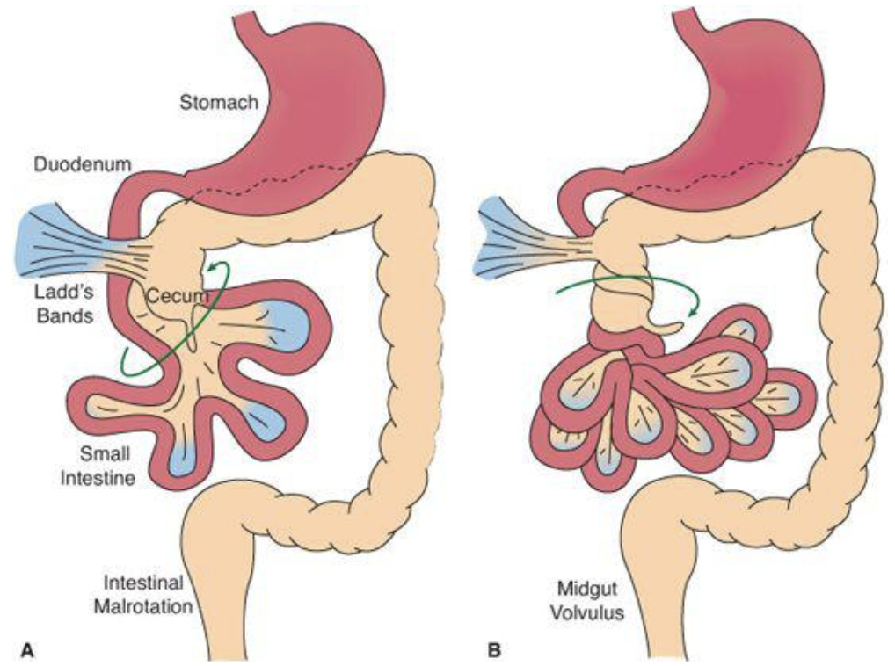

# Gastroenterology, Hepatology & Nutrition

## Constipation

### Bristol Stool Chart[^1]

### PowerPlans, Order Sets & Clinical Pathways
- **Clinical Pathways:** [Constipation](https://bchfit.tch.harvard.edu/ebg-services/component/pdfAlgorithm?algCode=Constipation&algVersion=1.4&accessCode=null)
- **PowerPlans & Order Sets:** GI AMB Constipation Plan, GI Constipation Cleanout (GoLYTELY) Plan, Chocolate Bomb Plan, SMOG Enema Plan

### Presentation
Two of the following for 2 weeks and ≥6 mos of age:

- _<_ 2 stools/week
- Fecal/urinary incontinence (after toilet trained)
- Painful/hard bowel movements
- Rectal fecal mass
- Large diameter stools that obstruct toilet/require multiple flushes 

### Differential
- **95% functional:** Withholding (related to new stressor, anxiety, dev. delay, autism), exacerbated by excess dairy, low fiber, inadequate fluid, toilet training
- **5% organic:** Anatomic (e.g. anal stenosis), hypothyroidism, CF, Celiac, lead poisoning (may see calcifications on KUB), opiates, anti-epileptics, neurologic (e.g. Hirschsprung’s, CP)

### Red Flags
- **Hx:** Onset < 1 month, passed meconium >48 HOL, breastfeeding w/ hard stools, FTT, motor delay, ribbon or bloody stools, bilious emesis, FHx Hirschsprung's.
- **Exam:** Tight rectum gripping finger, explosive stool and air from rectum upon withdrawal of  finger, no anal wink, perianal fistula, midline dimple, lower back hair tuft, lower limb weakness or abnormal tone, abnormal thyroid, severe abdominal distension, fever

### Work-up
- If no red flags → KUB not routinely indicated
- If red flags or signs of systemic illness → Refer to ED/admit, obtain chem10, KUB
- If suspect Hirschsprung’s → Consult GI & Surgery for contrast enema, rectal bx

### Management
See the [Constipation Clinical Pathway](https://bchfit.tch.harvard.edu/ebg-services/component/pdfAlgorithm?algCode=Constipation&algVersion=1.4&accessCode=null) for more even more options than below.

#### Clean Out (evidence of impaction)
- **Inpatient**
	- **Cleanout & Bowel Prep:** MiraLax 34g q30min x4 hrs PO, OR Go-Lytely infusion via NG tube + IVF
		- Follow electrolytes and BUN/Cr if infusing for >12 hrs
		- If Go-Lytely is complete and effluent is not clear, start NS enemas
	- **Chocolate bomb:** 4oz chocolate (or vanilla)  ice cream + 15mL senna, + 30mL mineral oil* + 30mL milk of magnesia
		- **Contraindications** to PO mineral oil: Pt at risk for aspiration, age _<_ 12 mos, GERD
	- **SMOG enema:** 20 mL normal saline + 20 mL mineral oil + 20 mL glycerin 
- **Outpatient** (_>_ 12 mos)
	- **Day 1-3:** MiraLax 0.5g/kg  (2g in 1 oz fluid) TID + Ex-lax choc ½ square daily, OR fleet mineral oil enema BID (2-12yrs: 2oz, >12 yrs: 4oz)
	- **Day 3 and disimpacted:** Begin maintenance (see below)

#### Maintenance
- Be sure to include constipation education, stool diary, diet review
- **6-12 mo**
	- Maintenance therapy = clean out therapy  for this age group 
	- **Start with osmotic:** Prune juice (2-6 oz/day in 2-4oz water), OR lactulose 1ml/kg/d BID, OR MiraLax 1g/k/d (mix in 4-8oz liquid, max dose 8.5g)
	- If no relief, trial **glycerin suppository**
- **_>_ 12 mo**
	- **Start with osmotic:** MiraLax (10-30kg: 8.5g/day, >30kg: 17g/day), OR lactulose 1g/kg BID
	- If necessary, add **stimulant:** Senna (Ex-lax choc ½ square), OR bisacodyl (Dulcolax), OR milk of magnesia
		- Rx stimulant **_<_ 2 wks**
	- **AND** toilet-sitting TID or after meals, reward-based toilet training if age appropriate
- **Reassess after 2-4 wks**

## Diarrhea

### PowerPlans, Order Sets & Clinical Pathways
- **Clinical Pathways:** [Gastroenteritis and Dehydration](https://bchfit.tch.harvard.edu/ebg-services/component/pdfAlgorithm?algCode=DEHYGASTRO&algVersion=1.9&accessCode=null)
- **PowerPlans & Order Sets:** GI Chronic Diarrhea Labs Plan, SSYCE Plan, Stool Studies Plan

### Differential

#### Acute vs. chronic
- **Acute (< 5 days):** Gastroenteritis (viral or bacterial), food poisoning, antibiotic-associated, organophosphate ingestion, hyperthyroidism, disaccharidase deficiency (infants), AOM
- **Chronic (> 2 wks):** Postinfectious lactase deficiency, IBS, IBD, Celiac, CF, milk protein allergy (infants), lactose intolerance, laxative abuse, giardiasis or other parasite, primary immunodeficiency or HIV, SIBO, chemo-induced, secretory tumor (gastrinoma, VIPoma), lymphangiectasia, congenital villous atrophy

#### Most common vs. can't miss
- **Most common cause of...**
	- **Febrile, non-bloody:** Viral (noro, rotavirus), C. diff
	- **Afebrile, non-bloody:** Viral enteritis, bacterial foodborne, recent abx use, excessive juice (sorbitol), postinfectious lactase deficiency
	- **Febrile, bloody:** Bacterial enteritis (SSYCE)
	- **Febrile, mucusy:** Bacterial enteritis
	- **Afebrile, bloody:** Intussusception (+intermittent severe abd pain and age 6 mos-2 yrs)
- **Life-threatening**
	- **Diarrhea associated w/ sepsis:** Commonly caused by Salmonella spp and toxigenic s.aureus, immunocompromised pts at incr. risk
	- HUS: Bloody diarrhea w/ pallor, purpura, elevated serum BUN or Cr, or hematuria. Do not give antibiotics!
	- **Toxic megacolon:** Severe diarrhea + abdominal distension/peritonitis (+hx Shigellosis, pseudomembranous colitis, Hirschsprung's, or IBD)
	- **Non-classic presentation of appendicitis:** Age < 5yo w/ small volume mucusy stools
	- **IBD:** Bloody diarrhea + weight loss, fever, fatigue, extraintestinal findings

### Work-up
- **Toxic appearing:** CBCd, retic, chem 10, BCx, stool cx (SSYCE), C. diff toxin, KUB, Abd US
- **Non-toxic** but significant **dehydration:** Chem10
- **Non-toxic** but **febrile + bloody** diarrhea: Stool cx (SSYCE) 
- **Recent immigration,** travel to underdeveloped country, significant farm exposure: Stool O+P
- **Recent abx or hospitalization** AND age _>_ 12 mos: C. diff toxin
- **Chronic watery:** Stool pH, stool electrolytes and osms, reducing substances, trial of fasting 
- **Chronic bloody (occult or gross):** FOBT, fecal calprotectin or lactoferrin, CBC, serum albumin, ESR/CRP
- **Chronic fatty:** Fecal fat (quantitative is gold standard), fecal elastase-1, serum TTG IgA and total IgA

### Interpretation

#### Stool Studies
- Elevated **fecal calprotectin or lactoferrin:** Intestinal inflammation
- Elevated **fecal fat:** Villous atrophy, pancreatic insufficiency
- Elevated **stool Mg or Phos:** Laxative overuse/abuse

#### Differentiating osmotic vs. secretory diarrhea
- **Stool Osmolar Gap** = Stool Osm - (2 x [stool Na + stool K])
- **Osmotic diarrhea** = osmolar gap > 100 mOsm/kg
	- Maldigested carbohydrates draw water into the intestinal lumen  (e.g. celiac, pancreatic disease, lactose intolerance)
	- Stool volume **decreases with fasting**
	- Presence of reducing substrates or stool pH<6 suggests carbohydrate malabsorption
- **Secretory diarrhea** = osmolar gap < 100 mOsm/kg
	- Secretion of water into intestine exceeds absorption (e.g. cholera, ETEC, neuroendo tumor, hyperthyroidism, non-osmotic laxative use)
	- Large volume stool that **does NOT** decrease with fasting
- **NOTE:** Many infectious diarrheas are **mixed** osmotic and secretory 

### Acute Management
- In a non-toxic child, start with appropriate re-hydration (see [Gastroenteritis and Dehydration Clinical Pathway](https://bchfit.tch.harvard.edu/ebg-services/component/pdfAlgorithm?algCode=DEHYGASTRO&algVersion=1.9&accessCode=null))
- Generally avoid antidiarrheals
- Antibiotics are not indicated for well-appearing child with acute bloody diarrhea

## Acute Gastroenteritis

### PowerPlans, Order Sets & Clinical Pathways
- **Clinical Pathways:** [Gastroenteritis and Dehydration](https://bchfit.tch.harvard.edu/ebg-services/component/pdfAlgorithm?algCode=DEHYGASTRO&algVersion=1.9&accessCode=null)

### Presentation
Diarrhea (>2 loose/watery stools per day), +/- vomiting, fever, anorexia, cramping. Diarrhea usually lasts <1 wk and not more than 2 wks (diarrhea >14 days = “chronic”).

### Pathophysiology
- **Viruses** (**rotavirus**, **norovirus**, enteric adenovirus, calicivirus, astrovirus, enterovirus) are a major cause → Low-grade fever, vomiting, and **watery, non-bloody** diarrhea 
- **Bacteria** (SSYCE, C. diff) cause infiltration of mucosal lining → Fever, abdominal pain, **bloody** diarrhea, positive **stool leukocytes**
- **Parasites** (Giardia, Cryptosoporidia, Cyclospora, E. histolytica)

### Management
- **Dehydration score** determines management:
	- If severe, obtain POCT BG + lytes and start IVF
	- Otherwise, oral rehydration solution (e.g. Pedialyte or ½ strength apple juice)
		- **NOTE:** Theoretical risk that high osmolality fluids will worsen diarrhea and hypoNa fluids will lead to hypoNa, but one RCT demonstrated improved outcomes w/ ½ strength apple juice b/c Pedialyte = not tasty 
- No evidence for bowel rest or bland diet

### Anticipatory Guidance
- Very common childhood illness (children < 5yo avg 2 episodes/year)
- Fecal-oral transmission. Illness usually begins 12 hrs to 5 days after exposure, and generally lasts for 3-7 days. 
- Oral rehydration/breastfeeding must be continued at home. Return to normal diet as soon as can tolerate.
- Do not give antidiarrheals
- Fever is common, give antipyretics 

## Clostridium Difficile (C. diff)

### PowerPlans, Order Sets & Clinical Pathways
- **PowerPlans & Order Sets:** C. diff Treatment Plan

### Presentation
- Ranges from **asymptomatic colonization** to **profuse watery diarrhea** to **fulminant colitis** w/ fever and severe illness
	- Asymptomatic colonization w/ toxigenic C. diff is common in neonates (< 28 days) and infants (< 12 mos)
	- **Illness (but not colonization) is rare in children < 2 yo** because they lack cellular machinery to bind C. diff toxin
- **Complications:** Perforation, toxic megacolon

### Pathophysiology
- Anaerobic, Gm+, toxin-producing bacillus. Spores extremely resistant. Toxins disrupt endothelial cytoskeleton → inflammation, necrosis.
- Usually associated w/ antibiotic use (esp. clindamycin, cephalosporins, penicillins), PPIs, immunosuppression, IBD (esp. UC)

### Work-up
- **Stool enzyme immunoassay (EIA)** = high sens/spec. Positives auto-reflex to PCR.
- Stool culture is **NOT** helpful! Do not test if age < 12 mos.
- Sample should be fresh (on ice if outpatient), and usually only one sample is needed to confirm infection 
- Place on contact + hand-wash precautions while awaiting stool result

### Management
- **Initial, non-severe:** **Metronidazole** (Flagyl) IV or PO 30 mg/kg/day x10-14 days, OR Fidaxomycin PO
- **Initial tx failure, underlying IBD, or severe disease:** **Vancomycin** PO 40 mg/kg/day (max 125 mg/dose) x10-14 days, OR Fidaxomicin PO
- **Chronic-recurrent** (>3x): Fecal microbial transplantation

## Inflammatory Bowel Disease (IBD)

### PowerPlans, Order Sets & Clinical Pathways
- **PowerPlans & Order Sets:** GI Inflammatory Bowel Disease Admit Plan, GI Inflammatory Bowel Disease Workup Plan, GI Inflammatory Bowel Disease Medications Plan

### Crohn’s Disease (CD)

#### Epidemiology
Onset in teens-20s and 50s-60s. Unusual in < 5yo. 

#### Risk Factors
- More than 200 risk loci associated with both CD and UC, and associated with with other autoimmune diseases (ankylosing spondylitis, psoriasis, Celiac)
- Family history, Ashkenazi Jewish heritage, European ancestry
- NOD2/CARD15 mutations (CD). Turner’s Syndrome (CD), smoking (CD), sedentary lifestyle (CD), poor diet (high animal fat intake, low vegetable/fruit intake, Vitamin D deficiency) (UC+CD).

#### Presentation
- **Systemic:** Poor weight gain, stunted linear growth, anorexia, delayed puberty anemia, fatigue
- **GI:**
	- **Early:** Abd pain, RLQ mass (ileal involvement), bloody stools, perianal skin tags, fistulas, and abscesses. Primary sclerosing cholangitis.
	- **Late:** Stricture formation, intra-abd abscesses, colon cancer (8-10y after onset)
- **Extraintestinal:** Erythema nodosum, pyoderma gangrenosum, arthritis, uveitis/episcleritis, nephrolithiasis, osteoporosis, thrombosis

#### Work-up
- High **ESR/CRP,** low albumin, low Hct, **low B12,** +fecal leukocytes, high fecal calprotectin/lactoferrin
- p-ANCA -, **ANCA+** (80% of patients)
- Upper GI/SBFT/MRI/low dose CTE/WCE: **Skip lesions,** “cobblestoning,” aphthous ulcerations, narrowing or obstruction
- **Endoscopy:** Inflammation can occur anywhere in the GI tract from mouth to anus (but most commonly is ileocecal), patchy involvement, colonic aphthous lesions, linear fissures, **rectal sparing,** pseudopolyps, perianal findings (skin tags, fissures fistulae)
- **Biopsy:** Chronic inflammation, noncaseating granulomatous, transmural inflammation

#### Management
- **Corticosteroids:** Systemic, topical (enteric-coated or rectal), or GI-focused  (Budesonide, Uceris)
- **Aminosalicylates (5-ASA):** Poor/minimal response in CD. Anti-inflammatory, not immune-suppressing. Timed release, enteric-coated, pH-release, rectal suppository or enema (only in mild disease).
- **Immunomodulators:** Thiopurines (azathioprine, 6-MP – check TPMT activity before starting), methotrexate. Take 2-3 mos to work so require a bridge (steroid or nutritional EEN) to manage acute inflammation.
- **Biologics:** For **Infliximab** (IV) & **adalimumab** (SC) (anti-TNFa), need HBsAg, VZV titer or 2 vaccines, TB within 6 mos to initiate. **Vedolizumab** (anti-integrin) used mainly for maintenance of CD colitis, approved in adults. **Ustekinumab** (nti-IL12/23) used mainly for maintenance, approved in adults.
- **Antibiotics** (ciprofloxacin, metronidazole): Useful in mild active CD
- **EEN:** Formula-based diet that can be used in place of steroids, which is as effective as steroids at inducing remission. Particularly good in growth failure and SI disease.
- **Surgery:** For complications such as stricture, fistula, abscess formation and to remove isolated areas of bowel involvement
- **Specific carbohydrate or anti-inflammatory diets:** As adjuvant
- Use **Pediatric Crohn's Disease Activity Index (PCDAI)** to measure response

### Ulcerative Colitis (UC)

#### Epidemiology
Onset in teens and young adults

#### Risk Factors
See CD

#### Presentation
- **Systemic:** Similar to CD
- **GI:** Frequent, bloody/mucousy diarrhea, tenesmus, overnight stools, abd pain similar to infectious colitis
	- **Toxic Megacolon:** Can be seen in both but more common in UC. Fever, tachycardia, dehydration, electrolyte disturbance, hypoTN/shock, abd distention, vomiting, severe pain, abrupt change from diarrhea to no/little stools. ↑ risk w/antimotility agents (loperamide or opiates). **STAT abd XR + Surgery consult.**
- **Extraintestinal:** Erythema nodosum, arthritis, thrombosis, PSC

#### Work-up
- High **ESR/CRP,** low albumin, low Hct, +fecal leukocytes, high fecal calprotectin/lactoferrin
- **p-ANCA+** (60% of patients)
- Endoscopy: Friable colonic mucosa w/ **continuous extension from rectum up to proximal colon,** pseudopolyps, “backwash” ileitis, +/- gastritis
**Biopsy:** Chronic mucosal inflammation in lamina propria, crypt abscesses

#### Management
- **Corticosteroids** and PO/PR **5-ASA,** as with CD
- **Immunomodulators:** 6-MP (check TPMT activity before starting)
- **Calcineurin inhibitors:** Racrolimus, cyclosporine as a bridge to colectomy
- **Biologics:** **Infliximab** used for induction and maintenance. **Vedolizumab** used mainly for maintenance (UC > CD), approved in adults. **Tofacitinib (Xelganz)** approved for adults.
- **Surgery:** Colectomy can be curative, but requires either ileostomy (undesirable) or ileal-rectal/ileal-anal anastamoses (complicated surgeries, prone to recurrence w/ any residual rectal mucosa)
- **Specific carbohydrate or anti-inflammatory diets:** As adjuvant
- **Probiotics** (VSL#3): <ay be complimentary
- Use **Pediatric Ulcerative Colitis Activity Index (PUCAI)** to measure response (Gastroenterology 2007;133:423-432)

## Malabsorption

### Carbohydrates

#### Presentation
**Frequent, watery** stools

#### Pathophysiology
Caused by: **Pancreatic insufficiency** (e.g. CF) → inadequate amylase; **lactase deficiency** (postinfectious or permanent); **bacterial overgrowth**/alteration of bowel flora (e.g. post-surgical, recent abx use); consumption of **excessive or non-absorbable sugars** (excessive juice consumption); **inadequate absorption** (e.g. Celiac)

#### Work-up
- Fecal pH < 6 (can also be seen transiently in viral enteritis)
- Stool reducing substances > 0.5%. Need fresh stool for this test!
- Breath hydrogen test used to detect lactase and sucralase deficiency (rare); or strict elimination of lactase and reassess clinically

### Fat

#### Presentation
**Greasy, foul-smelling** stools (**steatorrhea**)

#### Pathophysiology
- Caused by: **Diseases affecting bile production/secretion**; **poor enterohepatic circulation of bile salts** (e.g. ileal resection 2/2 short gut or Chron’s); **pancreatic insufficiency** (e.g. CF, Schwachman-Diamond) → inadequate lipase; **Giardia**
- Critically affects absorption of the fat-soluble vitamins A, D, E, and K

#### Work-up
- **Spot fecal fat** (Sudan III stain): Non-specific, but sample can be further tested for:
	- Split fats (fatty acids) = more suggestive of malabsorptive process, vs.
	- Neutral fats = more suggestive of pancreatic dysfunction
- **72 hr fecal fat (Quantitative):** > 5g per 24 hrs suggests malabsorption (diet during these 24 hrs should be >35% fat or ~60g)

### Protein

#### Presentation
Edema, hypoalbuminemia

#### Pathophysiology
- Most commonly caused by **pancreatic insufficiency ** (e.g. CF) → inadequate bicarb and peptidases
- Differentiate from **protein losing gastroenteropathy (PLE),** which is excessive leakage of serum proteins into the gut

#### Work-up
- Serum total protein, albumin
- Stool alpha-1 antitrypsin (for PLE)

## Celiac Disease

### PowerPlans, Order Sets & Clinical Pathways
- PowerPlans & Order Sets: Celiac Disease Plan, Celiac Gene Assessment, GI AMB Celiac Disease (Future) Plan

### Presentation
- **Classic:** Malabsorption (FTT/wt loss, steatorrhea), abd pain, gas, **bloating/distension, constipation or diarrhea,** anemia, non-erosive arthritis, dental enamel defects, aphthous ulcers, dermatitis herpetiformis (pruritic papules/vesicles), neuropsych (ADHD, depression, HA)
	- Can also be completely **asymptomatic**!
- **Infants:** Irritability, wasted extremities and buttocks, distended abdomen

### Pathophysiology
- **HLA-DQ2 or -DQ8** (predisposition, **necessary for dz**) + environmental trigger → antibodies to gliadin (gluten byproduct), tissue transglutaminase (TTG; cross-links and deamidizes gliadin peptides) → **enterocyte destruction**
- ↑ risk in T1DM, autoimmune thyroid dz, Turner and Down syndrome

### Work-up
- **Serologies:** Anti-TTG IgA, anti-endomysial IgA. Always check IgA levels (IgA deficiency can yield false negatives)! Deamidated gliadin peptide (DGP) IgG if < 2 yo or if IgA deficient.
- **Biopsy:** Intraepithelial lymphocytes, villous atrophy, crypt hyperplasia

### Management
- **Gluten-free diet** is the only treatment currently available, but is hard to maintain as it is expensive and requires very strict adherence
	- Wheat, rye, barley all contain gluten. Oats often cross-contaminated unless explicitly stated. 
	- Tends to be low-fiber, so watch for constipation
	- Sx should start to improve 2-4 wks into GF diet
- Trend TTG until normalized (usually by 12 mos on GF diet); improves after 6 mos. Follow Vitamin D and B12 levels, iron/ferritin PRN, thyroid. Check if immune again200 risk st Hep B.

## Gastrointestinal Bleeding

### PowerPlans, Order Sets & Clinical Pathways
- PowerPlans & Order Sets: ED Gastrointestinal Bleed Plan, ICU GI Bleed Admit Plan

### Presentation
- **Upper GI bleed (UGIB):** **Hematemesis** (vomiting (or NGT/GT output) of red blood or coffee ground-like material), and/or **melena** (black, tarry stools). Hematochezia in brisk/massive UGIB, or sometimes in infants due to short intestinal transit time.
- **Lower GI bleed (LGIB):** **Hematochezia** (bright red (BRBPR) or maroon-colored blood or fresh clots per rectum). **Melena** in proximal LGIB. **Painful vs. non-painful** is an important distinction.

### Anatomy
UGIB is proximal to **ligament of Treitz** (distal duodenum), LGIB is distal

### Work-up
- **Labs:** CBC, coags, chem10, LFTs, T&S. +/- amylase/lipase. **Guaiac** to confirm it is blood.
	- ↑ BUN (in absence of renal dz) is consistent w/ UGIB, but normal or low doesn’t r/o. 
	- Of note, some substances/methods can **interfere w/ stool guaiac tests**
		- **False positive:** Red meat (rare or well done, w/i 72hrs), ferrous sulfate (if stool pH <6), raw peroxidase-rich fruits & vegetables (e.g. broccoli, cauliflower, radishes, turnips), stool obtained during DRE (microtrauma)
		- **False negative:** Vitamin C (>250 mg/day), storage of specimen >4 days, outdated reagent or card
- **Imaging:** Consider XR (r/o foreign body or bowel obstruction/perforation) or abd US (evaluate for signs of portal HTN). Endoscopy and angiography may be diagnostic and therapeutic.

### Differential Diagnosis

#### Upper GI Bleed (UGIB)

Ddx for UGIB in an **infant:**

- Common
	- Swallowed maternal blood (from delivery or mother’s nipples) → w/u: Apt test
	- Esophagitis (from stress, hypoxia, indomethacin, dexamethasone)
- Uncommon
	- Gastric Ulcer

Ddx for UGIB in a **child or adolescent:**

- Common
	- **Esophagus:** Esophagitis (reflux, pill-induced e.g. NSAIDs or tetracycline); Mallory-Weiss tear
	- **Stomach:** Gastritis (NSAIDs, H. pylori, binge drinking); stress ulcer
	- **Duodenum:** Duodenitis (e.g. Crohn’s)
	- **Other:** Swallowed blood from mouth/nasopharynx; facial trauma, tooth extraction, epistaxis; red-colored liquid meds (e.g. tylenol)
- Uncommon
	- **Esophagus:** Esophagitis (viral, candidal, caustic, allergic/eosinophilic); foreign body; duplication cyst; varices (most common cause of severe acute UGIB in children; due to portal HTN)
	- **Stomach:** Gastritis (Crohn’s, portal HTN, CMV); ulcer (e.g. Zollinger-Ellison); Cushing ulcer (↑ ICP); leiomyoma (uterine fibroid); vascular malformation (e.g. Dieulafoy disease)
	- **Duodenum:** Ulcer (e.g. H. pylori, Curling ulcer in burn victims); foreign body; duplication cyst; vascular malformation; hemobilia (intrahepatic bleeding from biliary tree)
	- **Other:** Swallowed blood (e.g. Munchausen by proxy, pulmonary hemorrhage)

#### Lower GI Bleed (LGIB)

Ddx for LGIB in an infant:

- Common
	- Anal fissure (often w/constipation)
	- Milk protein allergy (mucus in stool, diarrhea)
	- Necrotizing enterocolitis
	- Swallowed maternal blood or epistaxis (can present as hematochezia due to rapid transit; w/u: Apt test)
- Uncommon
	- Vascular lesions
	- Hirschsprung enterocolitis
	- Intussusception
	- Intestinal duplication
	- Meckel’s diverticulum
	- Infectious enterocolitis
	- Infantile/very early onset IBD (VEO-IBD)

Ddx for LGIB in a child or adolescent:

- Common
	- Anal fissure (constipation, r/o sexual abuse)
	- Intussusception
	- Infectious enterocolitis (salmonella, shigella campylobacter, E. coli 0157, Yersinia, C. diff)
	- IBD
	- Meckel’s diverticulum (large-volume, painless bleeding)
	- Perianal streptococcal cellulitis
	- Juvenile/inflammatory polyp (painless)
- Uncommon
	- Nodular lymphoid hyperplasia
	- Vascular malformations
	- Intestinal duplication
	- Henoch-Schonlein purpura (HSP)
	- Infectious diarrhea (e.g. CMV colitis. amebiasis)
	- Hemorrhoids
	- Colonic or rectal varices
	- Neutropenic enterocolitis/typhlitis (immunosuppressed)

### Management
- **Initial:** Assess hemodynamic stability and determine need for fluid resuscitation and/or transfusion (establish IV access)
- **In general:** NPO, high-dose PPI (or drip), fluids resuscitation +/- transfusion, correct coagulopathy
- **UGIB:** Sometimes octreotide drip. Endoscopy/angiography.
- **Avoid:** UGI barium contrast studies, sucralfate (Carafate) (can interfere w/ visualization on endoscopy)

## Gastroesophageal Reflux Disease (GER/GERD)

### PowerPlans, Order Sets & Clinical Pathways
- **Clinical Pathways:** [Gastroesophageal Reflux Disease (GERD)](https://bchfit.tch.harvard.edu/ebg-services/component/pdfAlgorithm?algCode=12345&algVersion=1.2&accessCode=null)
- **PowerPlans & Order Sets:** GI AMB Gastroesophageal Reflux Plan

### Definitions
- **GER:** Reflux of gastric constants through LES into esophagus
	- **Physiologic in infants**; peaks around 4mo, typically improves significantly by 12mo
- **GERD** = GER + pathologic consequences (e.g. esophagitis, FTT/ weight loss, aspiration)

### Presentation
- **Infant:** Back arching, Sandifer syndrome, excessive crying (> 3 hrs/day), irritability after feeds
- **Child:** Epigastric pain, heartburn, regurgitation, vomiting, exacerbated by supine position or acidic foods
- **Moderate/severe symptoms:** > 3 days/wk, and/or interfere w/ function
- **Red flags:** Weight loss/FTT, hematemesis, vomiting that is persistent, projectile, or bilious, feeding refusal, dysphagia, recurrent PNA. Should prompt further work-up or endoscopy.

### Management

- **Approach to GERD in a child:** Goal is to differentiate between mucosal disease, abnormal esophageal acid exposure, reflux hypersensitivity and/or functional heartburn driving symptoms
	1. [NASPHGAN **diet and lifestyle changes**](http://chbshare.chboston.org/TS/clinsvc/dom/domqp/Documents1/Forms%20and%20Templates/Rosen_GERD_NASPGHAN_Guidelines.pdf). If no improvement → *Step 2:*
	2. 2 wk trial of **H2RA** (e.g. famotidine). If no improvement → 6-8 wk trial **PPI** (e.g. omeprazole). If no improvement on PPI or if unable to wean acid suppression → *Step 3:*
	3. **Refer to GI** (upper endoscopy +/- pH impedance testing)
- **Approach to GERD in an infant:** Remember, GER is physiologic in infants! Impt to consider feeding difficulties/oropharyngeal dysphagia/aspiration in ddx.
	1. **Reflux precautions:** Elevate HOB, paced feeding, hold upright for 30 min after feed, thicken feeds (Similac SpitUp/Enfamil AR or 1 tsp rice/oatmeal cereal per 1oz formula), avoid tobacco exposure. Specifically counsel that **all infants should continue back to sleep,** even with reflux. If no improvement → *Step 2:*
	2. 2-4 wk trial of **hydrolyzed or amino acid formula, or elimination trials** of cow’s milk and soy from maternal diet if breastfeeding. If no improvement AND severe symptoms (poor weight gain, feeding refusal) → *Step 3:*
	3. 2-4 wk trial of **famotidine or omeprazole**. Counsel caregivers on limited evidence of efficacy and ↑ risk of CAP PNA, GI infections, vitamin deficiencies, and fractures. If severe symptoms persist beyond 12 mos age → *Step 4:*
	4. **Refer to GI**

## Pancreatitis

### PowerPlans, Order Sets & Clinical Pathways
- **Clinical Pathways:** [Pancreatitis, Acute](https://bchfit.tch.harvard.edu/ebg-services/component/pdfAlgorithm?algCode=PANCREATITIS_ACUTE&algVersion=1.4&accessCode=null)
- **PowerPlans & Order Sets:** Acute Pancreatitis Plan, Acute Pancreatitis Critical Care Plan, ED Pancreatitis Plan, GI Pancreatitis Labs Plan

### Presentation
**Epigastric abd pain** w/ band-like pain to back, fever, **N/V,** ileus, jaundice/clay-colored stools

### Pathophysiology
**Gallstones or biliary disease** (30% of pediatric cases), congenital anomalies (e.g. **choledochal cyst,** pancreatic divisum), infectious (**mumps, mycoplasma,** coxsackie, influenza, salmonella, GNRs), drugs (**valproic acid,** L-asparaginase, steroids), systemic dz (**CF w/ pancreatic sufficiency,** Lupus, RA, HUS, Kawasaki, IBD), metabolic (**hyperlipoproteinemia,** hyperCa, DM), EtOH abuse, blunt abd trauma (e.g. handlebar injury), genetic (SPINK1). 10% will have recurrence of disease.

### Diagnostic Criteria
At least **2 out of 3:** (1) Abdominal pain (see above), (2) Amylase or lipase > 3 ULN, (3) Imaging compatible w/ pancreatitis (US, EUS, MRI/MRCP)

### Work-up
- Chem10, **amylase/lipase** (lipase rises earlier, elevated for longer, more specific), lipids, albumin, glucose, LFTs. ALT > 3x ULN has >95% PPV for gallstone pancreatitis.
- **Contrast-enhanced US** to confirm pancreatic inflammation and assess for gallstones or dilated CBD

### Management
Refer to the [Acute Pancreatitis Clinical Pathway](https://bchfit.tch.harvard.edu/ebg-services/component/pdfAlgorithm?algCode=PANCREATITIS_ACUTE&algVersion=1.4&accessCode=null). There are 4 components:

1. **Pain control:** Ketorolac, acetaminophen +/- opiates
2. **Fluids:** NPO x24 hrs w/ NS or LR (if calcium wnl) bolus(es) followed by 2x MIVF
3. **Imaging:** Contrast-enhanced US
4. **Feeding:** Trial enteral feeds at 24 hrs if clinically stable. Interval increases in amylase and/or lipase or mild vomiting should not delay advancing introduction of enteral feeds.

### Complications
SIRS, ARDS, abscess, pleural effusion, pseudocyst (patients require f/u RUQ US in 4-6 wks to assess for pseudocyst)

## Functional Gastrointestinal Disorders (FGID)

### Pathophysiology
Hypersensitivity (visceral nervous system, CNS), motility disturbance, ?microbiome disturbance, psychological factors including caregiver stress, and abnormal responses to both normal and abnormal physiologic stimuli

### Alarm Symptoms
Blood in stool, multiple episodes of diarrhea > daily, persistent fevers, weight loss, nighttime awakenings for pain or to have BM. **CANNOT** be FGID!

### Management
Each diagnosis has its own specific management pearls (see below), but these general principles apply to all:

- Pt/family **education** about FGIDs. Thorough **understanding** of diagnosis and clear **motivation** to overcome it is critical for patient and family. **Language** is important: Can be helpful to describe broadly as “hyperactive/overly sensitive gut nervous system” that needs to be “re-trained”; the word “functional” may be off-putting, so alternatives might be “sensitive stomach” or “irritable bowel” (as appropriate depending on specific diagnosis). Most important is **reassurance** (e.g. have ruled out other concerning diagnoses). Many families are actually  accepting and feel relieved to put a name to the symptoms.
- **Judiciously** order labs/imaging **only if** alarm symptoms are present and after introducing possibility of FGID.
- **CBT:** Relaxation training, cognitive restructuring, modifying family response. Also important to **address other psychological comorbidities.**
- **Antispasmodics** (hyoscyamine, dicyclomine). **TCAs or SSRIs** if comorbid anxiety/depression.
- Identify and avoid **food triggers** (e.g. tomatoes/citrus, caffeine, carbonation, greasy, spicy foods).
- **Inpatient:** Consider Magic Mouthwash (AIOH/diphenhydramine/lidocaine/MgOH/simethicone) or hyoscyamine if “something” necessary (e.g. over a weekend)

### Irritable Bowel Syndrome (IBS)
Subtype may be Constipation (**IBS-C**), Diarrhea (**IBS-D**), or mixed/alternating (**IBS-M** or **IBS-A**)

#### Presentation (Rome IV Criteria)
Recurrent abd pain, at least 1 day/wk x3 mos, associated w/: Defecation, change in frequency/form of stool. Look for association w/ excitement or stress.

#### Specific Management
**Probiotics** (lactobacillus or bifidobacteria). Bio-psycho-social approach. Medications to target symptoms, but educate that goal is to **improve rather than cure.** Return to **regular schedules/routines.**

### Functional Dyspepsia (FD)

#### Presentation (Rome IV Criteria)
More than 1x/wk of: Bothersome postprandial fullness (uncomfortably full after regular-sized meal) w/early satiety, epigastric pain/burning

#### Specific Management
Small, frequent meals. Time-limited empiric trials of **acid suppression** or **prokinetics**. Peppermint oil (**IBguard**). Limit fructose, sorbitol. Consider **cyproheptadine** if weight loss. **Sulcralfate** helpful for burning, best to use single dose at night.

### Abdominal Migraine

#### Presentation (Rome IV Criteria)
Paradoxical episodes of acute periumbilical abd pain lasting _>_ 1 hr, often i/s/o family hx of migraine. Must be completely asymptomatic between attacks. Note: This is a controversial diagnosis.

#### Specific Management
**Avoid caffeine.** **Ppx:** Cyprohepatdine, propranolol. **Abortive:** Triptan (IV, intranasal), dark/quiet room.

### Functional Abdominal Pain (FAP)

#### Presentation (Rome IV Criteria)
Often **vague, diffuse pain,** almost never focal. Often occurs at times of separation (bedtime or school) and is better over summer, weekends, or vacation.

#### Specific Management
If severe, consider referral to Functional Abdominal Pain Clinic

### Cyclic Vomiting Syndrome

#### Presentation (Rome IV Criteria)
- Stereotypical episodes of intense vomiting separated by wks to mos, completely fine between attacks. Usually presents in 3-7yo, uncommon onset after puberty). Typically happens at night (e.g. before bed), and parents can often tell it is coming (e.g. child is pale). Often i/s/o maternal hx of migraine.
- **Isolated vomiting should always raise concern,** so **need to r/o** malrotation, inborn error of metabolism, increased ICP, UPJ obstruction, pancreatitis, and cannabanoid hyperemesis syndrome (often responsive to hot showers, topical capsaicin cream)

#### Specific Management
See abdominal migraine management above, plus IV hydration and ondansetron PRN

### Functional Nausea

#### Presentation (Rome IV Criteria)
Predominant symptom is nausea. At least 2 mos of all of the following: (1) Bothersome nausea at least 2x/wk generally not related to meals; (2) Not consistently associated w/ vomiting; (3) R/o other medical condition causing nausea.

### Functional Vomiting

#### Presentation (Rome IV Criteria)
At least 2 mos of all of the following: (1) Avg 1+ episodes of vomiting per week; (2) Absence of self-induced vomiting or criteria for eating disorder or rumination; (3) R/o other medical condition causing vomiting

### Rumination Syndrome

#### Presentation (Rome IV Criteria)
At least 2 mos of all of the following: (1) Repeated regurgitation and rechewing or expulsion of food, begins soon after ingestion of meal, does not occur during sleep; (2) Not preceded by retching; (3) R/o other medical conditions, including eating disorder

#### Specific Management
Can use strategies similar to management of habit disorders. Education on diaphragmatic breathing.

## Newborn GI

### Pyloric Stenosis

#### Presentation
- **Immediate postprandial projectile emesis,** “hungry vomiter,” palpable olive-like mass
- 4:1 M:F. Classically presents in **3-6wo infants, but can worsen by 2-3 mos** (rare by 12wo).

#### Pathophysiology
Hypertrophy of pylorus. Risk factors = bottle feeding, maternal smoking.

#### Work-up
BMP (**hyperchloremic metabolic alkalosis**), CBC (should be wnl), bili (unconjugated hyperbili), hemoccult stool (should be neg), **abd US**

#### Management
- Address dehydration and correct alkalosis
- Consult Surgery for pyloromyotomy (definitive treatment)
- Post-op feeding can start within hours

### Malrotation/Volvulus

#### Presentation
Bilious emesis, third spacing, HD instability

#### Pathophysiology
- **Malro:** Arrest in normal rotation in embryonic gut. Misplaced cecum is attached by peritoneal bands (Ladd bands) which cross the duodenum, leading to risk of volvulus. Mostly asymptomatic.
- **Volvulus:** Small bowel twisting around SMA → vascular compromise, ischemia, necrosis

#### Work-up
Depends on clinical stability

- Bilious emesis + signs of sepsis/HD compromise + suspicion for volvulus → rapid resuscitation and surgical exploration
- If HD stable → KUB, upper GI series (corkscrew appearance), abd US (whirlpool sign), CT in adults.  Laproscopy if indeterminate.

#### Management
- **Ladd procedure:** Division of Ladd bands, widening mesenteric base, explore duodenum with tube for patency, **appendectomy** (to avoid future confusion w/ abd pain), bowel resection PRN, replacement of bowels in nonrotation
- Post-op, address **short gut syndrome** if relevant

### Biliary Atresia (BA)

#### Presentation
**Jaundice, acholic stools,** hepatomegaly

#### Pathophysiology
- Most common cause of neonatal cholestasis; more common in premature infants
- Grouped into 3 categories:
	1. **Nonsyndromic type:** Most common type (84%). Perinatal and involves an inflammatory process involving intra- and extrahepatic fibro-obliteration → direct hyperbili → biliary cirrhosis, liver failure. Etiology unknown although possibly virus & toxins. 
	2. **Biliary Atresia Splenic Malformation** (10% of cases) is associated w/ laterality malformations (e.g. situs inversus, asplenia/polysplenia, malrotation, interrupted IVC, cardiac anomalies)
	3. **3rd type** (6% of cases) is associated w/ other congenital anomalies (e.g. intestinal atresia, imperforate anus, kidney and cardiac anomalies)

#### Work-up
- **Labs:** Bilirubin (conjugated hyperbili >1.0 mg/dl is always considered pathological and warrants workup), liver enzymes (transaminitis, elevated GGTP), obtain TSH/T4 for ddx
- **Imaging:** Abd US (inability to visualize gallbladder or small gallbladder), HIDA scan (looks for excretion of bile from liver)
- **Operative:** Liver biopsy, intra-op cholangiogram

#### Management
- 100% mortality by 2yo if untreated. Early diagnosis (< 8wo) improves prognosis.
- Kasai procedure (hepatoportoenterostomy): Best if done before 2mo. Removal of portal tract remnant followed by Roux-en-Y anastomosis of jejunal loop directly to liver capsule to allow bile drainage. 60-70% of patients undergoing Kasai will eventually need liver transplant (BA = most common indication for pediatric liver transplant)

 

## GI Imaging

### Abdominal XR (KUB)

#### Description
Radiography. **Positions:** PA upright (most common), left lateral decubitus (for closer evaluation of peritoneal free air or to look for air trapping)

#### Used to Evaluate
Abdominal pain or distension, constipation, emesis, concern for mass, concern for ingestion

#### Potential Pathology Visualized
- Constipation (stool burden)
- Ileus, bowel obstruction (dilated loops of bowel)
- Foreign body
- Necrotizing enterocolitis, bowel ischemia (pneumatosis, pneumoperitoneum, air in the biliary tree)
- Bowel perforation (free air under diaphragm)

#### Patient Prep
None

### Modified Barium Swallow (MBS)

#### Description
**Videofluorography** to evaluate the function of the phases of swallowing. Barium-impregnated foods of different consistencies are given to the patient and swallowing function is assessed.

#### Used to Evaluate
Dysphagia; coughing, choking, drooling w/ swallowing; aspiration PNA, known or suspected; neurologic or anatomic disease that may affect swallowing function

#### Potential Pathology Visualized
Swallowing dysfunction (e.g. aspiration or laryngeal penetration), anatomic anomalies (note: esophagram, UGI series, or endoscopy may be better depending on the structural anomaly)

#### Patient Prep
- NPO for several hours (check BCH/BMC policies and/or discuss w/ Feeding Team/SLP)
- Pt needs to be able to cooperate w/ exam (i.e. able to attempt swallowing when fed)

### Upper GI (UGI) Series

#### Description
- **Single Contrast UGI:** Fluoroscopy of esophagus, stomach and duodenum, w/ PO barium as contrast agent
- **Double Contrast UGI:** Fluoroscopy of esophagus, stomach and duodenum, w/ PO barium + sodium bicarbonate crystals (crystals release CO2, which distend the stomach and esophagus)
- **UGI/SBFT** (small bowel follow-through): Single contrast UGI → drink additional contrast and wait 30 min → fluoroscopic evaluation q15 minutes until the enteric contrast reaches terminal ileum

#### Used to Evaluate
- **Single Contrast +/- SBFT:**
	- Severe or persistent abd pain, epigastric pain/discomfort
	- Congenital syndromes associated w/ intestinal malrotation
	- Weight loss or FTT
	- Vomiting
	- Esophageal strictures or foreign bodies
	- Upper GI bleed
	- Bowel dilation in short bowel syndrome 
	- Anastomotic stricture or abnormality in post-surgical short bowel syndrome patients
- **Double Contrast:** Evaluation of mucosal integrity

#### Potential Pathology Visualized
Esophageal stricture/foreign body; malrotation; hiatal hernia; gastric outlet obstruction; delayed transit/delayed gastric emptying; gastritis, duodenitis, peptic ulcer disease; duodenal laceration or intramural hematoma; pyloric stenosis (although US is preferred); bowel dilatation post-surgery; anastomotic abnormality

#### Patient Prep
- NPO >2 hrs or NPO >6 hrs is assessing for gallstones
- Must be able to swallow contrast
- Contrast may be placed through an enteral tube if small bowel follow through is desired
- Counsel parents that barium may cause/worsen constipation

#### Considerations
Barium is **contraindicated** i/s/o gastric perforation (use water soluble contrast), high aspiration risk, or colonic obstruction, T-E fistula, esophageal stricture, or in the immediate post-op  period s/p GI surgery

### Abdominal CT

#### Description
Cross sectional imaging of abdominal structures. Both IV and oral contrast can be used.

#### Used to Evaluate
Colicky pain; abd trauma (once HDS stable); cancer; liver disease; features of small intestinal Crohn’s disease (fistula, stricture, abscess)

#### Potential Pathology Visualized
Nephrolithiasis, urinary tract calculi (non-con); pelvic or abdo masses (contrast); IBD; SBO/LBO; diffuse liver disease (steatosis, iron deposition disease, cirrhosis); appendicitis; abd trauma

#### Patient Prep
Oral or IV contrast as indicated

### Contrast Enema

#### Description
Contrast agent per rectum: **Water-soluble (gastrograffin)**  if bowel perforation suspected, **air** if intussusception suspected

#### Used to Evaluate
IBD; SBO/LBO; intussusception; anastomotic stricture or abnormality in post-surgical short bowel syndrome

#### Potential Pathology Visualized
Lower abd obstruction in the neonate (Hirshprung's, meconium ileus, ileal atresia); intussusception (diagnostic and therapeutic); dnastomotic abnormality

#### Patient Prep
None

## G-Tubes & J-Tubes

### PowerPlans, Order Sets & Clinical Pathways
- **PowerPlans & Order Sets:** Enteral Tube Obstruction Plan (can also find under Gastrostomy Tube Obstruction Plan)

### Indications
- Inadequate intake (lower threshold in already malnourished, premature, oncologic kids)
- NG/NJ = 1st line, short-term; GT/GJ/JT = if feedings indicated > 2 months

### Tube Troubleshooting
***Before calling for help,*** need to know: **what kind of tube** (type, size), **who placed it** (Surgery, GI, IR), and **how old is the original tract**?

#### Tube Falls Out
- **NEW T-type PEG tubes** placed by GI/Surgery < 6 months ago: **Do not attempt** replacement! Page GI fellow as tube will likely need replacement by IR. 
- **Surgically-placed G-tube:** If tract is < 12 wks old, page Gen Surg. If > 12 wks old, replace immediately with same-sized tube. If new tube is not immediately available, use Foley catheter in same French size (or 1 size larger to help dilate the tract). Do not force the tube in, as this can lead to false-tracking. Obtain G-tube study if any concerns for tube malposition.

#### Clogged Tube
Crush 1 tab of sodium bicarb (324 mg) and 1 tab of Viokase 8 (Pancrelipase) in 5mL water. Instill slurry into feeding tube; wait 30-60 min, withdraw, and flush. See Enteral/Gastrostomy Tube Obstruction Order Set.

#### Granulation Tissue
Stabilize tube. Consider silver nitrate vs. triamcinolone cream vs. salt in small amount of water.

#### Contact Dermatitis
Absorbent topical powder, dressing. Consider Aveeno, Dombro, topical antifungal.

#### Cellulitis
Outline erythema and start antibiotics

### Devices

#### Percutaneous Endoscopic Gastrostomy (PEG) Tube
- Usually T-type tube w/ cross-bar to hold internal balloon tight to abdominal wall
- Needs 6 months before conversion to skin-level device.  This is done endoscopically with sedation.

#### Surgically Placed G-Tube
- **MIC-G:** Non-skin level device w/ 3 ports (feeds, meds, balloon). Has round disk flange to hold it to abdominal wall.
- **MIC-KEY:** Skin level button device w/ 2 ports. Tubing swivels, allowing patient to move comfortably.  Now using AMT tubes instead of  MIC-KEY.
- **Bard button:** Skin level device, slightly smaller than MIC-KEY. Uses plastic bolster rather than balloon.
- **MIC-GJ:** Non-skin level device placed by IR through existing gastrostomy site. Has separate ports for gastric and jejunal.
- **MIC-KEY-GJ:** Skin level button device w/ separate ports for gastric and jejunal. Multiple jejunal exit holes allow for decreased clogging.

#### Jejunal Tube
- No bolus feeds; continuous only, and requires slow advances
- Needs large water flushes (15-30 mL) after medications and feeds to prevent clogging
- Crushed medications can precipitate and should not be given through the J tube (e.g. ciprofloxacin)
- If vomiting, look for intussusception around tube with tube study

## Infant Formulas
See the “Pediatric Formula Guide” on the [BCRP website’s Virtual White Coat](http://thebcrp.com/cards) for more detailed information

### Helpful Math
- **1 oz = ~30 mL**
- Standard infant formula = 20 kcal/oz. Toddler/infant formula (1yo+) = 30kcal/oz

### Types of Formula

#### Cow's Milk
- **Common brands:** Enfamil (cheapest); Similac Advance (claims to have better calcium absorption); “Step 2” or “next step” versions (babies > 6mo) have more calcium, protein; Preemie versions (Enfacare, Neosure) have 22 kcal/oz, extra calcium, phosphorus

#### Partially Hydrolyzed
- Whey = cow's milk-based
- **Common brands:** Good Start (made by Nestle, covered by WIC)

#### Soy
- Lactose-free, good for **lactose intolerance** or **galactosemia**
- Can cause **constipation**
- **Common brands:** Prosobee (made by Enfamil); Isomil (made by Similac); Goodstart Soy

#### Hydrolyzed, Semi-Elemental
- **Common brands:** Nutramigen (cheapest, covered by WIC); Alimentum (sweeter taste); Pregestimil

#### Amino Acid-Based, Elemental
- Very expensive $$$$
- **Common brands:** Neocate (covered by WIC); Elecare (higher MCT oil content, less osms)

### Caloric Supplements
- Formulas can be safely concentrated up to **28 kcal/oz**
- If increased renal solute load is undesirable, use carb/lipid caloric supplements instead:
	- Polycose powder (carb-based)
	- Corn oil, medium chain triglyceride (MCT) oil (lipid-based)
	- Duocal (contains both carb and fats, only for infants > 1yo)

## Total Parenteral Nutrition (TPN)
***NOTE:*** **Enteral feeding is always the preferred route of nutrition support!** It ↓ gut atrophy, ↓ infections (boosts gut immune function), ↓ liver damage, and ↓ source of infection from central line.

### PowerPlans, Order Sets & Clinical Pathways
- **PowerPlans & Order Sets:** PN + lipid Orderset, PN Monitoring Plan, PN Profile
- At BCH you write your own PN orders, but Nutrition will always walk you through it step by step!

### Indications
Low birth weight. Abnormal nutritional status (z-score < -2 weight-for-age or weight-for-height, < 2500g). Dysfunctional GI tract. NPO > 4 days. **Always** in consultation with Nutrition Service and Dietitian.

### Access
- If Osm > 900, need central access. 
- Calculate % of daily maintenance fluids, consider heart or renal limitations

### Monitoring
- Weight daily, length (<24 mos) weekly, height (>24 mos) periodically, head circumference (<24 mos) weekly
- Fluid balance daily, chem10 daily until stable
- Chem10, LFTs, and TG weekly
- If on PN and minimal feeds for > 1 mo, nutritional labs checked periodically (Se, Cu, Zinc, Iron, Carnitine, CRP, vitamins A/D/E, INR, Manganese, Aluminum, iron studies, essential fatty acid profile) 

## Liver Enzymes

|Pattern          |Lab Findings|Ddx|
|-----------------|------------|---|
|Hepatocellular   |↑ ALT (specific), AST, LDH >>> ↑ GGTP, alk phos, bilirubin|- Viral (HepA, CMV, EBV, VSV, HSV, others) - Meds/toxins - Shock (highly elevated, LDH also high) - Autoimmune hepatitis - Steatosis (often subtle ALT elevation) - Celiac disease - Hemochromatosis (↑ ferritin/TIBC >45%) - A1AT - Wilson’s disease (AST>ALT, ↓ ceruloplasmin, ↓ alk phos) - EtOH (AST:ALT >2:1) - Non-hepatic: Adrenal insufficiency, thyroid disease, heart failure, NAT - **Isolated ↑ AST:** Myopathies, cardiomyopathies, hemolysis, strenuos exercise|
|Cholestatic      |↑ Alk phos, GGTP & Direct Bili >> AST, ALT|- Bile duct obstruction/abnormalities (e.g. gallstones) - Infectious hepatitis - Cirrhosis - Meds/toxins (anabolic steroids, amox/clav, erythromycin, bactrim, TPN) - PBC/PSC - A1AT - Alagille syndrome - Inborn errors of metabolism - CF|
|Infiltrative     |↑ Alk phos w/ nl bili (send GGT to determine if from liver or bone)|- Granulomatous disease (e.g. sarcoid, Tb) - Amyloidosis - HCC, liver mets|
|Chronic/end-stage|↓ Alb, PT, PTT, factor VII, V & serum lipids|Progress of chronic liver disease|

## Infectious Hepatitis

|            |Hepatitis A|Hepatitis B|Hepatitis C|Hepatitis D|
|------------|-----------|-----------|-----------|-----------|
|**Transmission**|Fecal-oral, blood|Blood, sex, maternal-fetal (90% vertical transmission rate, but **infants almost always become chronic carriers**; OK to breastfeed)|Blood, sex, maternal-fetal (<5% vertical transmission rate; OK to breastfeed)|Blood, sex (less common). ONLY if **Hep B co-infection!**|
|**Epidemiology**|High in Mexico, S. America, Africa, Asia|1-2% in US. Higher in Asia and South America. 10-20% in China, sub-Saharan Africa|Seroprevalence 0-1% worldwide|<3% of HBV+ patients|
|**Incubation**  |2-8 wks|1-4 mo|1-3 mo|3-7 wks|
|**Prophylaxis** |Hep A vaccine, pre-/post-exposure w/ polyclonal IgG|Post-exposure w/ **HBIg & HBV vaccine w/i 12 hrs** (newborns born to HBV+, needlesticks)|None|None|
|**Management**  |Supportive. Vit K for coagulopathy|Entecavir, tenofovir, peginterferon alfa-2a, IFNa (20-50% will seroconvert, but lots of systemic side effects), lamivudine (high rate of resistance)|Direct-acting antiretrovirals (DAA), specific treatment depends on genotype and age (ledipasvir/sofosbuvir, sofosbuvir/ribavirin or Glecaprevir/Piprentasvir). Treatment for patients < 3 yo should be deferred (until Ribavirin-free DAA available).|IFN-based. Lamivudine is not helpful.|
|**Prognosis**   |Usually self-limiting|- Self-limited or progression to chronic HBV/carrier status (esp. neonates) - Cirrhosis in 3% - Increased risk of hepatocellular cancer (yearly RUQ US, AFP level)|- 20-45% spontaneous clearance - Remainder will have slow progression to cirrhosis/hepatocellular cancer if untreated|Worse prognosis and faster progression than HBV alone|

### Hep B Serologies
- **HBsAg** (surface antigen): Indicative of **acute** infection, disappears in 3-6 mos
- **HBsAg** for >6 mos: **Carrier** state
- **HBeAg** (secretory protein) and **HBV DNA** by PCR suggest **active viral replication**
- **Anti-HBc IgM** (antibody to core protein): Secondary indicator of **acute** infection
- **HBsAb** (antibody to surface protein): Neutralizing antibody, suggests **recovery or response to HBV vaccine**

#### Timeline of Hep B Serologies

#### Interpretation of Hep B Serologies

|Anti-HBc IgM|Anti-HBc IgG|HBsAg  |Anti-HBs|Interpretation                          |
|------------|------------|-------|--------|----------------------------------------|
|**POS**     |Neg         |**POS**|Neg     |Acute HBV infxn                         |
|Neg         |Neg         |**POS**|Neg     |Early acute HBV infxn                   |
|Neg         |**POS**     |Neg    |**POS** |Resolved acute HBV infxn                |
|Neg         |Neg         |Neg    |**POS** |Prior vaccination for HBV (NOT infected)|
|Neg         |Neg         |Neg    |Neg     |Not infected                            |
|Neg         |**POS**     |**POS**|Neg     |Chronic HBV infxn                       |

## Autoimmune Hepatitis

### Presentation
- Acute vs. subacute. HSM, fatigue, amenorrhea.
- Transaminitis > bilirubin elevation. Hypergammaglobulinemia.
- Typically 10-20yo, affects mostly (75%) females

### Pathophysiology
- **Type 1** (classic, 80% of cases): +ANA, anti-SM and/or anti-nuclear, anti-actin, rarely anti-ASGPR
- **Type 2:** Anti-LKM and/or anti-liver cytosol. Recurrence and fulminant hepatitis more common in Type 2.
- In AIH associated w/ Coombs-positive hemolytic anemia, none of the typical autoantibodies are present

### Work-up
- LFTs, Ig levels, auto-antibodies, coags, consider liver biopsy. Sero-negative AIH exist but are rare.
- Cholangiography if cholestatic w/ c/f “Overlap Syndrome” with PSC

### Management
- Prednisone (18-24m) or azathioprine/6-MP (steroid-sparing; check TPMT enzyme activity first, as low TMPT levels = risk of myelosuppression)
- Monitor LFTs for treatment success
- Relapse more common if tx weaned in first 3 yrs of therapy or during puberty

## Non-Alcoholic Fatty Liver Disease (NAFLD)

### Presentation
**Often asymptomatic.** Fatigue, abdominal discomfort, acanthosis nigricans.

### Pathophysiology
Incompletely understood, but insulin-resistance considered a key mechanism, +/- oxidative injury

### Work-up
- Screen if > 9yo and BMI >94%, or >85% + risk factor (e.g. signs of insulin resistance)
- **ALT** >>> AST, alk phos, GGTP (although LFTs can be normal)
- Abd US, Fibroscan (to assess degree of fibrosis)
- Liver biopsy: If steatosis + hepatocellular injury present, then it is **Nonalcoholic Steatohepatitis (NASH)**

### Management
Diet and exercise counseling, bariatric surgery, consider Vitamin E (limited evidence)

## References
[^1]: Wikipedia
