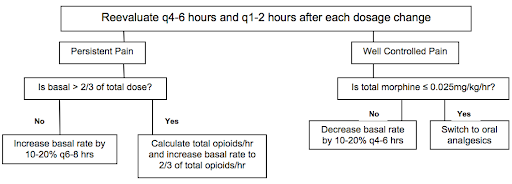

# Hematology {#hematology_chapter}

## Anemia [^1]

### Definition
Anemia is a reduction in hemoglobin concentration, hematocrit. The lower/upper limit of the normal range is set at two standard deviations below the mean for age and sex for the general population.

**Normal Mean and Lower Limits of Normal for Hgb, Hct & MCV**

|              | Hemoglobin (g/dl) |                 | Hematocrit (%) |                 | Mean Corpuscular volume (mM3) |                 |
|--------------|-------------------|-----------------|----------------|-----------------|-------------------------------|-----------------|
| **Age (yr)** | **Mean**          | **Lower Limit** | **Mean**       | **Lower Limit** | **Mean**                      | **Lower Limit** |
| 0.5-1.9      | 12.5              | 11.0            | 37             | 33              | 77                            | 70              |
| 2-4          | 12.5              | 11.0            | 38             | 34              | 79                            | 73              |
| 5-7          | 13.0              | 11.5            | 39             | 35              | 81                            | 75              |
| 8-11         | 13.5              | 12.0            | 40             | 36              | 83                            | 76              |
| 12-14 (F)    | 13.5              | 12.0            | 41             | 36              | 85                            | 78              |
| 12-14 (M)    | 14.0              | 12.5            | 43             | 37              | 84                            | 77              |
| 15-17 (F)    | 14.0              | 12.0            | 41             | 36              | 87                            | 79              |
| 15-17 (M)    | 15.0              | 13.0            | 46             | 38              | 86                            | 78              |
| 18-49 (F)    | 14.0              | 12.0            | 42             | 37              | 90                            | 80              |
| 18-49 (M)    | 16.0              | 14.0            | 47             | 40              | 90                            | 80              |

### Approach to Anemia (by MCV & Retics)

| Reticulocyte count | Microcytic anemia (MCV <80) | Normocytic anemia (MCV 80-100) | Macrocytic anemia (MCV >100) |
|--------------------|-----------------------------|--------------------------------|------------------------------|
| **LOW** (inappropriately low for the degree of anemia) | -[Iron deficiency](https://bchfit.tch.harvard.edu/ebg-services/component/pdfAlgorithm?algCode=IDA&algVersion=1.4&accessCode=null) (see Clinical Pathway) - [Lead poisoning](https://bchfit.tch.harvard.edu/ebg-services/component/pdfAlgorithm?algCode=Lead_Poisoning&algVersion=1.9&accessCode=null) (see Clinical Pathway) - Chronic disease - Aluminum toxicity - Copper deficiency - Protein malnutrition | - Chronic disease - RBC aplasia (TEC, infection, drug induced) - Malignancy - JRA - Endocrinopathies - Renal failure |  - Folate deficiency, Vitamin B12 deficiency - Aplastic anemia - Congenital bone marrow dysfunction (Diamond-Blackfan or Fanconi syndromes, Diamond Blackfan anemia) - Drug-induced - Myelodysplasia - Trisomy 21 - Hypothyroidism |
| **NORMAL** | - Thalassemia trait - Sideroblastic anemia | - Very acute bleeding - Phlebotomy - Hypersplenism - Dyserythropoietic anemia II |   |
| **HIGH** | - Thalassemia syndromes - Hemoglobinopathies | - Antibody-mediated hemolysis - Hypersplenism - Microangiopathy (HUS, TTP, DIC, Kasabach-Merritt) - Membranopathies (spherocytosis) - Enzyme disorders (G6PD, PK) - Hemoglobinopathies - Acute/chronic bleeding | - Dyserythropoietic anemia I, III - Active hemolysis |

### Microcytic Anemias

|   | Serum Iron | TIBC | % Transferrin Sat (Fe/TIBC) | Ferritin | Smear |
|---|------------|------|-----------------------------|----------|-------|
| **Iron deficiency anemia** | Low | High | Low (<12%) | Low | Hypochromic, microcytic |
| **Anemia of chronic disease/inflammation** | Low | Low | Normal (>18%) | Normal/High | Hypochromic, normocytic or microcytic |
| **Lead poisoning** | High/normal | Low/normal | Normal | High/Normal | Stippled, microcytic |
| **Sideroblastic** | High | Low | High/Normal | High | Ringed sideroblasts (BM) |
| **Hemochromatosis** | High | Low | High | High |    |
| **Alpha/Beta Thalassemia** | Normal | High | Normal | Normal | Microcytic RBCs, target cells (alpha), basophilic stippling (beta) |

#### Thalassemias

|       | Variant | Defect | Clinical/Dx |
|-------|---------|--------|-------------|
| **α** | **α Thalassemia Minima** | 1 α-globin allele | **Asymptomatic** (no anemia) |
|       | **α Thalassemia Minor** | 2 α-globin alleles | - **Minimal anemia** (“α-thalassemia trait”) - Target cells |
|       | **Hemoglobin H disease** | 3 α-globin alleles | - **Hgb H** (4 β-globins) - Microcytic anemia, **chronic hemolytic anemia** - Pallor, splenomegaly, decreased lifespan |
|       | **Hydrops fetalis** | 4 α-globin alleles | - **Hgb Bart’s** (4 γ-globins) - **Fetal edema** → intrauterine death |
| **β** | **β Thalassemia Minor** | 1 β-globin allele | - **↓ β-globin, ↑ Hgb A2** (α2δ2) - **Minimal anemia** (“β-thalassemia trait”) |
|       | **β Thalassemia Major** | 2 β-globin alleles | - **Absent β-globin, Hgb F** (α2γ2) **+ Hgb A2** - **Severe anemia** |

### Sickle Cell Anemia

[**See full section below**](#scd)

### Hemolytic Anemias

|         | Pathophysiology | Smear | Coombs | Clinical/Dx | Management |
|---------|-------------|--------------|-------------|----------------|--------------|
| **Drug-Induced** | Drug induces IgG → cross-reacts w RBCs | - Burr Cells - Schistocytes | Direct (+) | Cephalosporins, PCNs, Quinidine, NSAIDs, Methyldopa | Stop drug |
| **Autoimmune Hemolytic Anemia (AIHA)** | **Warm-IgG:** - Primary - Secondary (HIV/EBV, SLE, Drugs (PCN), ALPs/immunodeficiencies, Evans, Transplant, Non-Hodgkin Lymphoma | Microspherocytes | - Direct (+) - IgG +/- C3 | - Asymptomatic vs. life-threatening hemolytic anemia (mainly **extravascular**) - Indirect hyperbilirubinemia, elevated LDH - Splenomegaly - Venous thromboemboli | - **1st line:** RBC Transfusion, Prednisone (long taper over ~3 mos) - **2nd line:** Rituximab - **3rd line:** Immunosuppressants, splenectomy |
|                                        | **Cold-IgM:** - EBV (mono), mycoplasma | Agglutination | C3+ | - Hemolytic anemia (**intravascular**) - Indirect hyperbilirubinemia, elevated LDH, low haptoglobin - Hemoglobinuria | - RBC transfusion, once Hb is high enough, give IVF support to protect kidneys - Avoid cold (warmed IVF/blood) - **2nd line:** Rituximab, plasmapheresis |
|                                        | **Paroxysmal Cold Hemoglobinuria (PCH):** - IgG (Donath-Landsteiner Ab) - EBV, mycoplasma | Spherocytes or bland smear | Must ask blood bank to look for **Donath-Landsteiner Ab** | - Hemolytic anemia (**extra/intravascular**) - Indirect hyperbilirubinemia, elevated LDH | - RBC transfusion - Warmed IVF/blood - Keep warm |
| **Mechanical** | - **Microangiopathic:** DIC, TTP,HUS - **Macroangiopathic:** Kasabach-Merritt Phenomenon, AS, prosthetic valves | Schistocytes | Neg | - Hemolysis + thrombocytopenia - **DIC:** Fever, hypotension, prolonged PT/PTT, low fibrinogen - **TTP:** Hemolytic anemia, thrombocytopenia +/- fever, renal insult, and neurologic changes, normal PT/PTT/fibrinogen, low ADAMTS13 activity 0 **HUS:** Hemolytic anemia, thrombocytopenia, fever, bloody diarrhea (E Coli) - **Atypical HUS:** Hemolytic anemia, thrombocytopenia, fever (stress trigger) | - **TTP:** Plasmapheresis - **Sepsis:** Treat underlying cause |
| **Hereditary Spherocytosis** | Defect in RBC membrane (vertical interactions, ex/ band 3, ankyrin) | - Spherocytes - +Osm. frag | Neg | - High MCHC - Jaundice/gallstones - Aplastic crisis | - Folic acid - Transfusions PRN - +/- splenectomy |
| **Hereditary Elliptocytosis**  | Defect in RBC membrane (horizontal interactions, ex/ spectrin) | Elliptocytes | Neg | - >50% elliptocytes on blood smear - Ranges from clinically silent (no evidence of hemolysis) to chronic hemolytic anemia | None to folic acid +/- splenectomy |
| **G6PD Deficiency** | - Oxidants (fava, sulfa, dapsone, INH, quinine) → hemolysis - **Epidemiology:** Asian, African Am, Middle E. - **Genetics:** X-linked | - Bite cells - Heinz bodies | Neg | Jaundice, dark urine, back pain | - Avoid oxidants - Transfuse |
| **Pyruvate Kinase Deficiency** | PK is required for RBC glycolysis | Decreased PK activity | Neg | - Mild to severe chronic anemia - Gallstones - Iron overload | - Folic acid - Transfusion - +/- Splenectomy |
| **Paroxysmal Nocturnal Hemoglobinuria** | Complement-mediated intravascular RBC lysis | - Absent CD55/59 - Increased LDH | Neg | - Pancytopenia 0 Venous thrombosis (abd/cerebral) - Hemoglobinuria | - Eculizumab - Iron/Folate |

### Other Normocytic Anemias

|   | Pathophysiology | Smear | Clinical/Dx | Management |
|---|-----------------|-------|-------------|------------|
| **CKD-related anemia** | ESRD → EPO deficiency | Normochromic, normocytic | Side effects of EPO: HTN, HA, flu-like sx | EPO/Fe |
| **Aplastic anemia** | BM failure | Pancytopenia | Pallor/fatigue, infections, bruising | Treat the underlying condition |

### Macrocytic Anemias

|   | Pathophysiology | Smear | Clinical/Dx | Management |
|---|-----------------|-------|-------------|------------|
| **Folate deficiency** | Alcoholism, AEDs, severe anorexia/dietary limitations | Megaloblastic macrocytic | Pallor/fatigue, atrophic glossitis | PO folate |
| **B12 deficiency** | Pernicious, chronic gastritis, malabsorp, parasite (D. latum), severe anorexia/dietary limitations | -Megaloblastic macrocytic - Increased methylmalonic acid and homocysteine | Pallor/fatigue, subacute combined degeneration, atrophic glossitis, dementia | - IM/IV B12 - High dose PO B12 - Anti-IF Abs |

### Pediatric-Specific Anemias

|   | Pathophysiology | Smear | Clinical/Dx | Management |
|---|-----------------|-------|-------------|------------|
| **Anemia of prematurity** | Preterm → decr EPO, decr RBC life, incr phlebotomy |   | Asymptomatic vs. tachycardia +/- apnea | Fe, decreased phlebotomy |
| **Erythro-blastosis** | ABO set-up/Rh disease, minor blood group antigens |   | Jaundice/hyperbili in 1st 24 HOL | Transfusion, phototherapy |
| **Fanconi** | AR/XL mutation → aplastic | Pancytopenia, aplastic | Short, microcephaly, bent thumb, freckles, café-au-lait, ear abnormalities | Transfusion +/- SCT |
| **Diamond-Blackfan** | Pure red cell aplasia | Macrocytic, normal WBC | Short, web neck, shield chest, cleft lip, triphalangeal thumbs | Steroids, transfusion |

#### Newborn Anemia
\

## Sickle Cell Anemia {#scd}

#### Pathophysiology
Autosomal recessive missense mutation (Glu → Val) at position 6 of B-globin gene

#### Clinical manifestations
- **Vaso-occlusive (pain) crisis:** Ischemia → pain
	- *Triggers:* Cold weather (vasospasm), hypoxia, infection, dehydration, acidosis, alcohol intoxication, emotional stress, pregnancy, exertional stress
	- **Bones:** Most commonly long bones like femur, tibia, humerus, and lumbar vertebrae (femoral head → avascular necrosis)
	- **Joints & soft tissue:** Dactylitis or hand and foot syndrome - painful and swollen hands/feet
	- **Abdomen:** Can mimic an acute abdomen
	- **Renal:** Papillary necrosis → hyposthenuria (inability to concentrate urine)
	- **Lungs:** Acute chest syndrome
	- **CNS:** Cerebral infarction, hemorrhage (young adults), seizures, transient ischemic attacks, cranial nerve palsies, meningitis, sensory deficits, and acute coma
	- **Skin:** Ulceration, especially over bony prominences (malleoli)
	- **Eye:** Retinal hemorrhages, proliferative retinopathy (more common in HbSC)
	- **Penis:** Prevents drainage of blood from the corpus cavernosum leading to priapism
- **Acute chest syndrome (ACS):** Pulmonary infarction → fever, cough, chest pain, SOB, new pulmonary infiltrate on x-ray
- **Fever:** Viral vs. bacterial (including encapsulated organisms: H. flu, S. pneumoniae, N. meningitidis)
	- Children w/ sickle cell anemia also have lower serum IgM levels, impaired opsonization, and sluggish alternative complement pathway activation, so are susceptible to Mycoplasma pneumoniae, Salmonella, Staphylococcus aureus, and Escherichia coli
- **Sepsis:** Strep pneumo is most common cause 
- **Hyposplenia:** Splenic autoinfarction → susceptible to infections w/ encapsulated bacteria
- **Osteomyelitis:** Staph > Salmonella, treat w/ CTX/Vanc
- **Aplastic crisis:** Decreased retic/RBCs, parvo B19 infection, pallor, weakness, fatigue
- **Splenic sequestration crisis:** Marked decrease in hemoglobin level despite persistent reticulocytosis, splenic vasoocclusion → rapid splenomegaly, prior to autosplenectomy

#### Diagnosis
- **VOE:**
	- **Labs:** CBCd (compare to baseline Hb), retics, chem10, LFTs, amylase/lipase, T&S
	- **Imaging:** CXR PA & lateral for fever, chest wall pain, hypoxia, or respiratory symptoms
- **Fever:**
	- **Labs:** CBCd (compare to baseline Hb), retics, chem10, LFTs, amylase/lipase, T&S, BCx (for 1st temp >38.5C or 101.3F) and qdaily w/ temp spikes, ABG if hypoxic
	- **Other studies:** UA/UCx (cath all M <6mo, F <2yo, or any child w/ urinary sx), viral panel, throat culture (if suggestive on exam), stool studies (if having diarrhea), LP (if neurologic s/sx)
	- **Imaging:** CXR PA & lateral (if fever, chest wall pain, hypoxia, respiratory symptoms)

#### Management
See sections below on **VOE, ACS,** and **fever**

### Vaso-Occlusive Episode (VOE)
***_BMC Sickle Cell Cards:_*** NOTE practices may vary at BCH. Should not replace clinical judgment or Pedi Heme consult (place consult order in EPIC and page on-call pager 5731); please page daily after rounds to discuss management as needed, and read daily consult note for detailed recommendations.

***_THE INFORMATION BELOW IS APPLICABLE TO BOTH BMC & BCH:_***

#### Fluids, Monitoring, & Labs
- Hydration: D5 1/2NS or D5 NS @ 1.25x maintenance is crucial to lessen sickling
- Continuous pulse oximetry
- Routine labs are not needed for uncomplicated VOE
- DVT prophylaxis should be addressed for all patients per inpatient protocol

##### Pain Management
- **Non-opioid analgesics:**
	- Standing NSAID: **Ketorolac** on admission if proven benefit; after 72 hrs switch to standing ibuprofen q6h
	- Additional modalities: **Ketamine** (refer to Lexicomp for dosage), hot packs, lidocaine patch, distraction, Child Life, relaxation, acupuncture
- **Opioids:**
	- Management and prevention of opioid **side effects:**
		- **Constipation:** Standing stimulant laxative (senna) and daily Miralax w/ admit. Titrate for 1 soft formed stool q1-2d. Escalate PRN, may add Mg citrate, milk of magnnesia, lactulose, methylnaltrexone.
		- **Pruritus and nausea:** Start w/ camphor-menthol lotion for mild itching. Next step is a naloxone drip at 0.5 mcg/kg/h, titrate up to 2 mcg/kg/h q3-4h for significant itching/nausea. Can then add Zofran. Avoid Benadryl given the sedating effect.
		- **Prevent hypoventilation:** Crucially important in preventing atelectasis and ACS! Incentive spirometer 10x/hr while awake and q4h overnight. Bubbles or pinwheel in younger kids. HOB elevated to 30 degrees at all times. Have patient sit up in bed, out of bed to chair, and ambulation as tolerated. Standing albuterol q4-6h for pt w/ asthma, history of wheeze w/ prior VOE, chest or back pain, or any current wheezing or cough. Oxygen overnight PRN (goal O2 sat > 95% or pt’s known baseline; can provide NC O2 at 0.5-1L for mild desats while asleep; does not replace the need for incentive spirometry). Continue any home respiratory therapies (home O2, CPAP, etc).
	- **Titration of PCA/opioids:**
		- Use patient reported pain score (compare to baseline/chronic pain level) AND change in pain AND patient functional status to assess pain control
		- Assess for VOE vs. opioid side effects to help w/ dose adjustment
		- Reassess pain control frequently, especially during first 24 hrs, and adjust PCA as needed w/ goal of providing 2/3 of total opioid dose as basal and 1/3 as demand
		- Consider increasing basal rate by 20% overnight early in the admission to avoid falling behind in pain control while asleep
		- As pain is captured, wean PCA rate and then switch to orals
	- **Weaning to orals:** Please discuss patient specific plan w/ Pedi Heme; details will depend on length of admission, pain tolerance, and patient preference. In general, when pain is well-controlled, replace the basal PCA w/ SCHEDULED long- or short-acting oral medication (MS Contin, oxycodone, or hydromorphone), leaving the PCA demand button. If pain remains well-controlled after 12-24 hrs, then replace PCA demand w/ a standing short-acting medication (often oxycodone, tramadol, or hydromorphone). This step should be considered both a conversion and a wean.
		- **Quick conversion from IV to oral opiates** (meant as a guide, not a mandate):

| Total Basal IV morphine use over 24 hours | Total Basal IV dilaudid use over 24 hours | MSContin dose | If using ONLY oxycodone |
|-------------------------------------------|-------------------------------------------|---------------|-------------------------|
| 10mg                                      | 2.5mg                                     | 15mg PO q12   | 5mg PO q6               |
| 15mg                                      | 4mg                                       | 15mg PO q8    | 5mg PO q4               |
| 20mg                                      | 5mg                                       | 30mg PO q12   | 10mg PO q6              |
| 30mg                                      | 8mg                                       | 30mg PO q8    | 10mg PO q4              |

#### Discharge planning
- Ready for discharge when pain is controlled on oral meds (pain may not be gone at this time)
- Continue standing pain meds x48hrs at home before tapering to PRN
- Anticipate home opioid needs; ask if opioids are available at home, and prescribe meds-in-hand early on day of discharge. If patient prefers to fill meds at home pharmacy, provide Rx early in hospital course (controlled substance prescriptions can now be faxed or sent electronically). Be aware of specific MA prescribing requirements for opioids.
- Schedule follow-up in Heme clinic w/i 1 week (BMC clinic phone # 617-414-4841), appointments are available everyday Mon-Fri

### Acute Chest Syndrome (ACS)
ACS in SCD is multifactorial. Causes include **infection, bronchospasm, inflammation,** and **fat embolization.** It can be very serious and needs to be managed very closely.

#### Optimize ventilation
to prevent serious sequelae from ACS:

- Incentive spirometry 10x per hour while awake and q4h overnight
- Have patient sitting up in bed, out of bed to chair, and ambulation as tolerated
- Examine patients for any drop in O2 saturation — do NOT simply put on oxygen w/o evaluating
- Standing albuterol neb q4-6h for those patients with known benefit, people with a history of reactive airway, asthma, wheeze on clinical exam. Add inhaled corticosteroid only if on one at home
- Consult Pulm for any patient w/ wheezing, severe ACS, or as needed to help optimize respiratory status; please notify Pulm when of their patients are admitted w/ ACS
- Consider high flow NC or BIPAP as appropriate (requires ICU transfer)

#### Fluid balance
needs to be monitored carefully:

- Patients w/ SCD require increased IVF in cases of VOE or fever/dehydration. However, overhydration can worsen ACS.
- In general, use IV + PO at 1x maintenance for patients w/ ACS
- Must have strict I/O’s ordered and reviewed regularly to adjust fluids as needed

#### Other monitoring & labs
- Continuous pulse oximetry
- All patients w/ ACS should have an active **type & screen**
- **DVT prophylaxis** should be addressed for all patients per inpatient protocol

#### Antibiotics
should include coverage for pneumococcus and atypicals (typically ceftriaxone and oral azithromycin):

- See Fever guidelines below for details

#### Transfusions
must be approved by Heme:

- Need to balance need for immediate treatment w/ long term risks of alloimmunization
- If the patient does not have an O2 requirement, we typically attempt medical management w/ abx and aggressive pulmonary toilet for 24hrs before transfusing
- Potential indications for transfusion in ACS include a drop in Hb > 2g/dL below baseline w/o appropriate reticulocytosis, a significant oxygen requirement, or worsening work of breathing
- See Blood Transfusions section below for details

#### Discharge planning
- Stable for discharge when BCx are negative x48hrs and respiratory status is stable/improved
- Should complete a full course of antibiotics to cover both pneumococcus and atypicals
- Schedule follow-up w/ PCP w/o the week and in Heme clinic preferably w/i a week (BMC clinic phone # 617-414-4841), appts at BMC are available every day Mon-Fri
- At BMC, please refer to Pulm for outpatient follow-up (referral for “SCD w/ ACS”)

### Fever

#### Definition
T >38.5C (101.3F) if >2mo

#### Work-up
- Detailed history and physical exam to identify potential source
- **Labs:** CBCd (compare to baseline Hb), retics, chem10, clot (hold for Blood Bank), BCx (for 1st temp >38.5C (101.3F) and qdaily w/ temp spikes), ABG (if hypoxic)
- **Other studies:** UA/UCx (cath all M <6mo, F <2yo, or any child w/ urinary sx), viral panel, throat culture (if suggestive on exam), stool studies (if having diarrhea), LP (if neurologic s/sx)
- **Imaging:** CXR PA & lateral (if fever, chest wall pain, hypoxia, respiratory symptoms)

#### Management
- **Inpatient** management:
	- IV bolus of 10 - 20 ml/kg if dehydrated→ IV fluids @ 1.25 Maint (+/- for fluid intolerance vs. dehydration)
	- **Antibiotics:** Goal administration w/i 30 min of arrival! Draw cultures first. Do not delay treatment while awaiting lab results and CXR. Needs empiric antibiotics even if a source of infection is identified.
		- **Ceftriaxone** 50 mg/kg IV/IM q24h (max dose 1g/day), q12h (max 2g/day) if suspect meningitis. If allergic to Ceftriaxone, consider Levofloxacin or Clindamycin if inpatient.
		- Add **Vancomycin** 40-60 mg/kg/day divided q6h for CNS involvement (including meningitis), septic shock, central line/port, or hx of resistant infection
		- For HD instability or meningitis; consider in pts w/ port or hx of resistant infection
		- Add **Azithromycin** PO for pts w/ positive CXR or respiratory symptoms
- **Outpatient** management and follow-up:
	- Observe in ED for 2 hrs after giving CTX. **Return if:** Temp >38.5C; poor PO intake; lethargy; respiratory symptoms; pain.
	- Follow up in Hematology clinic, PCP’s office, or ED in 24 hours for re-evaluation & 2nd dose of CTX
	- Follow up BCx at 24 and 48 hrs → call PCP regarding ED visit & to assure follow up

### Blood Transfusions in SCD
Blood transfusions in SCD are used to increase RBC mass and oxygen carrying capacity and to decrease proportion of sickle cells. Acute benefits of transfusion must be weighed against the long-term risks, including alloimmunization. Phenotypically matched (ABO, Rh-D, Kell, C, E), sickle negative, leuko-depleted irradiated packed red blood cells are the blood product of choice. More extensive phenotyping needed for patients on chronic transfusion. It may take hours for the blood bank to find matched blood, and even longer in cases of alloimmunization so maintain an active type and screen if you anticipate needing to transfuse a patient.

#### Potential indications for transfusion
- Aplastic crisis/acute anemia (drop in Hb > 2g/dL below baseline) w/o an appropriate reticulocytosis
- Acute chest syndrome (ACS) not responsive to medical management or severe disease/ hypoxemia
- Symptomatic anemia
- Pre-procedure prophylaxis (goal Hb of 10 g/dL)
- Splenic sequestration:
- Hb drop > 2g/dl, drop in platelet count and WBC as well
- Monitor spleen size and labs frequently

#### Amount of blood to transfuse
based on goal Hb:

- mL of pRBC = (desired Hb - current Hb) x (wt (kg) x Blood Vol(ml/kg)) /(Hb of PRBC)
- Blood volume = 80mL/kg for children
- Hb of pRBCs = 18.5g/dL at BMC, avg HCT 60% at BCH
- 1 unit pRBC = 250-350 mL; consider rounding down to a whole unit to avoid extra donor exposure

#### Other considerations
- Premedicate only if history of transfusion reaction
- Need for post-transfusions labs to be dictated by individual case

## Transfusion Medicine

### Consenting a Patient for Blood Products

#### Risks
- Fever, chills, hives/itching, and shortness of breath (can be managed w/ medications)
- Hemolytic transfusion reaction or transfusion-related lung injury (rare)
- Bacterial or viral infection (hepatitis C, hepatitis B, HIV, malaria). Blood is extensively screened to prevent this.

#### Benefits
Improve blood clotting or oxygen delivery

#### Alternatives (may not work as quickly)
- Colony stimulating factor
- Vitamin K
- No treatment (note: parents may not refuse blood products in life-threatening situations)

### Acute Transfusion Reactions

|   | Time | Pathophysiology | Clinical/Dx | Management |
|---|------|-----------------|-------------|------------|
| **Anaphylactic** | Sec-Mins | IgA def → anti-IgA/IgG Abs | Shock, urticaria, angioedema, hypoTN | EPI, IVF, O2 Washed RBCs |
|                  | Within mins | IgE-mediated, bradykinin-med if ACEi | HoTN, wheeze, N/V/D | ABCs, Epi, Benadryl |
| **Urticarial** | Anytime | Type I HSR (IgE mediated) | Hives, erythema | Benadryl, Wash |
| **Acute Hemolytic** | First 15 mins | ABO/Kidd incomp.→ hemolysis/comp activ. Rh/Kell/Duffy incompatibility → hemolysis +Coombs, Pink plasma | Fevere, chills, back or flank pain, bleeding/DIC | NS/Lasix Monitor for HoTN, AKI/DIC |
| **Febrile non-hemolytic** | 1-6 hrs | Donor WBCs → TNF-alpha, IL 1 / 6 RBC: anti-HLA Plt: donor WBC cytokines | Low grade fever, chills, HA, flushing | APAP, meperidine Leukoreduction |
| **Delayed hemolytic** | >3 days | Anamnestic IgG against exposed Ag (Kidd/Duffy/Kell) → extravasc. hemolysis | Fever, anemia, jaundice, flu-like illness | R/O AIHA (+DAT) |
| **Transfusion-related lung injury (TRALI)** | 1-6 hrs | Pre-Tx stress activates lung endothelial cells and primes PNMs Post-Tx donor anti-HLA Ab → primed PMNs | Fever, SpO2 <90%, PaO2/FiO2 <300 B/l pulm edema | ABCs, O2, mech vent.  Dec. in male donor |
| **Transfusion-Assoc. Circ Overload (TACO)** | 1-6 hrs | High risk in elderly, CHF, CKD, chronic anemias | Cardiogenic edema → dyspnea, hypoxemia | Stop, sit up , O2, diuretics, slower rate (1 cc/kg/hr) |
| **Bacterial sepsis** | 15-60 mins | Bacteria >> Viruses in donor blood   RBC: Yersinia, PsA, Plt: Staph epi (GPCs) | Fever (>39), rigors, abd sxs, HoTN, shock | Antibiotics Screen |

#### Specialized RBCs
- **Irradiated:** BMT recipients, acquired congenital cellular immunodeficiency, blood from 1st/2nd degree relatives
- **Leuko-reduced:** Chronic transfusion, CMV seronegative at-risk pts (AIDS, transplant), potential transplant candidates, previous febrile nonhemolytic transfusion reaction
- **Saline Washed:** IgA deficiency, Complement-dependent AIHA, allergic reactions w/ RBC transfusion

### Transfusion Products
| Component | Contents | Volume | Indications | Contraindications | Considerations |
|-----------|----------|--------|-------------|-------------------|----------------|
| **Red Blood Cells (RBC)** | Concentrated RBCs | 200-300 mL | Symptomatic anemia (Hgb <7 g/dL); Acute hypovolemia due to hemorrhage | Pharmacologically treatable anemia (eg. iron, folate, B12 deficiencies) | Must be ABO compatible, cross-match compatible Infuse w/in 4 hr or as patient tolerates |
| **Platelets (PLT)** | >5.5×10^10 PLT per 50 ml | 60 mL | Bleeding related to thrombocytopenia or PLT dysfunction; Low PLT count | Patients w/ TTP, HUS or HIT; Not as effective in ITP, DIC, sepsis, uremia, hypersplenism | ABO and Rh compatible w/ patient’s RBC if possible Infuse 5-10 mL/min or as tolerated, usually w/in 1 hour |
| **Leukocyte reduced RBC or PLT** | RBC or PLT w/ WBC: <5×10^6 | Similar to original | RBC/PLT indications plus history of febrile transfusion reactions; At risk of CMV and alloimmunization | See RBC or PLT | See RBC or PLT |
| **Cryo-precipitate (Cryo)** | 80-120 units Factor VIII; 150-250 mg Fibrinogen | 25 mL 40-70% orig. plasma VWF | Fibrinogen deficiency or dysfunction | Safer and more concentrated therapy available (ie, for specific clotting factors) | Consider alternative therapies for specific factor deficiencies Should be ABO compatible if possible |
| **Fresh frozen plasma (FFP)** | 400 mg fibrinogen and 200 units of other clotting factors | 200-250 mL | Clotting factor def. (if specific factor conc. not avail.), lg volume required Severe liver disease Rapid warfarin reversal Vit K def w/ active bleed  TTP/DIC: massive crystalloid + RBC transf. w/ ongoing bleeding C1 esterase inhib def. | Safer and more concentrated therapy available (ie, for specific clotting factors) | Should be ABO compatible Infuse 5-10 mL/min or as the patient tolerates Give 10-15 cc/kg |

## Pancytopenia

### Marrow
Decreased cellularity (aplastic, myelofibrosis, chemo), normal cellularity (MDS, PNH), increased cellularity (leukemia, lymphoma, MM, mets)

### Systemic
Spleen (cirrhosis, myelofibrosis), toxin (EtOH, cocaine), nutrition (B12/folate def), rheum (SLE, RA), sepsis

### Meds
NSAIDs, PPIs, sulfas, antihistamine, chemo, anticonvulsants, antiprotozoals, heavy metals

### Infectious
Virus (HIV, HB/CV, CMV/EBV, Parvo), bacteria (Brucella, TB), fungi (Histo), parasites (Leishmania, Malaria, Schisto)

## Thrombocytopenia

#### Definition
Platelets <150,000 → increased risk of hemorrhage, mucosal bleeding, petechiae, purpura, ecchymoses

#### Pathogenesis
- **Decreased platelet production:** Virus (EBV, Hep C, HIV, parvo), meds (chemo, thiazide, linezolid, chloramphenicol), leukemia, myelodysplasia, EtOH, BMF syndromes/aplastic anemia, Vit B12/Folate deficiency, congenital thrombocytopenias (WAS, TAR, MYH9)
- **Increased platelet destruction:** Virus (HIV, HSV/VZV, EBV), meds (heparin), ITP, DIC, TTP, HUS, HIT, HELLP, antiphospholipid syndrome, vasculitis, vascular anomaly (Kasabach-Merritt)
- **Hypersplenism:** Splenomegaly (cirrhosis, portal HTN) -Dilutional/pooling: massive transfusion, hypothermia/neonatal cooling

#### Labs
- Plts <150,000, normal PT/PTT
- **Blood smear:** Poor production (typically normal/small plts), increased destruction (large/giant platelets)

### Causes
|     | Pathophysiology | Clinical/Dx | Management |
|-----|-----------------|-------------|------------|
| **ITP (immune thrombocytopenic purpura)** | **Autoimmune:** Primary or secondary  (Evans, immunodeficiency (ALPs, others), infectious (HIV, Hep), rheum (SLE), transplant, medications/vaccines) | - Plt <100,000 - Antecedent viral infection - Diagnosis of exclusion | - Generally self-limited - Close observation - Steroids, IVIG, TPO-RA, immunosuppressants |
| **HIT (heparin-induced thrombocytopenia)** | Heparin → forms complex w/ Plt F4-> immune complex formation → Plt activation/aggreg → thrombosis/thrombocytopenia | Decision to screen based on 4T Score (if >4 poinnts, send ELISA/SRA): - Thrombocytopenia (>50% fall but >20) - Timing of plt fall - Thrombosis or skin necrosis - Other causes| - Stop heparin - Lifelong avoidance. Use argatroban, fondaparinux instead. |
| **TTP (thrombotic thrombocytopenic purpura)** | - Decreased ADAMTS 13 (uncleaved vWF multimers) → plt aggregation → thrombosis → plt consumption + microangiopathic hemolysis (schistocytes) - Primary or Secondary (pregnancy, HIV, rheumatologic dx, transplant) - Congenital TTP can present late | Hemolytic Anemia and thrombocytopenia, +/- renal failure, and neuro | Plasmapheresis, +/- glucocorticoids, +/- Rituximab |
| **Classic HUS (hemolytic uremic syndrome)** | E. coli O157:H7 → plt aggregation → thrombosis → plt consumption + microangiopathic hemolysis (schistocytes) | Hemolysis, uremia, decreased plts, inc, fever, bloody diarrhea | Supportive, IVF, dialysis |
| **Bernard-Soulier** | Decreased GpIb → dec. plt adhesion | Large/decreased plt count | Supportive, perisurgical planning |
| **Glanzmann** | Decreased GpIIb/IIIa → dec. plt agg | Normal plt count | Supportive, perisurgical planning |
| **Antiphospholipid syndrome (APLS)** | Persistent Antiphospholipid Abs w/ thrombosis (arterial or venous) or pregnancy complications → arterial/venous thrombosis (X2 >12 weeks apart) | - +Antiphos. Abs (anticardiolipin Ab, B2 Glycoprotein Ab, Lupus Anticoagulant), thrombocytopenia - Primary or secondary (underlying rheumatologic dx) | - Anticoagulate: LMWH or warfarin for ATE or VTE treatment - Hydroxychloroquine |
| **HELLP syndrome** | Preeclampsia (HTN) + **_H_**emolysis, **_E_**levated **_L_**iver enzymes, **_L_**ow **_P_**lts | Schistocytes on smear | Induce labor, deliver |

## Hematologic Disorders of the Newborn/Child

### Anemia of Prematurity

#### Pathogenesis
Impaired EPO production; shortened RBC life; iatrogenic blood loss

#### Clinical manifestations
Asymptomatic, apnea, poor weight gain, tachycardia

#### Diagnosis
Hb/Hct, retic, smear

#### Management
Decrease phlebotomy, iron supplementation, transfusions

### Transient Erythroblastopenia of Childhood

#### Pathogenesis
Acquired red cell aplasia (6mo - 5yr)

#### Clinical manifestations
Gradual pallor, fatigue

#### Diagnosis
Normocytic/normochromic anemia, Hb (3-8), retic

#### Management
Self-resolving

### Neonatal Polycythemia

#### Pathogenesis
Erythropoiesis from intrauterine hypoxia. Risk factors: IUGR, maternal DM/HTN, smoking, delayed cord clamping, twin-twin transfusion.

#### Clinical manifestations
Ruddy skin, hypoglycemia, resp distress, cyanosis, apnea

#### Diagnosis
Hct >65% in FT infant

#### Management
If asymptomatic → hydration/feeding. If symptomatic → partial exchange transfusion.

## Coagulation Disorders
*Characterized by coagulopathy and/or hypercoagulability*

|   | Pathophysiology | Clinical/Dx | Management |
|---|-----------------|-------------|------------|
| **VWD (von nwillebrand deficiency)** | AD/AR def. of VWF → abnormal mucocutaneous bleeding | - Bruising, mucosal bleeding, menorrhagia - VWF Ag and Activity low, may have decreased FVIII activity and prolonged PTT | - **Bleed:** DDAVP (if responder) - **Severe bleed:** VWF conc. - **Menorrhagia:** OCPs - Avoid aspirin use |
| **Hemophilia** | -	X-linked inheritance - **Hemophilia A:** Factor VIII deficiency - **Hemophilia B:** Factor IX deficiency | - Hemarthrosis, ICH, mucosal bleeding, epistaxis, occasional hematuria, GI bleed - Prolonged PTT, decreased FVIII or FIX activity; PT and plt wnl | - **Hemophilia A:** FVIII concentrate (DDAVP for most mild pts) - **Hemophilia B:** FIX concentrate |
| **Vitamin K deficiency** | - Decreased synthesis of FX, IX,VII, II, Protein C, S - **Epidemiology:** Neonates, antibiotics, malabsorption (pancreatitis, celiac, IBD), warfarin use | - Easy bruising, mucosal bleeding, melena, hematuria, ICH (newborns) - Prolonged PT and PTT | - Vit K (PO or IM) - **Acute bleed:** FFP or PCC |
| **DIC (disseminnnated intravascular coagulation)** | - Widespread pathologic intravascular coagulation → plt/factor consumption, hemolysis - Causes: STOP Making Thrombi (**_S_**epsis, **_T_**rauma, **_O_**B complications, **_P_**ancreatitis, **_M_**alignancy, **_T_**ransfusion) | - Bleeding from wound/surgical site, hemoptysis, venous/arterial thrombosis → organ ischemia, hypoTN, jaundice, ext. cyanosis - Decreased Plts, fibrinogen, haptoglobin - Increased PT/PTT, D-Dimer, LDH | - Treat underlying cause - Aggressive support - Acute bleed: Plt transfusion + FFP +/- RBC transfusion |
| **Inherited hypercoagulable states** | **Factor V Leiden** | Reduced factor V inactivation by protein | Lifelong anticoagulation in the setting of homozygous inheritance and prior VTE |
|                                      | **Prothrombinn 20210 mutation** | Increased prothrombin levels |   |
|                                      | **Antithrombin deficiency** | Reduced inactivation of factor 2 (thrombin) |   |
|                                      | **Protein C or S deficiency** | Reduced factor 5 / 8 inactivation, purpura fulminans w/ homozygous protein C deficiency |   |

## Antiplatelet / Anticoagulant Medications

| Medication | MOA | Monitor/Reversal | Side Effects |
|------------|-----|------------------|--------------|
| **Aspirin (ASA)** | Irreversibly inhibits COX → blocks production of Thromboxane A2 → blocks plt aggregation |   | GI bleed, hyperventilation (resp alkalosis), tinnitus, Reye Syndrome |
| **Clopidogrel** | Inhibits plt ADP receptors → blocks GPIIb/IIIa expression → blocks plt aggregation |   | GI bleed |
| **Abciximab, Eptifatide** (GP IIb/IIIa inhibitors) | Binds plt GP IIb/IIIa → blocks plt aggregation |   | GI bleed, N/V, back pain |
| **Aggrenox** | Inhibits platelet cAMP phosphodiesterase → increases adenosine/cAMP → vasodilation & decreases plt aggregation |   | Dizziness, headache, nausea |
| **Heparin** (continuous infusion) | Binds/activates antithrombin → inactivates thrombin/FXa → inhibits coagulation | - anti-Xa (goal 0.3-0.7) - Protamine sulfate (100%) | HIT, hypersensitivity, narrow therapeutic window |
| **Enoxaparin, Dalteparin** (LMWH, SQ injection) | Binds antithrombin → inactivates FXa→ inhibits coagulation | - anti-Xa (goal: 0.5-1) - Protamine sulfate (60%) | HIT (rare) |
| **Fondaparinux** (direct factor Xa inhibitor, SQ injection) | Binds antithrombin → inactivates FXa → inhibits coagulation | - Not routine, antiXa - No antidote | No risk of HIT (b/c does not bind PF4) |
| **Rivaroxiban, Apixiban, Edoxaban** (direct factor Xa inhibitors, PO) | Binds FXa → inhibition activation of FII (prothrombin→ thrombin) | Not routine, Andexanet alfa (severe/life-threatening bleeding) | Bleeding |
| **Dabigatran** (PO) | Direct thrombin (factor II) inhibitor | Not routine, Idarucizumab (severe/life-threatening bleeding) | Bleeding |
| **Argatroban, Bicalirudin** (continuous infusion) | Direct thrombin inhibitor. Binds thrombin → inhibits coagulation | - Check LFTs prior to starting - Check PTT 2 hrs after initiation and 2 hrs after any dose change (goal PTT 1.5-3x baseline) | Hemorrhage, hypotension |
| **Warfarin** (PO) | Inhibits epoxide reductase → inhibits Vit. K-dependent clotting factors: 2,7,9,10, protein C/S | INR / Start IV Vit K, FFP q4, Kcentra (if severe bleeding) | Bleeding, teratogen, drug-induced interactions (cyt p450), skin necrosis |

## References

[^1]: Table 447-1, from Brugnara C, Oski FJ, Nathan DG: Nathan and Oski’s hematology of infancy and childhood, ed 7, Philadelphia, 2009, WB Saunders, p. 456.
