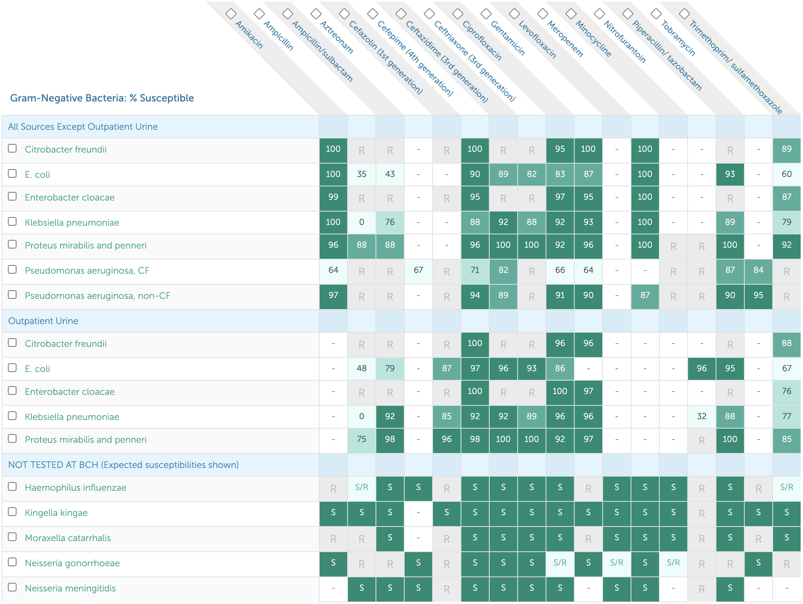
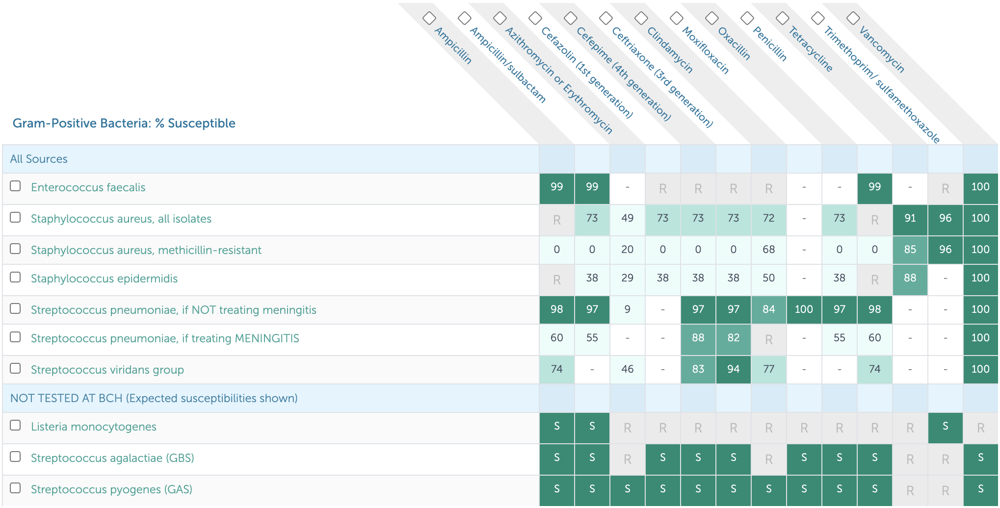
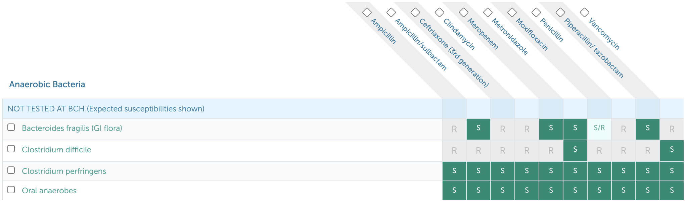

# Infectious Diseases {#id_chapter}

## [Antibiogram+](https://bchfit.tch.harvard.edu/)
The [Antibiogram+](https://bchfit.tch.harvard.edu/) website (also available as a phone app) is an excellent resource that contains [Antibiotic Susceptibilities](https://bchfit.tch.harvard.edu/susceptibilityMatrix) matrices (typically referred to as "the antibiogram(s)"), [Antibiotic Recommendations](https://bchfit.tch.harvard.edu/diagnoses) for commonly encountered diagnoses, and [Dosing Quick References](https://bchfit.tch.harvard.edu/dosingGuidelines) (although you can also always use Lexicomp for this purpose).

## [Antibiotic Susceptibilities](https://bchfit.tch.harvard.edu/susceptibilityMatrix) for Common Pathogens
*****NOTE:*** The antibiograms are **updated annually** based on that year's susceptibility data, so the digital [Antibiogram+](https://bchfit.tch.harvard.edu/) is always the most accurate resource. The following susceptibilities are based on the BCH Antibiogram+ at the time of publication.

*****ALSO NOTE:*** Sensitivities at **BMC** are **different**! (e.g. higher rates of clindamycin-resistant MRSA)

### Gram Negative Susceptibilities

### Gram Positive Susceptibilities

### Anaerobe Susceptibilities

## [Antibiotic Recommendations](https://bchfit.tch.harvard.edu/diagnoses) (Dosing, Duration) for Common Infections

*While these are often first line antibiotic choices, clinical decision-making on antibiotic prescribing should be based on the patient’s entire clinical picture. Also make sure to review patient’s allergy history prior to prescribing.*

### Bone & Joint
- **Osteomyelitis:** Cefazolin 50 mg/kg/dose IV q8h (2g) x 4wks
- **Septic arthritis:** Cefazolin 50 mg/kg/dose IV q8h (2g) x 3wks

### Head & Neck
- **Acute otitis media (AOM):** Amoxicillin 45 mg/kg/dose BID (875 mg) x 5-10 days
- **Acute sinusitis:** Amoxicillin-clavulanate 45 mg amox/kg/dose PO BID (1g) x 10 days
- **Mastoiditis, peritonsillar abscess (PTA), and/or retropharyngeal abscess (RPA):** Ampicillin-sulbactam 50mg ampicillin/kg/dose IV q6h (2g) x 10-14 days
- **Strep pharyngitis:** Amoxicillin 50 mg/kg daily (1g) x 10 days
- **Suppurative cervical lymphadenitis:** Ampicillin-sulbactam 50 mg amp/kg/dose IV q6h (2g)

### Gastrointestinal
- **C. diff:** Metronidazole 10 mg/kg/dose PO QID x 10 days
- **Ruptured appendicitis:** Piperacillin-tazobactam 100 mg pip/kg/dose IV q8h (6g) x 7 days

### Genitourinary 
- **PID, outpatient:** Ceftriaxone 50 mg/kg/dose IM x1 (250mg) + Doxycycline 2.5 mg/kg/dose PO BID (100 mg) x 14 days + Metronidazole 10 mg/kg/dose PO BID (500 mg) x 14 days
- **PID, inpatient:** Cefoxitin 40 mg/kg/dose IV q6h (2g) + Doxycycline IV/PO 2.5 mg/kg/dose PO BID (100 mg)
- **Pyelonephritis:** Ceftriaxone 50 mg/kg/dose IV q24h (2g) x 10 days
- **UTI 3-23 months, febrile, healthy, outpatient:** Cephalexin 25 mg/kg/dose TID (500 mg) x 10 days
- **UTI >24 months, healthy, outpatient:** Cephalexin 25 mg/kg/dose PO TID (500 mg) x 3-5 days

### Respiratory
- **Community-acquired pneumonia (CAP), outpatient:** Amoxicillin 30 mg/kg/dose PO TID (500 mg-1g) x 7 days
- **CAP, inpatient:** Ampicillin 50 mg/kg/dose IV q6h (2g) x 7 days
- **CAP, complicated:** Ceftriaxone 50 mg/kg/dose IV q24h (2g) + Vancomycin 15-20 mg/kg/dose IV q6-8h (1g)
- **Aspiration pneumonia:** Ampicillin-sulbactam 50 mg amp/kg/dose IV q6h (2g) x 7 days

### Skin & Soft Tissue
- **Cellulitis, non-purulent:** Cefazolin 25 mg/kg/dose IV q8h (1g) OR cephalexin 25 mg/kg/dose PO TID (1g) x 5-7 days
- **Cellulitis, purulent or abscess:** TMP-SMX 6 mg TMP/kg/dose IV/PO q12h (160 mg) x 5-7 days

## Cellulitis & Abscess

### PowerPlans, Order Sets & Clinical Pathways
- **Clinical Pathway:** [Cellulitis and Abscess](https://bchfit.tch.harvard.edu/ebg-services/component/pdfAlgorithm?algCode=CELLULOABCCESS&algVersion=1.6&accessCode=null)
- **PowerPlans & Order Sets:** Cellulitis and Abscess Pathway Plan

### Etiology
Beta-hemolytic strep, S. Aureus > H. influenzae, Clostridia, S. Pneumo

### Differential
- Erysipelas (upper dermis/superficial lymphatics, clear demarcated tissue)
- Necrotizing fasciitis (pain out of proportion to exam, crepitus, toxic appearing)
- Tenosynovitis (tenderness over flexor sheath, reduced motion)
- Compartment syndrome (early → late: paresthesia, pain out of proportion/with stretch, pallor, pulseless)

### Work-up
- Diagnosis is clinical, based on tenderness to palpation, warmth, erythema, induration, fluctuance, fever
- Obtain US if concerned for abscess
- Circle border of lesion with ink, upload photo to PowerChart w/ Cerner Camera Capture app
- No need for labs (e.g. CBC) or MRSA swab if hemodynamically stable

### Managament
- Treatment duration typically 5-7 days
- **Non-purulent:** Cephalexin/cefazolin, clindamycin
- **Purulent:** 1st Line: TMP-SMX, 2nd Line: Clindamycin, 3rd Line: Doxycycline
- Consider MRSA coverage (TMP-SMX, vanc, linezolid) if: no response to initial therapy, systemic illness, recurrent infection, prior history of MRSA, high prevalence of MRSA in community

## Osteomyelitis

### PowerPlans, Order Sets & Clinical Pathways
- **Clinical Pathways:** [Osteomyelitis](https://bchfit.tch.harvard.edu/ebg-services/component/pdfAlgorithm?algCode=OSTEOM&algVersion=1.3&accessCode=null); [Osteomyelitis, Complex](https://bchfit.tch.harvard.edu/ebg-services/component/pdfAlgorithm?algCode=COMPLEX_OSTEO&algVersion=1.3&accessCode=null)
- **PowerPlans & Order Sets:** Osteomyelitis Admit Pathway Plan

### Etiology
- Hematogenous seeding > direct inoculation vs. contiguous spread
- S. aureus, GAS, S. pneumo, H. flu type b, Salmonella (sickle cell), E. coli (neonates), Group B Strep (<3 mo), Kingella, Bartonella (vertebral), TB

### Presentation
Fever, localized pain, swelling, warmth, reduced ROM/weight bearing

### Differential
Cellulitis, septic joint, fracture, sickle cell crisis, rheumatic disease, bleed/joint effusion, malignancy

### Work-up
CBC, CRP, ESR, BCx, plain film (only + after 10-14 days), MRI (sens 80-100%, spec 70-100%), technetium 99 bone scan

### Treatment
- IV antibiotics +/- surgical debridement, full antibiotic course 4-6 weeks, ortho consult
- 1st line: Cefazolin (does not cover MRSA) 
- Clindamycin (recommended for use in staph infections if sensitivities are available or if Cephalosporin allergy)
- Vancomycin if unstable/toxic-appearing
- Ceftriaxone for sickle cell patients (for Salmonella)
- Transition to PO antibiotics when no fever >24 hrs, improved pain/ROM, CRP downtrending, BCx negative x48 hrs

## Septic Arthritis

### PowerPlans, Order Sets & Clinical Pathways
- **Clinical Pathway:** [Septic Arthritis](https://bchfit.tch.harvard.edu/ebg-services/component/pdfAlgorithm?algCode=SEPTICARTHRITIS&algVersion=1.9&accessCode=null)
- **PowerPlans & Order Sets:** ED Septic Joint/Arthritis Plan

### Etiology
MSSA, Strep pneumo, GAS, > MRSA, Kingella, gonorrhea, Lyme

### Presentation
Fever, localized pain, reduced ROM/weight bearing

### Differential
Crystal-induced arthritis, inflammatory arthritis (SLE, reactive, sarcoid), OA, malignancy, hemarthrosis

### Work-up
- CBC, BCx, CRP, ESR, synovial fluid analysis, X-ray, US, consider Lyme Ab, ASLO, DNase-B Ab
- **Kocher Criteria:** (1) ESR >40, (2) WBC >12, (3) Fever >38.5, (4) Non-weight bearing
- Risk of septic arthritis with 0/4 (0.2%), 1/4 (3%), 2/4 (40%), 4/4 (99.8%)

### Treatment
- 1st line: Cefazolin x3 weeks, 2nd line: Clindamycin x3 weeks
- Use ceftriaxone if concern for Lyme, gonorrhea, or GNR
- Add vancomycin if clinically ill-appearing

## Infectious Mononucleosis

### Etiology
EBV (90%) > CMV, acute HIV, HHV6/7, Hep B, Toxoplasma

### Presentation
Fatigue, malaise, fever, dysphagia, LAD, splenomegaly (up to 65%)

### Differential
Viral syndrome, strep pharyngitis, malignancy

### Work-up
- Monospot (poor sensitivity in first week - 75%)
- EBV IgG/IgM titers
- Early Antigen IgG (EA-D IgG, rises in early infection) 
- EBNA IgG (negative EA-D and positive EBNA suggests past infection)
- Lymphocytosis >50%, atypical lymphocytes >10%, +/- transaminitis

### Treatment
- Supportive, no contact sports x 3 wks due to risk of splenic rupture
- Avoid amoxicillin/other PCNs for treatment of concomitant strep pharyngitis given risk of associated rash

## Acute Otitis Media (AOM)

### PowerPlans, Order Sets & Clinical Pathways
- **Clinical Pathway:** [Acute Otitis Media](https://bchfit.tch.harvard.edu/ebg-services/component/pdfAlgorithm?algCode=AcuteOtitisMedia&algVersion=1.2&accessCode=null)
- **PowerPlans & Order Sets:** ED Otitis Plan

### Etiology
Strep pneumo, Moraxella catarrhalis, H. flu

### Differential
Otitis media externa, mastoiditis, serous effusion

### Work-up
- Diagnostic criteria
 - Moderate-severe TM bulging 
 - Mild TM bulging + ear pain/pulling 
 - Intense TM erythema 
 - Otorrhea not due to otitis externa 
 - Acute symptoms + bulging TM + reduced TM mobility with pneumatic otoscopy

### Treatment
- Amoxicillin (1st line), augmentin (2nd line)
- Consider tubes if 3 episodes in 6 mos OR 4 episodes in 1 yr  w/ 1 episode in the preceding 6 mos
- If no severe symptoms (>39 C temp, ear pain 48+ hrs, severe ear pain), no bilateral symptoms in <24 mo pt, can defer antibiotic treatment

## Influenza

### PowerPlans, Order Sets & Clinical Pathways
- **Clinical Pathway:** [Influenza-Like Illness (ILI)](https://bchfit.tch.harvard.edu/ebg-services/component/pdfAlgorithm?algCode=1012&algVersion=1.7&accessCode=null)
- **PowerPlans & Order Sets:** ED Influenza Plan; Influenza, Respiratory Virus Microbiology Testing Plan; Influenza Immunization Plan

### Etiology
Influenza A (including H1N1) or B

### Presentation
Fever, cough, sore throat, rhinorrhea, myalgias, headaches, fatigue

### Work-up
Clinical + rapid influenza diagnostic test which detects the viral antigen. *At BCH we use PCR test (Influenza A/B, RSV PCR) since other rapid flu tests have low sensitivity.*

### Treatment
- If diagnosis is identified within 48 hrs of symptom onset, antiviral therapy (Tamiflu) should be given for 5 days
- Children at high risk should still be considered for antiviral therapy even after 48 hrs
 - **High risk** is defined by: <2 years old, presence of comorbidities (chronic pulmonary disease (asthma), cardiac disease, renal disease, hepatic disease, hematologic disease (sickle cell), neurodevelopmental disorders (CP, seizure disorder), moderate to severe developmental delay, pregnancy, metabolic disorders (including diabetes),chronic immunosuppression, hospitalized with high risk of influenza complication), pregnancy, morbid obesity
- Tamiflu dosing for full-term children: 
	- 0-8 mo: 3 mg/kd/dose BID
	- 9-11 mo: 3.5 mg/kg/dose BID
	- Children >12 mo: 
		- (<)15 kg: 30 mg/kg BID
		- 15-23 kg: 45 mg/kg BID
		- 23-40 kg: 60 mg/kg BID
		- (>)40 kg: 75 mg/kg BID

### Prophylaxis
- Annual flu vaccination is recommended for every child and adolescent, age 6 mos and older 
- Any child with an egg allergy of any severity can receive the influenza vaccine

### Complications
Sinus or ear infections, pneumonia, myocarditis, sepsis

## Fever of Unknown Origin (FUO)
*See Rheumatology chapter for further discussion*

### PowerPlans, Order Sets & Clinical Pathways
- **Clinical Pathway:** [Fever of Unknown Origin (FUO)](https://bchfit.tch.harvard.edu/ebg-services/component/pdfAlgorithm?algCode=FEVEROFUNKNOWNORIGIN(FUO)*&algVersion=1.7&accessCode=null) - includes H&P template!
- **PowerPlans & Order Sets:** Fever of Unknown Origin (FUO) Pathway Plan

### Definition
Fever without a source for > 7 days

### Differential
- **Bacterial:** Endocarditis, mastoiditis, sub-diaphragmatic abscess, liver abscess, perinephric abscess, pyelonephritis, pelvic abscess, osteomyelitis, TB, salmonellosis (including typhoid), lymphogranuloma venereum, brucellosis, bartonella, leptospirosis, tularemia, psittacosis, tick-borne disease (e.g. Anaplasma, Babesia), Q fever, RMSF
- **Viral:** Adenovirus, arboviruses (e.g. West Nile, dengue), primary HIV, CMV, EBV, HBV, HCV
- **Fungal:** Blastomycosis, histoplasmosis
- **Parasitic:** Malaria, toxoplasmosis, visceral larva migrans
- **Granulomatous:** Sarcoidosis, granulomatous colitis
- **Collagen vascular disease:** Systemic juvenile idiopathic arthritis (sJIA), polyarteritis nodosa, SLE
- **Malignancy:** Leukemia, lymphoma, neuroblastoma, Langerhans cell histiocytosis
- **Immunologic:** Primary or secondary immunodeficiency
- **Miscellaneous:** Diabetes insipidus, drug fever, Kawasaki disease, familial dysautonomia (Riley-Day Syndrome), familial Mediterranean fever or other periodic fever syndromes, HLH, infantile cortical hyperostosis (Caffey Syndrome), pancreatitis, serum sickness, ulcerative colitis, thyrotoxicosis

### Work-up
- **History** including thorough ROS, travel history, animal exposures, outdoor activities, insect bites, food exposures, sexual history, IV drug use
- **Exam:** Skin exam, LN palpation, joint exam
- **Labs:** CBCd, chem10, UA/UCx, BCx, HIV, LFTs, LDH, CPK, ESR/CRP, ANA, TST/IGRA, LDH/Uric acid, Procalcitonin, Ferritin, IgG, EBV, CMV, Viral respiratory testing
- **Imaging:** CXR to start; may require abdominal axial imaging (MRI vs. CT)
- Additional work-up as indicated by history and physical, and decided upon with guidance from consulting teams and radiology

### Treatment
- Unless patient is very ill, empiric antimicrobial therapy should be avoided as it often delays diagnosis
- Can observe fever pattern for diagnostic purposes before treating fever
- Glucocorticoids or other immunosuppressive therapy should be withheld until infectious etiology is adequately ruled out

## Urinary Tract Infection (UTI), First Febrile

### PowerPlans, Order Sets & Clinical Pathways
- **Clinical Pathway:** [Urinary Tract Infection, First Febrile, Inpatient](https://bchfit.tch.harvard.edu/ebg-services/component/pdfAlgorithm?algCode=uti2&algVersion=1.4&accessCode=null). Also see: [Fever/UTI, 2-24 Months, Emergent/Urgent](https://bchfit.tch.harvard.edu/ebg-services/component/pdfAlgorithm?algCode=URINARYTRACTINFECTION_2-24MONTHS_EMERGENT_URGENT&algVersion=2.1&accessCode=null) and [Urinary Tract Infection, 2-18 Years Old, Emergent/Urgent](https://bchfit.tch.harvard.edu/ebg-services/component/pdfAlgorithm?algCode=URINARYTRACTINFECTION_2-18YEARSOLD_EMERGENT_URGENT&algVersion=1.5&accessCode=null).
- **PowerPlans & Order Sets:** Urinary Tract Infection Pathway Plan

### Etiology
E. coli, Klebsiella, Proteus, Enterobacter, Citrobacter, Enterococcus, Staph saprophyticus

### Work-up
Inclusion Criteria: 0-24 mos, appropriate work-up for fever completed

- Send **UA and culture (UCx):**
	- Bagged UA if >6mo, cathed UA recommended if pyuria or bacteriuria present
	- UA considered positive if: Trace or more Leuk Esterase OR ≥ 5 WBCs OR Trace or more nitrites
	- UCx considered positive if: > 50,000 CFU of a uropathogen
- Start **IV antibiotics** if: <60 days old, ill-appearing, OR not tolerating PO
- Obtain **renal US** if:
	- 0-24 mos w/ a 1st time febrile UTI
	- Any age w/ recurrent febrile UTIs
	- Any age w/ UTI + family history of renal disease, poor growth, or HTN
	- Failure to respond to appropriate antibiotic therapy
- Obtain **VCUG** if:
	- Any age w/ 2 or more febrile UTIs
	- Any age w/ a 1st time febrile UTI w/ any of the following: (1) Abnormal renal US, (2) T _>_ 102.2 and pathogen other than E. coli, (3) Poor growth or HTN

### Treatment
- IV antibiotics if <60 days, ill-appearing, or poor PO
- If <2mo, use Ceftazidime (IV) / Cefdinir (PO)
- If >2 mo, Ceftriaxone (IV) / Cephalexin (PO) Upon discharge, use culture data to direct management

## Bacterial Meningitis

### PowerPlans, Order Sets & Clinical Pathways
- **PowerPlans & Order Sets:** CSF Studies Plan

### Presentation
- Fever, headache, vomiting, meningismus, seizures
- **Kernig sign:** Stretching of hamstring w/ knee extension + back pain
- **Brudzinski sign:** Passive neck flexion, involuntary hip/knee flexion
- **Red flags:** Focal neurological deficits, seizures, papilledema, risk factors for TB (poor clinical outcomes), petechiae on exam (Neisseria)

### Differential
Viral meningitis/encephalitis, brain abscess, increased ICP, neoplasm, ADEM

### Work-up
- **LP:** CSF: WBC count often > 1,000, glucose often < 40 or < half of serum value, protein > 250, cell count w/ > 50% PMNs
- Obtain **imaging** on comatose patients or those w/ focal neurologic deficits **PRIOR to** LP
- Pursue HSV testing (and coverage, see below) if: Maternal history of HSV, child unwell or toxic-appearing, presence of rash c/w HSV, lab abnormalities (pleocytosis, thrombocytopenia, transaminitis in pt <2wks), or pneumonia in pt <2 wks

### Etiology/Management
*Refer to NeoFax for dosing*

|Age|Organism|Treatment| 
|---|--------|---------| 
|0-1 mo|GBS, E. coli, L. monocytogenes, S. pneumo|Ampicillin 75-100 mg/kg/day (divided q6-q8h) AND Ceftriaxone (CTX) 50mg/kg/ dose q12h (if no contraindications to CTX). If contraindications to CTX (see below), ceftazidime/Cefepime 50 mg/kg/dose (refer to NeoFax for dosing)|
|1-3 mos|S. pneumo, E. coli, Neisseria, GBS, L. monocytogenes, H. flu|Ampicillin 50-100 mg/kg/day (divided q6-q8h) AND Ceftriaxone 50 mg/kg/dose q12h|
|3- 18 mos|N. meningitides, S. pneumo, H. influenzae|Ceftriaxone 50mg/kg/dose q12h AND Vancomycin (dose to goal trough levels of 15-20 for meningitic dosing)|
|Risk factors|HSV|Include HSV coverage (Acyclovir 20 mg/kg/dose q8h) if HSV risk factors above are present|

Contraindications for ceftriaxone in neonates: 
- Patients < 44 wks PMA w/ hyperbilirubinemia
- Patients < 44 wks PMA receiving calcium-containing intravenous fluids or parenteral nutrition), then amp + ceftazidime or cefepime

### Complications
Seizure, stroke, elevated intracranial pressure

## [COVID-19](https://docs.google.com/presentation/d/13P51MYLSvwFDnY2127Lyh69S-WSXdUu4TAyy-H7wr68/edit#slide=id.p)
*Click the link above or use the QR code below to navigate to our one-pager about SARS-CoV-2 and COVID-19.*

### PowerPlans, Order Sets & Clinical Pathways
- **PowerPlans & Order Sets:** COVID-19 (Novel Coronavirus) Evaluation Plan; COVID-19 (Novel Coronavirus) Evaluation Plan - PRE OP ONLY
