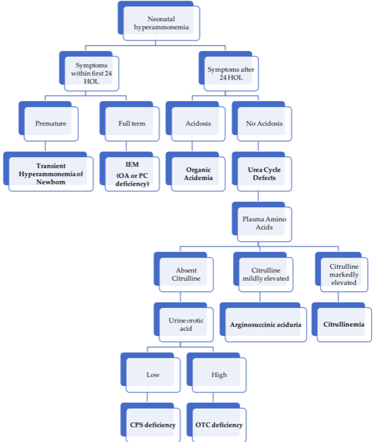
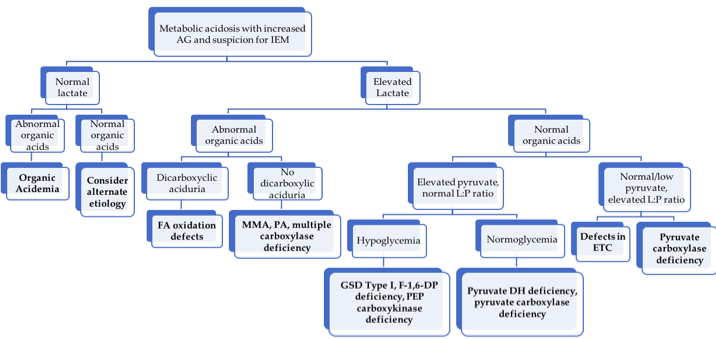
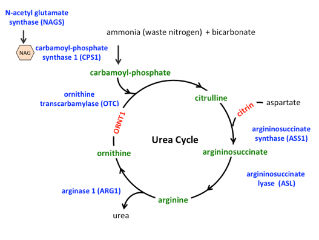

# Metabolism

## I think this might be metabolic...
* Page Metabolism!
* **Patient is in a metabolic crisis:** [see overviews](#metab-crisis) for specific crises (hyperammonemia, metabolic acidosis, etc.) 
* **Patient has a known diagnosis:**
	* Look for a **critical contingency plan** in Powerchart
		* Look for “Critical Contingency” on top blue bar
		* Hover over this to see what date contingency note was created
		* Find this note in documents
	* In the ED, find the relevant orderset in **ED Metabolism Plan**
	* On admission, select the relevant **Admit Plan**
	* Clinic notes or the family may have a "sick day plan"
	* Acute Illness Protocols <https://newenglandconsortium.org/for-professionals/acute-illness-protocols/>
* **Patient has no known diagnosis:** [see "Differential diagnosis by clinical manifestations"](#metab-ddx)
* **Patient has an abnormal NBS result:**
	* [ACT sheets](https://www.acmg.net/ACMG/Medical-Genetics-Practice-Resources/ACT_Sheets_and_Algorithms.aspx)
	* Info for families: <https://www.newbornscreening.info/>, <https://nensp.umassmed.edu>

## Management of Metabolic Crises
### General Principles

0. Consult metabolism!
1. ABCs: address any need for airway protection, intubation, mechanical ventilation, rehydration, inotropic support
2. Identify the trigger: underlying illness vs dehydration vs incorrect diet - will help metabolism guide management 
3. Consider alternate dx: electrolyte imbalance, sepsis 
4. Established dx: acute illness protocols above, family should have home / ED illness protocol

> **Bill's Pearls:** Think about the underlying metabolic ***state*** of the patient!  
> 
> The catabolic state precipitates most problems in decompensating metabolic diseases, anabolic support is focused on giving calories to stimulate insulin secretion and signaling. If someone is really sick and they are hyperglycemic (BG > 250 mg/dL), it would be better to give insulin than to cut the dextrose because the insulin will increase the anabolic support. If you have elevated beta-hydroxybutyrate (blood) or acetoacetate(urine) then you are in a catabolic state and at risk.  
> 
> Similarly, don't be falsely reassured by correcting lab values. For instance, you can easily correct hypoglycemia, but the patient could still be catabolic and/or depleted of stores from their illness. They may still decompensate rapidly after therapy is weaned off.

### Acute Metabolic Encephalopathy
#### Definition
Acute global cerebral dysfunction → altered mentation w/ or w/o seizures NOT due to primary structural brain disease (e.g., tumor or hemorrhage) or infection (though some IEMs may cause strokes)

#### Etiologies 
Hyperammonemia, metabolic acidosis-hyperlactatemia or ketosis, hypoglycemia, recurrent seizures (‘excitotoxic’ damage), specific toxins, e.g., copper deposition in Wilson’s, electrolyte imbalances

#### Presentation
* May be precipitated by high protein intake, catabolic state (fever/illness/GIB/fast)
* Presents w/ lethargy, AMS, seizures, tachypnea 2/2 metabolic acidosis or central stimulation by inc NH3
* Do NOT rule out IEMs even if: functional neuro disorder, presentation @ older age, sudden onset, no PMHx

#### Management
* Reverse catabolism ASAP and prevent sequelae, do frequent neuro checks
* **Hydration:** 10 mL/kg NS bolus if dehydrated, then D10 NS + 20 mEq/L of KCl (add after ruling out hyperkalemia or after voiding) @ 1-1.5x M, avoid hyponatremia (predisposes to cerebral edema; minimum of 4-5 meq/kg/day of sodium in fluids)
* **Nutrition:** give calories via carbs + IL alone (unless FA ox d/o is on ddx, then no IL) to provide 1-1.5x TEE (120-150 kcal/kg/day), preferably enteral nutrition (enteral carbs → portal vein → maximize insulin release); can give TPN if enteral feeds are not tolerated, start protein w/in 48h 
* **Promote anabolism:** nutrition, ↓ counter-regulatory hormones → ensure adequate volume, ondansetron for vomiting if not at risk of long QT, treat infxn/fever/pain, correct hypoglycemia (bolus of 2 or 5 mL of 25 or 10% Dextrose → rule of 50 (i.e., vol*%dex = 50), then infusion to maintain a GIR of 8-12 mg/kg/min [GIR in mg/kg/min = dextrose% x Vol (ml/kg/day) / 144]), maintain normoglycemia if needed with insulin @ 0.1mcg/kg/hr, titrating to maintain glucose between 100-120mg/dL (goal of high GIR = get glucose (i.e., calories), into the cells rather than add to Sosm by causing hyperglycemia), wean GIR slowly to prevent rebound hypoglycemia
* **Cofactor therapy:** try the vitamins below even empirically, but esp if these disorders are on ddx

| **Suspected Enzyme Deficiency**| **Cofactor** |
|:---|:---|
|Propionyl-CoA carboxylase, Beta-methylcrotonyl-CoA carboxylase, Holocarboxylase synthase, Pyruvate carboxylase, Biotinidase deficiency | Biotin (dose depends on disorder) |
| Methylmalonyl-CoA mutase | Hydroxycobalamin 1 mg/day IM |
| BCAA DH (MSUD), Pyruvate DH, Alpha-ketoglutarate DH | Thiamine (B1) 100 mg/day |
| GAII (Multiple acyl-CoA DH) | Riboflavin (B2) 200 mg/day |

* **L-carnitine:** inc urinary excretion of carnitine-bound organic acids → secondary deficiency; carnitine is neuroprotective and non-toxic, give 100mg/kg/day, max 6 g/d, 1st via IV bolus of daily dose, then divide q4-6h, IV or enteral; carnitine controversial in FAOD 
* **Toxin removal:** CVVH ideal; can consider PLEX or peritoneal dialysis in neonates (less effective); extracorporeal toxin removal if severe 
* **Specific rx:** Address underlying acidosis, hyperammonemia (scavengers), metabolic pathway block

#### Risks of therapy
* *Overhydration*
* *cerebral edema / herniation* (may need ventilation + other modes to control ICP while maintaining cerebral perfusion w/ mannitol, hypothermia)
* protein malnutrition (if no protein >48h)

### Hyperammonemia
**PowerPlan:** Metabolism Hyperammonemia Admit Orderset

#### Definition
Normal ammonia levels vary w/ prematurity, age, and catabolic state; usu 15-35 μmol/L (up to 100 μmol/L in neonates), nl <50 μmol/L. Most IEMs >500, while ↑ NH3 in liver failure, sepsis usually <500

#### Underlying differential diagnosis
UCDs (OTC most common), hyperammonemia-hyperornithine-hypercitrulline (HHH) syndrome, organic acidemias (PA, IVA, MMA), FAODs (MCAD, LCAD, LCHAD), systemic carnitine deficiency, PC deficiency, THAN (esp in preemies), liver failure from any cause, VPA toxicity, infection with urease-positive organism (e.g., Proteus, H pylori), post-transplant idiopathic HA, porto-systemic shunt

#### Pathophysiology
Inc NH3 in brain → astrocytes turn NH3 into Gln → inc intracellular osmolality → cerebral edema. 
NH3 inhibits α-KG DH → TCA cycle blocked → pyruvate ⇒ lactate, α-KG ⇒ Glu → excitotox/sz → cerebral edema, possible herniation. **Even brief periods of hyperammonemia in infants** may have chronic sequelae 

#### Presentation
Headaches, irritability, nausea/vomiting, Lethargy/delirium → coma, sz, opisthotonic posturing; central hyperventilation/resp alkalosis; cerebral edema → inc ICP → HTN + bradycardia, CN VI palsy, encephalopathy

#### Workup
**free-flowing** sample in Na heparin tube w/o tourniquet, send to lab **on ice STAT** w/ chem 10, VBG, CBC/diff, plasma AAs, urine OAs, repeat NH3 at least q6-8h alongside daily chem and others PRN

#### Management
* General measures/ABCs as above.
* Stop protein intake: start hydration and nutrition as described above for goal GIR of 10-12 mg/kg/min, aiming to provide 120-150 kcal/kg/day
* Give ammonia scavengers: 
	* Ammunol (sodium benzoate + sodium phenylacetate; ordered by metabolism)

	* May also add Arginine HCl - avoid in Arginase deficiency, central access only
	* Give one dose as bolus over 90 minutes, then second dose over 24 hours
* Consider dialysis for NH3 in critical cases (preferably ECMO-based, requiring NICU transfer)
Reintroduce protein w/in 48h to prevent endogenous protein from breaking down

#### Approach to hyperammonemia in neonates

### Metabolic Acidosis d/t suspected IEM

**PowerPlan:** Metabolism Lactic or Metabolic Acidosis NOS Admit Plan

#### Definition
Arterial blood gas with pH < 7.35, pCO2 < 35, bicarbonate < 22

#### Etiologies 
Inherited: organic acidurias, primary lactic acidemias, renal tubular acidosis; ANY metabolic crisis, if left untreated long enough, will progress to metabolic acidosis 

#### Presentation
Acute vomiting, dehydration, lethargy, and rapid, shallow breathing, often h/o protein load

#### Physical Exam
* **Organic acidurias:** limb hypertonia/axial hypotonia, large amplitude tremor, myoclonic jerks, pedaling, sustained paraspinal contraction (opisthotonic posturing) 
* **RTA:** Failure to thrive, polyuria, and rachitic changes
* **PDH deficiency:** blindness, hypotonia, DD, narrow forehead, frontal bossing, wide nasal bridge, long philtrum, and anteverted nostrils 

#### Management
* Work-up as per flow-chart above; also check ketones as a marker for catabolism
* Hydration, caloric intake of 120-140kcal/kg/day, stop proteins initially (esp stop all BCAAs if MSUD is suspected), maintain glucose 100-150 (using high GIR +/- insulin), avoid hypoNa, cerebral edema
* If serum bicarb < 14 meq/L and pH < 7.2, give IV bolus NaHCO3 as 2.5 meq/kg over 30 minutes, then 2.5 meq/kg/day until serum bicarbonate is 24-28 meq/L
* HD = last resort but may be lifesaving in severe refractory cases (especially neonates)

### Seizures d/t suspected IEM
#### Etiology
Alteration of intracellular **osmolality**, depletion of substrates needed for **cellular metabolism** or membrane function, and/or intracellular accumulation of **toxic substances** 

#### Underlying differential diagnosis
DDx of ‘seizures in a newborn’ is large, including many IEMs with poor prognosis. Rare but potentially treatable etiologies:

* **pyridoxine responsive seizures**
* **folinic acid responsive seizures**
* serine responsive 3-phosphoglycerate DH deficiency
* sz from **hypoglycemia**
* **biotin responsive** holocarboxylase synthetase deficiency
* biotinidase deficiency

#### Management
* **See neurology section for treatment of status epilepticus**
* avoid AEDs that block mitochondrial fxn (VPA, chloral hydrate) - c/s fosphenytoin, BZDs, and/or levetiracetam
* Correct fever, electrolyte issues, acidosis, hypoglycemia
* If refractory, c/s empiric pyridoxine (100-200 mg IV x1), folinic acid (2.5-5 mg PO once daily), L-serine (200-600 mg/kg/d div 6x/day), or biotin (5-20 mg PO once daily)

### Ketotic Hypoglycemia

*For broader approach to Hypoglycemia, see the [Endocrine chapter](#endocrine_chapter).*

**PowerPlan:** Metabolism Hypoglycemia Admit Plan

#### Definition

BG < 60 mg/dL, elevated BOHB, likely acidosis  
Gluconeogenic amino acid levels are low on plasma AA analysis

Distinguish from hypoglycemia with:  

* lactic acidosis (possible carbohydrate metabolism defect)  
* no acidosis but elevated FFA (possible FAOD)
* no acidosis or FFA (likely endocrine-mediated)

#### Etiology

Failure of the catabolic state to maintain euglycemia, typically i/s/o trigger. Glycogen stores are typically depleted (no response from glucagon)

#### Presentation
Very common in children 16 months to 3 years, usually gone by ages 10-12. Possibly related to factors that improve with age (increased muscle mass, decreasing GIR need, decreased head to body size).  

#### Physical exam
* Look for skin darkening or other signs of adrenocortical insufficiency
* Enlarged liver (Hepatic glycogen storage disease)

#### Management
* Promote anabolic state (not just correct the blood glucose)
* Start children on D10 containing fluids at 1.5x maintenance rate until they demonstrate the ability to take substantial calories by mouth
* Do not discharge catabolic state reversed (e.g. taking very good PO, ketones clearing, hepatic stores repleting)

### Access in a metabolic crisis

Pay attention to access because it determines your ability to provide anabolic support and give scavengers.
 
**PIV:** dextrose up to D12.5, continuous ammonul, intralipids      
**G-Tube:** Metabolic formula to assist in detoxification, allows for highest calories/volume, avoid use if vomiting  
**CVL/Port:** Ammonul w/ arginine bolus, high concentration dextrose  
 
**Common caloric values for fluids:**  

| Fluid | Calories (kcal/mL) |  
|---|---|
| **D5** | 0.17 |
| **D10** | 0.34 |
| **D12.5** | 0.425 |
| **Intralipid** | 2.0 |
| **Metabolic formula** (30 kcal/oz) | 1.0 |
| **Pedialyte** | 0.105 |

## Differential Diagnosis by Clinical Manifestations

### Presenting in *Neonatal period* or *early infancy*

#### History
Consanguinity (increased inc of AR disorders), ethnicity (e.g., tyrosinemia in French-Canadians of Quebec), SIDS or intellectual disability in family (all from possible undiagnosed IEMs), relation of symptom to introduction of new food, NBS results

#### Presentation
* Acute and severe, simulating sepsis (lethargy, vomiting, tachypnea, seizures, poor perfusion) 
	* classically ex FT, prev healthy, deterioration despite support, usu neg sepsis workup
	* d/t deficiency of a product or excess of toxic substrate, so called “intoxications” - organic acidemias, aminoacidopathies, and UCDs
	* First presentation may be unmasked by a concurrent illness
* Indolent w/ early and persistent neurological deterioration 
	* nl pregnancy, no interim healthy pd, d/t energy def: mitochondrial + peroxisomal disorders 

<!-- table start col_level=5 row_level=None-->
##### Encephalopathy
* MSUD
* MMA
* PA
* IVA
* MCD
* UCD

##### Seizures
* B6 responsive seizures
* MCD (biotin)
* Folinic acid responsive
* GLUT1
* 3PGD

##### Hepatic
* Galactosemia
* Fructosemia
* Tyrosinemia
* Bile acid synthesis defects
* Glycosylation defects Ib
* LCHAD

##### Cardiomyopathy
* LC-FAOD 
* Pompes	

##### Hypoglycemia 
* GSD
* FAOD
* Primary hyperinsulinemia

<!-- table end -->

#### Physical exam
* Usually non-specific--hepatomegaly and HD instability may be only signs in a crisis
* Dysmorphisms and other findings may be seen in specific cases:

| **Dysmorphisms**| |
|:---|---|
| Peroxisomal disorders (e.g. Zellweger) | Trisomy 21 like facies |
| Pyruvate dehydrogenase deficiency | FAS like facies |
| Lysosomal disorders (I cell disease) | Hurler-like coarse facies |
| Glycosylation defects | Inverted nipples, fat pads/lipodystrophy |
| **Hydrops** |  |
| Storage disorders | Mucopolysaccharidosis, Niemann-Pick |
| Disorders affecting erythropoiesis | G6PD deficiency, pyruvate kinase deficiency |
| Disorders affecting liver | Neonatal hemochromatosis, galactosemia |
| **Skin and hair manifestations** |  |
| Acrodermatitis enteropathica (Zn def) | Vesiculobullous/eczematoid lesions on perioral/perineal areas |
| Hartnup | Pellagra like features |
| PKU | Blonde, fair, blue eyes |
| Congenital Erythropoetic Porphyrias | Photosensitivity with vesiculobullous lesions and scarring |
| Biotinidase deficiency | Rash and alopecia |
| Menkes syndrome (Cu dysreg) | Pilli torti (fragile, kinky hair), sagging skin |
| **Cataracts** | Lowe, galactosemia, Zellweger and variants |
| **Hepatomegaly** | Galactosemia, hereditary fructose intolerance, GSD type Ia & III, LCHAD, Tyrosinemia, hemochromatosis, Zellweger, Lysosomal storage disease |

#### Initial lab workup
Consider the following tests based on your above history and physical:  

| Lab test | Common associations |
|---|---|
| VBG + chem 10 | Acidosis and increased anion gap in organic acidemias |
| Blood glucose | Hypoglycemia in FAOD, glycogenolysis and glycosylation defects |
| LFTs and coags | Jaundice/hepatitis in tyrosinemia, galactosemia, hemochromatosis |
| Plasma ammonia | Increased in urea cycle defects and organic acidemias |
| Plasma lactate (L), pyruvate (P), and ketoacids (3OHB, AcAc)  | Some IEMs have pathognomonic L/P or 3OHB/AcAc ratios  |
| CBC w/diff | Neutropenia and thrombocytopenia with IVA, MMA, PA; neutropenia in GSD Ib |
| Blood Culture | Galactosemia a/w increased incidence of E. coli sepsis.  |
| Urine pH | >5 in setting of acidosis suggests distal RTA. |
| Urine (non-glucose) reducing substances | Suggestive of galactosuria or fructosuria  |
| Urine ketones (if acidosis or hypoglycemia) | As with plasma ketoacids, although B-OHB may be easier to obtain from plasma in infants |

#### Secondary workup

In discussion with metabolism:

* **Urine:** Organic acids, acylglycines, mucopolysaccharides, oligosaccharides
* **Plasma:** AAs (quantitative), carnitine + acylcarnitine, Peroxisomal tests (VLCFA), bile acid analysis
* **CSF:** for amino acids (glycine), lactate, pyruvate, and neurotransmitters, glucose (with corresponding serum glucose 30 min before LP)
* **Imaging:** Brain MRI/MRS, HIDA scan for biliary atresia
* **Auditory + ophthalmologic evaluations**
* *In general pre-prandial samples should be sent for most tests (at least 2-4 hours after last feed)

>**Bill's Pearls:** Plasma AAs
>
>A plasma amino acid panel can tell you if you need to give protein or not, if you see deficiency in multiple amino acids. You can only restrict protein for 24-48 hours before an amino acid deficiency develops. When there is an AA deficiency, the catabolic state is less responsive to dextrose-based anabolic support. In addition to protein synthesis, amino acids have other synthetic and regulatory roles (methionine -> methylation of DNA, synthesis of creatine; leucine -> stimulator of insulin secretion; cysteine -> antioxidant; etc.) you may not otherwise think about.

### Later onset
***About 50% of patients with IEMs present beyond the immediate neonatal period (even as adults!)***

#### History
*Episodic illness* precipitated by mild intercurrent illness, fasting, or change of diet, specific dietary preferences (e.g., autovegetarianism seen in conditions predisposing to hyperammonemia), behavioral issues such as ADHD (partially treated PKU)

#### Presentation

Can be classified into 2 patterns which may overlap:

* Acute, presenting in a metabolic crisis w/ emesis, lethargy, seizures, tachypnea  
	* **Encephalopathy**	
		* **Without focal findings:** look for predominant acidosis, hyperammonemia or hypoglycemia & work up as outlined above
		* **With focal findings:** homocystinuria with thromboembolic event, mitochondrial disorders with CVA, biotin-responsive basal ganglia disease, some OA (striatal necrosis inorganic acidemias); cerebral edema in UCDs
	* **Recurrent ataxia:**	MSUD, OTC, pyruvate dehydrogenase (associated peripheral neuropathy)
	* **Psychiatric symptoms:**	UCD’s, porphyrias, homocystinuria, cobalamin C disease, late-onset Tay Sachs
	* **Dehydration** associated with:
		* **Polyuria:** RTA, nephrogenic Diabetes Insipidus
		* **Diarrhea:** glucose or galactose malabsorption, acrodermatitis enteropathica (Zn deficiency), sucrase isomaltase deficiency, congenital chloride diarrhea
		* **Ketoacidosis:** MMA, IVA, PA, DM
		* **Salt losing:** CAH, hypoaldosteronism
	* **Reye syndrome-like:** 	UCD’s and OA’s, disorders of mitochondrial fatty acid oxidation and ketogenesis

* **Indolent:** FTT, myopathies, neurological sequelae (DD, ID, micro/microcephaly), dysmorphisms

## Aminoacidopathies
> **Bill's Pearls:** high-level approach to Aminoacidopathies  
> 
> Amino acid concentrations that get excessively elevated can cause cerebral edema (e.g. leucine in MSUD, methionine in homocystinuria). Avoid excessive fluid administration if you think these states are present. The key is to provide metabolic formula that has caloric value and a mixture of amino acids that don’t include the toxic ones (i.e. branched-chain-free formula in MSUD). The goal is to make the toxic amino acid the limiting reagent in protein synthesis and to provide enough calories to stimulate protein synthesis. You don’t get the same effect with dextrose-containing fluids and end up giving more volume.

**PowerPlan if relevant:** Metabolism MSUD Admit Orderset

#### Biochemical defect
Defect in AA metabolism → toxic AA metabolites accumulate

#### Presentation
* May present early (neonatal period) as catastrophic ‘intoxication’-like disease → feeding difficulty, lethargy, tachypnea, and poor perfusion → encephalopathy (e.g., MSUD)
* May present later w/ chronic encephalopathy (e.g., PKU)
* Often NO acidosis or hyperammonemia (vs organic acidemias and UCDs) 

#### Workup
* Definitive: quant plasma AAs + sequencing
* May be suggested by NBS, labs w/ hypoglycemia, ketosis, liver dysfxn

#### Management (general approach)
* Restrict culprit AA in diet, monitor plasma AAs carefully
* **Avoid catabolism:** may be with dextrose-containing fluids and/or AA-excluding formulas (encourage new protein synthesis with toxic AA as limiting reagent)
* Cofactor therapy in some cases

| Disorder | Enzyme Blockade | Accumulated Substrate(s) | Presentation | Treatment |
|---|---|---|---|---|
| **Phenylketonuria** | Phenylalanine hydroxylase (Phe → Tyr) | Phenylalanine | Neurotoxicity, intellectual deficits, microcephaly, GDD, eczema | Avoid Phe, give special Phe-free diet, consider cofactor tx (sapropterin), enzyme substitution (adults) | 
| **Maple Syrup Urine Disease** | Branched-chain alpha-keto acid dehydrogenase | BCAAs: Leu, Ile, Val, Leu is neurotoxic, causes hypoNa | Catabolic stress, high Leu intake → HA, confusion, halluc, lethargy, N/V → coma/death | Stop all Leu, give Leu-free feeds, dex-containing IVF, AVOID hypotonic fluids (cerebral edema) | 
| **Homocystinuria** | Cystathionine β-synthase (Hcy → cystathionone) | Homocysteine (chronic toxicity), **Methionine (potentially acute cerebral edema)** | Intellectual disability, tall stature, thrombosis (Hcy is thrombophilic), downward lens dislocation, osteoporosis | Met-free formula, B6 (cofactor for cystathionine β-synthase) in responsive patients, betaine (Hcy → Met), risk of cerebral edema with rapid methionine correction | 
| **Tyrosinemia**	 | Fumaryl- acetoacetase (fumaroaceto-acetate, → fumarate + acetoacetate) | Tyrosine (blood), Succinylacetone (urine) | Liver failure, RTA - due to accumulation of succinylacetone | 	Nitisinone (blocks early step in Tyr metab - can’t make succinylacetone), Tyr restriction | 

## Carbohydrate Metabolism Defects

**PowerPlan if relevant:** Galactosemia Admit Orderset

#### Biochemical defect
Issues with glucose/fructose/galactose metabolism

#### Presentation
* Timing depends on intro to culprit carb (**galactosemia early** d/t breastmilk, **fructose introduced later**) and from timing of spacing feeds (**longer fasting** = need to mobilize glycogen stores → **GSD becomes manifest**)
* Often p/w metabolic crises (lethargy, encephalopathy, HD instability); may have stigmata of toxic deposition (see chart below)

#### Workup
* **NBS:** Galactosemia (NOT hereditary fructosuria or GSD)
* Definitive with enzyme assays from blood (also done on cultured fibroblasts & liver)
* Suggestive labs: hypoglycemia, ketosis, metabolic acidosis, liver dysfunction; reducing substances in urine present in galactosemia + hereditary fructose intolerance   

#### Management (general approach)

* Dietary avoidance of the given carbohydrate
* Some hepatic glycogen storage diseases are associated with hypoglycemia (I, III, IV, IX, 0). For sick children that need dextrose-containing fluids, the goal is to keep BG > 77 but below 110. In excess of that, glycogen starts to be stored and can worsen existing accumulation.

| Disorder | Enzyme Blockade | Accumulated Substrate(s) | Presentation | Treatment | 
|---|---|---|---|---|
| **Classic Galactosemia** | Galactose-1- phosphate uridyl transferase (allows for transfer of Gal-1-P to Glu-1-P) | Gal-1-P, total galactose  + urine reducing substances | Hepatomegaly, jaundice, vomiting, cataracts, FTT, lethargy, proximal RTA (Fanconi syndrome), E Coli sepsis after starting galactose-containing feeds (e.g., breastmilk) | No galactose - includes no lactose (milk / dairy) | 
| **Hereditary Fructose Intolerance** | Aldolase B (splits F-1-P into DHAP + glyceraldehyde) | F-1-P - urine reducing substances | Similar to classic galactosemia, but no cataracts; occurs w/ fructose-containing foods | No fructose from diet - includes no sucrose or sorbitol | 
| **Glycogen Storage Disease (GSD) Type Ia (von Gierke)** | Glucose 6 phosphatase (G6P → glucose + Pi, last step of glycogen breakdown) | G6P → lactate, triglycerides, and uric acid | ~3-6 months: hypoglycemia 3-4 hrs after meal, lactic acidosis, hepatomegaly, hypertriglyceridemia, hyperuricemia, “doll face,” small size | Frequent meals, Uncooked cornstarch 1.5-2.5 g/kg PO q4-6h, avoid sucrose/fructose/galactose, NaHCO3 for acidosis, allopurinol for hyperuricemia | 
| **GSD Type IIa (Pompe)** | Lysosomal acid α-glucosidase | Glycogen - accumulates in skeletal and cardiac muscles | Progressive hypotonia, macroglossia, loss of motor, respiratory, and cardiac functions (**cardiomyopathy**). Pilot optional test on NBS | ERT (alglucosidase alfa), management of cardiomyopathy | 
| **GSD Type IIIa & IIIb (Cori)** | Debranching enzyme | Glycogen - accumulates in liver and muscle | Similar to Ia but may be milder; IIIb causes neutropenia | Uncooked cornstarch + continuous feeds to maintain normoglycemia, high-protein diet  | 
| **GSD Type V (McArdle)** | Muscle phosphorylase | Glycogen - accumulates in muscle | Exercise intolerance / cramping, “second wind” phenomenon, myoglobinuria/ rhabdomyolysis | Carbohydrate administration before exercise, high-protein diet | 

## Fatty Acid Oxidation Disorders

**PowerPlans if relevant:** Metabolism Fatty Acid Ox Disorder NOS Admit Orderset, LCFAOD Admit Orderset

#### Biochemical defect 
Mitochondrial FA oxidation (AKA β-oxidation) = main energy (FADH2 / NADH for **gluconeogenesis** and **ketogenesis**) for **heart, skeletal muscle, neurons** when Glucose is limited (starvation, exercise). Disorders occur d/t decreased carnitine uptake by cells (required for FA transport into the mitochondria), inhibiting entry of FAs into mitochondria, or by blocking β-oxidation. End result = energy-deficient state **without appropriate ketosis**.

#### Presentation
Fasting-induced vomiting, lethargy, coma, and hypoglycemic seizures, occasional hepatomegaly (may be Reye's-like)

#### Workup
Suggested by **hypoketotic hypoglycemia** +/- liver failure, acidosis & hyperammonemia. Acylcarnitine profile with specific findings. Confirmation w/ DNA mutation analysis (less frequently enzyme testing in cultured skin fibroblasts)

| Disorder | Enzyme Blockade | Accumulated Substrate(s) | Presentation | Treatment | 
|---|---|---|---|---|
| **Medium-chain acyl-CoA DH deficiency** | MCAD -- cannot degrade MC FAs to short-chain FAs and Acetyl CoA | C6, C8, and C10 acylcarnitines | Illness + poor PO → glycogen depletion → HKHG →  brain injury, seizures, & death if untreated; excellent prognosis if treated. **On NBS in most states, but may present on DOL 2-3** | Avoid fasting during illnesses, give dex-containing IVF if unable to tolerate PO, carnitine supplementation if low carnitine, **AVOID MCT** | 
| **Long-chain / Very long-chain acyl-CoA DH deficiency** | LCHAD/VLCAD | **LCHAD/TFP:** 3-hydroxy-acyl-carnitines (C16-OH) **VLCAD:**  unsat long-chain acylcarnitines (C14:1) | More severe than MCAD -- rhabdo, CMP, liver failure, and HKHG even w/ rx. LCHAD may have peripheral neuropathy + retinopathy. On NBS in all states | Dietary fat restriction, MCT oil supplementation, avoid fasting; give dex-containing IVF, Serial cardiac evaluations, check CK with illnesses | 
| **Primary Carnitine Deficiency** | Defective carnitine transporter (OCTN2) -- dec GI  absorption / renal reabs. | Elevated urine carnitine, low blood carnitine | CMP + recurrent HKHG, may progress to Reye-like picture. **Blood:** low free carnitine. **Urine:** elevated carnitine excretion | High-dose oral carnitine, avoidance of fasting, dex-containing IVF if unable to tolerate PO |

## Lysosomal Diseases
#### Biochemical defect
Deficiency in lysosomal enzyme → excess intracellular substrate (e.g., GAGs, MPS) 

#### Presentation
* Substrate build-up → HSM, coarse facies, short stature, skeletal abnormalities
* If nervous system involvement → intellectual disability, cataracts, neuropathy 

#### Workup
**Enzyme assay** on samples of WBCs, serum, or skin fibroblasts

| Disorder | Enzyme Blockade | Accumulated Substrate(s) | Presentation | Treatment | 
|---|---|---|---|---|
|**Gaucher Disease** | β-glucosidase  (glucocerebrosidase) | Glucocerebroside | Type 1:HSM, bone disease, anemia & thrombocytopenia, absence of CNS disease Type 2&3: Primarily neurologic with DD, regression, early death | ERT, substrate reduction therapy | 
| **Tay-Sachs Disease** | Hexosaminidase A | GM2 gangliosides | By age 1 - DD, exaggerated startle, sz, macular cherry-red spot | Supportive | 
| **Niemann-Pick Disease** | Sphingomyelinase | Sphingomyelin | Massive HSM, cherry red spot, interstitial lung disease; neuronopathic or non-neuronopathic | HSCT for non- neuronopathic | 
| **Krabbe Disease** | Galactocerebrosidase | Galactocerebroside | Infantile-onset:By age 1 - irritability, rapid neurologic deterioration,early childhood death. Later-onset: variable | Early HSCT | 
| **Metachromatic Leukodystrophy** | Cerebroside sulfatase (arylsulfatase A) | Sulfatides | First years of life (late infantile form): DD/regression; Juvenile form with regression, of dev and beh, then gait; Peripheral neuropathy in adult form | HSCT for juvenile and adult MLD | 
| **Fabry Disease** | α-galactosidase | Globotriaosyl- ceramide (GL-3) | X-linked recessive. Acroparesthesias, pain crises, corneal opacities, fatigue, angiokeratomas | ERT | 
| **Hurler Syndrome (MPS I)** | α-L-iduronidase | Glycosamino- glycans (GAGs):  dermatan + heparan sulfate | Coarse facies, DD, ID, corneal clouding, hearing loss, hernias, dysostosis multiplex | ERT, HSCT | 
| **Hunter Syndrome (MPS II)** | Iduronate-2-sulfatase | GAGs as above | X-linked recessive. Similar to MPSI r w/o corneal clouding. | ERT, HSCT
*ERT = enzyme-replacement therapy. HSCT = hematopoietic stem-cell transplant. Autosomal recessive unless otherwise specified*

## Mitochondrial Disorders / Primary Lactic Acidemias

>**Bill's Pearls:** high-level approach to Mitochondrial disorders
>
>Mitochondrial diseases don’t decompensate acutely like small molecule metabolic diseases. Therapy is focused on decreasing systemic stressors (treat infection, stop catabolism, correct dehydration, etc). Try to **keep the bicarbonate > 16**, otherwise acidemia will impair mitochondrial function. The lactate levels will be what they are -- just keep the bicarbonate up and don’t give too much dextrose (D5 ok, D10 negotiable). **Don’t give valproic acid or Lactated Ringers.** Lactate gets the attention but cardiac dysfunction in acute scenarios is the concern. Cardiac cells that have poor mitochondrial function typically hypertrophy, leading to hypertrophic cardiomyopathy and some preload dependence. You are never wrong to get an EKG and call cardiology. Correct dehydration to minimize perfusion-associated lactic acidemia. 
>
>If you think someone may have a mitochondrial disease, get a plasma amino acid level with a lactate. Look for elevated alanine as well, because of the high error associated with lactate due to blood draws. True metabolic acidemia should have an anion gap and acidic urine. 

#### Biochemical defect
Disorders of **Krebs cycle** and **oxidative phosphorylation**; transmission via mitochondrial genes → defects vary / not all organs are affected equally

#### Presentation
Indolent, progressive neurologic deterioration, +/- poor feeding, vomiting, CMP, myopathy, liver failure, seizures, strokes, blindness, deafness, and nephropathy

#### Workup
* Definitive dx from enzyme assay or DNA testing
* Labs often show **AG metabolic acidosis** and **primary lactic acidosis** +/- hypoglycemia w/ ketosis, liver dysfxn

| Disorder | Enzyme Blockade | Accumulated Substrate(s) | Presentation | Treatment | 
|---|---|---|---|---|
|**Pyruvate Dehydrogenase Complex Deficiency** | Pyruvate dehydrogenase (Pyruvate → Acetyl CoA + CO2) | Pyruvate →  lactate | Lactic acidosis, intellectual disability, hypotonia, seizures, exacerbated by ingestion of carbohydrates | Supplement with carnitine, thiamine, and lipoic acid (cofactors for pyruvate DH complex), high fat / low carb diet or ketogenic diet | 
| **Pyruvate Carboxylase Deficiency** | Pyruvate carboxylase (pyruvate + CO2 → oxaloacetate) | Pyruvate → lactate | NH3 (as Asp cannot be formed from OAA)	Severe lactic acidosis, hypothermia, hypotonia, hypoglycemia, hyperammonemia, lethargy, vomiting, often death as neonate or w/in 1 year for Type B; Types A & C are milder | High carb and protein diet; Treat metabolic crisis with 10% dex-containing IVF, avoid fasting, NaHCO3 for acidosis, possible liver transplant | 

## Organic Acidemias
**Powerplans if relevant:** Metabolism IVA, MMA, PA, Glutaric Acidemia Type I Admit Ordersets

#### Biochemical defect
Defect in AA breakdown → accumulation of organic acid byproducts

#### Presentation
Neonatal lethargy, poor perfusion, vomiting, coma, CVAs, death

#### Workup
* **Definitive:** quant plasma AAs
* Often on NBS (elevated C3 / C5 acylcarnitines)
* Usually p/w severe high **AG metabolic acidosis**, +/- hyperammonemia, hypoglycemia, liver dysfunction, ketosis, and secondary carnitine deficiency

#### Management (general approach)
Stop all protein intake, high-dose carnitine, promote anabolism with D10NS + IL +/- insulin, +/- NaHCO3 for severe acidosis, dialysis for life-threatening acidosis or hyperammonemia

| Disorder | Enzyme Blockade | Accumulated Substrate(s) | Presentation | Treatment | 
|---|---|---|---|---|
| **Methylmalonic acidemia** | methylmalonyl-CoA mutase deficiency (MM-CoA → succinyl CoA)  | Products of BCAAs (Ile, Val, Met) - MMA, methylcitrate, C3 acylcarnitine | Stressor (illness, excess protein intake) → metabolic crisis (high-AG metabolic acidosis, basal ganglia stroke, pancreatitis). Complications: renal dz, intellectual disability. Variable age of onset. | As above, plus Vitamin B12, liver or liver/kidney transplantation, avoid Ile, Val, Met, Thr in diet | 
| **Propionic acidemia** | propionyl-CoA carboxylase deficiency (propionyl CoA → MM-CoA) | Products of BCAAs (Ile, Val, Met) - 3-OH propionic acid, methylcitrate, C3 acylcarnitine | Newborn period - profound metabolic acidosis w/ high AG and prominent ketosis → multiorgan dysfunction (cardiac, respiratory, pancytopenia, basal ganglia stroke, pancreatitis), hyperammonemia. Later - cardiomyopathy and dysrhythmias in early adulthood | As above, plus liver transplant, avoid Ile, Val, Met, Thr in diet. **Acutely,** anabolic support, increase carnitine to protect mito from organic acids. Consider bowel regimen (stool can harbor toxic intermediates). | 
| **Isovaleric acidemia** | isovaleryl-CoA dehydrogenase (isovaleryl-CoA → → acetoacetate and Ac-CoA) | Products of Leu metabolism (Isovaleric acid and metabolites), C5 acylcarnitine | Neonatal: severe lethargy and obtundation, +AG metabolic acidosis, hypoglycemia, ketonuria, hyperammonemia, odor of IVA in urine, pancreatitis. Infantile/late-onset: FTT, DD, seizures | As above, avoid Leu |
| **Glutaric acidemia type I (GA1)** | Glutaryl CoA DH deficiency | Products of Trp and Lys metab (plasma C5 dicarboxylic (C5DC) acylcarnitine) | Macrocephaly (risk of tearing of bridging veins → subdural hemorrhage), **metabolic basal ganglia stroke** (unlikely after 6y), isolated cerebral acidosis -- may not have metabolic acidosis/ketosis/hyperammonemia. **Catabolic stress, fever** → devastating neurologic injury (dystonia, movement disorders).  | As above, restrict Trp and Lys in diet, aggressive sick day management. Start D10 at 1.5x mIVF regardless of appearance. If controlled during childhood, outcomes excellent. | 

## Peroxisomal Disorders

#### Biochemical defect
Peroxisomes = site for β-ox of VLCFAs, H2O2 degradation, and pipecolic, phytanic, and pristanic acid metabolism, also of bile acid synthesis, plasmalogen formation (for membranes and myelin).

#### Presentation
Dysmorphic facies (as below) alongside shortened proximal limbs, epiphyseal stippling, hypotonia, seizures, encephalopathy, cataracts, retinopathy, hepatomegaly, and cholestasis.

#### Workup
Elevated levels of substrate in question (see below), enzyme assays

| Disorder | Enzyme Blockade | Accumulated Substrate(s) | Presentation | Treatment | 
|---|---|---|---|---|
| Zellweger Syndrome | Several peroxisomal genes; often PEX1 | VLCFAs and branched- chain FAs | Early neuromotor arrest, seizures, ID, craniofacial anomalies (large fontanel, midface hypoplasia, short pf, incr. neck fat),chondrodysplasia punctata (calcification of cartilage), renal cysts, liver failure - cerebrohepatorenal syndrome, death w/in 1 yr | Supportive care only; no disease-modifying rx | 
| Refsum Disease | Defective phytanoyl-CoA -hydroxylase | Phytanic acid | Later onset (adolescence / adulthood) of ataxia, retinitis pigmentosa, ichthyosis, cataracts/night blindness, anosmia, and hearing loss | Restrict phytanic acid intake (found in dairy, beef, lamb, seafood. Cardiac & ophtho surveillance | 
| Adrenoleukodystrophy | ABCD1 gene - issues shuttling VLCFAs in to peroxisomes  | VLCFAs | X-linked recessive. Seizures, intellectual disability, neuromotor arrest, adrenal insufficiency, hypogonadism, beginning with behavioral changes around age 4-10. | Lorenzo’s oil (special preparation of FAs)-NOT PROVEN. Treat adrenal disease. HSCT | 

## Urea Cycle Defects

**PowerPlans:** Several, including for known defects and unknown; search “metabolism urea” in PC for full list

#### Biochemical defect
Deficiency in any of the 6 UC enzymes, which converting toxic nitrogenous metabolites from protein turnover to non-toxic urea for urinary excretion → NH3 accumulation.

#### Presentation
Interim healthy period → **catabolic stressor** (stress, infection, surgery, or starvation) → vomiting, feeding intolerance, tachypnea (due to central hyperventilation) → encephalopathy and coma, with potentially irreversible brain damage if untreated. 

#### Workup
* Labs w/ hyperammonemia and respiratory alkalosis → metabolic acidosis
* Definitive: plasma/urine levels of UCD metabolites and confirm with enzyme testing

#### Management (general approach)

> **Bill's Pearls:** UCD management
> 
> Children often look better than their ammonia level. _Start anabolic support when they get to the ED!_ If they don’t have access, then get it as fast as you can. If they are not vomiting, protein-free formula run continuously through a G-tube provides more calories than IV fluid and is faster to get going.

* **Acutely:** immediate treatment of hyperammonemia (see full details in Metabolic crisis management section): Stop all protein intake (but no longer than 36-48h), give dex-containing IVF (10-25% @ 1.5xM) and IL (1-3 g/kg/d) through central line, NH3 scavengers (Ammonul = Na benzoate and Na phenylacetate) usually with IV arginine, avoid hypoNa (would exacerbate cerebral edema), prepare for HD (likely if NH3 > 300 μmol/L)
* **Long term:** Low-protein diet, avoid catabolism, include missing UC intermediates, liver transplant

| Disorder | Enzyme Blockade | Accumulated Substrate(s) | Presentation | Treatment | 
|---|---|---|---|---|
| **Ornithine Transcarbamylase Deficiency** | OTC (carbamoyl phosphate + ornithine → citrulline) - most common| NH3 → cerebral edema. Glutamine elevation. Low arginine and citrulline as cycle is blocked proximally. Elevated **orotic acid** in urine | X-linked recessive. **Hyperammonemic crisis**, typically early on, p/w poor feeding, lethargy, tachypnea, hypothermia, irritability, vomiting, ataxia, seizures, hepatomegaly, coma. **NOT** always evident on NBS, may flag for low citrulline | As above, alongside: citrulline/ arginine, + carnitine, ammonia scavengers such as glycerol phenylbutyrate. **Consider ammonul for acute hyperammonemia** | 
| **Citrullinemia** | Arginosuccinate synthetase (citrulline + aspartate → argininosuccinate) | Same as OTC def but with elevated citrulline | Similar to OTC def, but AR inheritance. All states include on NBS | As above, alongside: arginine, glycerol phenylbutyrate, NO citrulline | 
| **Arginosuccinic aciduria** | Arginosuccinate lyase (arginosucc → fumarate + arginine) | Same as OTC def but with elevated citrulline and arginosuccinate | Similar to citrullinemia. All states include on NBS | Same as for citrullinemia | 
| **Carbamoyl phosphate synthetase (CPS) I deficiency & NAGS deficiency** | CPS I (NH3 + bicarb + Phos → CPS). NAGS is cofactor for CPSI | Same as OTC def but without elevated orotic acid in the urine | Similar to OTC deficiency. NOT always evident on NBS, may flag for low citrulline | Same as for OTC deficiency |

## Glossary
| Abbreviation | Term |
|---|---|
| BOHB/3OHB | 3- (or beta-) Hydroxybutyrate |
| 3PGD | 3 Phosphoglycerate dehydrogenase deficiency | 
| CAH | Congenital adrenal hyperplasia | 
| CPS | Carbamoyl phosphate synthetase | 
| CPT-I&II | Carnitine palmitoyl transferase deficiency Type I and II | 
| DH | Dehydrogenase | 
| FAOD | Fatty acid oxidation defects/disorders | 
| FDP | Fructose diphosphate | 
| GALT | Galactose-1-phosphate  | uridylyltransferase
| GIR | Glucose infusion rate | 
| GLUT1 | Glucose transporter protein type 1 | 
| GSD | Glycogen storage disease | 
| HHH | Hyperammonemia, hyperornithinemia, homocitrullinuria | 
| HMGCoA | 3-Hydroxy-3-methlyglutaryl-CoA  | 
| IEM | Inborn error of metabolism | 
| IVA | Isovaleric acidemia/Isovaleryl-CoA DH deficiency | 
| LCAD | Long-chain acyl-CoA DH deficiency | 
| LCHAD | Long-chain hydroxyacyl-CoA DH deficiency / 3-Hydroxyacyl CoA DH deficiency | 
| L/P | Lactate/pyruvate ratio | 
| MCADD | Medium-chain acyl-CoA DH deficiency | 
| MCD | Multiple Carboxylase deficiency | 
| MMA | Methlymalonic acidemia | 
| MSUD | Maple syrup urine disease | 
| OA | Organic acidemia | 
| OTC | Ornithine transcarbamylase | 
| PA | Propionic acidemia/Propionyl-CoA carboxylase deficiency | 
| PC | Pyruvate carboxylase | 
| PDH | Pyruvate DH | 
| PKU | Phenylketonuria | 
| TEE | Total energy expenditure | 
| THAN | Transient hyperammonemia of the Newborn | 
| UCD | Urea Cycle Defect | 
| VLCAD | Very long-chain acyl-CoA DH deficiency | 

## Resources

**Information for patients and families:** [newenglandconsortium.org](), [https://www.newbornscreening.info/]()  
**Acute Illness Protocols:** [https://newenglandconsortium.org/for-professionals/acute-illness-protocols/]()  
**Newborn Screen Resources:** [https://www.acmg.net/ACMG/Medical-Genetics-Practice-Resources/ACT_Sheets_and_Algorithms.aspx, http://genes-r-us.uthscsa.edu/resources.htm]()  
**Manifestations/Diagnosis/Treatment reviews** for most genetic/metabolic diseases: [https://www.ncbi.nlm.nih.gov/books/NBK1116/]()

Major classification of IEMs and examples are adapted in part from Rice GM et al, Pediatrics in Review 2016;37.

