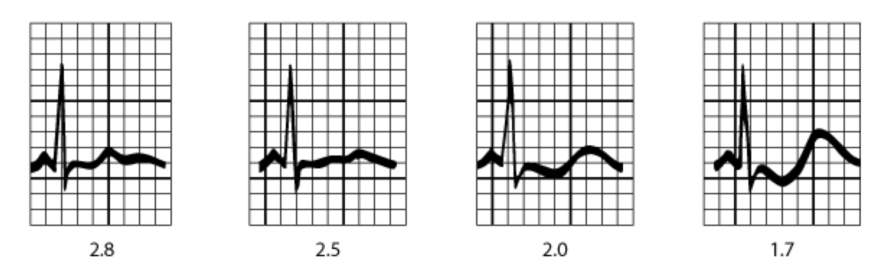
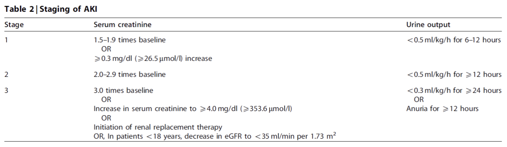
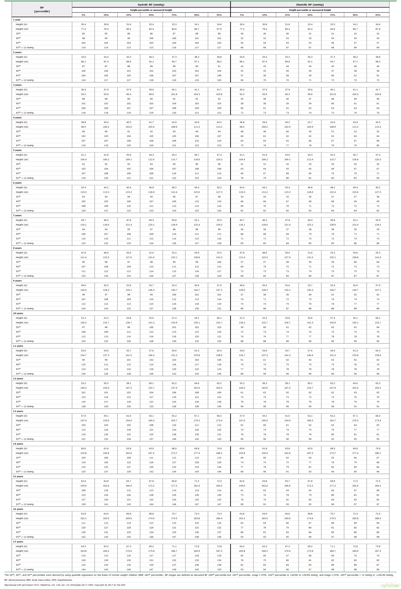
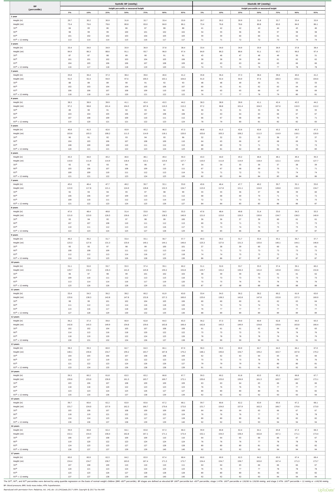

# Nephrology {#nephrology}

## Formulas  

### Modified Bedside Schwartz  

Used ages 1-18 to estimate GFR.

$eGFR=0.413 \times  \frac{height_{(cm)}}{SCr}$

###  Insensible Fluid Loss 

Use for patients when replacing insensible fluid plus urine/stool losses.   

$IFL_{(mL/day)}=300mL/m^{2}/day$   $BSA_{(m^{2})}=\sqrt{\frac{ht_{(cm)}\times wt_{(kg)}}{3600}}$                                       

###  Total Body Water  

Use to calculate total body water. 

$TBW_{males}=wt_{(kg)}\times 0.6$  

$TBW_{females}=wt_{(kg)}\times 0.5$                                        

###  Free Water Deficit     

Calculate **water** to be replaced in **hypernatremic** dehydration.  

$FWD_{(L)}=\left ( \frac{Current\: Na^{+}}{Desired\: Na^{+}} -1\right )\times TBW$                                                                                                                                                                     
###  Sodium Deficit                                               

Calculate **Na+** to be replaced in **hyponatremic** dehydration.    

 $Na^{+} Deficit_{(mEq)}=(140-Na_{actual}^{+})\times TBW$
 
 
###  Fractional Excretion Sodium    

Use in oliguric **AKI** to determine **prerenal** (<1%, sodium-avid) vs. **intrinsic renal** (&gt; 2%, tubular dysfunction) etiology). 

$FENa=\frac{\left ( Urine\: Na^{^{+}}\times Plasma\: Cr \right )}{\left ( Plasma\: Na^{+}\times Urine\: Cr \right )}$                                                                                                                          

###  Fractional Excretion of Urea    

Use in **AKI** if patient has recently been given **diuretics** (would alter Na+ excretion and therefore FENa), acute GN, or CKD; **prerenal** <35%, **intrinsic renal** &gt; 50%. 

$FEUrea=\frac{\left ( Urine\: Urea\: Nitrogen\times Plasma\:Cr \right )}{\left ( Plasma\: Urea\: Nitrogen\times Urine\: Cr \right )}$ 

###  Urine Protein/Cr Ratio             

- Normal <0.2.

- Greater than 3.5 indicates nephrotic-range proteinuria. 

$UPCR= \frac{Urine\: Protein\: Spot}{Urine\: Cr\: Spot}$        

### Transtubular Potassium Gradient 

Normal is 8 to 9.

Can only use when urine osm > plasma osm and urine Na+ greater than 25 mmol/L.

TTKG &lt; 7 +  **hyperkalemia**  → aldo deficiency/resistance

TTKG > 3 +  **hypokalemia**  → aldo ↑ vs renal K+ loss 

$TTKG= \left ( \frac{Urine\: K^{+}}{Plasma\: K^{+}} \right )/{\left ( \frac{Urine\: Osm}{Plasma\: Osm} \right )}$   

### Tubular Reabsorption of Phosphate

Normal is 80 - 98%.

Decreased TRP can be seen in conditions with prox tubular dysfunction, such as Fanconi syndrome/Type 2 RTA        

$TRP_{\%}=\frac{1-\left ( Urine\: Phosphate \times Plasma\: Cr \right )}{\left ( Plasma\: Cr\times Urine\: Cr \right )}\times 100$  

###  Urine Calcium/Cr Ratio 

Normal:

- 6 months old: ≤ 0.8
- 7 - 11 months old: ≤ 0.6 
- 1+ year old: ≤ 0.2

Use to assess for hypercalciuria in patients with hematuria, stones, and/or hypercalcemia.

$UCaCR=\frac{Urine\: Ca^{2+}Spot}{Urine\: Cr\: Spot}$                

###  Corrected Calcium  

Use to calculate calcium levels in low albumin states.

Albumin = negatively charged, and therefore carries calcium.  

$CorrCa^{2+}=\left ( 4-measured\:albumin \right )\times 0.8+measured\: Ca^{2+}$                                                      

###  Calculated Serum Osmolality       

Use to calculate serum osmolality.  

$CalcOsm=\left [ 2\times \left ( Na^{+}+K^{+} \right ) \right ]+\left ( \frac{Glucose}{18} \right )+\left (\frac{BUN}{2.8} \right )$                                                                                                                       

### Osmolar Gap

Osmolar gap > 10 can be caused by toxic alcohols (ethanol, methanol, ethylene glycol, isopropyl alcohol), mannitol, and lorazepam infusions (which contain propylene glycol).

$OG=Measured\: SOsm - Calculated\: SOsm$    

## Fluid Management

### Dehydration[^1]

| Severity | % Volume Loss | Vital Signs            | Physical Exam                                                                                                |
|----------|---------------|------------------------|--------------------------------------------------------------------------------------------------------------|
| **Mild**     | 3-5%          | Normal                 | Oliguria                                                                                                     |
| **Moderate** | 6-9%          | Inc HR, Orthostatic BP | Decreased skin turgor, delayed cap refill, dry mucosa, sunken fontanelle, oliguria                           |
| **Severe**   | ≥10%          | Inc HR, Dec BP         | Markedly decreased peripheral perfusion (cool, mottled extremities), lethargy/AMS, deep respirations, anuria |
  

**PowerPlans:** Gastroenteritis CPG Admit Plan, ED Gastroenteritis Pathway Plan  

**Clinical Pathways:** Gastroenteritis Clinical Pathway  

**Clinical Pearls:** estimate degree of dehydration by s/sx above to calc amt of fluid necessary to replace. 

* Calculate fluid deficit: $FD=Dry\: Weight-Current\: Weight$
* If dry weight unknown, estimate:  $Est.\,Dry\, Wt= \frac{Current\: Weight}{\left ( 1-\left ( p\times \frac{\% Dehydrated}{100} \right ) \right )}$, where p=0.6 for boys and 0.5 for girls (as % of total weight is water is 60% in boys and 50% in girls).
* Oral rehydration is preferred to IV rehydration when possible  
* If giving IV rehydration: 20cc/kg bolus of normal saline - consider D5NS if hypoglycemic or acidotic, repeat PRN until HDS, if ongoing IV rehydration necessary, start IVF @ maintenance (D5NS unless child is <1 month, has renal disease, etc); for hypernatremic dehydration, give hypotonic fluids (e.g., D5 ½ NS) **after** volume resuscitation.  
	
	
### Maintenance Fluid Therapy

|     Fluid     |    Dex    | Na+ | Cl- | K+ | Ca2+ |    Buffer    |   Osm  |
|:-------------:|:---------:|:--------------:|:--------------:|:-------------:|:---------------:|:------------:|:------:|
| **Unit**          |    g/dL   |      mEq/L     |      mEq/L     |     mEq/L     |      mEq/L      |     mEq/L    | mOsm/L |
| **Plasma**        | 0.07-0.11 |     135-145    |     95-105     |     3.5-5     |     4.4-5.2     | 20-30 bicarb |   308  |
| **NS (0.9%)**     |     0     |       154      |       154      |       0       |        0        |       0      |   308  |
| **D5 NS**         |     5     |       154      |       154      |       0       |        0        |       0      |   308  |
| **D5 ½ NS**       |     5     |       77       |       77       |       0       |        0        |       0      |   15   |
| **D5  ¼ NS**      |     5     |       34       |       34       |       0       |        0        |       0      |   78   |
| **3% Saline**     |     0     |       513      |       513      |       0       |        0        |       0      |  1026  |
| **D5 LR**         |     5     |       130      |       109      |       4       |        3        |  28 lactate  |   284  |

### Holliday-Segar Method

Use for children >14 days old  

| Body Weight        | cc/kg/day | cc/kg/hr |
|--------------------|:---------:|:--------:|
| **First 10 kg**        |    100    |     4    |
| **Second 10 kg**       |     50    |     2    |
| **Each additional kg** |     20    |     1    |

**Insensible Fluid Loss** 

$IFL_{(mL/day)}=300mL/m^{2}/day$, with $BSA_{(m^{2})}=\sqrt{\frac{ht_{(cm)}\times wt_{(kg)}}{3600}}$ 

**Maintenance Electrolyte Requirements:** 

**Na+:** 2-4 mEq/kg/day  

**K+:** 1-2 mEq/kg/day. Choice of fluid depends on age, serum sodium, and degree of dehydration.

**2018 AAP Clinical Practice Guideline:**[^2]  

* **Bottom line:** when in doubt, use isotonic fluids + KCl and dextrose (e.g., D5NS + 20 mEq/L KCl)
* **Exceptions:** neonates <28d or in NICU, CHF, renal disease, massive burns, hepatic disease, neurosurgical disorders, voluminous diarrhea, DI
* **Why:** avoids iatrogenic hyponatremia (hypotonic fluids + non-osmotic stimuli to ADH release) without a notable increase in iatrogenic hypernatremia or hypertension.
* **Note:** large amounts of NS → hyperchloremic non-gap metabolic acidosis. Keep this in mind when you see a persistent acidosis despite a normal anion gap when correcting patients in DKA!

## Acid/Base

### Simple Acid/Base Disorders

| Disorder              |   pH  | pCO2 | HCO3 |
|:-----------------------|:-----:|:---------------:|:-----------------:|
| **Metabolic Acidosis**    | **<7.35** |       >45       |       **<22**       |
| **Metabolic Alkalosis**   | **>7.45** |       <35       |       **>26**       |
| **Respiratory Acidosis**  | **<7.35** |       **>45**       |       <22       |
| **Respiratory Alkalosis** | >7.45 |       **<35**       |       >26       |

**Bold** indicates primary disturbance -- non-bold indicates secondary response.  

Note: lower serum bicarbonate levels (as low as 18 mmol/L) can be physiologically normal in neonates.   

* **Acidemia** → pH < 7.35. **Acidosis** → process that makes pH ↓  
* **Alkalemia** → pH > 7.45. **Alkalosis** → process that makes pH ↑  
* In **respiratory** disorders, the **pH** moves in the same direction as the pCO2.  
* Always look at the pH! A high bicarb on a chem often represents a metabolic alkalosis, but could also be a compensation for chronic respiratory acidosis (e.g., in patients with chronic lung disease). 

### Metabolic Acidosis

**PowerPlans:** Metabolism Lactic or Metabolic Acidosis NOS Admit Plan  

**Approach:** is there a concomitant respiratory acidosis / respiratory alkalosis?  
<ol><li> Use Winter’s Formula: $Expected\: pCO_{2}=\left [ \left ( 1.5\times HCO_{3}^{-} \right ) + 8\pm 
2\right ]$</li><li> Calculate Anion Gap, $AG = Na^{+}-\left ( Cl^{-} +HCO_{3}^-{}\right )$</li>
</ol>

In healthy patients, $Normal = 3\times albumin\pm 2$  
**Normal AG MAc:** GI loss (diarrhea, laxative, ureteroenteric fistula) vs renal loss (RTA (see chart), acetazolamide use, renal failure (may also have elevated AG), aggressive rehydration with NS. 
Calculate urine AG, $Urine\:AG=(UNa^{+}+UK^{+})-UCl^{-}$ (works b/c urine Cl- = proxy for NH4+ secretion)  

* If positive → impaired renal acidification  
* If negative → GI loss of bicarb 

**Increased AG MAc: MUDPILES**  
**M**ethanol  
**U**remia  
**D**iabetic ketoacidosis/starvation ketoacidosis  
**P**araldehyde  
**I**nfection/**I**soniazid/**I**ron/**I**EM   
**L**actic Acidosis  
**E**thylene Glycol  
**S**alicylates (cause primary metabolic acidosis and respiratory alkalosis)  

**Not fitting? Use the "delta gap":** compares difference between measured and normal AG vs difference between normal bicarb and measured bicarb to answer the question: is each decrease in the bicarb accounted for by an increase in the AG? $$\Delta Gap = \frac{\left ( AG - 12 \right )}{\left ( 24-bicarb \right )}$$
<ul><li> If **yes**, then DGap = 0.8 to 2 → high AG metabolic acidosis (MAc) **alone**</li><li> If **no** and DGap &lt; 0.4 → low/normal AG MAc **alone**</li><li> If **no** and DGap 0.4-0.8 → low/normal AG MAc **and** high AG MAc</li><li> If **no** and DGap > 2 → high AG MAc superimposed on chronic **metabolic alkalosis** or **respiratory acidosis** with metabolic compensation</li></ul> 

**Management:** directed at underlying etiology; see Metabolism section for acute management.

#### Renal Tubular Acidosis: Hyperchloremic Metabolic Acidosis w/ +Urine AG**  

|                         | **Proximal (Type 2)**                                                                     | **Distal (Type 1)**                                                | **Hyperkalemic (Type 4)**                                        |
|-------------------------|-------------------------------------------------------------------------------------------|--------------------------------------------------------------------|------------------------------------------------------------------|
| **Defect**              | Bicarb reabsorption                                                                       | H+                                                      | Inadequate aldosterone                                           |
| **Potassium**           | Normal/Decreased                                                                          | Normal/Decreased                                                   | **Increased**                                                    |
| **Urine pH**            | <5.5                                                                                      | >5.5                                                               | <5.5                                                             |
| **Renal Stones**        | No                                                                                        | **Yes** (high urine pH → CaPhos stones, low urine citrate)         | No                                                               |
| **Clinical Correlates** | **Fanconi Syndrome** (generalized proximal tubular dysfunction → lose glucose, phos, AAs) | Hereditary channelopathies (may be a/w sensorineural hearing loss) | DM, primary adrenal insufficiency, use of ACEIs/aldo antagonists |

### Metabolic Alkalosis

**Chloride Responsive** (urine Cl- &lt; 20 mEq/L)**:**  loss of gastric secretions (HCl): vomiting, NG tube drainage, thiazide and loop diuretics (urine chloride varies based on when drug was given), CF   

**Chloride Resistant** (urine Cl- &gt; 20 mEq/L)**:** **w/ HTN:** primary hyperaldosteronism, CAH, renovascular HTN, Liddle’s syndrome
**w/o HTN:** Bartter / Gitelman syndrome, severe K or Mg loss

### Respiratory Acidosis

**DDx**  
<ul><li>CNS depression</li><li>Nervous/Muscular disorders (Guillain-Barre, myasthenia gravis, botulism, muscular dystrophy)</li><li>Acute and chronic lung disease</li></ul>  

**Workup/Management:** ABG/VBG, CXR, SaO2, escalate respiratory support as needed

### Respiratory Alkalosis

**DDx**  
<ul><li>Anxiety</li><li>Hypoxia</li><li>Pain</li><li>Salicylates</li><li>Urea cycle disorders (during metabolic crisis, hyperammonemia increases respiratory drive)</li></ul> 

## Hyponatremia  
**Categorization**  

* **Mild:** Na+ < 135 mEq/L
* **Moderate:** Na+ < 130 mEq/L
* **Severe:** Na+ < 120 mEq/L 

**Hypovolemic**     

- Nonrenal sodium losses: GI, skin, sequestration

- Renal sodium losses: diuretics, cerebral salt wasting, mineralocorticoid or glucocorticoid deficiency

**Euvolemic**  

- SIADH
- Psychogenic polydipsia
- Reset osmostat 
- Drug-induced 
- Hypothyroidism

**Hypervolemic**                                                             

- Edematous states: nephrotic syndrome, CHF, cirrhosis
- Renal failure (acute or chronic)

 
  

**Presentation**  
  
*   Usually d/t underlying cause rather than symptoms from hyponatremia itself.
*   Sx occur when hyponatremia evolves acutely (<24h) & include N/V/HA → seizures, coma, and respiratory arrest.

**Workup**  

* Chem 10, serum Osm (↓ in true hyponatremia. If ↑, look for hyperglycemia or other osms)
* UA (proteinuria, hematuria, glucosuria), urine Osm. If euvolemic, nl response to hyponatremia = suppress ADH → urine is maximally dilute (osmolality < 100 mosmol/kg, SG ≤1.003).
	* Abnormally conc urine + euvolemic hypoNa = SIADH (whereas ↑ ADH i/s/o hypovolemia = appropriate ↑ in ADH)
	* Urine Na+ (<20 = EABV depletion; >40 = SIADH, cerebral salt wasting, diuretic use, renal failure)  

**Management:**  address underlying cause (volume if hypovolemic, fluid restriction if eu/hypervolemic), time course to match timing of onset (fast rx for onset <12h, slow rx for slow onset to prevent CPM).

* **Acute, symptomatic:** ICU admit, 3% HTS to raise [Na+] by 3-5 mEq/L (give ~TBW x 5 mEq/L x 2).
* **Chronic, asymptomatic:** calculate Na+ Deficit (mEq) =  (140 – Na+actual) x TBW, where TBW = weight in kg x 0.6 for males, 0.5 for females. Then give IVF to account for  missing Na+ content; should not exceed 0.5 mEq/L/hr rise in [Na+].
* **SIADH:** restrict free water intake to match insensible losses + UOP; use vaptans if severe.

## Hypernatremia
**Definition:** Na+ > 145mEq/L  

**Etiology:** **excessive water loss** (GI losses / Diuretics / Central or nephrogenic DI (see endocrine section) / Osmotic diuresis / Increased insensible losses / Impaired thirst mechanism) vs **excessive salt provision** 
 
**Clinical Presentation:** lethargy, irritability, MS changes. Typically presents w/ sx of underlying cause. 
 
**Exam:** check volume status, neurologic exam, mental status.
  
**Workup:** UA, chem 10, urine osm (appropriate response to hyperNa → ↑ ADH → concentrated urine. Inappropriately dilute urine i/s/o hyperNa → think DI), serum osm (Uosm < Sosm → think DI).
  
**Management**

1. For hypernatremic dehydration, calculate Free Water Deficit(L) = $\left ( \frac{Current\: Na^{+}}{Desired\: Na^{+}} -1\right )$xTBW,  where TBW = weight in kg x 0.6 for males, 0.5 for females.
2. Replace ½ of FWD w/in 24h, then remainder over next 1-2 days, and replace maintenance + ongoing losses. Avoid ↓ Na+ by >15 mEq/L over 24h (0.5 mEq/L/hr) due to risk of cerebral edema.

* If due to DI, see endo section for management

## Hypokalemia
**PowerPlan:** MSICU Intermittent IV Electrolyte Replacement Orderset  

**Definition:** K+ < 3.5 mEq/L  

**Etiology:** decreased K+ intake (malnutrition), increased K+ entry into cells (alkalosis → H+ for K+ / insulin / beta adrenergic activity - albuterol, pheo), increased GI losses (diarrhea, vomiting, laxative abuse, copious GT losses), renal losses (diuretics due to  loops/thiazides but NOT aldo antagonists, mineralocorticoid excess -- primary hyperaldo, hyperreninemic states [p/w HTN, hyperNa, metabolic alkalosis], Type I/II RTA, Gitelman/Bartter)  

**Pathophysiology:** low K+ → hyperpolarization of myocytes → lack of inhibition of voltage-gated Na+ channels → ↑ Na+ entry into myocytes and ↑ excitability → cardiac arrhythmias

**Clinical Presentation (generally only K+ < 3):** muscle weakness, fatigue, constipation → ileus, tetany, rhabdo, respiratory muscle failure, EKG changes (ST depression → dec T wave amplitude → U waves)

  

**Workup:** Chem 10, EKG (see above),$TTKG= \left ( \frac{Urine\: K^{+}}{Plasma\: K^{+}} \right )/{\left ( \frac{Urine\: Osm}{Plasma\: Osm} \right )}$ (note: can only use when urine osm >300). TTKG >3 i/s/o hypoK suggests aldo excess.

**Management**

* **Mild to moderate (K+ = 3.0-3.5 mEq/L):** treat underlying d/o, give KCl 1 mEq/kg (max 20 mEq) PO q8-24h OR add KCl to IVF (max conc is 80 mEq/L via PIV).
* **Severe (K+ < 2.5-3 mEq/L or symptomatic, EKG changes):** add KCl to IVF, give KCl 0.5-1 mEq/kg (max 30 mEq) IV x1 (only in ICU!), and should have EKG monitoring during infusion.
* Also correct Mg2+ if low (25-50 mg/kg IV, max 2g/dose) as hypoMg prevents resolution of hypoK.

## Hyperkalemia

**PowerPlan:** MICU/MSICU/NICU hyperkalemia Orderset  

**Definition:** K+ > 5.5 mEq/L (up to 6.5 may be normal in neonates)  

**Etiology:** ↑ K+ intake (TPN, IVF, formula), ↑ K+release from cells [acidosis (K+ efflux allows H+ influx to buffer acidosis), cell lysis (hemolysis, rhabdo, tumor lysis)], ↓ renal excretion [acute or chronic renal failure, hypoaldosteronism (adrenal insufficiency, hyporeninemic hypoAldo, ACE inhibitors -- look for hypoNa and metabolic acidosis), K+-sparing diuretics (spironolactone, epelrenone, amiloride, triamterene)], pseudohyperkalemia (hemolyzed blood sample)  

**Clinical Presentation:** muscle weakness (LE > UE) → flaccid paralysis, arrhythmias (if K+ > 7). **EKG changes** (in order of appearance): tall peaked T wave, shortened QT → PR/QRS lengthening → “sine wave” QRS → VFib

  

**Workup:** Chem 10 (ensure not hemolyzed -- free-flowing sample, order STAT), blood gas to assess acid/base status, EKG, TTKG (see above) -- low TTKG (<7) in setting of hyperkalemia may indicate aldo deficiency or resistance, plasma renin and aldosterone.

**Management:** if real and with EKG changes.  

* **STOP** K+ supplementation, K+-containing IVF, and K+-sparing medications.

* **Stabilize cardiac membrane**
	* Calcium gluconate 10% @  0.5 mL/kg (=100 mg/kg) IV over 5 min.
	* Calcium chloride 20 mg/kg IV over 5-10 min if impending cardiac arrest.
* **Drive K+ into cells**
	* Insulin 0.1 U/kg, max 10U IV with glucose, infuse over 30 min:
		* <5 yo: D10 (100 mg/mL) @ 5 mL/kg
		* ≥5 yo: D25 (250 mg/mL) @ 2-4 mL/kg IV (max 25g)
	* Albuterol nebs
		* Neonates: 0.4 mg/2 mL NS
		* <25 kg: 2.5 mg/2 mL NS
		* 25-50 kg: 5 mg/2 mL NS
		* \>50 kg: 10 mg/2-4 mL NS or 4-8 MDI puffs
	* Bicarb: 1 mEq/kg IV (max 50 mEq) over 10-15 min
		* <6 mo: 2 mL/kg of 4.2% NaHCO3
		* ≥6 mo: 1 mL/kg of 8.4% NaHCO3
	* Intubate + hyperventilate (induce alkalosis)
* **Excrete total body K+**
	* Kayexalate 1 g/kg, max 50g PO/PR q4h PRN
	* Furosemide 1-2 mg/kg IV (max 40 mg or 80 mg if renal insufficiency) q6h PRN
	* Dialysis if emergent or if ongoing source of K+ release (tumor lysis, rhabdo)
 

## Proteinuria  
**Definition**

* Excessive excretion of urinary protein
* Dipstick: primarily detects albumin
	* Trace = 15-30 mg/dL
	* 1+ = 30-100 mg/dL
	* 2+ = 100-300 mg/dL
	* 3+ = 300-1000 mg/dL
	* 4+ = >1000 mg/dL
* If positive dip, perform **quantitative** analysis
	* **Spot UPCR:** nl <0.2 if ≤2 yo or  <0.5 if <2 yo; >2 = nephrotic (see below section on nephrotic syndrome)
	* **Urinary Protein Excretion 24h:** >100 mg/m2 per day = abnormal, ≥1000 mg/m2 per day = **nephrotic**  

**Etiology**  

* **Glomerular** [inc filtration of macromolecules, esp albumin -- may be transient (fever, exercise, stress, seizures, resolves on rpt testing after stressor gone) vs orthostatic (present when standing and not when supine - first morning void) vs persistent (elevated on both supine/upright voids)]
* **Tubular** [inc excretion of low molecular weight proteins, esp β2 microglobulin, that are normally filtered in the glomerulus and reabsorbed in the proximal tubule -- may be d/t congenital disorders of proximal tubule (Fanconi syndrome, cystinosis, galactosemia, Lowe syndrome) or with acute tubular injury (ATN, AIN, pyelo)]
* **Overflow** [inc excretion of low molecular weight proteins d/t protein overproduction (multiple myeloma, myoglobin in rhabdomyolysis)].  

**Clinical Presentation**  

* If significant quantity, protein will be frothy; otherwise varies with cause.
* If nephrotic, may have edema/HTN, may have stigmata of primary dx (oral ulcers, rash, and joint swelling in SLE; abdominal pain and palpable purpura in HSP; h/o recurrent UTIs with VUR, hepatitis and movement d/o in Wilson disease).

**Workup**  

  

## Hematuria  
**Definition:** red blood cells in the urine  

**Etiology** 
 
* **Extraglomerular:** UTI, ureteral trauma, nephrolithiasis, cystitis (any UTI, adenovirus, cyclophosphamide), sickle cell disease or trait, malignancy (bladder CA, Wilms tumor)  
* **Glomerular:** glomerulonephritis (see GN section), benign familial hematuria / thin basement membrane disease  

**Workup**  

* UA (+blood on dip **AND** +RBCs on micro)
* If only +blood, think myoglobin vs hemoglobin
* If red but neg blood/neg RBC, think beets, rifampin, nitrofurantoin, doxorubicin, chloroquine
* If cola- or tea-colored urine, RBC casts, marked proteinuria, or dysmorphic RBCs, think GN
* If blood clots, uniform RBCs, urethral bleeding, think extra-gl
* If h/o trauma, do CTAP
* If s/sx UTI, do UCx
* If s/sx nephrolithiasis, do renal US +/- CTAP
* If c/f GN, send chem 10, CBC w/diff + retic, C3/C4, albumin, ASLO titer, anti-DNase B, ANA, UPCR; consider renal biopsy if concomitant proteinuria/HTN and/or rising serum creatinine 

## Nephrotic Syndrome  
**Definition:** syndrome characterized by presence of heavy proteinuria (albuminuria >3 g/24 hours), hypoalbuminemia (<3.0 g/dL), edema, and hyperlipidemia.  

**Etiology**

* Minimal change disease (most common in children) -- see normal light microscopy but on EM there is diffuse foot process effacement
* Focal Segmental Glomerulosclerosis
* Membranous Nephropathy
* Membranoproliferative GN (may be nephrotic + nephritic)
* SLE (may be nephrotic + nephritic)
* IgA/HSP (may be nephrotic + nephritic)
* Post-infectious Glomerulonephritis (may be nephrotic + nephritic)

**Pathophysiology**

* Abnormalities in glomerular podocytes → increased filtration of proteins, **esp albumin**. Others include clotting inhibitors (Protein C, S, antithrombin III) → prothrombotic state and immunoglobulins → susceptibility to serious infections.
* Increased Na+ retention and hypoalbuminemia → edema 
* Decreased oncotic pressure → inc hepatic lipoprotein synthesis → hypercholesterolemia  

**Clinical Presentation**

* Edema, typically first appears in periorbital tissue/scrotum, then in dependent areas
* HTN, HLD, increased risk of VTE
* Can present with AKI
* **Exam:** edema, hypertension, assess for extra-renal findings that may suggest a secondary cause for nephrotic syndrome (e.g. infection)  

**Workup**

* Chem 10 / C3; see also section on proteinuria
* UA + 24 hour urine collection with protein ≥1000 mg/m2/day OR spot UPCR >3.5
* Consider renal biopsy for diagnosis (see below)

**Management**  

* **Empiric steroids** for presumed minimal change disease (if persistent past 1-2 wk).
	* Prednisone 60 mg/m2/day (max 60 mg/day) for 4 weeks.
	* Then prednisone 40 mg/m2/day QOD for 4 weeks w/ gradual taper, generally for minimum total 2-3 months.
	* Consider biopsy if steroid resistant, steroid-dependent, or evidence of steroid toxicity.
* BP Control - **ACE inhibitors or ARBs** are preferred (decrease glomerular pressure → decreased protein filtration).
	* e.g., enalapril 0.08 mg/kg per day (maximum of 5 mg/day), can titrate to maximum dose of 0.6 mg/kg per day (maximum of 40 mg/day) for appropriate BP response
	* Use with caution for GFR < 60 mL/min/1.73 m2.
	* Re-check serum Cr, K+ 3-5 days after starting ACEI/ARB.
* Edema - **salt restriction** (< 2 mEq/kg/day) and **diuretics**.
	* If intravascular volume normal (FENa >2 %) - furosemide 1-2 mg/kg/dose x2 doses.
	* If intravascular volume low (FENa < 2%) and edema is severe (anasarca, pleural effusions, ascites)
		* Albumin 25% 1 gram/kg IV over 4 hours.
		* Give 1 mg/kg IV lasix at the 2 hour point
		* Give 1 mg/kg IV lasix after albumin infusion (4 hour point).
* VTE
	* Consider prophylactic anticoagulation if high-risk (age >12, albumin <2, fibrinogen >6).
	* Treat VTE if present with LMWH 
* HLD - consider statin, especially if other ASCVD risk factors are present.  

## Nephritic Syndrome  
**Definition:** any of several conditions leading to glomerular hematuria, proteinuria, and potential AKI with azotemia/oliguria, edema, and hypertension.  

**Etiology**

* Post-infectious
	* **Group A β-hemolytic strep**, either after pharyngitis or impetigo
	* Other infections: Staph aureus/epi, Pneumococcus, Mycoplasma, viral
* IgA Nephropathy (most common glomerulopathy worldwide)
* SLE Nephritis
* **Membranoproliferative GN:** can be idiopathic or secondary to HBV/HCV or rheumatologic disease
* **Alport Syndrome:** XLR collagen IV mutations, a/w hearing loss, vision changes
* **Goodpasture Syndrome:** autoAb to Type IV collagen in glomerular and alveolar basement membranes → hemoptysis
* **Vasculitis:** HSP, granulomatosis with polyangiitis (lung/sinus/kidney), eosinophilic granulomatosis with polyangiitis (asthma/neuropathy/lung/kidney/skin), microscopic polyangiitis (lung/kidney)

**Clinical Presentation**  

* Hypertension
* Hematuria
* Fluid retention/edema
* Sequelae of underlying disease
	* **SLE:** rash, arthritis, oral ulcers
	* **Vasculitides:** hemoptysis, skin ulcers
	* **Alport:** sensorineural hearing loss, vision changes
* Ask about preceding sore throat (usually 2-3 weeks before onset of post strep GN) or current URI symptoms (which can be seen with IgAN).
* Some patients may have rapid progression with development of acute renal failure over the course of several days. Any of the above etiologies can have a rapidly progressive course.  
* **Exam:** monitor BP, assess volume status. Look for signs of Lupus or other vasculitides such as rash, abdominal tenderness (HSP), joint swelling/tenderness.  

**Workup**

* UA: RBCs + proteinuria. Glomerular bleeding → dysmorphic RBCs and red cell casts.
* Chem 10 / CBC w/ diff + retic / serum albumin / ASLO titer + anti-DNase B / ANA + anti-dsDNA
* **C3, C4:** low C3 seen with post-infectious GN and C3 glomerulopathy; low C3/C4 in SLE; normal C3/C4 in IgAN, pauci-immune GNs (ANCA-associated vasculitis), and anti-GBM disease
* **UPCR:** typically will see proteinuria, sometimes in nephrotic range (nephrotic range protein is UPCR > 3.5).
* If rapidly progressive course or significant renal insufficiency on admission, send anti-GBM Ab and ANCA (for Goodpasture disease and GPA/MPA). Patients with rapidly progressive course should also have renal biopsy.  

**Management**  

* **Reasons for admission:** hypertension, acute renal failure, volume overload, or electrolyte abnormalities.
* Hypertension typically responsive to diuretics.
* Fluid and sodium restriction during acute phase.
* Patients with RPGN may be treated with pulse dose steroids. *Patients with RPGN due to Goodpasture disease, SLE, or GPA/MPA may be treated with steroids, cyclophosphamide, and plasmapheresis.
* Post-infectious GN is typically self-resolving.
	* Patients suspected to have post-infectious GN should have repeat complement studies sent in 8-12 weeks, at which time complement should return to normal. 
	* If still hypocomplementemic, consider other diagnoses such as C3 glomerulopathy or SLE.

 
## Acute Kidney Injury  

**Definition:** acute decrease in GFR per KDIGO criteria.

  

**Etiology**

* **Pre-Renal:** decreased renal perfusion.
	* Decreased intravascular volume: dehydration, blood loss.
	* Decreased effective circulating volume: shock, heart failure, cirrhosis.
* **Renal:** intrinsic renal parenchymal disease.
	* Glomerular disease: glomerulonephritis, nephrotic disorders.
	* Vascular: vasculitis.
	* Tubulointerstitial: ATN (ischemia/progression of pre-renal AKI, aminoglycosides, myoglobin, uric acid in tumor lysis syndrome), interstitial nephritis (NSAIDs, penicillins).
* **Post-Renal:** obstructive uropathy (posterior urethral valves, tumor, large stones, etc). Needs to be bilateral obstruction to develop renal failure in a patient with otherwise normal kidneys.  

**Clinical Presentation**  

* Fluid retention: edema, decreased urine output.
* Hematuria with intrinsic kidney injury (glomerulonephritis, ATN).
* Uremia: nausea/vomiting, GI bleeding, pericarditis, pruritus, mental status change.
* **Exam:** look for hypertension and edema (periorbital and peripheral).  

**Workup**  

* Urine Studies
	* UA
		* Hematuria, proteinuria, red cell casts suggests glomerulonephritis.
		* Muddy brown casts suggests ATN.
		* Urine eosinophils suggests acute interstitial nephritis (not a great test, may be positive even if only 1 eosinophil).
	* Urine electrolytes to calculate fractional excretion sodium (FENa).
		* $FENa=\frac{\left ( Urine\: Na^{^{+}}\times Plasma\: Cr \right )}{\left ( Plasma\: Na^{+}\times Urine\: Cr \right )}$
		* FENa < 1% suggests prerenal; FENa > 2% suggests intrarenal.
* Blood Labs: Chem 10, CBC w/ diff, consider CK if history suggestive of rhabdomyolysis.
* Renal US to look for hydronephrosis, obstructive uropathy, renal scarring.  

**Management**  

* Correct associated electrolyte issues (hyperkalemia, hyponatremia, hypocalcemia, acidosis).
* Manage hypertension (see section below).
* Fluid management
	* Small NS bolus (5-10 cc/kg) if hypovolemic or in pre-renal failure.
	* Reassess volume status and continue to give small boluses until patient is euvolemic.
	* Replace insensible losses plus 1:1 urine/stool output.
	* $IFL_{(mL/day)}=300mL/m^{2}/day$
	* $BSA_{(m^{2})}=\sqrt{\frac{ht_{(cm)}\times wt_{(kg)}}{3600}}$
* Indications for dialysis: AEIOU
	* **A**cidosis
	* **E**lectrolyte anomalies refractory to medical management (hyperK/phos)
	* **I**ngestions (Li+, ASA)
	* **O**verload
	* **U**remia (pericarditis, encephalopathy)  

## Chronic Kidney Disease  

**Definition**

* Irreversible kidney damage and reduction in kidney function; may be progressive.
* Requires 1 of 2 of the following (2012 KDIGO Clinical Practice Guideline):
	* For age ≥ 2 yo
		* GFR < 60 mL/1.73 m2 for > 3 mo 
		* GFR > 60 mL/1.73 m2 alongside evidence of structural kidney damage or other marker of abnormal renal function (proteinuria, albuminuria, renal tubular d/o).
	* For age < 2 yo → GFR < 1 std dev below mean = mod dysfunction, < 2 std dev = severe.
* Severity stratified by GFR from G1 (normal, ≥ 90) → G2 (60-89) → G3a (45-59) → G3b (30-44) → G4 (15-29) → G5 (< 15) = ESRD / dialysis-dependence.

**Etiology**  

* Congenital causes (renal aplasia, reflux, PKD, obstructive uropathy) in ~60%.
* Glomerular disease (FSGS, membranous nephropathy, MPGN, SLE nephritis, etc.).
* Other: HUS, Alport syndrome, cystinosis, interstitial nephritis, tumors.  

**Pathophysiology:** multiple possible insults leading to intraglomerular HTN and glomerular hypertrophy → nephron loss → hyperfiltration in remaining nephrons → further glomerular damage → glomerulosclerosis, proteinuria, fibrosis.

**Clinical Presentation**  

* Edema + HTN
* Proteinuria / hypoalbuminemia
* Anemia (due to EPO deficiency)
* Dyslipidemia / accelerated ASCVD
* Vitamin D deficiency with secondary hyperparathyroidism
* Electrolyte derangements: hyperkalemia, hyperphosphatemia, hypocalcemia, metabolic acidosis
* Growth failure, delayed puberty, and intellectual disability 
* Complications of uremia: pericarditis, platelet dysfunction, encephalopathy  

**Workup**

* Chem 10
* CBC w/diff + retic + iron studies
* UA w/ UPCR
* 25-OH Vitamin D, PTH
* Fasting lipid panel
* If etiology uncertain: see sections on proteinuria/hematuria, consider renal U/S and bx.  

**Management**

* Stage G1/G2 
	* Monitor kidney function closely.
	* Educate about nephrotoxin avoidance (NSAIDs, contrast, smoking, obesity, dehydration).
	* BP control w/ ACEI/ARB based on guidelines from the ESCAPE Trial.[^3]
		* Using ramipril (starting at 6 mg/m2/d and inc dose / adding other agents as needed).
		* Targeting 50th-%ile BP for age, sex, and weight vs 90th-%ile slowed rate of progression to ESRD.
* Stages G3 and above: as above and add the following.
	* Prepare for possibility of transplant, ideally prior to dialysis (HD vs peritoneal).
	* Na+-restricted diet (2-3g/d) +/- diuretics (furosemide 0.5-2 mg/kg/d, HCTZ 1-3 mg/kg/d).
	* Management of hyperkalemia (low K+ diet, diuretics), acidosis (sodium bicarb), hypocalcemia/hyperphosphatemia (Vitamin D, calcimimetics, phos binders).
	* Rx anemia to goal Hgb 10-12 g/dL w/ EPO-stimulating agents (erythropoietin alfa, darbepoetin alfa).
	* In pts with significant uremia, consider preoperative DDAVP to prevent bleeding.  

## Hemolytic-Uremic Syndrome

**Definition**

* **Hemolytic Uremic Syndrome:** microangiopathic hemolytic anemia + AKI + thrombocytopenia
* **Thrombotic Thrombocytopenic Purpura:** triad of HUS + fever + neurologic changes

**Etiology**  

* Principally affects children under the age of five years.
* 90% due to shiga toxin; of those 70% due to *enterohemorrhagic E. Coli*.
* Occurs in 6-9% of EHEC infections; usually begins 5-10 days after diarrhea onset.
* Non-diarrheal (atypical) HUS associated can be due to S. pneumo infection or due to defects in the complement system (e.g., mutations in complement regulatory proteins).  

**Pathophysiology**

* **HUS:** Shiga toxin binds to receptors in glomerular, colonic, and cerebral cells → promotes adhesion and aggregation of platelets onto endothelial cells →  thrombocytopenia and RBC shearing (microangiopathic anemia); in kidney, glomerular damage.
* **TTP:** due to deficiency or immune-mediated inhibition of ADAMTS13, a metalloproteinase responsible for breakdown of vWF. No vWF cleavage → coagulation occurs at a higher rate, particularly in microvasculature → platelet consumption → thrombocytopenia and microthrombi → microangiopathic hemolytic anemia.  

**Clinical Presentation**  

* Microangiopathic hemolytic anemia → jaundice, pallor, dark urine.
* Thrombocytopenia → petechiae, bleeding.
* Acute renal failure → HTN, edema.
* Other systems
	* **Central nervous system:** seizures, coma, stroke
	* **Cardiac:** dysfunction due to ischemia, uremia, fluid overload
	* **Pancreas:** transient DM
	* **Liver:** hepatomegaly, increased serum transaminases
	* **Heme:** in addition to anemia and thrombocytopenia, leukocytosis is common in diarrhea-induced HUS; the prognosis is worse with increased white blood cell counts.  

**Workup**

* **CBC w/diff + retic:** anemia, thrombocytopenia w/ appropriate reticulocytosis.
* **Smear:** schistocytes
* ↑ LDH, ↓ haptoglobin, Coombs negative (evidence of intravascular hemolysis).
* **Chem 10:** evidence of acute kidney injury, elevated BUN/Cr
* **LFTs:** elevation in transaminases, unconjugated hyperbilirubinemia
* **UA:** possible proteinuria, hematuria.
* Stool culture: causative pathogen
* Head CT if any change in MS or abnormal neurologic exam.

**Management**  

* Treatment mainly supportive; judicious fluid management (see section on AKI), correct electrolyte abnormalities, transfuse RBCs if needed (avoid platelets unless actively bleeding, as this may worsen the TMA process), manage hypertension.
* If significant CNS involvement or if TTP is suspected, consider plasmapheresis.
* For non-STx mediated (atypical) HUS, consider eculizumab (anti-C5 antibody; prevents activation of terminal complement pathway).
* 5-10% mortality; 5-10% progress to ESRD. Inc WBC, seizure, or CVA = poor prognostic factors.

## Hypertension

**Definition**[^4]  

|                 |                                  **Children 1-13 Years Old**                                 | **Children > 13 Years Old** |
|:---------------:|:--------------------------------------------------------------------------------------------:|:---------------------------:|
| **Normal**      | <90th percentile                                                                             | <120/<80 mmHg               |
| **Elevated BP** | ≥90th percentile to <95th percentile or 120/80 mmHg to <95th percentile (whichever is lower) | 120/<80 to 129/<80 mmHg     |
| **Stage 1 HTN** | ≥95th percentile to <95th percentile +12 mmHg or 130/80 to 139/89 mmHg (whichever is lower)  | 130/80 to 139/89 mmHg       |
| **Stage 2 HTN** | ≥95th percentile + 12 mmHg or ≥140/90 mmHg (whichever is lower)                              | ≥140/90 mmHg                |

*Percentiles determined by gender, age, and height.

**Blood Pressure Levels for Boys**[^5]

 

**Blood Pressure Levels for Girls**[^6]

 

**Etiology** 
 
* **Essential Hypertension**
	* Most common etiology in older children; increasing incidence with rise in obesity.
	* More likely in children who are overweight, postpubertal, and/or have a family history of hypertension.
* **Secondary Hypertension**
	* Suspect in child <6, w/o family hx HTN, if acute rise in BP, or past hx suspicious of underlying etiology.
	* **Renal Parenchymal Disease**
		* Glomerulonephritis, both acute and chronic
		* Renal scarring from pyelonephritis, VUR → CKD.
	* **Renovascular**
		* Renal artery stenosis: fibromuscular dysplasia, Neurofibromatosis I, Williams Syndrome
		* Thromboembolism (e.g., h/o UAC)
		* Aortic coarctation
		* Vasculitis: Takayasu’s arteritis, polyarteritis nodosa
	* **Endocrine**
		* Hyperthyroidism
		* Catecholamine excess: pheochromocytoma, neuroblastoma, exogenous catecholamines (cold medications, cocaine, amphetamines)
		* Corticosteroid excess: exogenous or endogenous (Cushing’s)
		* Mineralocorticoid excess: congenital adrenal hyperplasia, primary hyperaldosteronism
	* **Neurologic:** intracranial hypertension, familial dysautonomia

**Clinical Presentation**  

* Depends on etiology; essential hypertension often asymptomatic and discovered on routine blood pressure screening.
* Renal parenchymal disease: may present with hematuria, edema.
* Catecholamine excess: headache, flushing, sweating, tachycardia.
* Hyperthyroidism: sweating, diarrhea, tachycardia.
* Hypertensive emergency can present with headache, altered mental status, chest pain, dyspnea (see section on hypertensive emergency).

**Workup**

* **Phase 1: Confirmation**
	* Manual auscultatory measurement with appropriate-sized cuff on 3 separate occasions.
		* Bladder width: > 40% of upper arm circumference.
		* Bladder length: > 80% of upper arm circumference.
	* Consider BP measurements at school, home, or ambulatory BP monitoring.
* **Phase 2: Screening Studies**
	* Urinalysis (microscopic if positive).
	* Chem 10 + uric acid (if concern for oncologic etiology, can also be elevated in essential HTN).
	* Renal ultrasound with doppler interrogation.
	* If obese, add HgA1c and ALT.
* **Phase 3: Directed Testing**
	* Determine etiology (tests to consider based on history, PE, screening results).
		* TFTs
		* Plasma/urine catecholamines and metanephrines
		* Renin/aldosterone
		* DMSA scan to identify renal scarring in the setting of severe VUR.
		* Renal arteriography
	* Assess for end-organ damage.
		* Echocardiogram (?LVH)
		* Dilated eye exam (?retinal changes)

**Management**

* For essential hypertension, can consider dietary/lifestyle modifications as first-line approach for patients with Stage 1 hypertension and no evidence of end-organ damage.
* Pharmacologic therapy typically indicated for patients with Stage 2 hypertension, symptomatic hypertension, evidence of end-organ damage, or Stage 1 hypertension that does not improve after 4-6 months of lifestyle modifications.
* Choice of pharmacologic agent depends on underlying etiology.
	* For renin-mediated hypertension (renal artery stenosis, renal scarring), ACE-inhibitor usually best choice (e.g., enalapril 0.08 mg/kg/day).
	* For volume-related hypertension (e.g., glomerulonephritis) use diuretics (e.g., HCTZ 1-3 mg/kg once daily).
* General principle is to choose one medication and increase dose until reach maximum recommended dose, then add an additional agent until hypertension controlled.
* **For treatment of hypertensive emergency, refer to hypertensive emergency section in critical care chapter.**

## Urinary Tract Infections  

**Definition**

* **Age < 2 mo:** ≥ 50,000 CFU/mL of a uropathogen OR 10,000-50,000 CFU/mL with pyuria on UA
* **Age ≥ 2 mo:** significant bacteriuria (≥100,000 CFU/mL of single uropathogen from clean catch or ≥50,000 CFU/mL of uropathogen from cath sample) with associated inflammatory response (+LE/nitrite/WBC -- except if due to Enterococcus, Klebsiella, or PsA) and lower urinary tract symptoms (if appropriate age)
* **Cystitis:** infection of urinary bladder
* **Pyelonephritis:** infection of upper urinary tract (kidneys and ureters)

**Etiology**  

* ~90% due to E coli; others include Enterococcus, Proteus, Pseudomonas, and Enterobacter
* Adenovirus may cause acute infectious cystitis
* **Risk factors**
	* **Ages 2-23 months:** age <12 mo, max T ≥ 39 °C, nonblack race, female sex, uncircumcised male, no additional source of fever identified
	* **Ages ≥ 2 years**
		* Female sex (shorter urethra, wetter periurethral environment)
		* Lack of circumcision (in male infants)
		* Sexual activity (receptive vaginal intercourse -- S saprophyticus; unprotected insertive anal intercourse)
		* Urinary tract anomalies (bladder stones, constipation, urinary retention, posterior urethral valves, VUR)
		* Bladder catheterization or instrumentation (predisposes to PsA, coag-neg Staph)
		* Sickle cell disease
		* DM or other immunosuppressive conditions

**Pathophysiology** 

* **Newborns:** rare in first 6d life. May be due to hematogenous spread or ascending infection. Hematogenous spread more likely among preterm infants. Congenital anomalies of the kidney and urinary tract may predispose to UTI.
* **Beyond newborn period:** colonization of periurethral area by uropathogens → attachment of pathogens to uroepithelium → inflammatory response. Inflammation of upper urinary tract (pyelonephritis) → renal scarring → HTN, ESRD.

**Clinical Presentation**

* **Age < 2 years:** fever may be sole manifestation, esp when ≥ 39 °C (102.2 °F).
	* Concomitant upper respiratory infection or AOM does not r/o UTI.
	* May have concomitant poor feeding, irritability, or FTT.
	* May cause conjugated hyperbilirubinemia. 
* **Age ≥ 2 years**
	* Cystitis: dysuria, urinary frequency, hematuria, suprapubic pain and TTP
	* Pyelonephritis: fever, flank/back pain, nausea/vomiting, headache

**Workup**
**Don’t Forget the UTI Clinical Pathway**

* **Age < 2 mo:** catheterized UA + urine culture
	* Obtain blood culture given risk of urosepsis.
	* Strongly consider LP (1-3% of infants with UTI have bacterial meningitis).
	* Obtain renal/bladder U/S and consider VCUG if abnormal, if UTI is recurrent, or if pathogen other than E. Coli is identified.
	* If ultrasound suggests renal damage - consider DMSA scan after resolution of acute illness.
* **Age 2 mo-2 years**
	* _UTI Risk Score_
		* Two points if: temp  ≥40oC, no alternative source of fever, female.
		* One point if: temp Temp ≥39oC, male uncircumsized <12mo, male circumsized <6 mo, fever   ≥2 days, sibling w/ VUR, prior UTI.
	* Low pre-test probability of UTI → consider starting with POCT UA on bagged urine sample. If normal, stop. If abnormal, obtain catheterized UA and send for culture. Do NOT send a bagged sample for culture.
	* High pre-test probability of UTI (female w/ risk score  ≥2, male w/ risk score  ≥3) → obtain catheterized UA and send for culture.
* **Age ≥ 2 years:** clean catch UA → if +LE, nitrite, or WBC, send for culture. Consider empiric antibiotics for ≥1+ LE and nitrite, ≥1+ LE +/- nitrite, or ≥10 WBC/hpf.
* Consider baseline creatinine if initiating nephrotoxic antibiotics .
* Consider CRP and procalcitonin: CRP <2 mg/dL helps exclude pyelo, while procalcitonin >0.5 ng/mL can help confirm pyelo.

**Management**

* Neonate 0-1 month (consult reference for preterm neonates): **See BCH Clinical Pathway for Fever 0-1 month for additional recommendations.**
	* ≥35 wk GA and ≤7 days old
		* Ampicillin 50 mg/kg IV q8h 
		* Cefotaxime 50 mg/kg/dose q8h **OR** Gentamicin 4 mg/kg IV q24h
	* ≥35 wk GA and >7 days old 
		* Ampicillin 50 mg/kg IV q6h 
		* Cefotaxime 50 mg/kg/dose q12h **OR** Gentamicin 5 mg/kg IV q24h
* Infant/Child/Adolescent 
	* **Duration:** 5-7 days if afebrile, 7-10 days if febrile.
	* **1st line:** cephalexin 25 mg/kg/dose PO TID (max 500 mg/dose) vs ceftriaxone 50 mg/kg/dose IV q24h (max 2 g/dose).
	* **2nd line:** TMP/SMX, amoxicillin-clavulanate, cefdinir, cefuroxime, ciprofloxacin (for adolescents with pyelo), nitrofurantoin (for adolescents with cystitis).
* If Grade III-V VUR is identified on VCUG, can consider prophylactic antibiotics, though the decrease in UTIs is exactly matched by an increase in MDROs as the etiology for UTI, when present.[^7]

## Nephrolithiasis

**Definition:** deposits of minerals within the kidney or the urinary tract.

**Risk Factors:** underlying risk factors are present in ~75-85% of children.

* PMHx or FHx of stone
* Abnormal urinary system anatomy (ADPKD, UPJ obstruction)
* Previous urological surgery
* Metabolic disorder → solute excess (hypercalciuria, hyperoxaluria, hyperuricemia)  or ↓ levels of inhibitors of stone formation (hypocitraturia, hypomagnesemia)
* Chronic predisposing condition (IBD, CF, lymphoproliferative disorder, GSD, RTA)
* Medications predisposing to stone formation (diuretics, steroids, topiramate, high dose vitamin C)
* Recurrent UTIs

**Etiology:** majority of stones are CaOx, followed by CaPhos, struvite, cystine, and then uric acid.

**Clinical Presentation:** classic symptoms of abdominal/flank pain, hematuria, and dysuria 

* Younger children tend to lack the classical symptoms.
* If diagnosed with UTI and not getting better with abx, consider nephrolithiasis.
* **Admission criteria:** Admit if unstable VS, inadequate pain control, poor hydration.

**Workup**

* Urine studies
	* Can do POCT UA, but consider formal if trying to clarify hematuria; UCx if c/f infection.
	* Begin straining urine.
	* Majority of urine/stone testing can wait until outpatient follow-up.
* Imaging
	* US preferred, but may miss small or ureteral stones.
	* If no stone on US ± CT (may not need if normal anatomy and no other s/sx).

**Management:** see Nephrolithiasis Clinical Pathway for additional recommendations.

* **Pain Control**
* Hyperhydration
* Diet: low Na+, but no Ca2+ restriction

## References
[^1]: Steiner MJ, DeWalt DA, Byerley JS. Is This Child Dehydrated? JAMA. 2004;291(22):2746–2754. doi:10.1001/jama.291.22.2746
[^2]: Feld LG, Neuspiel DR, Foster BA, et al. Clinical Practice Guideline: Maintenance Intravenous Fluids in Children. Pediatrics. 2018;142(6):e20183083
[^3]: Group TET. Strict Blood-Pressure Control and Progression of Renal Failure in Children. N Engl J Med. 2009;361(17):1639–50. Available from: http://www.nejm.org/doi/abs/10.1056/NEJMoa0902066
[^4]:  Flynn JT, Kaelber DC, Baker-Smith CM, et al. Clinical Practice Guideline for Screening and Management of High Blood Pressure in Children and Adolescents. Pediatrics. 2017;140(3):e20171904
[^5]: Mattoo TK. Definition and Diagnosis of Hypertension in Children and Adolescents [Internet]. UpToDate. 2020; Available from: https://www.uptodate.com
[^6]: Mattoo TK. Definition and Diagnosis of Hypertension in Children and Adolescents [Internet]. UpToDate. 2020; Available from: https://www.uptodate.com
[^7]: Selekman RE, Shapiro DJ, Boscardin J, et al. Uropathogen Resistance and Antibiotic Prophylaxis: A Meta-analysis. Pediatrics. 2018;142(1):e20180119

