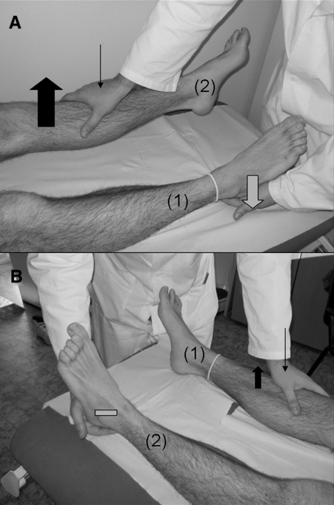
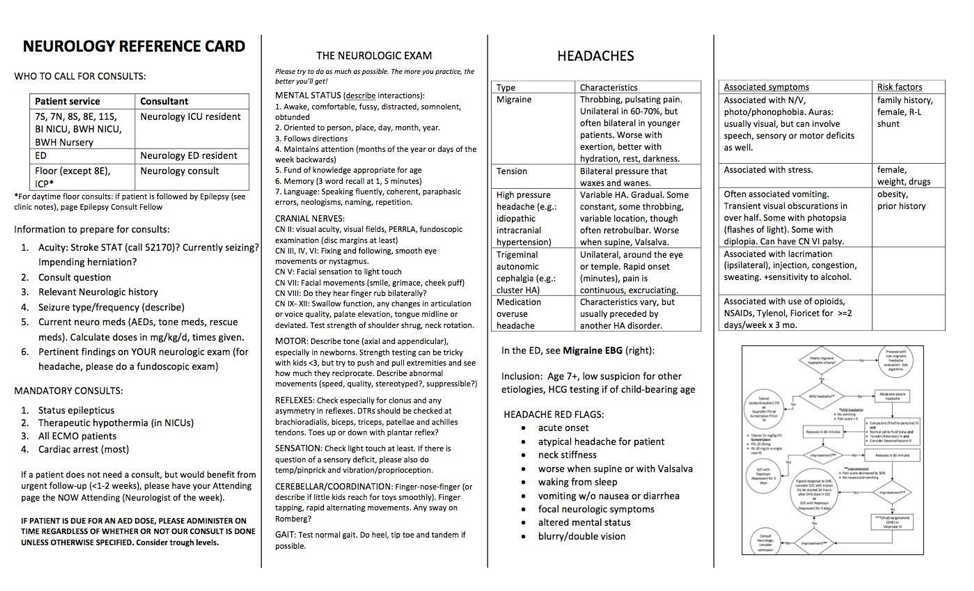
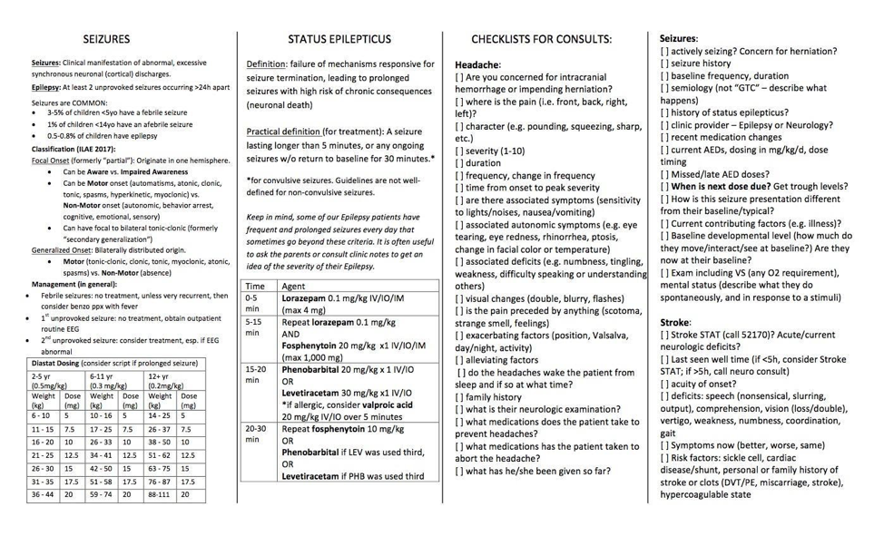

# Neurology

## Neurologic Emergencies

### Status Epilepticus

#### PowerPlan
See new BCH Guidelines

#### Definition
Seizure lasting > 5 min (or > 30 minutes, at which there may be long-term consequences), or two sequential seizures w/o return to baseline in between. Neurologic emergency. If seizure is refractory to multiple drugs, considered refractory SE.

#### Presentation
May be generalized SE, focal SE, or non-convulsive (including absence, aura continua, aphasic)

#### Differential
Epilepsy, electrolyte derangement, febrile status, meningitis/encephalitis, space occupying lesion, stroke, hypertensive emergency/PRES, PNES

#### Red Flags
Refractory to treatment, focal neurologic deficits on examination

#### Work-up
Initial labs include glucose, chem, UA/blood/urine cultures if febrile, urine tox screen, AED levels in patients taking AEDs, LP if concerns for CNS infections, imaging if examination is focal. Work up is considered following treatment.

#### Management
ABC’s, correct electrolyte disturbances, call relevant Neurology consult service, administer rescue meds as below, **consider activating Code Blue or anesthesia stat x5-5555**

- **First line** (0-5 min): IV lorazepam (Ativan) 0.05 - 0.1 mg/kg/dose (max 4 mg). If no access, diazepam (Diastat) PR: (0.5 mg/kg if < 5yo; 0.3 mg/kg if 6-11yo; 0.2 mg/kg if > 11yo)
- **Second line** (5-15 min): Repeat benzos x1 at same dose if no response in 5 min
	- Fosphenytoin IV: 20 phenytoin equivalents/kg/ dose (max 1500 mg)
	- Levetiracetam IV: 30 mg/kg (max 4500 mg) over 5-15 minutes. Dosing range 20-60 mg/kg.
- **Third line** (15-20 min): Phenobarbital 20/mg/kg IV push, monitor for resp. depression
	- Give Levetiracetam (60mg/kg IV) OR Fosphenytoin (20 mg PE/kg/dose), whichever was not previously given
	- Consider repeat Fosphenytoin (10 mg PE/kg/dose IV) OR Valproic Acid (Depakote) (20 mg/kg IV)

#### Complications
Cardiac arrhythmia, cerebral edema, hypotension, rhabdomyolysis, dehydration, pneumonia

### Increased Intracranial Pressure (ICP)
*See [Critical Care/ICP chapter](#critical_care)*

### Stroke[^1]

#### PowerPlans, Order Sets & Clinical Pathways
- **PowerPlans & Order Sets:** Neuroscience ICP Admit Plan; Neuro Stroke Plan
- **Call for help!** *Please call a **Code Stroke (x52170)** if symptom onset < 5 hrs prior!*
- **Other resources:** See Neurology Card

#### Pathophysiology
Acute-onset neurologic dysfunction due to impaired blood supply to the brain; ischemic or hemorrhagic

#### Presentation
Any acute-onset focal neurologic finding including unilateral weakness or numbness, visual loss, aphasia, altered mental status, new-onset focal seizures

#### Differential
Seizure, demyelinating process, Todd’s paralysis following focal seizure, hemiplegic migraine

#### Red Flags
- Risk factors include trauma, vasculitis/vasculopathy, infection, tumor/malignancy,  prothrombotic state, leukocytosis and anemia
- Risk factors for arterial ischemic stroke include Sickle Cell Disease and Cardiac Disease
- Risk factors for venous stroke are IBD, auto-immune disorders, infections and dehydration

#### Work-up
Brain MRI/MRA w/ stroke protocol (includes DWI/ADC, FLAIR, T2, T1, susceptibility sequences), +/- MRV. TTE to look for cardiac causes. Serum labs to look for coagulopathy. If newborn, add metabolic studies.

#### Management
ABC’s! Head of bed flat; IVF at maintenance, target SBP 50-90th percentile for age. Maintain euglycemia and normothermia, treat seizures, consider PICU admission and neurosurgical consult. Stroke in sickle cell is treated with exchange transfusion. 

#### Complications
Malignant edema which may lead to herniation, hemorrhagic conversion (consider STAT CT for change in exam) 

## Weakness

### Guillain-Barré Syndorme (GBS)[^2]

#### Pathophysiology
Monophasic demyelinating neuropathy. Antibody and complement-mediated injury to myelinated peripheral nerves. At least half of cases are preceded by viral infection (EBV, mycoplasma, c. jejuni, CMV). Vaccines are also implicated.

#### Presentation
Progressive motor weakness (ascending) & areflexia +/- autonomic dysfunction. May also complain of pain. Children may refuse to walk.

#### Differential
Spinal cord lesion (transverse myelitis, hematoma), acute flaccid myelitis, tick paralysis, toxic neuropathy

#### Red Flags
Weakness of muscles of respiration can indicate need for intubation

#### Work-up
CSF profile classically w/ albuminocytologic dissociation (elevated protein w/o leukocytosis). EMG is not helpful early in the disease course.

#### Management
IVIG or plasmapheresis. Consult PT.

### Miller-Fisher variant of Guillain-Barré[^3]

#### Pathophysiology
Antibody-mediated (anti-Gq1b) demyelination of the cranial nerves w/ or w/o peripheral nerve involvement

#### Presentation
Defined by the presence of areflexia, ophthalmoplegia and ataxia; viral illness usually precedes symptoms. Sensorium remains intact.

#### Differential
Guillain-Barré Syndrome, myasthenia gravis, spinal cord lesion, MS

#### Red Flags
Weakness of muscles of respiration can indicate need for intubation

#### Work-up
MRI of the brain and spine; LP if no space-occupying lesion. CSF profile similar to that of GBS w/ albuminocytologic dissociation (elevated protein w/o leukocytosis).

#### Management
IVIG 2g/kg over 2-5 days

### Myasthenia Gravis[^4]

#### Pathophysiology
Antibody blockade of the post-synaptic ACh receptor at the neuromuscular junction

#### Presentation
- Fatigable weakness (symptoms worse at the end of the day)
- Diplopia and ptosis can be provoked by sustained upgaze, arm weakness can be provoked w/ repetitive arm pumps
- Weakness tends to present in the muscles of the face, causing dysphagia, dysphonia, drooling, dysarthria (bulbar symptoms)
- **Myasthenic Crisis:** Presents w/ inability to clear secretions or maintain oxygenation (precipitated by infection, surgery, stress, meds, etc)

#### Differential
Botulism, Miller Fisher variant of GBS, brainstem lesion, thyroid ophthalmopathy

#### Red Flags
Check how high the patient can count in a single breath, NIFs, check sustained up-gaze; evaluate neck flexion/extension (sensitive test for diaphragmatic strength) to assess need for intubation

#### Work-up
Ice pack for eval of ptosis (should improve as cold slows acetylcholinesterase activity). Check for antibodies (anti-AChR, anti-MuSK). EMG (decrement in muscle potentials on repetitive nerve stim). CXR to screen for thymoma. 

#### Management
Avoidance of drugs which may exacerbate MG (see uptodate table). Monitor FVC/NIF and intubate for FVC < 15 mL/kg and NIF < -20. Suctioning, NG tube.

#### Management
See below: IVIG (0.4 g/kg/d x 5d), plasmapheresis if severe

#### Complications
Respiratory failure, pulmonary infections, death

### Bell’s Palsy

#### PowerPlans, Order Sets & Clinical Pathways
- **Clinical Pathways:** [Facial Palsy](https://bchfit.tch.harvard.edu/ebg-services/component/pdfAlgorithm?algCode=FACIALPALSY&algVersion=1.6&accessCode=null)

#### Pathophysiology
Acute paralysis of the peripheral facial nerve. Pathogenesis viral (most commonly HSV) but also may be post-viral or immune-mediated (VZV, Hepatitis, HIV, Lyme, EBV).

#### Presentation
Weakness in the upper and lower face, pain, tingling in ipsilateral ear canal, taste changes, impaired lacrimation and hypersensitivity to sound

#### Differential
Otitis media, trauma, tumor, TB, Ramsay Hunt syndrome, malignant hypertension, mastoiditis

#### Red Flags
Signs of increased ICP, focal neurologic findings, other cranial neuropathies

#### Work-up
Exclude other cause (i.e. HTN, trauma, active herpetic lesions c/w RHS). Consider MRI, Lyme serologies if indicated by history/exam.

#### Management
- **Watchful waiting:** Eye ointments/artificial tears to maintain hydration, eye patch or taping eyelid closed while sleeping, use of corticosteroids controversial (most kids have complete spontaneous recovery). Valacyclovir/acyclovir if HSV suspected, doxycycline if Lyme is suspected May-November. Consider MRI if other symptoms present.
- **Empiric corticosteroids:** Prednisone 2 mg/kg once daily x 5 days w/ 5-day taper (max 60 mg/dose). Start w/i 3 days of symptom onset.

#### Complications
Corneal ulcers if absent blink reflex/incomplete closure of palpebral fissure

### Acute Flaccid Myelitis (AFM)[^5]

#### Pathophysiology
Inflammation of gray matter of spinal cord (anterior horn cells). Most commonly associated with enterovirus D68 or A71. Historically poliovirus. May also be caused by adenovirus, flavivirus and West Nile virus. 

#### Presentation
Limb weakness following non-specific viral symptoms (fever, cough, rhinorrhea, vomiting/diarrhea). Median onset ~5 days (range 0-28 days). May have hyperacute presentation (rapid progression <6 hours). Quadriparesis at presentation in ~1/3 of cases. May have UMN pattern due to involvement of lateral corticospinal tracts. May include bowel/bladder symptoms and/or cranial neuropathies. 

#### Differential
Spinal cord infarct or mass lesion, GBS, myasthenia, transverse myelitis/NMO

#### Red Flags
Respiratory failure. Signs of brainstem encephalitis (Entero A71 - autonomic instability/shock, ataxia, cranial nerve involvement, AMS).

#### Work-up
- MRI brain and spine w/wo contrast (Spinal gray matter T2 hyper-intensities, MRI may be normal <72 hrs)
- CSF analysis (lymphocytic pleocytosis (mean ~210), mild elevation of protein)
	- Note: Generally unable to detect viral RNA in CSF
- Nasopharyngeal and rectal swabs for viral PCR (or fecal)
- Serologies for mimics (anti-MOG)

#### Management
- Supportive care. ~30% require mechanical ventilation.
- Immune therapies (glucocorticoids, IVIG, PLEX relatively contra-indicated given direct viral infection)

#### Complications
Respiratory failure. Rare cases of A71 causing brainstem encephalitis with non-cardiogenic pulmonary edema and rapidly fatal cardiopulmonary failure.

## Hypotonia

### Approach to Neonatal Hypotonia

#### Pathophysiology
Central (UMN) vs. peripheral (LMN) injury or dysfunction leading to decreased tone, which is resistance to passive stretch of the muscle at joints, often but not always associated w/ weakness

#### Presentation
Head lag, frog-legged positioning, slip-through on vertical suspension, U-shape on horizontal suspension. Failure to meet developmental milestones. Also with dysphagia, FTT.

#### Differential
Central (HIE, TORCH, brain malformations, IEM, genetic disorders, mitochondrial disease, hemorrhage/stroke) vs. peripheral (SMA, myasthenia gravis). Maternal drugs. 

#### Red Flags
Respiratory insufficiency/failure. Developmental regression. 

#### Work-up
1. Reflexes are the most important examination maneuver (you can tap a finger to assess a baby’s reflexes)
	- Areflexia indicates a peripheral process and need for non-urgent EMG
	- Present reflexes indicate a central process
2. Next is the presence of appendicular hypertonia, which is an increased resistance to passive stretch (and hyperreflexia) of the limbs despite the axial hypotonia (muscles of the neck and trunk), which can indicate perinatal injury and can be non-urgently assessed w/ MRI
3. Septic work-up, LFTs, ammonia, chemistry, CK, consider genetic work-up

#### Management
New therapies for SMA (nusinersen, zolgensma)! Otherwise, depends on etiology. Typically supportive, using EI for children under age 3 or the school for older children w/ emphasis on PT and OT, ST as needed for dysphagia.

#### Complications
Dependent on the underlying cause but sometimes associated w/ cognitive dysfunction in addition to developmental delay

### Infantile Botulism[^6]

#### Pathophysiology
- C. botulinum produces toxin that interferes w/ release of acetylcholine at NMJ (disrupts vesicle binding to the pre-synaptic membrane)
- In infancy, C. botulinum colonizes intestinal tract in situ
- Contamination of honey or corn syrup, dusty environments near construction/agricultural soil disruption are culprits
- In adults, paralysis results from ingestion of the toxin

#### Presentation
Descending paralysis, often starting w/ ophthalmoplegia (may involve pupillary response), followed by weak cry, dysphagia and progresses to weakness of respiratory muscles

#### Differential
GBS Miller Fisher variant, hypermagnesemia, SMA, Myasthenia Gravis

#### Red Flags
Weakness of muscles of respiration can indicate need for intubation

#### Work-up
Isolation of organism in stool. EMG: short-duration, low-amplitude motor unit potentials.

#### Management
- ICU care for severe presentation, may require ventilator support
- Immune globulin
- Avoid aminoglycosides (produce pre-synaptic neuromuscular blockage)
- Treat w/ BIG prior to confirmation of stool/EMG if clinical suspicion is high

#### Complications
Apnea, respiratory failure, sudden infant death

## Neuroimmunology

### Multiple Sclerosis (MS)[^7]

#### Pathophysiology
T lymphocytes attack oligodendrocytes, affecting myelin (autoimmune-mediated demyelination); known genetic (HLA subtypes) and environmental (smoking, latitude, vit D) risk factors

#### Presentation
- Repeated episodes focal deficits (optic neuritis, weakness, numbness) separated in time
- Imaging often shows lesions separated by space w/i the CNS

#### Differential
ADEM (often a first presentation of MS- multiple lesions causing altered sensorium), NMO spectrum disorder (neuromyelitis optica), MOG-antibody associated demyelinating disease, malignancy, nutritional deficiency, leukodystrophy, mitochondrial disorder, CNS vasculitis, ophthalmologic disease

#### Red Flags
- Presentation is broad and variable
- Seizure (indicating gray matter involvement), fever should lead you to rethink the diagnosis 
- Weakness of muscles of respiration and/or mental status changes can indicate need for intubation

#### Work-up
- Definitive diagnosis requires repeated episodes over time
- LP reveals CSF w/ elevated protein count +/- presence of oligoclonal bands (must be compared w/ serum). MRI is imaging modality of choice.
- The presence of 3+ white matter lesions on T2 imaging especially if perpendicular to the ventricles sensitive for diagnosis (Dawson’s fingers)

#### Management
Acute exacerbations require short-course of steroids. Load w/ methylprednisolone (30 mg/kg; maximum 1g), treat for 3-5 days. Neuroimmunology consult for disease-modifying drugs.

### Acute Disseminated Encephalomyelitis (ADEM)[^7]

#### Pathophysiology
Central demyelinating disorder, presumed immune-mediated mechanism

#### Presentation
Encephalopathy + lethargy, headache, vomiting, focal neurological symptoms

#### Differential
Multiple Sclerosis, infectious/toxic/metabolic encephalitis, leukodystrophy

#### Red Flags
Decreased level of arousal can indicate need for intubation for airway protection

#### Work-up
MRI brain and spine w/ and w/o contrast (T2 weighted MRI reveals confluent increased signal intensity throughout white matter, specifically corpus callosum and periventricular region). LP (CSF can be normal or have elevated protein or WBC).

#### Management
High dose IV methylprednisolone; IVIG and plasma exchange may help refractory cases

#### Complications
- Typically a self-limiting, monophasic course
- Multiple episodes raise concern for MS/MOG-associated demyelination

### Transverse Myelitis[^8]

#### Pathophysiology
Combined demyelinating and inflammatory disorder. Wide variety of associations:

- May present as part of demyelinating disorder (MS, NMO)
- Associated with various rheum conditions (SLE, RA, scleroderma, etc)
- Idiopathic cases largely thought to be post-infectious (30-60% preceded by viral illness)

#### Presentation
Acute to subacute development (nadir 4 hrs to 21 days) of weakness (commonly UE), sensory deficit, autonomic disturbance. Although initially flaccid, spasticity often follows. Autonomic symptoms include urinary/fecal incontinence, urinary retention, sexual dysfunction.

#### Differential
- **Non-inflammatory:** Compressive myelopathy (neoplasm, vertebral body compression fx, spondylosis, herniation); spinal infarct; nutritional deficiencies (B12, vitamin E, NO toxicity)
- **Inflammatory:** Demyelinating disease syndrome (MS, ADEM, NMO); rheum disease (SLE, sarcoid, Sjogrens); infections (enterovirus, HIV, WNV, Lyme)

#### Red Flags
Rapid onset of paraplegia/spinal shock

#### Work-up
- Spinal MRI w/wo contrast (T2 hyperintensities; no mass lesion)
- Brain MRI (r/o central lesions c/w MS)
- CSF studies (basic + IgG index, oligoclonal bands, cytology, VLDR) abnormal in 50% of cases
	- Expect lymphocytic pleocytosis (children > adults with mean ~136/mm), elevated protein, elevated IgG index
- Serologies (AQP4, MOG, ANA, Ro/SSA, La/SSB)
- Infectious studies (HIV, VZV, EBV, VLDR, WNV, enterovirus)
- B12, MMA

#### Management
High dose IV steroids (methylpred 30 mg/kg daily). PLEX if refractory disease or acute motor impairment. Relapsing disease may require long-term immunomodulation (mycophenolate or rituximab).

#### Complications
Progression to multiple sclerosis (risk factors include brain MRI abnormalities, oligoclonal bands, mild or asymmetric disease)

### Autoimmune Encephalitis (NMDA Receptor Antibody Encephalopathy)[^9]

#### Pathophysiology
- Antibodies bind to NR1 subunit of NMDAR and cause receptor endocytosis and subsequent neurologic dysfunction
- Ovarian teratomas are an important cause in girls < 18 (31 %); tumors rare in males
- Overall, a rare disease

#### Presentation
Acute (<3 mos) behavior and personality changes (including depression/anxiety/psychosis), seizures, insomnia, stereotyped movements and autonomic instability

#### Differential
Viral encephalitis, neuroleptic malignant syndrome, psychosis, catatonia

#### Red Flags
Autonomic instability

#### Work-up
- MRI Brain typically w/ lesions
- EEG can show slowing and delta brush
- ELISA test of Ab against NR1 subunit of NMDA receptor (autoimmune encephalitis panel) is diagnostic
- Look for tumor w/ US/MRI of abdomen/pelvis

#### Management
- If applicable, tumor resection
- Methylprednisolone 30mg/kg (max 1g) IV daily x5d, IVIG 2g/kg over 2 to 5 days and plasma exchange are all first line treatments

#### Complications
Autonomic instability, seizures

 
## Neuropsychiatric

### Functional Neurologic Disorder[^10]

#### PowerPlans, Order Sets & Clinical Pathways
- **Other resources:** Refer patients to <www.neurosymptoms.org>

#### Pathophysiology
Inorganic cause of neurologic symptoms, thought to be due to inappropriate signaling and heightened pain sensation as response to stress

#### Presentation
- Can present w/ weakness or paralysis, nonepileptic seizures, sensory or somatic complaints
- Often w/ comorbid anxiety or depression
- **Inconsistencies on exam:** Distractibility, inconsistencies between confrontational testing and function, sensory symptoms in non-dermatomal distribution

#### Differential
Stroke, GBS, transverse myelitis or other spinal disorder, seizures

#### Red Flags
Sudden-onset weakness of one side, dermatomal distribution, spinal level of weakness, areflexia, altered mental status

#### Work-up
- Thorough history and physical, including medical and psych, review prior labs or imaging, ask about psychological stressors
- Depends on positive clinical findings rather than negative tests
- Exam maneuvers
	- Hoover’s sign: involuntary extension of weak leg when contralateral leg flexes against resistance 
	- Hip abductor sign: hip abduction weakness in affected leg returns to normal during contralateral hip abduction against resistance of unaffected leg
	- Drift without pronation sign: when asked to hold arms out with palms up and eyes closed, weak arm drifts without pronating (as would be seen with UMN lesions)
	- Arm drop: weak arm held above face and released, will stay suspended or move to miss hitting face, can be tested during non-epileptiform seizures
	- Midline splitting: complete sensory loss on one side, split exactly midline

#### Management
PT/OT, psychotherapy, pain management, supportive care, education

## Headache

### Migraine

#### PowerPlans, Order Sets & Clinical Pathways
- Clinical Pathway: [Headache/Migraine, Emergent/Urgent](https://bchfit.tch.harvard.edu/ebg-services/component/pdfAlgorithm?algCode=MIGRAINE&algVersion=2.4&accessCode=null)

#### Pathophysiology
Cortical spreading depression: Neurons fire in a sequential manner across the surface of the brain (causing an aura). Associated w/ irritation and dysregulation of blood vessel tone of the overlying meninges, causing pain.

#### Presentation
Unilateral throbbing headache (bilateral sometimes in young children), visual aura, photophobia, phonophobia, nausea, vomiting, relieved by rest

#### Differential
Venous sinus thrombosis, concussion, tension type headache, intracranial mass lesion

#### Red Flags
Any symptoms suggestive of increased ICP (i.e. papilledema, nerve palsy, positional headache, morning emesis, encephalopathy, wake from sleep w/ headache), focal neurological deficits, change in character from typical headache, progressive worsening of headaches, neck stiffness

#### Work-up
Clinical diagnosis, consider MRI for red-flag symptoms

#### Management
- See treatment algorithm in [Migraine Clinical Pathway](https://bchfit.tch.harvard.edu/ebg-services/component/pdfAlgorithm?algCode=MIGRAINE&algVersion=2.4&accessCode=null) as above

### Tension Headache
*See Headache section of Neurology Reference Card*

### Concussion
*See Sports Medicine chapter*

### Idiopathic Intracranial Hypertension (Pseudotumor Cerebri)

#### Pathophysiology
Syndrome of increased ICP due to impaired absorption at the arachnoid granulations. Risk factors: obesity, drugs (tetracyclines, retinoids, OCPs)

#### Presentation
- Patients have frontal, positional HA worse upon awakening
- Visual disturbances, visual loss, +/- dizziness
- Examination reveals papilledema

#### Differential
Venous sinus thrombosis, intracranial mass lesion, migraine headache, tension headache

#### Work-up
MRI/MRV required in children w/ HA and papilledema to rule out mass/hydrocephalus, venous sinus thrombosis. LP w/ elevated opening pressure is diagnostic.

#### Management
Acetazolamide 15-25 mg/kg/day (decreases rate of CSF production). Follow-up with Ophtho.

#### Complications
Vision loss, optic neuropathy
 

## Seizures

### Febrile Seizure

#### PowerPlans, Order Sets & Clinical Pathways:
- **Clinical Pathway:** [Seizure, Febrile](https://bchfit.tch.harvard.edu/ebg-services/component/pdfAlgorithm?algCode=FEBSEIZE&algVersion=2.1&accessCode=null)

#### Pathophysiology
Decreased threshold for seizure due to fever and immaturity of the CNS, often familial

#### Presentation
- **Simple:** < 15 min, generalized, occurred once in 24 hrs
- **Complex:** > 15 min, focal, or occurred _>_ 2 times in a 24 hr period
- Most commonly seen between 6mo and 6yo, w/ peak presentation between 12-24 mos

#### Differential
Meningitis, encephalitis

#### Red Flags
AMS, neck stiffness, lethargy, status epilepticus, focal deficits lead to consideration of meningitis/encephalitis

#### Work-up
If examination is normal, no further work-up is required

#### Management
Reassurance and anticipatory guidance. For complex febrile seizures > 15 minutes, prescribe rectal Diastat. Antipyretics not shown to decrease risk.

#### Complications
30-50% recurrence rate. Minimally increased risk of epilepsy compared w/ the average population, slightly greater for those w/ complex febrile seizures.

### First-time Unprovoked Seizure

#### Pathophysiology
Typically idiopathic (likely genetic), but sometimes symptomatic from underlying brain lesions

#### Presentation
- **Focal:** Unilateral symptoms +/- AMS (dyscognitive vs. cognitive) 
- **Generalized:** Bilateral tonic clonic movements (GTC), tonic, myoclonus, absence

#### Differential
Meningitis, encephalitis, intracranial hematoma, focal lesion (i.e. abscess, AVM, focal cortical dysplasia).  

#### Red Flags
AMS, neck stiffness, lethargy, focal deficits lead to consideration of meningitis/encephalitis

#### Work-up
If examination is normal, no further work-up is required emergently. EEG is next step, as is neurology referral. If the seizure had focal onset or if the EEG shows focality (spikes arising from one portion of the brain), most neurologists opt to do an MRI of the brain w/o contrast.

#### Management
Indication for AED therapy is 2 or more unprovoked seizures, or one unprovoked seizure w/ an abnormal EEG. Keppra is often our first line because of both focal and generalized coverage w/ favorable side-effect profile, but we avoid it in cases of children w/ behavioral issues. Neurology admission for patients not returning to baseline following seizure or for multiple seizures upon presentation requiring immediate treatment. 

#### Complications
Epilepsy for those who go on to have further unprovoked seizures. Rare complication of generalized epilepsy is **SUDEP** (sudden unexplained death in epilepsy patients).

### Breakthrough Seizure (in a patient w/ epilepsy)

#### Pathophysiology
Decreased threshold for seizure due to fever, lack of sleep, missed medication dose, alcohol use vs. natural fluctuation of epilepsy (as is the natural history) such that seizures may become more frequent w/o provocation

#### Differential
Evaluated potential underlying causes of increased seizure frequency

#### Red Flags
AMS, prolonged seizures

#### Work-up
Neurology consult for medication adjustment. Before calling, should know the following: Baseline seizure frequency and semiology (what the seizure looks like) vs. current frequency and semiology, doses of all AEDs, most recent levels if available.

#### Management
Typically small adjustments to AEDs including addition of AEDs when needed

### Infantile Spasms

#### Pathophysiology
Varied; can be associated w/ CNS malformations, genetic/metabolic abnormalities, trauma, infections, tuberous sclerosis and other neurocutaneous syndromes, trisomy 21 or may be idiopathic

#### Presentation
- Spasms involving tonic flexion or extension of neck, trunk, and/or extremities lasting up to 10 sec, can occur in clusters, commonly followed by crying
- Usually occur during daytime and while awake
- Usually presents at < 1yo, peak incidence in 3-7mo

#### Differential
Exaggerated startle, torticollis, reflux, colic, spasticity, benign myoclonus of infancy, myoclonic epilepsy

#### Work-up
EEG: Hypsarrhythmia, MRI, genetic/metabolic labs

#### Management
- ACTH is first-line, should monitor BP and chem10 while on ACTH
- Vigabatrin

#### Complications
Developmental regression, refractory seizures

## Meningitis

### Bacterial Meningitis
*See [ED](#ed_chapter) and [ID chapters](#id_chapter)*

#### PowerPlans
Fever in infant < 30 days

#### Pathophysiology
Bacterial infection of the meninges, caused by hematogenous spread or direct spread from sinuses or mastoids

#### Presentation
- Fever, headache, vomiting, meningismus, seizures
- Kernig Sign: Stretching of hamstring w/ knee extension + back pain
- Brudzinski Sign: passive neck flexion, involuntary hip/knee flexion

#### Differential
Viral meningitis/encephalitis, brain abscess, increased ICP, neoplasm, ADEM

#### Red Flags
Focal neurological deficits, seizures, papilledema, risk factors for TB (poor clinical outcomes), petechiae on exam (Neisseria)

#### Work-up
It’s all about the LP. CSF: WBC count often > 1,000, glucose often < 40 or < half of serum value, protein > 250, cell count w/ > 50% PMNs. Obtain imaging on comatose patients or those w/ focal neurologic deficits PRIOR to LP.

#### Management
In addition to abx, dexamethasone used to reduce hearing loss in children 0.15mg/kg q6hr for 2-4 days. *See ID chapter for meds/dosing.*

#### Complications
Seizure, stroke, elevated intracranial pressure

### Viral Meningitis & Encephalitis

#### Pathophysiology
Viral infection and inflammation of the meninges

#### Presentation
Fever, headache, malaise, photophobia, altered mental status

#### Differential
HSV (HSV-1 most common in children, HSV-2 most common in neonatal period acquired through maternal transmission), EBV, VZV, CMV (consider if immunocompromised), Eastern Equine Virus, Subacute sclerosis panencephalitis (if remote hx of measles infection), Lyme

#### Red Flags
History of immunosuppression/transplant → consider less common organisms

#### Work-up
- Consider MRI if focal neurologic deficits are present
- LP should be performed (CSF profile w/ elevated protein and cells, lymphocytic pleocytosis)

#### Management
- Largely supportive, w/ empiric treatment w/ antibiotics and acyclovir until cultures result
- HSV → Acyclovir x 14-21 days  (<35 wk conceptual age 40 mg/kg/d divided q12; > 35 wk conceptual age 60 mg/kg/d divided q8hr)
- CMV → Ganciclovir

#### Complications
Rarely associated w/ long-term issues; HSV may cause hemorrhage w/i temporal lobes, causing seizures

## References

[^1]: Lehman, et al., Transient focal neurologic symptoms correspond to regional cerebral hypoperfusion by MRI: A stroke mimic in children. American Journal of Neuroradiology. July 2017.
[^2]: Jones, H. Guillain-Barre Syndrome: Perspectives w/ Infants and Children. Seminars in Pediatric Neurology June 2000.
[^3]: Shahrizaila, N, and Yuki, N. Bickerstaff brainstem encephalitis and Fisher Syndrome: anti-GQ1B antibody syndrome. Journal of Neurology, Neurosurgery and Psychiatry 84(5). 2013.
[^4]: Peragallo, J. Pediatric Myasthenia Gravis. Seminars in Pediatric Neurology. May 2017. 
[^5]: Ayers, T. et al. Acute Flaccid Myelitis in the United States: 2015-2017. Pediatrics. 2019;144(5) Epub 2019 Oct 7
[^6]: Thompson et al., Infant Botulism in the age of botulism immune globulin. Neurology. June 2005. 
[^7]: Krupp et al. International Pediatric Multiple Sclerosis Study Group criteria for pediatric multiple sclerosis and immune-mediated central nervous system demyelinating disorders: revisions to the 2007 definitions. Multiple Sclerosis Journal. April 2013.
[^8]: Pidcock FS, et al. Acute transverse myelitis in childhood: center-based analysis of 47 cases. Neurology. 2007;68(18):1474. 
[^9]: Dalmau, J. Clinical experience and laboratory investigations in patients w/ anti NMDAR encephalitis. Lancet Neurology. January 2011. 
[^10]: Tremolizzo et al. Positive signs of functional weakness. J Neurological Sciences. March 2014.

