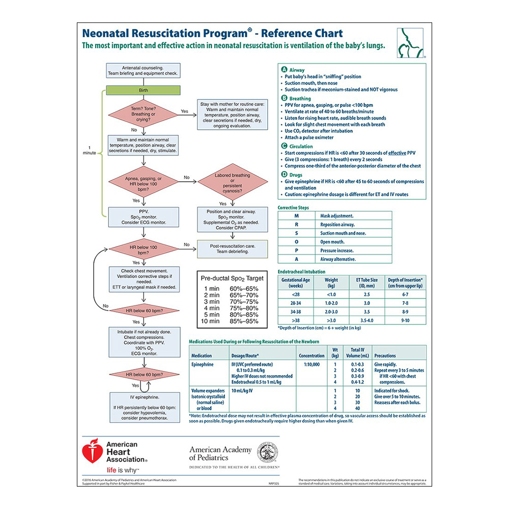
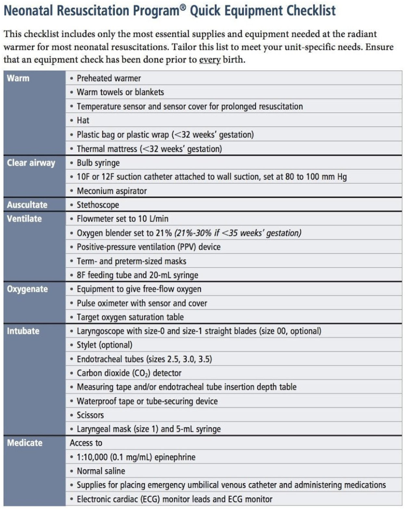

# Neonatology (NICU)

## APGAR Scoring
|                   | 0 | 1 | 2 |
|-------------------|---|---|---|
|HR                 |<60|60-100|>100|
|Color              |Blue throughout|Pink body & blue extremities|All pink|
|Respiratory effort |No effort|Weak cry, hypoventilation|Strong cry|
|Tone               |Limp|Some flexion w/o active movement|Active movement|
|Reflex irritability|No response|Grimace|Cry/cough/sneeze|

## Neonatal Respiratory Disorders & Delivery Room Pathology

- Can be divided into:
	- Upper airway blockage (choanal atresia, pharyngeal airway malformation)
	- Impaired lung function

### Choanal Atresia

#### History
Pink when crying, cyanotic when quiet. Inability to pass NG tube in one or both sides

#### Management
Oral airway, intubation

### Pharyngeal Airway Malformation

#### History
Persistent Retractions, poor aeration

#### Management
Prone positioning, posterior nasopharyngeal tube

### Congenital Diaphragmatic Hernia (CDH)

#### History
Assymetric lung sounds, cyanosis with bradycardia, scaphoid abdomen. 

#### Diagnosis
Most likely on prenatal imaging in patients with prenatal care. Postnatally diagnosed with CXR

#### Management
Intubation, **avoid positive pressure**! Place orogastric tube. 

### Pleural Effusion

#### History
Diminished aeration with poor osygenation/ventilation

#### Management
Intubation, needle thoracentesis +/- chest tube. Volume expansion if hemodynamically unstable. Fluid analysis to determine type and source of fluid. 

### Pneumothorax

#### History
Persistent cyanosis, hypoxemia, +/- bradycardia associated with respiratory distress

#### Diagnosis
CXR 

#### Management
Needle thoracentesis immediately, chest tube if recurrent 

### Meconium Aspiration

#### History
Meconium stained fluid, respiratory distress and/or apnea if severe

#### Diagnosis
CXR

#### Management
Can deep suction upper airway. Tracheal suctioning not recommended. Intubation per NRP 

#### Complications
Can cause lung inflamation and direct surfactant inactivation and one of the causes of persistnet pulmonary hypertension, there is a range of severity but can be quite severe! 

### Persistent Pulmonay Hypertension (PPHN)

#### History
Asphyxia, mecoumium aspiration, intrinsic lung disease

#### Clinical Manifestations
Hypoxemia, hypotension

#### Diagnostics
CXR with decreased pulmonary vasculature. ECHO with increased R->L shunting. 

#### Management
- Ultimate goal is to decrease the pulmonary vascular resistance and increase pulmonary blood flow. 
- Oxygenation Index (OI): Helpful numeric index evaluating oxygenation to direct management decisions
	- **OI = FiO2 x MAP / PaO2**

### Respiratory Distress Syndrome (RDS)

#### Etiology
Surfactant deficiency, common in premature infants

#### Symtpoms
Hypoxia with respiratory distress 

#### Diagnostics
CXR with ground glass opacities, low lung volumes, air bronchograms 

#### Management
- CPAP or if severe respiratory distress/apnea intubation 
- Surfactant administration if intubated. Can give 2 doses if still intubated 12 hrs after the 1st dose
- Minimize barotrauma and FiO2 

### Transient Tachypnea of the Newborn (TTN)

#### Etiology
Delayed retention of amniotic fluid

#### History
Typically a term infant, higher risk with birth by C-section. 

#### Clinical Manifestations
Tachypnea, respiratory distress, +/- hypoxemia 

#### Diagnosis
CXR with prominent vasculature and fluid in the fissures

#### Management
Supportive care, usually improves in 4-6 hrs. If O2 needs or symptoms last longer than 24 hrs, question diagnosis.

## Neonatal Cardiology	
**NOTE:** See [Cardiology chapter](#cardiology) for full details.

### Blood Pressure for Premature Infants 
- Can be controversial as there are no normatives in the literature, but rough rule of thumb:
	- First 1-2 DOL, MAP = GA (i.e. 24wk infant → goal MAP >24) 
		- Some evidence that MAP should be > 30 mmHG even for ELBW
	- After first few DOL, goal MAP = GA + 5
	- For infants w/ **PPHN**, goal MAP should be based on pulmonary blood flow and urine output, even if it requires higher MAPs than typical for GA (sometimes 40-50 mm Hg)
- Key is to monitor **urine output, pulses, perfusion, trends in BUN/Cr**
	
### Patent Ductus Arteriosus (PDA)

#### Etiology
Failure of ductal tissue to close in the premature infant. Affects about 60% of infants <28 weeks.

#### Clinical Manifestations
- Continuous machine-like murmur
- Hypotension, widened pulse pressure, hyperactive precorium
- Worsening oxygenation and ventilation, secondary to pulmonary over-circulation
- Metabolic acidosis

#### Diagnosis
Echocardiogram 

#### Management
- **Medical therapy:** Indomethacin or ibuprofen or tylenol 
	- Generally contraindicated if large IVH, severe oliguria, or NEC
- **Surgical ligation**
- **Watch & wait:** w/ symptomatic support (i.e. ventilator management, pressors for MAP support)

## Neonatal Hematology

### Anemia

#### Definition
Depends on gestation and chronologic age
 
#### Differential
- **Iatrogenic:** Frequent blood draws, surgical/procedural blood loss
- **Hemorrhagic:** Placental abruption, umblical cord disruption at delivery, head trauma (subcaleal, cephalohematoma), NEC, twin-twin transfusion, IVH
- **Hemolytic:** Rh incompatability, ABO incompatability

#### Work-up
- CBC, retic, type and Coombs, smear, bilirubin, HUS or head imaging if risk for IVH
- At birth: Delivery history, PE,  Kleinhauer-Betke on mother (determines if fetal blood is in maternal circulation) in addition to above

#### Management
- **NOTE:** Transfusion criteria for term and premature infants does not have robust data and is controversial. It tends to be ***facility dependent.***
- **Preterm:**
	* If intubated and acutely ill, Hct 35-40 
	* If "feeding and growing," Hct >30 w/ good reticulocyte 
- **Term:** 
	* If acultely ill, consider transfusing to goal Hct >40 
	* If hemodynamically stable, goal Hct >25 

### Polycythemia

#### Definition
Hct >65

#### Differential
Increased fetal production, placental insufficiency, thyrotoxicosis, gestational diabetes (GDM), genetic disorders (e.g. Trisomy 21, Beckwith-Wiedemann), hypertransfusion, delayed cord clamping, twin-twin transfusion

#### Work-up
- CBC, monitor for hypoglycemia, follow bili & electrolytes
- Monitor especially if there are neurologic symptoms or respiratory distress

#### Management
Partial exchange transfusion w/ normal saline, ideally w/ UVC

- **Indications:** Hct >65 w/ symptoms, >70 and asymptomatic

### Thrombocytopenia

#### Definition
Plt <150 

#### Differential
- **Increased destruction/consumption:** Autoimmune, alloimmune (NAIT), infection/DIC/NEC, drug-induced/toxicity, hypersplenism, Kasabach-Merrit Syndrome, following transfusion
- **Decreased production:** Thrombocytopenia-absent radius, Fanconi anemia, Trisomy 13, 18, 21
- **Miscellaneous:** Asphyxia, pre-eclampsia, Type 2B Von-Willebrand

#### Work-up
- **Labs:** Repeat platelet count, coagulation studies
- **Imaging:** Consider HUS
- Exam for evidence of bleeding
- Maternal history including maternal platelet count

#### Management
Depends on etiology, symptoms, and upcoming needs (i.e. procedures)

- **Platelet goals:**

|GA      |Symptomatic|Asymptomatic|
|--------|-----------|------------|
|Term    | >50-100k  | >20-30k    |
|Pre-Term| >100k     | >50k       |

* Management specific to **Neonatal Alloimmune Thrombocytopenia (NAIT):**
	* Goal plts >20-30k if no active bleeding (use antigen negative platelets to transfuse)
	* Check HUS 
	* Consider steroids or IVIG 
	* Maternal platelet typing

## Neonatal Neurology

### Interventricular Hemorrhage (IVH)

#### Pathophygiolosy
Blood vessel/blood brain barrier development is premature leaving very delicate, fragile blood networks 

#### Screening
- **Screening criteria (indications for HUS):** GA <32 wks, BW <1500g, low Hct, low plts, unstable BPs, prolonged hypotension, cardiopulmonary arrest, pneumothorax, asphyxia, pre/during ECMO
	- **Timing:** DOL 3, 7-10, 30, 60 (consider in first 24 HOL if very ill ELBW)

#### IVH Grading 
- **Grade I:** Germinal matrix hemorrhage (GMH)
- **Grade II:** Intraventricular hemorrhage **without** ventricular dilation 
- **Grade III:** Intraventricular hemorrage **with** ventricular dilation
- **Grade IV:** Grade III + parenchymal hemorrhage

### Therapeutic Cooling 

#### BWH Protocol
***NOTE:*** Protocols are ***site-specific!*** This section reviews the **BWH** protocol. Access BMC info via the BMC Infonet.

- **Standard eligibility criteria:**
	- _>_ 34 wks gestation
	- Any one of the following:
		- Sentinel event prior to delivery
		- Apgar score _<_ 5 at 10 min
		- Requires PPV, intubation, or CPR at 10 min
		- pH _<_ 7.1 from cord or blood gas within 60 min of birth
		- Abmormal base excess _<_ -10 meq/L from cord or blood gas within 60 min of birth
	- Any one of the following:
		- Neonatal encephalopathy score _>_ 4
		- Seizure or clinical concern for seizure
- **Exclusion criteria:**
	- **Absolute** contraindication: <34 wks gestation
	- **Relative** contraindications: Severe IUGR, <1750g, severe congenital anomalies/genetic syndromes/known metabolic disorders, major intracranial hemorrhage, overwhelming sepsis, uncorrectable clinically significant coagulopathy

#### Management
**Site-specific** as encompassed in respective protocols, but below are some general guides:

- **Cardiovascular monitoring**
- **Total fluid goal** of 60 ml/kg/day. Can do up to 10 mL/kg/day of eneteral feeding if clinically stable.
	- At BWH, infant will be on starter PN and then custom PN while cooled
- **Sedation:** Morphine 0.05 mg/kg loading dose, followed by 0.01 mg/kg/hr infusion. Can decrease to 0.005 mg/kg/hr after 12 hrs.
- **Neuromonitoring**
	- EEG for 24 hrs, can be switched to aEEG if EEG w/o seizures
	- HUS on admission
	- MRI on DOL 4 after re-warming, and after DOL 10-21
	- If leaving protocol early, consider MRI 24-48 hrs after rewarming
- **Seizures**
	- Drug of choice: Phenobarbital 20 mg/kg loading dose, w/ serum level 2-12 hrs
	- 2nd choice: Fosphenytoin 20 mg/kg
	- 3rd choice: Midazolam 0.05 mg/kg IV one time followed by 0.15 mg/kg/hr for 12 hours then taper over 24 hrs
- **Lab monitoring** (suggested)
	- **On admission:** Lactate, blood gas, CBC, PT/PTT/INR, fibrinogen, blood culture
	- **At 12 hrs:** BMP, Mg, ALT, AST

## Neonatal Infectious Disease

### Sepsis
- Use [Kaiser Early Onset Sepsis (EOS) risk calculator](https://neonatalsepsiscalculator.kaiserpermanente.org/) for > 34 wks 
- Otherwise, use clinical illness in coordination w/ maternal fever, ROM, GBS status to help determine treatment

### TORCH infections 
- **When to be concerned:** IUGR/SGA (<10th% for age), failed hearing screen, blueberry muffin rash, hepatosplenomegaly, unexplained direct hyperbilirubinemia
- Infections and how to diagnose them:
	- **Toxoplasmosis:** Newborn Screen (NBS)
	- **Syphilis (other):** Maternal screen
	- **Rubella:** Maternal screen 
	- **CMV:** Urine CMV shell or Buccal CMV PCR
	- **HSV:** Maternal history or PCR/cultures from suspected lesions on baby. HSV PCR from blood/CSF.

### Vertical Transmission

#### Hep B
See Newborn Nursery chapter

#### HIV
Call ID consult w/ maternal labs and history to initiate treatment **AS SOON AS POSSIBLE!**

## Neonatal Endocrinology

### Hypoglycemia 

#### Definition
Goal glucose value depends on age:

- 0-4 hours of life (HOL) = >40
- 4-24 HOL = >45
- 24-48 HOL = >50
- Greater than 48 HOL = >60

#### Risk factors 
Infant of diabetic mother (IDM), birth weight <2500g, SGA (<10%ile) or LGA (>90%ile), preterm (<37w) or post-dates (>42w), 5-min Apgar <7, maternal meds (beta blocker, terbutaline given to mom w/i 48 hrs of delivery, respiratory distress > 1hr, family history of hypoglycemia, congenital syndrome or midline abnormalities

#### Management
Depends on age and value:
 
- If mild for age, can feed
- If severe for age, consider D10W 2 mL/kg bolus and/or maintenance D10W at 60 mL/kg/day

## Neonatal Gastroenterology

### Emesis in an Infant

#### Differential

**Medical vs. Surgical**

|Medical|Surgical|
|-------|--------|
|- Anxiety, excitement - Celiac disease - CAH - Improper feeding - Inborn errors of metabolism - Infection (sepsis, UTI, meningitis) - Esophageal dysmotility - Excessive crying - Food allergies - Gastroenteritis - GERD - Ingestion of maternal blood/mucous - Kernicterus - Milk protein allergy - NEC - Overfeeding|Annular pacreas - Appendicitis - Atresia, stenosis, webbing - Duplications - Esophageal atresia - Functional ileus - Hernias - Intussusception - Malrotation w midgut volvulus - Meconium ileus - Meconium plug syndrome - NEC w/ perforation - Pyloric stenosis - Testicular torsion - Tracheoesophageal fistula (TEF) - Tumors - Ulcers - Vascular rings|

**Bilious vs. Non-Bilious**

|Bilious **OR** Non-Bilious|Likely **NON**-Bilious|
|----------------------|------------------|
|- Intestinal atresia - NEC - Meconium plug - Meconium ileus - Malrotation - Volvulus - Hirschsprung Disease|- Pyloric stenosis - Intussusception - Reflux|

#### Work-up
- **Imaging:** Always start w/ KUB!
	- Ultrasound for anatomic, NEC or intussusception
	- Consider contrast study
		- Upper if concern for malro/volvulus
		- Lower in concern for jejunal/ileal atresia
- Sepsis eval if concerned for NEC
- Bowel rest
- If concerned for surgical diagnosis, consult Surgery
- Further **lab evaluation** depending on clinical presentation/suspected etiology: CBCd, chem10, blood gas, lactic acid, LFTs, amylase/lipase, BCx, UA/UCx, stool guaiac, consider metabolic/endocrine work-up

### Acute Abdomen in the Neonate

|"High" Obstruction|"Low" Obstruction|"Acquired" Disease|
|------------------|-----------------|------------------|
|- Esophageal atresia - Duodenal atriesia - Duodenal web - Annular pancreas - Malrotation - Jejunal atresia|- Ileal atresia - Meconium ileus - Meconium plug - Hirchsprung disease - Anal atresia|- NEC - Hypertrophic pyloric stenosis - Incarcerated inguinal hernia - Gastroenteritis - Sepsis - Perforated stress ulcer |
|**Main symptom:** Emesis|**Main symptom:** Constipation|   |
|**KUB:** No distal bowel gas|KUB: Dilated small bowel loops (proximal to obstruction) and microcolon (distal to obstruction)|   |

### Indirect Hyperbilirubinemia
- **ALL infants:** Juandice in the **first 24 HOL** should **ALWAYS** be considered pathologic and prompt an **immediate** serum bilirubin, both total **and** direct
- Infants **_>_ 35 wks GA:** Use [BiliTool](http://bilitool.org/)
- **Premature infants** have light level (LL) and exchange transfusion levels based on gestational age (use corrected GA):

|Gestational Age (corrected)|Phototherapy at TsB|Exchange Transfusion at TsB|
|--------------------|---------------|---------------|
| <28w 0/7           |       5       |       11      |
| 28w 0/7 to 29w 6/7 |       6       |       12      |
| 30w 0/7 to 31w 6/7 |       8       |       13      |
| 32w 0/7 to 33w 6/7 |       10      |       15      |
| 34w 0/7 to 34w 6/7 |       12      |       17      |

- Other management if approaching **exchange transfusion:**
	- Aggressive phototherapy
	- Aggressive hydration (IV + PO)
	- IVIG if Coombs positive
	- Consider steroids
	- Prepare for exchange transfusion (call blood bank)

### Neonatal Entercolitis (NEC)

#### Etiology
- Precise etiology unclear
- Affects 10% of premature infants, w/ increased incidence at lower gestational age
- **Risk factors:** Prematurity, IUGR, preinatal asphyxia, PDA, shock/hypotension, umbilical arterial catheter (UAC), congenital heart disease

#### Clinical Manifestations 
- Abdominal distension/discoloration/redness, feeding intolerance, heme positive stools (may be grossly bloody)
- **Non-specific systemic symptoms,** including: lethargy, apnea, temperature instability, unexplained acidosis, hyperglycemia, poor perfusion
* **Lab abnormalities:** Hyponatremia, hyperkalemia, metabolic acidosis, leukocytosis or leukopenia, thrombocytopenia

#### Work-up
- **Labs:** CBCd, blood culture, electrolytes
- **Imaging:** KUB w/ left lateral decub

#### Management
- Supportive care
- Place replogle tube for decompression
- Antibiotics, start IVF/TPN
- Monitor labs and KUB serially
- Surgery consult

### Malrotation (+/- Mid Gut Volvulus)

#### Etiology
- Developing bowel fails to undergo usual counterclockwise rotation during 4th-10th wk of embryogenesis
- Peritoneal bands that usually attach bowel to central body axis are misplaced and compress duodenum, resulting in partial obstruction
- Volvulus results in intestinal obstruction
- Superior mesenteric artery may be compressed leading to ischemia

#### Clinical Manifestations 
- Newborn <1mo w/ bilious emesis
- Associated w/ diaphragmatic hernia, omphalocele, gastroschisis 

#### Work-up
- **KUB:** Usually unremarkable, may have signs of small bowel obstruction
- **UGI:** Abnormal position of duodenal-jejunal junction. Volvulus appears as spirla corkscrew of duodenum.
- **US:** May show volvulus in small bowel

#### Management
Emergent surgical intervention

- **Modified Ladd's Procedure:**
	- Division of peritoneal bands around the duodenum
	- Colon placed on the left w/ duodenum on the right, to broaden the mesentery 
	- Appendectomy preformed so no confusion w/ future abd pain

### Duodenal Atresia 

#### Etiology
Embryogenic. 1 in 5,000 live births. 25% have Trisomy 21.

#### Clinical Manifestations 
Bilious vomiting hours after birth w/o abdominal distention 

#### Work-up 
KUB shows **double bubble sign** (gaseous distension of stomach and proximal duodenum)

#### Management
- NPO w/ NG suction
- Surgical consult for duodenoduodenostomy

### Jujonoileal Atresia

#### Etiology
- Mesenteric vascular accident during fetal life
- 1 in 3,000 live births

#### Clinical Manifestations
Bilious vomiting hours after birth w/ abdominal distension, failure to pass meconium; hyperbilirubinemia 

#### Work-up
KUB shows air-fluid levels

#### Management
- NPO w/ NG suction
- Surgical consult for resection and anastomosis

### Meconium ileus 

#### Etiology
5% of newborns with cystic fibrosis, and in 1 per 5,000 to 10,000 live births

#### Clinical Manifestations 
Abdominal distension and vomiting hours after birth, failure to pass meconium

#### Work-up 
- KUB shows distension, air fluid levels
- Contrast enema shows microcolon +/- inpacted meconium pellets

#### Management
- NPO w/ NG suction
- Water soluble contrast enema
- Surgical enterostomy if needed
