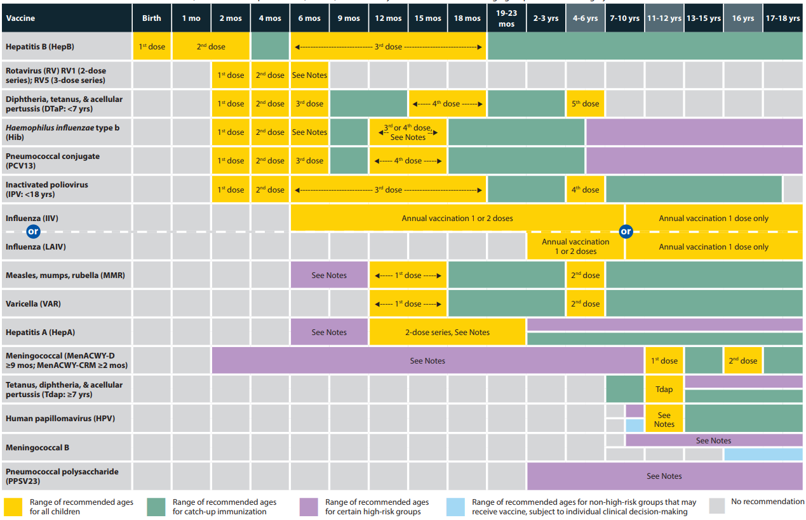
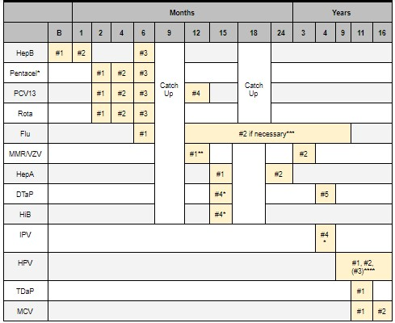
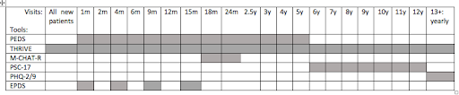

# Primary Care

## Developmental Milestones
|             | Gross Motor                                                                                                                   | Fine Motor                                                                                                                      | Social Language/Self-Help                                                                                                                                | Verbal Language                                                                                                                                                                        |
|-------------|-------------------------------------------------------------------------------------------------------------------------------|---------------------------------------------------------------------------------------------------------------------------------|----------------------------------------------------------------------------------------------------------------------------------------------------------|----------------------------------------------------------------------------------------------------------------------------------------------------------------------------------------|
| First Visit | Reflexively moves arms and legs, Lifts head briefly when on stomach                                                           | Keeps hands in fists                                                                                                            | Periods of wakefulness, Looks at parent when awake, Calms when picked up                                                                                 | Cries with discomfort, Calms to parent’s voice                                                                                                                                         |
| 2m          | Lifts head and chest when on stomach, Keeps head steady when sitting                                                          | Opens and shuts hands, Briefly brings hands together                                                                            | Smiles responsively, Makes sounds to show happiness/upset                                                                                                | Makes cooing sounds                                                                                                                                                                    |
| 4m          | Supports self on elbows and wrists when on stomach, Rolls from stomach to back, Pushes down on legs when feet on hard surface | Keeps hands unfisted, Plays with fingers in midline, Grasps objects                                                             | Laughs, Looks for caregiver when upset                                                                                                                   | Turns to voices, Makes extended cooing sounds, Begins to babble                                                                                                                        |
| 6m          | Rolls from back to stomach, Sits briefly without support, Supports weight on legs while held “standing”                       | Passes toys between hands, Rakes small objects, Bangs small objects on surfaces                                                 | Pats or smiles at own reflection, Looks when name is called, Knows familiar faces                                                                        | Babble, “ga”, “ma”, “ba”, Responds to sounds by making sounds                                                                                                                          |
| 9m          | Sits well without support, Pulls to stand, Crawls                                                                             | Picks up food to eat, Picks up small objects with 3 fingers and thumb, Lets go of objects intentionally, Bangs objects together | Uses basic gestures (wave bye), Looks for dropped objects, Turns when name is called, Plays Peek-a-boo, May be afraid of strangers                       | Says “Dada” “Mama” nonspecifically, Copies sound that parent makes, Looks around when hearing things like “where’s your bottle?”                                                       |
| 12m         | Cruising, May take first independent steps, Stands without support                                                            | Uses 2-finger pincer grip, Picks up food to eat, Drops objects in a cup, Uses index finger to point                             | Looks for hidden objects, Imitates new gestures, May be shy or nervous with strangers, Cries when parents leave                                          | Uses “Dada” “Mama” specifically, Uses 1 other word, Makes sounds with changes in tone, Follows directions with gestures                                                                |
| 15m         | Squats to pick up objects, Crawls up a few steps, Runs                                                                        | Makes marks with crayon, Drops objects in and takes objects out of container                                                    | Imitates scribbling, Points to ask for something                                                                                                         | Uses 3 words other than names, Follows directions without a gesture                                                                                                                    |
| 18m         | Walks up steps with 2 feet per step, Sits in small chair, Carries toy while walking                                           | Scribbles spontaneously, Drinks from a cup, Eats with a spoon                                                                   | Engages with others for play, Helps dress and undress self, Points to pictures in book, Uses words to ask for help                                       | Identifies at least 2 body parts, Names at least 5 familiar objects                                                                                                                    |
| 2y          | Jumps on 2 feet, Kicks a ball, Begins to run, Walks up and down stairs holding on                                             | Stacks objects, Turns book pages, Draws lines and circles, Uses hands to turn objects (i.e. door)                               | Plays alongside other kids, Takes off some clothing, Shows defiant behavior and more independence, Copies others                                         | Uses 50 words, combines two to four words in short phrases, 50% understandable speech,  Follows 2-step command, Names 5 body parts, Repeats words overheard in conversation (careful!) |
| 3y          | Pedals a tricycle, Jumps forward, Climbs on and off chair/couch, Runs well                                                    | Draws a circle, Draws a person with head and 1 body part, Cuts with child scissors                                              | Puts on coat, jacket by themselves, Eats independently, Enters bathroom and urinates independently, Imaginative play, shares                             | 3 word sentences, 75% of words are understandable to strangers, Tells a story from a book, Understands simple prepositions, Carries on conversation with 2-3 sentences                 |
| 4y          | Skips on 1 foot, Climbs stairs, alternating feet without support                                                              | Draws simple cross, Draws person with 3 body parts, Unbuttons/buttons, Grasps pencil with thumb and fingers                     | Enters bathroom and has bowel movement independently, Brushes teeth, Dresses and undresses self, Well-developed imaginative play, Cooperates with others | Tells stories, words 100% intelligible to strangers, Follows simple rules in game, Draws recognizable pictures                                                                         |
| 5y/6y       | Balances on 1 foot, hops, skips                                                                                               | Can draw person with 6 body parts, Copies squares and triangles, Prints some letters/numbers, Can tie a knot                    | Follows simple directions, Dresses with minimal assistance, Aware of gender, Wants to please friends, wants to be like friends                           | Counts to 10, Names 4 or more colors, Speaks very clearly, Tells a simple story using full sentences                                                                                   |

**Milestones from Bright Futures and CDC**

Early Intervention is responsible for assessing developmental delays and providing appropriate support in children birth through 2 years and 9 months. The Public School System is responsible for assessing deficits and providing appropriate support after 2.9 years. Their initial assessment is called a “TEAM evaluation”. An Individualized Education Plan (IEP) is developed after the TEAM evaluation.

## Red Flags
**REGRESSION** (loss of skills) & **PARENTAL CONCERN** are red flags at any age

- Asymmetry

- Idiosyncratic speech, disordered sequence of development

- Poor intelligibility for age

- Abnormal tone or movement patterns at any age, spasticity, hypotonia, absent DTRs

- Persistent primitive reflexes

- Lack of developmentally appropriate response to visual stimuli

- Immature play (like younger child)

- Stereotypic play; lack of pretend

- School failure (either for specific subjects like reading or math, or generalized)

- Always check vision and hearing if any concerns – can be assessed as young as newborn

- Emotional dysregulation

- Abnormal attachment patterns (over-clingy, indiscriminate)

- Using one hand exclusively at any age

- Problems w/ feeding and/or swallowing

Age-Specific:

- Poor head control at **5 mos**

- Limited social smiling and shared enjoyment by **6 mos**

- Parent suspects hearing loss, babbling stops at **>6 mos**, lack of response to sound (check hearing!)

- Lack of transfer at **7 mos**

- Not sitting independently w/ hands-free at **8 mos**

- Not rolling back-front, not taking weight well through the legs when held at **9 mos**

- Limited gestures like pointing response to name, joint attention by **12 mos**

- No single words by **15 mos**

- Not walking by **18 mos**

- Limited social imitative play by **18 mos** (e.g. imitating housework)

- No combos by **24 mos**

- Limited pretend play (e.g. feeding doll) by **24 mos**

- Stutter past **3 ½ yrs** (or earlier if anxiety/mannerisms)

- Delayed self care (ADLs) at **4 yrs**

- Delayed printing at school entry

- No friends at school age

## Newborn Visit

### HPI

#### BIRTH/PREGNANCY HISTORY
G/Ps, prenatal labs 

Gestational age, birth method, GBS status, whether sepsis r/o required at birth

#### IN/OUTs
Feeding (8-12/24 hrs): breastfed vs. formula vs. mixed- go over feeding cues (rooting, hands to mouth, fussing)

No more than around 4 hours w/o feeding. 

Stool: transitioning from meconium (black, sticky) -> green -> yellow and seedy 

Urine: multiple times per day (# of voids = days of life up until DOL 6, then >6/day)

#### SLEEP

Supine, in own separate space on flat, firm mattress w/o pillows, blankets, or stuffed animals. 

Discuss dangers of co-sleeping

Room sharing recommended for first 6 months 

Discuss harm reduction (no alcohol/smoking, consider bringing bassinet into bed) if family is going to cosleep 

#### DEVELOPMENT 
See chart above

#### SOCIAL

Who lives at home, who is involved w/ care

Screen for postpartum depression/baby blues 

Assess mood of primary caretaker, can be exhausting and difficult time

### Exam

Full exam including red reflex, Ortolani and Barlow maneuvers, umbilical exam

Weight check: % of birth weight  (should regain BW by 10-14 days)

Check for dysmorphic features

### A/P

#### Immunizations/Supplements
Has child received Hep B in nursery? If no, give today. 

Vitamin D (400 IU daily) if exclusively breastfeeding or taking <32 oz of formula.

#### Anticipatory Guidance

- When to call: jaundice, temperature >100.4F, decreased feeding, decreased urine 

- Development: Impossible to spoil an infant, intermittent tummy time when supervised

- Sleep: Safe sleep as above 

- Nutrition:
  - If formula fed, go over how to properly mix formula, should take about 3-4 oz every 3-4 hours
  - If breastfeeding, go over safe storage of breastmilk
  - Breastmilk rule of 4’s - can be left at room temperature (77 F or colder) for 4 hours, refrigerator (40 F) for 4 days or freezer (<0F) for up to 6 months (best) to 12 months (acceptable)

- Safety: Rear facing car seat, avoid smoke, avoid hot liquids while holding baby, umbilical stump care

- Caregiver: Normalize caregiver feelings, offer community supports, can introduce idea of planning ahead re day care but may be too early and overwhelming at this stage for some families

#### Follow Up

- Determine if infant needs weight check

- 1 month visit

## 2 Month WCC

### HPI

#### IN/OUTs

Feeding (8-12/24 hrs): breastfed vs. formula vs. mixed

Stool: yellow and seedy

Urine: multiple times per day

#### SLEEP

Supine, in crib w/o pillows, blankets, or stuffed animals. 

Discuss co-sleeping 

#### DEVELOPMENT

See chart above

#### SOCIAL

Mother’s mood: screen for postpartum depression, plan for childcare, caretaker’s mood and supports

### Exam

Full exam including red reflex, Ortolani and Barlow maneuvers 
Weight, length, height: head circumference, growing along curve

### A/P

#### Immunizations/Supplements

- Vaccines: Hep B #2, Hib #1, DTaP #1, IPV #1 , PCV #1, Rotavirus #1 (NOTE: CHPCC gives HepB # 2 @ 1 month)

- Vitamin D (400 IU daily) if exclusively breastfeeding (should start at newborn visit)

#### Anticipatory Guidance

- When to call:  Temperature, decreased feeding, decreased wakefulness

- Development: Risk of falling once learn to roll, unswaddle arms at night once rolling, develop a plan for fussy periods 

- Sleep: safe sleep, place in crib before fully asleep

- Nutrition: If formula feeding, should take about 3-6 oz 5-8 times per day, wait to introduce solids until 4-6 months, no water or cow’s milk

- Safety: Rear facing car seat, avoid smoke, hand on baby at all times while on high surfaces

- Caregiver: Go over caregiver supports, family planning, daycare options 

- Dental: Avoid putting to bed w/ bottle

#### Follow Up

4 month CPE

## 4 Month WCC

### HPI

#### IN/OUTs

Feeding Q4-5 hours. breastfed vs. formula vs. mixed

Assess if started any purees/table foods

Stool: yellow and seedy

Urine: multiple times per day

Assess family history of severe food allergy/eczema 

#### SLEEP

Supine, in crib w/o pillows, blankets, or stuffed animals

#### DEVELOPMENT

See chart above

#### SOCIAL

Who lives at home; Mother’s mood: screen for postpartum depression, childcare plans

### Exam

Full exam including red reflex, Ortolani and Barlow maneuvers 

Weight, length, height: head circumference, growing along curve

### A/P

#### Vaccines/Supplements

Vaccines: Hib #2, DTaP #2, IPV #2, PCV #2, Rotavirus #2

Poly-Vi-Sol + IRON if > 50% breastfed or taking <32 oz formula per day

#### Anticipatory Guidance

- When to call:  Temperature, decreased feeding, decreased wakefulness

- Development: Provide safe opportunities to explore, continue tummy time, calming strategies for fussy periods, unswaddle arms at night once rolling, begin to learn baby’s temperament 

- Sleep: Place in crib before completely asleep, back to sleep, decrease overnight feeds

- Nutrition: If formula feeding should take about 4-6 oz 4-6 times per day, introduce solids (1 at a time), introduce peanut (peanut butter in baby oatmeal is good option), discuss dietary sources of iron (iron fortified cereal, pureed meat, dark leafy greens), discuss choking hazards

- Safety: Start baby proofing, keep small objects away from baby, keep one hand on baby, rear facing car seat 

- Caregiver: Go over caregiver supports, family planning, daycare options

- Dental: Avoid putting to bed with bottle 

#### Follow Up
6 month CPE

## 6 Month WCC

### HPI

#### IN/OUTs

Feeding Q4-5 Hours, breastfed vs. formula vs. mixed

Ask if started solids (if so, stool might be less frequent, firm/hard, constipation)

Stool: yellow and seedy

Urine: multiple times per day

#### SLEEP

Supine, in crib w/o pillows, blankets, or stuffed animals 

#### DEVELOPMENT
See chart above

#### SOCIAL
Who lives at home; Mother’s mood: screen for postpartum depression,  childcare plans

### Exam
Full exam including red reflex, Ortolani and Barlow maneuvers 

Teeth?

Weight, length, height: growing along curve

### A/P

#### Vaccines/Supplements

Vaccines: Hep B #3, Hib #3, DTaP #3, IPV #3 , PCV #3, Rotavirus #3
Eligible for flu vaccine (need two to complete series, separated by 1 month)

Continue Poly-Vi-Sol + IRON if > 50% breastfed or taking <32 oz formula per day

#### Anticipatory Guidance

- When to call:  Temperature, decreased feeding, decreased wakefulness

- Development: Engage in reciprocal play, read to baby 

- Sleep: Safe sleep, put baby to sleep awake but drowsy, try to eliminate night time feeds 

- Nutrition: If formula feeding, should take about 6-8 oz 3-5 times per day,  continue to work on solid food introduction (1 at a time), ensure baby has had peanut, go over dietary sources of iron (iron fortified cereal, pureed meat, dark leafy greens), discuss choking hazards, delay cow’s milk until1 year old, okay to offer small amounts of water

- Safety: Baby proof home, keep small objects away, give poison control number (1-800-222-1222), rear facing car seat, avoid baby walkers, don’t leave baby alone in the tub 

- Caregiver: Use trusted child care providers

- Dental: Brushing/wiping down teeth to build habits

#### Follow Up
9 month CPE

## 9 Month WCC

### HPI

#### IN/OUTs

Feeding Q4-5 hours. breastfed vs. formula vs. mixed

Solids, no overnight feeds

Stool: might be less frequent since starting solids, ask if stool if firm/hard and if pt having abdominal distention (these are signs of constipation)

Urine: multiple times per day

#### DEVELOPMENT
See chart above

### Exam
Full exam

Weight, length, height: growing along curve (head circum)

### A/P

#### Vaccines/Supplements/Screenings

Vaccines: check that have received 3 of: Hep B, Hib, DTaP, IPV, PCV, Rotavirus

Eligible for flu vaccine (needs 2 to complete series)

CBC and lead screening

Continue Poly-Vi-Sol + IRON if > 50% breastfed or taking <32 oz formula per day

#### Anticipatory Guidance

- When to call:  Temperature, decreased feeding, decreased wakefulness

- Development: Develop daily routine, allow for safe exploration, discuss separation anxiety, read/talk/sing together, avoid screens if possible, focus on positive reinforcement/redirection for discipline, start to learn baby’s temperament 

- Sleep: Eliminate overnight feeds, develop bedtime routine 

- Nutrition: If formula feeding should take about 7-8 oz 3-4 times per day, increase table food to 3 meals and 2-3 snacks, start to introduce more textures, avoid juice, avoid cow’s milk until 1, encourage starting to wean from bottle to cup, discuss choking hazards

- Safety: Rear facing car seat until age 2 or highest weight allowed by manufacturer , keep small objects away, avoid baby walkers, poison control number (1-800-222-1222), be within arm’s reach near water/pools/bathtubs

- Dental: Brush teeth, avoid bottle in bed 

#### Follow Up

12 month CPE , 1st dental visit at 1 year old or w/i 6 months of 1st tooth eruption

## 12 Month WCC

### HPI

#### IN/OUTs
Goals to have social meals, eat w/ family if feasible, 3 meals and 2-3 snacks spaced evenly. 

Transition from formula to whole milk

Solids, no overnight feeds

Stool: might be less frequent since starting solids, ask if stool if firm/hard and if pt having abdominal distention (these are signs of constipation)

Urine: multiple times per day

#### DEVELOPMENT
See chart above

### Exam

Full exam - ensure testes are descended bilaterally 

Weight, length, height: growing along curve (head circum)

### A/P

#### Vaccines/Supplements/Screenings

Vaccines: PCV#4, MMR#1, VZV#1

Eligible for flu vaccine (needs 2 to complete series)

CBC/lead screening if not done at 9 months

Ensure ferrous sulfate started if evidence of iron deficiency anemia 

#### Anticipatory Guidance

- When to call:  Temperature, decreased feeding, decreased wakefulness

- Development: Develop daily routine, focus on positive reinforcement/redirection for discipline, limit screen time, read/sing/talk together, options for developmentally appropriate play

- Sleep: Continue 1 nap a day, nightly bedtime routine, try to introduce a comfort object (blanket, stuffed animal) to help with any nighttime awakenings 

- Nutrition: Should be transitioned to cow’s milk (limit 16-24 oz per day), transition to cup from bottle, 3 meals with 2-3 snacks per day, trust a toddler to know how much to eat, continue to introduce textures, discuss choking hazards

- Safety: Rear facing car seat until age 2 or highest weight allowed by manufacturer , childproof home, poison control number (1-800-222-1222), be within arm’s reach near water/pools/bathtubs, discuss gun safety

- Dental: Make first dental appointment, brush teeth twice a day with plain water, no bottle in bed

#### Follow Up

15 month CPE, 1st dental visit at 1 year old or w/i 6 months of 1st tooth eruption

## 15 Month WCC

### HPI

#### IN/OUTs

Eat w/ family, 3 meals and 2-3 snacks spaced evenly. 

Drinks whole milk

Solids, no overnight feeds

Stool: might be less frequent since starting solids, ask if stool if 
firm/hard and if pt having abdominal distention (these are signs of constipation)

Urine: multiple times per day

#### DEVELOPMENT

See chart above

### Exam

Full exam including red reflexes and dental exam 

Weight, length, height: growing along curve (head circum)

### A/P

#### Vaccines
HepA#1, DTap#4, Hib#4, flu if hasn’t had

#### Anticipatory Guidance

- When to call:  Temperature, decreased feeding, decreased wakefulness

- Development: Try to allow child to choose between 2 options, stranger anxiety is normal at this age, read/sing/talk together, focus on positive reinforcement/redirection for discipline, limit screen time

- Sleep: Maintain consistent bedtime routine,  try to introduce a comfort object (blanket, stuffed animal) to help with any nighttime awakenings, should still take 1 daily nap 

- Nutrition: Should be transitioned to cow’s milk (limit 16-24 oz per day), fully transition to cups from bottles, 3 meals with 2-3 snacks per day, trust a toddler to know how much to eat, continue to introduce textures, discuss choking hazards

- Safety: Rear facing car seat until age 2 or highest weight allowed by manufacturer , childproof home, poison control number (1-800-222-1222), be within arm’s reach near water/pools/bathtubs, discuss gun safety

- Dental: Ensure they have had first dental visit, twice daily brushing, no bottle in bed 

#### Follow up
18 month CPE, 1st dental visit at 1 year old or w/i 6 months of 1st tooth eruption

## 18 Month WCC

### HPI

#### IN/OUTs
Eat w/ family, 3 meals and 2-3 snacks spaced evenly. Drinks whole milk

Starts developing preferences, important to introduce healthy foods multiple times

Stool: might be less frequent since starting solids, ask if stool if firm/hard and if pt having abdominal distention (these are signs of constipation)

Urine: multiple times per day

#### DEVELOPMENT
See chart above

### Exam
Full exam including red reflexes and dental exam 

Weight, length, height: growing along curve (head circum)

### A/P

#### Vaccines/Screenings

Vaccines: Catch-up and flu

MCHAT for Autism 

#### Anticipatory Guidance

- When to call:  Temperature, decreased feeding, decreased wakefulness

- Development: Reinforce limits and appropriate behavior, focus on positive praise, allow child to choose between 2 options when possible, limit screen time, talk/read frequently with your child in simple words to help with language 

- Sleep: Maintain consistent bedtime routine,  try to introduce a comfort object (blanket, stuffed animal) to help with any nighttime awakenings, should still take 1 daily nap 

- Nutrition: Ensure no more than 16-24 oz cow’s milk daily, ensure no more bottle, trust a toddler to know when they are full, try to have family meal times, often have to offer a new food several times 

- Safety: Rear facing car seat until age 2 or highest weight allowed by manufacturer , childproof home, poison control number (1-800-222-1222), be within arm’s reach near water/pools/bathtubs, discuss gun safety, install stair/window gates now that child is walking/climbing 

- Dental: Ensure they have had first dental visit, twice daily brushing, no bottle in bed 

#### Follow up
2 year CPE, 1st dental visit at 1 year old or w/i 6 months of 1st tooth eruption

## 2 Year Old WCC

### HPI

#### IN/OUTs

Eat w/ family, 3 meals and 2-3 snacks spaced evenly. Transition to 1-2% milk.

Starts developing preferences, important to introduce healthy foods multiple times

Beginning of awareness of urges to urinate and stool, discomfort in diaper, interested in toileting

#### DEVELOPMENT
See chart above

### Exam
Full exam

Weight, height: growing along curve (head circum)

Observe coordination, language (expressive and receptive), socialization 

### A/P

#### Vaccines/Screenings
Vaccines: HepA#2 and flu

CBC and lead

MCHAT for autism screening

#### Anticipatory Guidance
- When to call:  Temperature, decreased feeding, decreased wakefulness

- Development: Help child recognize emotions, encourage play with other children, start looking for signs of toilet training readiness, limit screen time to 1-2 hr/day, establish a routine and stick to it, clear/consistent limits and a lot of positive praise, read together daily, can start thinking about preschool enrollment around 2.5

- Sleep: Maintain consistent bedtime routine, try to introduce a comfort object (blanket, stuffed animal) to help with any nighttime awakenings, if awakening at night, provide quick reassurance and return to bed 

- Nutrition: Ensure no more than 16-24 oz cow’s milk daily, ensure no more bottle, trust a toddler to know when they are full, try to have family meal times, often have to offer a new food several times 

- Safety: Rear facing car seat until age 2 or highest weight allowed by manufacturer, childproof home, poison control number (1-800-222-1222), be within arm’s reach near water/pools/bathtubs, discuss gun safety, install stair/window gates now that child is walking/climbing, wear helmets on bikes/scooters, teach street safety

- Dental: Brush teeth twice daily

#### Follow up
2.5-3 year CPE, 1st dental visit at 1 year old or w/i 6 months of 1st tooth eruption

## 3 Year Old WCC

### HPI

#### IN/OUTs
Eat w/ family, 3 meals and 2-3 snacks spaced evenly. 1-2% milk.

Starts developing preferences, important to introduce healthy foods multiple times

Beginning of awareness of urges to urinate and stool, discomfort in diaper, interested in toileting

#### DEVELOPMENT
See chart above

### Exam
Full exam

Weight, height: growing along curve

Observe language and socialization 

### A/P 

#### Vaccines/Screenings
Vaccines: MMRV  and flu

CBC and lead

Begin BP screening

#### Anticipatory Guidance

- When to call:  Temperature, decreased feeding, decreased wakefulness

- Development: Encourage child to talk about feelings/experiences, encourage age appropriate imaginative/interactive play, continue to read together and allow child to “tell” the story, limit screen time to 1-2 hrs/day

- Sleep: Maintain consistent bedtime routine,  try to introduce a 
comfort object (blanket, stuffed animal) to help with any nighttime awakenings, if awakening at night, provide quick reassurance and return to bed

- Nutrition: Ensure no more than 16-24 oz cow’s milk daily, trust a toddler to know when they are full, try to have family meal times, often have to offer a new food several times, limit juice

- Safety: Forward facing car seat, switch to booster when child is at the highest weight allowed by carseat, teach street safety, discuss gun safety, wear helmets on bikes/scooters, can discuss protective factors of family/child resilience, poison control number (1-800-222-1222), be within arm’s reach near water/pools/bathtubs

- Dental: Brush teeth twice daily

#### Follow up

Yearly CPE, yearly dental visit

## 4 Year Old WCC

### HPI

#### IN/OUTs

Eat w/ family, 3 meals and 2-3 snacks spaced evenly. 1-2% milk.

Starts developing preferences, important to introduce healthy foods multiple times

Should be toilet trained 

#### DEVELOPMENT
See chart above

### Exam
Full exam

Weight, height: growing along curve

Observe language and socialization 

### A/P

#### Vaccines/Screenings

Vaccines: DTAP, IPV and flu 

CBC and lead 

Hearing and vision screening

#### Anticipatory Guidance
- When to call:  Temperature, decreased feeding, decreased wakefulness

- Development: Encourage child to talk about feelings/experiences, make opportunities for daily play, continue to read together and allow child to “tell” the story, limit screen time to 1-2 hrs/day, ask about plans for kindergarten 

- Sleep: Maintain consistent bedtime routine,  try to introduce a comfort object (blanket, stuffed animal) to help with any nighttime awakenings, if awakening at night, provide quick reassurance and return to bed, might eliminate daytime naps 

- Nutrition: Ensure no more than 16-24 oz cow’s milk daily, try to have family meal times, limit juice

- Safety: Forward facing car seat, switch to booster when child is at the highest weight allowed by carseat, teach street safety, discuss gun safety, wear helmets on bikes/scooters, can discuss protective factors of family/child resilience, poison control number (1-800-222-1222), be within arm’s reach near water/pools/bathtubs, discuss rules for safety with adults (no secrets, safe touching)

- Dental: Brush teeth twice daily w/ pea-sized amount of toothpaste

#### Follow up
yearly CPE, yearly dental visit

## School Age (~5-10)

### HPI

#### IN/OUTs
Emphasize healthy eating and continue to introduce healthy foods even if child does not like. Limit calorie containing beverages.

Typically toilet training; screen for enuresis/encopresis 

#### DEVELOPMENT
Assess school readiness (language understanding and fluency, communication of feelings). Provide opportunities for socialization and structured learning experiences like early childhood programs or pre-school.

School readiness includes SDH, think about organizations that could help your family navigate school system, particularly if there are any special needs

### Exam

Full exam including back exam for scoliosis

Weight, height: growing along curve

### A/P

#### Vaccines/Screenings

9y Vaccines: HPV and flu (second HPV in 6mo or at next WCC visit)

BP screening yearly 

Hearing and vision screening at 5y

Obesity screening

Lipid screening once between 9-11

#### Anticipatory Guidance

- Discuss 5-2-1-0 rule for nutrition: 5 servings of fruits/veggies, 2 hours or less of screen time daily, 1 hour of physical activity and 0 sugary beverages 

- Safety: emphasize accident prevention including drowning prevention and water safety/firearm safety, teach child how to be safe with other adults (safe touching, no secrets), always wear a seatbelt, always wear helmets on bikes/scooters, discuss street safety

- Address SDH and protective factors of family/child resilience 

#### Follow up
Yearly CPE, twice yearly dental visit

## Middle School (~11-13)

### HPI

#### IN/OUTs
Emphasize healthy eating and continue to introduce healthy foods even if child does not like. Limit calorie containing beverages. Allow child to choose between healthy options and be involved in food preparation.

#### DEVELOPMENT
Evaluate for school challenges. Discuss bullying, peer group, after school activities.

### Exam
Full exam

Weight, height: growing along curve

### A/P

#### Vaccines/Screenings
11y Vaccines: TDap#1, MCV#1 and flu

BP screening

Lipid screening once between 9-11

Obesity screening

#### Anticipatory Guidance

- Talk to child alone or discuss that this will happen at next visit.

- Discuss 5-2-1-0 rule for nutrition: 5 servings of fruits/veggies, 2 hours or less of screen time daily, 1 hour of physical activity and 0 sugary beverages 

- Discuss puberty and sexuality and gender identity. 

- Discuss drugs, tobacco products, and alcohol

- Discuss mental health, mood, and how to seek help

- Firearm and fire safety. 

- Always wear seatbelt and helmet

- Consistent limit setting and encourage positive behaviors 

- Address SDH and protective factors of family/child resilience 

#### Follow up
Yearly CPE, Twice yearly dental visit

## Adolescence (~13-18)

### HPI

#### IN/OUTs
Emphasize healthy eating and healthy choices. Discuss what child purchases and chooses for his or herself.

#### DEVELOPMENT
Evaluate for school challenges. Discuss bullying, peer group, after school activities. Discuss college preparation and resources for college assistance.

### Exam
Full exam

Weight, height: growing along curve

### A/P

#### Vaccines/Screenings
16y Vaccines: MCV#2 and flu

BP screening

Obesity screening

Yearly GC/CT in sexually active females

#### Anticipatory Guidance

- Talk to child alone

- Discuss 5-2-1-0 rule for nutrition: 5 servings of fruits/veggies, 2 hours or less of screen time daily, 1 hour of physical activity and 0 sugary beverages 

- Assess satisfaction with current weight and risk factors for eating disorders 

- Continue to discuss sexuality and gender identity. Discuss safe sexual practices.

- Discuss drugs, tobacco products, and alcohol.

- Discuss mental health, mood, and how to seek help. Assess for suicide risk.

- Firearm safety

- Consistent limit setting and encourage positive behaviors 

- Always wear seatbelt and helmet

- Address SDH and protective factors of family/child resilience 

#### Follow up
Yearly CPE, Twice yearly dental visit

## Vaccine Schedule (Birth to 18 years)

[Recommended Child and Adolescent Immunization Schedule by Medical Indication.](https://www.cdc.gov/vaccines/schedules/downloads/child/0-18yrs-child-combined-schedule.pdf)

## CHPCC Vaccine Schedule

\* PENTACEL = HiB + DTaP + IPV.  PEDIARIX = HepB + DTap + IPV.  KINRIX = DTaP + IPV

\*\* MMR + VZV (separate) given @ 12m, combined MMRV @ 3 y/o

\*\*\* Children 6m - 9y who have never had flu vaccine require 2 doses, 4 weeks apart.

\*\*\*\* If HPV course started before 15th birthday, only need two doses. Each dose should be 6-12m apart.

## CHPCC Screening Schedule

## BMC Clinic Screening Questionnaire Schedule

## Autism Management in Primary Care Clinic (**CHOP EBG)

### Who to Screen
All children at 18 mo and 24 or 30 mo

Any child over 12 mo with concerns

Risk factors for ASD: sibling w/ ASD, unusual social responses, genetic disorder

### How to Screen

PEDS questionnaire @ every visit

Do you have any concerns about your child’s development or behavior?”

MCHAT-R or MCHAT-R/F (modified checklist for autism in toddlers) at 18mo and 24mo

### Developmental Red Flags

Diminished, atypical, or no babbling by 12 months

Diminished, atypical, or no gesturing (e.g., pointing, waving bye-bye) by 12 months

Lack of response to name by 12 months

No single words by 16 months

Diminished, atypical, or no two-word spontaneous phrases (excluding echolalia or repetitive speech) by 24 months

Loss of any language or social skill at any age

Lack of joint attention

### Positive screening - what now?

Formal audiology testing

Early Intervention (EI) referral (<5 years old), EI services end at 2 years and 9 months

DBP or ASK clinic referral for all

Other specialty referrals as needed

### Follow up

1 month after positive screening w/ primary provider for continuity

Ensure EI referral was placed, answer family questions, make sure school is involved for children older than 2.9 years

## ADHD

### EBGs
ADHD, adolescents; ADHD, pre-school and school-age

### ADHD Definition
Persistent and pervasive inattention, hyperactivity, and/or impulsivity affecting cognitive, academic, behavioral, emotional, and social functioning in more than one setting.

### How to Screen
PSC-17, attention score of 7+ should prompt further assessment for ADHD

Age 4+ year:  Vanderbilt Assessment Scales (Diagnostic) (print from internet) 

- To be filled out by parent and teacher

- Obtain detailed information from teacher, including report cards, IEP

### Common Coexisting Disorders

Learning disabilities

Tic disorders

Anxiety

Depression

OCD

ODD

Substance abuse

### Additional Evaluation PRN

- PT/OT for motor deficits

- Speech/language eval if needed 

- Labs/imaging if risk factors for alternate organic diagnosis:
  - Blood lead levels, TSH, neuroimaging, EEG

### Considerations Prior to Initiating Pharmacotherapy

- Age: If <6, start with short acting and ensure they are also in behavioral therapy

- Make sure to document baseline height, weight, BP, HR and allergies

- Make sure to ask about personal hx of substance use, can consider nonstimulant or vyvanse (prodrug, thus lower abuse potential) if hx of SUD 

- Take a thorough history including personal hx of cardiac disease,  epilepsy, tics  or comorbid psychiatric conditions and family hx of cardiac disease or sudden cardiac death

  - If any concerning cardiac personal or family hx: obtain ekg and consider discussion with cardiology prior to starting stimulant medications

- Consider subspecialty consultation if age <6, significant psychiatric comorbidities, cardiac concerns, hx of epilepsy or tourette syndrome

\* See medication chart below for more information about common ADHD medications

### Follow Up
See patient for dose titration follow up every 1-2 weeks

- Up titrate dose until symptom remission, max FDA approved dose or patient experience treatment limiting side effects

- If patient is experiencing significant side effects or not having symptom remission can switch drug class (ie methylphenidate to amphetamine)

- If patient is well controlled in the AM and experiencing relapse of symptoms in afternoon, can consider adding in afternoon short acting medication 

- Make sure to document height, weight, BP and HR at each follow up visit

- Repeat vanderbilt forms once patient at stable dose of medication 

- All children with ADHD qualify for a 504 

- Provide a diagnosis letter to school See patient in clinic every 3-6 months once at stable dose of medication with tolerable side effects

### General Prescribing Principles

- In children 6 years and older, long-acting formulations are first line (improved compliance, lower abuse potential

- In children <6 years, short-acting formulations are first line. In this age group, medication should always be used in conjunction with therapy.

- Increase dose until either 1) symptoms are in remission, 2) patient encounters dose-limiting side effects, or 3) maximum daily dose is reached

- Before switching medication class 1)  maximize dose, 2) optimize dosing schedule, and 3) manage side effects

### Stimulants

#### Methylphenidates 

*First Line*

| Drug Name        | Starting Dose & Titration                                                                                                                                                        | Duration of Action | Notes                                                                                          |
|------------------|----------------------------------------------------------------------------------------------------------------------------------------------------------------------------------|--------------------|------------------------------------------------------------------------------------------------|
| Ritalin          | Start with 5 mg 1-2 times per day and increase by 5 mg per week until good control achieved. May need additional reduced dose in the afternoon. Max daily dose: 60 mg            | 3-4 hrs            | Oral solution or chewable tablets                                                              |
| Ritalin SR or LA | Start with 20 mg in the morning and increase by 20 mg per week until good control achieved. May need second dose or regular Ritalin dose in the afternoon. Max daily dose: 60 mg | 4-8 hrs            | Capsules can be opened and sprinkled. Offers steady release of medication throughout the day   |
| Focalin          | Start with 2.5 mg per day and increase by 2.5-5 mg per week until good control achieved. Max daily dose: 40 mg                                                                   | 3-4 hrs            | Focalin is twice as potent as other methylphenidates, so halve dose when converting to Focalin |
| Focalin XR       | Start with 5 mg per day and increase by 5 mg per week until good control achieved. Max daily dose: 30 mg                                                                         | 8-12 hrs           | Capsules can be opened and sprinkled                                                           |
| Concerta         | Start at 18 mg each morning and increase by 18 mg each week until good control achieved. Max daily dose: 72 mg                                                                   | 8-12 hrs           | Not ideal for children who cannot swallow pills                                                |

#### Amphetamines
*Second Line* due to higher incidence of side effects

| Drug Name   | Starting Dose & Titration                                                                                            | Duration of Action | Notes                                                      |
|-------------|----------------------------------------------------------------------------------------------------------------------|--------------------|------------------------------------------------------------|
|   Adderall  | Start with 5 mg 1-2 times per day and increase by 5 mg per week until good control achieved. Max daily dose: 40 mg   |       4-6 hrs      |                                                            |
| Adderall XR | Start with 10 mg in the morning and increase by 10 mg per week until good control is achieved. Max daily dose: 40 mg |      8-12 hrs      | Capsules can be opened and sprinkled                       |
|   Vyvanse   | Start with 30 mg in the morning and increase by 10-20 mg per week until good control achieved. Max daily dose: 70 mg |      10-12 hrs     | Capsules can be opened and sprinkled. Low abuse potential. |

*Stimulant Side Effects: Anorexia/weight loss, insomnia, irritability, headache, stomachache, increased BP/HR, tics (rare)*

#### Non-Stimulants 
*Third Line*

##### Norepinephrine Reuptake Inhibitors

| Drug Name               | Starting Dose  and Titration                                                                                                                              | Duration of Action                                                                                                  | Notes                           |
|-------------------------|-----------------------------------------------------------------------------------------------------------------------------------------------------------|---------------------------------------------------------------------------------------------------------------------|---------------------------------|
| Atomoxetine (Strattera) | Start with 0.5 mg/kg/day and increase after at least 3 days  to target dose of 1.2-1.4 mg/kg/day.  Max daily dose: 1.4 mg/kg or 100 mg, whichever is less | FDA approved pediatric depression age 8+,  most consistent evidence,  long half-life, assoc w behavioral activation | Takes 4-6 weeks  to see effects |

*NRI side effects: Nausea, GI upset, insomnia, sedation, decreased appetite*

##### Alpha Agonists
| Drug Name               | Starting Dose & Titration                                                                                                                | Duration of Action | Notes                                |
|-------------------------|------------------------------------------------------------------------------------------------------------------------------------------|--------------------|--------------------------------------|
|  Clonidine ER (Kapvay)  | Start with 0.1 mg at bedtime and increase by 0.1 mg per week until good control achieved. Max daily dose: 0.4 mg                         |      12-24 hrs     | Helpful for use as sleep aid as well |
| Guanfacine ER (Intuniv) | Start with 1 mg per day and increase by 1 mg per week until good control achieved, target dose 0.05-0.12 mg/kg/day. Max daily dose: 7 mg |      12-24 hrs     | First line in Tourette’s             |

*Alpha agonist side effects: hypotension, sedation, lightheadedness, dry mouth*

## Anxiety

### Types of Anxiety Disorders
Selective mutism, separation anxiety disorder, phobias, OCD, social anxiety disorder, generalized anxiety disorder, panic disorder

- Important to screen in patients with ADHD and to screen for ADHD in those with anxiety--often linked

### How to Screen
PSC-17 (Pediatric Symptom Checklist): 4+ year olds

- Looks at psychosocial functioning, externalization and internalization
SDQb (Strengths and Difficulties Questionnaire): 3 year olds +

- Sensitivity: 63% to 94% for emotional symptoms

- Specificity: 88% to 98% conduct problems

- Separate scale assesses impact of symptoms on global functioning
ASQ-SE (Ages and stages questionnaire—social emotional): 6-60 months

- Screens for social-emotional communicative, motor, problem- problems 
- Sensitivity: 71% to 85%

- Specificity: 90% to 98%

### Positive Screening

Obtain detailed hx re: symptoms, freq, duration, severity, degree of distress or interference

Consider SW involvement as needed

Behavioral Health/Psych referral

### Initial treatment (school aged)

CBT

Fluoxetine 10 mg daily - can uptitrate to 20 mg daily

**What if symptoms persist?** (school age): SSRI treatment in consult w/ psych, see medication table below for further recommendations

## Depression

### Background

Extremely significant cause of morbidity/mortality in children, >⅓ children experience a psychiatric disorder by childhood.

Cormorbidity with ADHD very common, important to screen for both.

Many types but most often will see:

1. Unipolar major depression (MDD): at least 2 weeks of depression plus 4 neurovegetative symptoms, no hx of mania

2. Persistent depressive disorder (Dysthmia): depression for  >2 years and at least 2 other symptoms (or MDD that persists for 2 years+)

### Neurovegetative Symptoms (SIGECAPS)

**S**leep disruption

**I**nterest deficit

**G**uilty Feelings

**E**nergy deficit

**C**oncentration deficit

**A**ppetite disorder

**P**sychomotor Changes

**S**uicidality

### How to Screen
Always screen for history of mania or bipolar symptoms (25-30% of Bipolar Disorder starts with depressive episode)

- Use PSC internalizing scale for anxiety/depression

- PHQ-9

\* Important to consider referral to psychiatrist for severe symptoms, significant comorbidities and for children <12

### Therapy
Should always be concurrent with starting medications (or offered), particularly in younger children. See tables below re medication management

### Follow Up

Follow up 2 wks after initiation and then 2-4 wks after, monitoring closely.

Most symptom improvement in 6-8 wks with some mild effects seen at 2 wks.

## Medication Management: Anxiety and Depression

### Side Effects/Precautions with SSRI use (see chart below for medication recs)
Black box warning: 

- Increase in suicidality/self harm after dose initiation or increase in dose

- Important to monitor closely during any initiation or changes

- Often suicidality exists prior to starting medication and important to assess prior and during medication management 

SSRI Activation Syndrome/Induced Mania

- Irritability, restlessness, agitation, impulsivity, hyperactivity, manic symptoms, psychosis

- Often emerges with initiation of SSRI or dose increase

- Risk higher in younger children and those at risk for bipolar disorder

QTc prolongation/cardiac events seen in escitalopram and citalopram in particular, consider closer monitoring or avoiding in patients with cardiac history

Avoid Wellbutrin in patients with eating disorders or seizure history

- Important to do good diet history prior to initiation given common disordered eating, particularly in adolescents

Serotonin syndrome

Most common mild side effects: GI, HA, sleep disturbances

### Anxiety
| SSRI                   | Range                                                      | Notes                                                                                       |
|------------------------|------------------------------------------------------------|---------------------------------------------------------------------------------------------|
| Sertraline (Zoloft)    | 50-200 mg                                                  | FDA approved pediatric OCD age 6+ (POTS), often requires high doses for OCD                 |
| Fluvoxamine (Luvox)    | 100-300 mg                                                 | FDA approved pediatric OCD ages 8+, BID dosing, monitor for drug/drug interactions          |
| Fluoxetine (Prozac)    | 20-40 mg                                                   | FDA approved pediatrics OCD 7+, long half-life, behavioral activation                       |
| Escitalopram (Lexapro) | 20-40 mg                                                   | FDA-approved pediatric depression, dose related QTc prolongation; lower side effect profile |
| Citalopram (Celexa)    | 20-40 mg *Do not exceed 40 mg daily given QTc prolongation | Dose related QTc prolonging; lower side effect profile                                      |

### Depression
First line: SSRI

| SSRI                   | Range    | Notes                                                                                                               |
|------------------------|----------|---------------------------------------------------------------------------------------------------------------------|
| Fluoxetine (Prozac)    | 20-40 mg | FDA approved pediatric depression age 8+,  most consistent evidence,  long half-life, assoc w behavioral activation |
| Escitalopram (Lexapro) | 20-40 mg | FDA approved for adolescent depression 12+,  well tolerated                                                         |
| Sertraline (Zoloft)    | 5-200 mg | FDA approved pediatrics OCD 7+                                                                                      |
| Citalopram (Celexa)    | 20-40 mg | QTc prolongation concern but lower side effects otherwise;   do not exceed 40 mg daily                              |

Second line: another SSRI

- Try increasing dose of first before switching to a second

- Switch to second SSRI if one is not working or side effects bothersome with first attempt

Third line: Refer to specialist; medications include venlafaxine, bupropion, mirtazapine, duloxetine

- Should be done in conjunction with a specialist

## BMC Primary Care Clinic Resources

### Asthma Education

**WHAT**: 5-10 minute check in w/ patients to review triggers, spacer teaching, med teaching, Asthma Action Plan,, screening for in home asthma services such as Breathe Easy

**WHEN**: Monday-Friday 9am-5pm. Appropriate for any patient w/ asthma here for WCE, urgent visit, etc.

**HOW**:  Reachable via pager 8818p

### Reach out and Read (ROR)

**WHAT**: Program to promote early literacy

**WHO**: Age child 6 months – 5 years

**HOW**: Kids ages 6 months – 5 years receive a book at every well child visit.

**WHERE**: The ROR books are located in the little office next to the nursing office in the main primary care clinic hallway – they are next to a bunch of stickers too!!

### Lactation Resources

**WHAT**: We have lactation consults (both in the clinic and in the newborn nursery) who can often help mom’s during the newborn visits.

**WHO**: Any mom who is breastfeeding or attempting to breastfeed, especially those who have babies who aren’t gaining good weight. Also appropriate to call them if moms have questions about pumping, latch, nipple pain, etc.

**WHEN**: Anytime during PC clinic

**HOW**: You can page the Child Life Specialist who is usually in clinic and can come work w/ moms! You can also page a lactation consultant from the newborn nursery but it is very likely that they will be too busy to come during your visit.

### Food Pantry

**WHAT**: Provides food resources (including fresh fruits and vegetables) to patients w/ food insecurity, chronic illness, etc.

**WHO**: Anyone who gets a referral; immigration status DOES NOT matter and you don’t need to document income when you refer, you just need to place the referral

**WHEN**: Open Monday – Friday; 10:00 AM – 4:00 PM; pts can go 2x monthly

**HOW**: Write a prescription for your patient in EPIC (they MUST have a Rx)

### Street Cred

**WHAT**: Organization started by BCRP alum Lucy Marcil to help families get the maximum amount on their tax returns

**WHO**: For all pts w/ income <54,000

**HOW**: Refer patients to street cred (use .STREETCRED in the EMR)
info@mystreetcred.org
(617) 414-5946

### Child Witness to Violence Project

**WHAT**: Provides social support and counseling for young (< 8y) children who have witnessed domestic violence. Run under the auspices of the DBP clinic. 

**WHERE**:  Counseling happens at BMC but there is no documentation left in the chart. This can be tricky because you will not know if your patients are receiving services based on chart review alone.

**HOW**: Call (617) 414-7425

## BMC Pediatrics Specialty Outpatient Clinics

### CCP Clinic

**WHAT**: Primary care home for patients w/ complex medical problems including NICU grads, patients w/ complex genetic disorders, etc.

**WHO**: All patients w/ multiple medical problems and/or exceptionally complex social situations AND their siblings

**HOW**: Talk to Dr. Jack Maypole (BCRP alum!)

### GROW Clinic

**WHAT**: BMC based clinic for kids w/ FTT, provides comprehensive wrap around services including social work and home visits performed by a dietician. Not a PCP

**WHO**: For FTT kiddos (I think only less than age 5)

**HOW**: Talk to the Grow clinic patient navigator (refer in EPIC)

### Baby Steps Clinic

**WHAT**: Provides coordination of care for babies who are preterm or have had complicated newborn courses; NOT primary care. Comprehensive team including pediatrician, nutritionist, OT, dieticians and close communication w/ neuro and GI

**WHO**: For any baby who had a tough newborn course, is having difficulty gaining weight or other challenges. (All preterm)

**HOW**: This is usually done when the baby leaves the nursery but if you think a baby would benefit from this clinic as well you can place a referral in EPIC

## SoFAR Clinic

**WHAT**: Primary Care Clinic for moms w/ a history of substance use and their babies (babies w/ a history of NAS) or exposure

**WHO**: Babies born to moms who struggled w/ substance use during pregnancy and their siblings. Moms get care too--Dyadic approach!

**HOW**: Usually referred to the clinic from the newborn nursery but this can also be done on the outpatient side. Reach out to SoFar clinic SW to schedule an intake for the family. 

### Teen and Tot Clinic

**WHAT**: Primary Care Clinic for teen moms and their babies – teen girls can get prenatal care in a centering group by midwife.  Teen girls and children are seen together during primary care visits. The clinic also has a patient navigators and is run by Dr. Pierre-Joseph

**WHO**: Teen moms and their babies/pregnant teens who have elected to become parents

**HOW**: Page Adrian Stevenson (teen and tot patient navigator) or talk to Dr. Adolphe  or Dr. Pierre-Joseph to transfer maternal/newborn care to teen and tot. Adrian will talk to the mom and do an intake

### IEP Clinic

**WHAT**: Clinic that is run by BMC preceptor Dr. Adolphe that bridges primary care w/ DBP, Helps w/ ADHD, ASD, learning/intellectual disorders. Appropriate for kids w/ IEP who aren’t making progress or accessing the curriculum well or if parents have questions about the IEP.

**WHEN**: Usually takes patients ~ 1 month to get in (for now)… if you need help sooner or in the meantime, reach out to Dr. Adolphe directly.

**HOW**: Place a referral in EPIC

### Family Planning Services

Birth control counseling, STD testing, options counseling, for patients of ANY AGE, same-day birth control available page Teakia Brown

### Pain Clinic
For kids with chronic pain (including functional), MD, acupuncturist, psychologist, PT

### CATALYST Clinic
Teens with substance use disorder

### Menstrual Disorders Clinic
Joint Adolescent/Heme Clinic

### Lead Clinic
Sean Palfrey, for kids with elevated lead

### CATCH Clinic
For gender affirming care

### Embedded Child Psychiatrist
Andrea Spencer available for “curbside consults” and “co-management of patients with behavioral health concerns”-- page directly or refer to Integrated Behavioral health

## BMC Indications for Social Work Consult

- Child Abuse

- Neglect

- Domestic Violence

- Sexual assault

- Mental health (depression, anxiety, psychosis, PTSD, etc.)

- Thoughts of suicidal ideation/homicidal ideation

- Substance abuse

- Family bereavement

- Newly diagnosed chronic or terminal illness

- Witnessing/part of community violence

- Family distress or dysfunction

- Bullying

Liz Renzella #3433, 4-7756
Jill Baker #2610, 4-7799

## BMC Clinic Tips

- Always review medications, allergies, etc by going to the A/P section of epic and clicking “mark all as reviewed”

- You can delete a note by clicking the “X” by the “sign note” or “pend note” drop down

- When ordering immunizations, use the order sets, which are present under “A/P” order section
  - Simply check off the box and sign the orders

- Huddle w/ your nurse and CA prior to clinic to discuss patients that may be late, clinic flow goals, complex patients, anticipated orders

- You know a patient is roomed when their vitals populate into your note

- To promote continuity, staple your card to the after visit summary

**You must import the flowsheets for the developmental screens into your note & indicate positive or negative**

**You must send your notes to your preceptor w/i 48 hours for signing and billing**

## CHPCC Co-Located "Specialty" Clinics

Refer patients with a PowerChart Order

### Asthma Clinic

In-depth education or intervisit care, including home visits, for asthma patients requiring more frequent visits and/or asthma patients with more severe disease. 

### Advocating Success for Kids (ASK)

A multidisciplinary team (developmental medicine, educational specialist, social worker, and primary care) assists children who are having academic difficulties, such as from ADHD or a learning disability, who are not making adequate progress despite having an IEP, and also conducts evaluations for autism spectrum disorder and other developmental delays.

### Rainbow

A multidisciplinary team to coordinate care for our clinic’s medically complex children. Owing to their medical complexity, patients with a “Rainbow” distinction get longer patient visits, inter-visit monitoring, and additional nursing, social work, and case management support.

### RASH

Have your patients’ skin concerns addressed quickly, in a primary care setting, by pediatricians. This is generally far faster than a referral to dermatology.

### Young Parents Program (YPP)

A teen-tot clinic that provides primary care for adolescent parents and their children. Dedicated YPP staff provide longitudinal supports.

## CHPCC Contacts

Fax: 617-730-0505

Charge RN: 84706

Front Desk: 58944

SW Pager: 0170

Child Life: 84708

Dental Clinic: 5654

Lactation: 56445

Newborn Pager (for scheduling visits): 5222

Navigator: 5931

YPP: 7718

