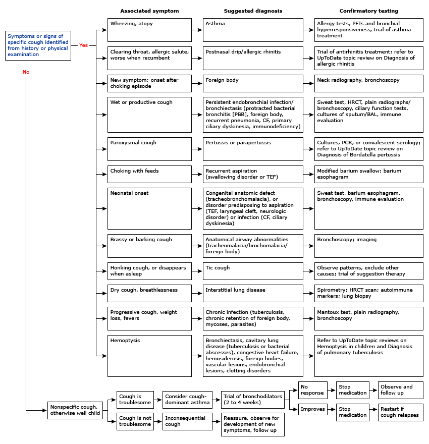
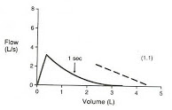
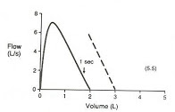

# Pulmonology 

## Asthma – ED/Inpatient: EBG
### History to Elicit
Time of onset, causes/triggers, symptom severity, prior treatments before presentation, last time of medications, last dose of oral steroids and past requirements for oral steroid doses

### Exam
- Tachypnea, hypoxia, altered mental status, accessory muscle use, URI symptoms, wheezing, prolonged expiratory phase, eczema, rash, signs of pneumonia/pneumothorax
- **Red flags**: dehydration, cyanosis/pallor, decreased aeration, AMS, admission w/i  1 year, ICU admission within 3 years, PCP/ED visit w/i 72 hours

### Etiology
Trigger → Production of IgE antibodies, overstimulation of mast cells/eosinophils → Inflammation, airway smooth muscle constriction, mucus production, edema → hyper-responsiveness of airway, obstruction, air-trapping → airway remodeling

### Work-up
* Assess severity w/ amount of dyspnea, RR, retractions, inspiratory vs. expiratory wheezes, and SpO2 (determines the HASS score).
* Not routinely recommended: CXR (unless prolonged fever, asymmetry post-albuterol, severe symptoms, hypoxemia, aspiration concern), viral testing, blood gas (if respiratory failure is suspected)

### Order Sets
“Asthma admit plan” (includes albuterol, Unineb, etc orders)

### Treatment
| Drug        | Use           | 
| ------------- |-------------| 
|**Albuterol**| -For mild-severe exacerbation MDI or nebulizer, base frequency on severity  -For MDI must use an aerochamber. In general, use w/ face mask (<6 mos = small orange facemask, 6 mos-6 yrs = medium yellow facemask, >6 years = large blue facemask)|
|**UniNeb** |For moderate-severe exacerbation  3 albuterol + 3 ipratropium over 1 hr|
|**Systemic Corticosteroids**|For moderate-severe exacerbation   Dexamethasone  Prednisone, prednisolone, or methylprednisolone|
|**Epinephrine**|For severe exacerbation  Administer by EpiPen if able|
|**Magnesium Sulfate**|For severe exacerbation  Administer w/ 20 cc/kg bolus of normal saline before dose to decrease risk of hypotension|
|**Terbutaline**|For severe exacerbation|
|**Heliox** (80% He + 20% O2)|For severe exacerbation   Contraindications: Requiring FiO2 >0.6 to maintain SpO2 >92%, Need for PPV, PTX, pneumopericardium, pneumoperitoneum|
*During flu season, also empirically treat for flu as patients with asthma are at high risk 

### Discharge Criteria
- HASS <7
- Pulse ox >94% 
- None or mild tachypnea 
- Normal mental status 
- None or minimal WOB 
- Good aeration 
- Mild expiratory wheeze only or clear 
- Access to necessary medications, devices, and appropriate follow up

## Asthma – Outpatient: 
EBG

### History to Elicit
Symptoms, nocturnal awakening, missed school, hospitalizations (ED, ICU, ETT), triggers, controllers, albuterol use, adherence, atopic history, vaccines, requirement for oral steroid courses.

Many of these factors go into the Asthma Predictive Index (wheezing episodes per year, asthma family history, eczema, allergic rhinitis, wheezing apart from colds, peripheral eosinophila >=4%)

### Presentation
SOB, coughing, wheezing, chest tightness

Exam: Tachypnea, hypoxia, altered mental status, accessory muscle use, URI symptoms, wheezing, prolonged expiration, eczema, rash

### Etiology

Trigger → Production of IgE antibodies, overstimulation of mast cells/eosinophils → Inflammation, airway smooth muscle constriction, mucus production, edema → hyper-responsiveness of airway, obstruction, air-trapping → airway remodeling

### Workup

PFTs +/- provocation test, other testing as suggested by differential diagnosis (immune work-up, GERD evaluation, allergy testing, sweat test, etc.)

### Severity Classification

|Variable|Intermittent|Mild|Moderate|Severe|
|---|---|---|---|---|
|Symptom frequency|≤2 d/wk|>2 d/wk|Daily|Throughout day|
|Nighttime awakenings|0-4 yr: 0   ≥5 yr: ≤2/mo|0-4 yr: 1-2/mo   ≥5 yr: 3-4/mo| 0-4 yr: 3-4/mo   ≥5 yr: ≥1/wk|0-4 yr: >1/wk   ≥5 yr: >7/wk|
|Interference w/ activity| None| Minor |Some|Extreme|
|SABA use|≤2 d/wk|0-4 yr: >2d/wk   ≥5 yr: >2/wk| Daily| Throughout day|
|FEV1% predicted|>80%|>80%|60-80%|<60%|
|Treatment|Step 1|Step 2|Step 3|Step 3|

### Stepwise Approach to Asthma Treatment
|Age|Step 1|Step 2| Step 3| Step 4| Step 5| Step 6|
|---|---|---|---|---|---|---|
|0-4|SABA PRN|Low dose ICS| Medium dose ICS| Medium dose ICS + (LABA OR montelukast)|High dose ICS + (LABA OR montelukast)|High dose ICS + (LABA or montelukast) + PO steroids|
|5-11|SABA PRN|Low dose ICS|Low dose ICS + LABA or LTRA OR Medium dose ICS|Medium dose ICS + LABA|High dose ICS + LABA|High dose ICS + LABA + PO steroids|
|>12|SABA PRN|Low dose ICS|Low dose ICS + LABA OR Medium dose ICS| Medium dose ICS + LABA| High dose ICS + LABA|High dose ICS + LABA + PO steroids|

## Bronchiolitis: EBG

### Presentation
URI symptoms → cough, wheezing/rales, increased WOB, peak symptoms 4-7 days of illness

Exam: rhinorrhea, cough, tachypnea, retractions, nasal flaring, grunting, crackles, wheezing

### Differential
Viral URI, asthma exacerbation, PNA, croup

Red Flags: apnea, respiratory failure, pneumothorax, bacterial PNA superinfection, dehydration

### Workup
Assess severity (mental/hydration/respiratory status); no routine indication for labs or CXR but consider if concern for bacterial superinfection

### Treatment
|Location|Treatment|
|---|---|
|**Outpatient**|Supportive w/ bulb suction, hydration, tylenol/motrin|
|**Inpatient**| Absolute admission criteria:  Apnea prior to admission   <37 weeks GA and age <48 weeks post-conception  Age <1 month  RA sat persistent <92%  RR persistent >70 for <12 months and >60 for >20 months  Severe retractions  Unable to feed  Wall suction, IVF, chest PT, supp O2 to maintain SpO2 >90%, spot check SpO2 HFNC - see ICP section for Bronchiolitis Pathway|
|**ICU** (if hypoxia respiratory failure)|Wall suction, IVF, chest PT, supp O2 to maintain SpO2 >90%, CPAP/BiPAP, consider albuterol, HTS, rac epi though little evidence to support benefits of therapy, NPO for aspiration risk |

### Prevention
Palivizumab for 1st 1-2 years of life depending on indication.   Indications may include HD significant congenital heart disease, CLD of prematurity (<32 weeks + supp O2 for 1st 28 days of life or BPD in children <2 years who required medical therapy within 6 months of RSV season,  born at <29 weeks gestation, anatomic pulmonary disorders, immunocompromised

## Approach to Cough

### Definition
Acute (less then 4 weeks) or chronic (>4 weeks)

### History to Elicit
* Age and circumstances of onset
* Nature of cough (dry vs. wet)
* Triggers
* Associated symptoms (particularly wheezing or allergy symptoms) 
* History of atopy/eczema
* History of recurrent infections
* History of travel
* Timing (night/day vs daytime only)

### Exam
Look for increased work of breathing, wheezing, atopy, boggy turbinates, conjunctivitis, dysmorphisms, cardiac abnormalities

### Differential Diagnosis
|Age|DDx|
|---|---|
|Infant|Chlamydia, viral (RSV, CMV, rubella), bacterial (pertussis), pneumocystis jiroveci, tracheoesophageal fistula, vascular ring, airway malformation (bronchogenic cyst, CPAM), pulmonary sequestration, CF, reactive airway disease/asthma, reflux, aspiration, interstitial lung disease, PCD, immunodeficiency, toxic exposures|
|Preschool to School age|Inhaled FB, mycoplasma, bacterial (pertussis), reactive airway disease/asthma, CF, bronchiectasis, PCD, viral, passive smoke inhalation, reflux, aspiration, interstitial lung disease, allergic rhinitis, sinusitis, croup, hypersensitivity pneumonitis|
|School age to Adolescence|Reactive airway disease/asthma, infectious, CF, psychogenic/habit cough, cigarette smoking, interstitial lung disease, reflux, aspiration, smoking, allergic rhinitis|

## Cystic Fibrosis: EBG
### Clinical Manifestations
* Pulmonary: Chronic airway disease w/ infection (H flu, S. aureus, P aeruginosa, Burkholderia, Steno, MRSA, atypical), bronchiectasis, air trapping, hypoxemia, hypercarbia
* Sinus: Sinus infections, nasal polyposis
* GI: Meconium ileus, constipation, distal intestinal obstructive syndrome, deficiencies in A, D, E, K, biliary disease
* Endocrine: CF related diabetes, osteoporosis from vitamin D deficiency
* MSK: Hypertrophic osteoarthropathy
* Reproduction: Congenital absence of vas deferens
* Renal: Nephrolithiasis due to chronic metabolic acidosis
* Hematologic: Recurrent venous thrombosis due to chronic inflammatory state

### Diagnosis
* Diagnostic Criteria: CF in 1+ organ system AND evidence of CFTR dysfunction through either elevated sweat chloride, two disease causing mutations, or abnormal nasal transepithelial potential difference
* Sweat Test:  <=29 normal, 30-59 intermediate, >=60 abnormal
* Newborn Screen: Massachuesetts NBS measures immunoreactive trypsinogen (IRT) by radioimmunoassay or enzyme-linked immunoassay. If elevated, then DNA is run to look for CFTR mutations. 
* CFTR Genetic Analysis

### Pulmonary Exacerbations
Symptoms: Increased cough, change in sputum color/quantity, decreased appetite, weight loss, tachypnea

### Chronic Pulmonary Treatment
* Agents to increase mucus clearance: Albuterol → Inhaled hypertonic saline → Pulmozyme → Chest PT (baseline in 2x per day and during illness increased to 3-4x) 
* Anti-inflammatory therapy: Consider azithromycin
* Persistent Pseudomonas Colonization: Inhaled tobramycin and aztreonam
* Vaccines: pneumococcal, yearly influenza
* Supplemental O2: If intermittent or chronic hypoxemia
* Nutritional support: pancreatic enzymes, replacement of fat-soluble vitamins, nutritional counseling
* CFTR modulators:
      * Ivacaftor “Kalydeco” (CFTR potentiator for C551D mutation)
      * Lumacaftor/Ivacaftor “Orkambi” (CFTR potentiator + corrects the F508del mutation and increases amount of functional CFTR at surface)
      * Tezacaftor/Ivacaftor “Symdeko” (CFTR modulator for F508del mutation)
      * Elexacaftor/Ivacaftor/Tezacaftor “Trikafta” (CFTR potentiator + corrects F508del mutation)
* Annual Screening: OGTT if >12, audiogram

### Treatment CF Exacerbations
* Home meds 
* Antibiotics 
* Pulmonary clearance regimen
* Bowel regimen 

### Admission Labs 
* Use “Pulmonary Cystic Fibrosis CPG admit order set”: CBC w/ diff, coags, electrolytes, LFTs, CRP, IgE, IgG, C3, C4, UA 
     * Vitamin levels if not done within 6 months (25OH Vit D, PTH, Vit A, Vit E) 
     * Urine HcG for women >13 
     * Urine specific gravity if starting nephrotoxic IV agent; if >1.012, give 20 cc/kg NS bolus prior to starting

### Lab monitoring: 
* Qweek (CBC diff, LFTs, CRP), Qmon/Thurs (BUN/Cr, Abx trough)

### Antibiotics:
* Tailor antibiotic regimen based on previous sputum cultures and antibiotic regimens to provide optimal coverage
     * Pseudomonas aeruginosa: aztreonam, cefepime, ceftazidime, ciprofloxacin, colistimethate, meropenem/imipenem, piperacillin/tazobactam, tobramycin, amikacin, ceftazidime, colistin 
          * Inhaled options: tobramycin, aztreonam, amikacin 
     * MRSA: vancomycin, linezolid, ceftaroline, bactrim, minocycline, doxycycline, clindamycin 
          * Inhaled option: vancomycin 
    * MSSA: augmentin, unasyn, cefepime 
    * Stenotrophomonas maltophilia: bactrim, minocycline, levofloxacin 
    * Haemophilus influenzae: augmentin, azithromycin, ceftriaxone, cefuroxime, cefotaxime, ciprofloxacin, levofloxacin, moxifloxacin, doxycycline, bactrim, unasyn 
    * Achromobacter: meropenem, zosyn, bactrim, ceftazidime, cefepime, colistimethate, tobramycin 
    * Burkolderia cepacia complex: meropenem, ceftazidime, minocycline, doxycycline, zosyn, bactrim

|Class| Antibiotic| Side Effects| Monitoring|
|---|---|---|---|
|Amino-glycoside|Tobramycin|Ototoxicity Nephrotoxicity Phototoxicity|Peak/trough w/ 2nd dose, goal peak is 20-40, tough < 1 (IV only)|
|Amino-glycoside|Amikacin|Ototoxicity Nephrotoxicity Phototoxicity|Peak AFB= 20-30 PSA or Short term dosing =40-60 Trough < 2.5|
|B lactams|Meropenem Imipenem|Transaminitis GI intolerance|
|B lactams|Ceftaroline (5th generation cephalosporin)||
|Oxazolidinones|Linezolid|Serotonin syndrome (w/ concurrent SSRI, avoid aged chees, meat, red wine, fava beans)|
|Sulfonamide|Trimethoprim- Sulfamex-thoxasole (TMP- SMX, or Bactrim)|Photosensitivity, SJS|
|Polycationic|Polymyxin E (Colistin)|Pulmonary toxicity (respiratory failure following inhalation, bronchoconstriction, Nephrotoxicity) Paraesthesias|
|Glycopeptide|Vancomycin|Nephrotoxicity, red man syndrome, eosinophilia, DRESS|No peak, goal trough 15-20 (for continuous vanc: q24 until goal level 20-30)|
|Tetracycline|Tigecycline** Minocycline|Photosensitivity, pancreatitis, hepatotoxicity, acute, intracranial hypertension, renal failure, photosensitivity|

### Pulmonary Clearance:
Order:  Bronchodilator → Hypertonic saline → Pulmozyme → Chest PT → Inhaled steroid and/or inhaled antibiotic 

1. Bronchodilators = albuterol, levalbuterol, ipratropium, duoneb 
2. Hypertonic saline = 7% usually BID 
3. Pulmozyme = 2.5 neb daily or BID (occasionally also 5 mg neb Qday) 
4. Chest PT = TID to QID

### Bowel Regimen
Prevention of distal intestinal obstruction syndrome
 Options:

1. Miralax 
2. Dulcolax (oral or PR) 
3. Lactulose 
4. Mucomyst enema
5. SMOG enema 

## Hemoptysis (CF)
### Definition
Acute bleeding >240 cc in 24 hours or recurrent bleeding of >100 cc daily for several days

### Management
* Call for help
* Assess site of bleeding on auscultation and place patient with that side down 
* Interventions: attempt to identify bleeding source, hemostasis interventions, chest CT, bronchial artery embolization, tranexamic acid, ECMO
* ORL and GI consult to help evaluate for hematemesis vs. hemoptysis
* Treatment is all guided by the volume of hemoptysis
     * **Scant**: anything from blood-streaked mucous to a teaspoon (5 mL)
          * Consider stopping NSAIDS, but guidelines recommend continuing the rest of the pulmonary clearance regimen!
          * Ensure vitamin K replete
     * **Mild/moderate**: approximately between an ounce and half a cup
          * Here’s where you might consider decreasing pulmonary clearance regimen, weighing the risks of bleeding with the need to remove the inspissated mucous causing the problem
          * Hypertonic saline is more caustic/irritating than dornase alfa
          *  If your patient is bleeding so much that you’re considering holding their BIPAP to avoid destabilizing a clot, they should be in a higher level of care
          *  Consider tranexamic acid (inhaled or IV) to stabilize clot
          *  Bronchoalveolar embolization of the bleeding arteries by interventional radiology is the gold standard treatment
    * **Massive**: more than a cup
          * Bleeding lung down to the bed to maximize gas exchange in the other lung
          * ICU stat or code blue

### Clinically stable patient with hemoptysis

|Volume|Scant|Mild/moderate|Massive|
|---|---|---|---|
|NSAIDS|No consensus|Stop|Stop|
|Chest PT|Do not stop|No consensus|Stop|
|Hypertonic saline|Do not stop|No consensus|Stop|
|Dornase alfa|Do not stop|No consensus|Stop
|BIPAP|Do not stop|No consensus|Stop
|Other considerations|Vitamin K repletion Location of pain?|Tranexamic Acid IR embolization|Bleeding lung down ICU stat|
Source: Cystic Fibrosis Pulmonary Guidelines: Pulmonary Complications: Hemoptysis, 2010 (consensus-based, national guidelines)

## Pneumothorax
### Types
Spontaneous, traumatic, tension

### Presentation
Chest pain, SOB, no symptoms, decreased breath sounds, hypoxia, if tension (hypotension, tachycardia, JVD)

### Workup
CXR (If concern for tension physiology, skip CXR and go straight to management)

### Management

* ABCs, supplemental O2 if hypoxia
* Unstable: chest tube placement
* Tension: needle decompression 2nd ICS at MCL
* Stable/Small: observation
* Stable/Large: chest tube or pigtail catheter, VATS w/ pleurodesis if continued air leak (typically after 72 hours)

## Pneumonia: EBG

### Presentation

Fever, cough, dyspnea, pleuritic pain, respiratory distress

### Etiology
* Neonatal: GBS, E. coli, K. pneumoniae, HSV
* Infants: viral, S. pneumoniae, C. trachomatis
* Pre-school age: viral, S. pneumoniae, S. pyogenes, S. aureus, B. pertussis
* School-aged: M. pneumoniae, C. pneumoniae, S. pneumoniae, S. aureus

### Differential
Asthma, pleural effusion/empyema, FB aspiration

### Workup
CXR, RVP, ESR/CRP, procalcitonin (although WBC, ANC, CRP, and procal do not correlate with illness severity)

### When to Hospitalize
Moderate-severe respiratory distress, SpO2 <90%, infants <6 mos, concern for virulent pathogen (MRSA), unable to tolerate PO intake

### Treatment
* Outpatient: amoxicillin
* Inpatient: ampicillin
* Alternatives: add azithromycin if concern for atypicals, vancomycin if concern for s. aureus
* Duration: 10 days, 2-4 weeks if parapneumonic effusion

## Pleural Effusions
### Presentation
* Pain w/ inspiration, hypoxemia, hypercarbia
* Exam: decreased breath sounds, dullness to percussion

### Differential
* Transudative: Decreased plasma oncotic pressure (nephrotic syndrome, cirrhosis, hypoalbuminemia) OR increased capillary hydrostatic pressure (HF, cirrhosis)
* Exudative: Increased capillary permeability (parapneumonic effusions, TB, AI disease, malignancy)
* Chylothorax: Secondary to lymphatic abnormalities

### Workup
* Imaging: CXR, US, CT
* Diagnostic thoracentesis (consider if >10 mm fluid from lung to chest wall, need for definitive diagnosis, respiratory compromise)
     * Light’s Criteria: Exudative if 1+ of (1) Pleural fluid protein:serum protein ratio ≥0.5, (2) Pleural fluid LDH:Serum LDH ratio >0.6, (3) Pleural fluid LDH >66% ULN of normal serum LDH

### Treatment
* Transudative: address underlying problem
* Chylothorax: Drainage, restrict to medium chain TGs as main source of dietary fat
* Parapneumonic effusions (pleural fluid + pneumonia, abscess or bronchiectasis)
     * Uncomplicated: Antibiotics
     * Complicated: Antibiotics + drainage +/- fibrinolytics +/- VATS
* Consider chest tube if: persistent fever, toxic appearing, large effusion, complicated pleural effusion or empyema

## Obstructive Sleep Apnea
### Presentation
* Snoring (>3 nights/wk), labored/obstructive breathing, daytime sleepiness, learning difficulties, FTT
* Exam: tonsillar hypertrophy, adenoidal faces, micrognathia, HTN, overweight

### Differential
Central sleep apnea, narcolepsy

### Workup
Polysomnography to assess severity via apnea-hypopnea index (AHI) → >5 AHI warrants treatment

### Treatment
CPAP, adenotonsillectomy if adenotonsillar hypertrophy, topical intranasal steroids or montelukast

## Tuberculosis
### Symptoms
Most common presentation in children is pulmonary disease +/- intrathoracic adenopathy. Other sxs include:

* Pulm: Chronic cough >3 wks w/ weight loss, fever, diaphoresis, miliary TB
* CNS: Meningitis, communicating hydrocephalus, stroke, increased ICP
* Abd: Ascites, abdominal pain, jaundice, chronic diarrhea
* MSK: Joint effusion, Pott’s disease
* Derm: Warty/papulonecrotis lesions, erythema nodosum
* Renal: Sterile pyuria, hematuria
* Ocular: Iritis, neuritis, conjunctivitis

### Workup
* Bacteriologic Diagnosis
     * Infants: 3 early morning gastric aspirates for AFB, Cx, PCR
     * Children/Adolescents: 3 sputum for AFB, Cx, PCR 
     * PCR: Xpert MTB/RIF detects M. tuberculosis and rifampin resistance
* Clinical Diagnosis
    * Recent close contact w/ known infectious case + positive tuberculin skin test (TST) or interferon-gamma release assay (IGRA) + suggestive findings on CXR or exam

### Treatment
* General: Rifampin, INH, pyrazinamide, ethambutol (RIPE) 2 mo → rifampin and INH (RI) for 4 mos
* TB Meningitis: RIP + streptomycin (SM) 2 mo → RI for 7-10 mo
* Osteoarticular: RIPE 2 mo → RI 7-10 mos
* Relapse: RIPE + SM 2 mo → RIPE 1 mo → RIE 5 mo

## Pulmonary Function Tests

* Indications: 

     1. Determine the nature of an unknown disease process
     2.  Study progression of  known disease (asthma, CF)
     3. Evaluate effect of therapy
     4. Establish a baseline in pts whose lung function is affected by a disease 

* Difficult to reliably obtain in children <6
* Reference values depend on age, height, gender, race

### Definitions
#### Forced vital capacity (FVC)

Measures total amount of air you can exhale w/ force after you inhale as deeply as possible

#### Forced expiratory volume 1 (FEV1)
Measures the amount of air you can exhale w/ force in one breath. The amount of air you exhale measured at 1 second

#### Forced expiratory flow 25% to 75%
This measures the air flow over the middle half of the FVC

#### Peak expiratory flow (PEF):
The maximum flow rate obtained during a forced exhalation. It is usually measured at the same time as your forced vital capacity (FVC)

#### Total lung capacity (TLC)
This measures the total volume of air in your lungs after you inhale as deeply as possible

#### Functional residual capacity (FRC)
This measures the amount of air in your lungs at the end of a normal exhaled breath

#### Expiratory reserve volume (ERV)
This measures the difference between the amount of air in your lungs after a normal exhale (FRC) and the amount after you exhale w/ force (RV)

## Obstructive vs. Restrictive Lung Disease
||Obstructive|Restrictive|
|---|---|---|
|**Definition**|The airways are narrowed, usually causing an increase in the time it takes to empty the lungs.  Affect flow.|Either a loss of lung tissue, a decrease in the lungs' ability to expand, or a decrease in the lungs' ability to transfer oxygen to the blood.   Affect volume.|
|**FVC**| Decreased|Decreased|
|**FEV1**|Decreased|Decreased|
|**FEV1/FVC**|Decreased|Normal or increased|
|**TLC**|Normal|Decreased|
|**Differential Diagnosis**|Asthma, bronchiectasis, bronchiolitis obliterans, cystic fibrosis, alpha 1 antitrypsin deficiency|Chest wall: ankylosing spondylitis, kyphosis, obesity, scoliosis Drugs: amiodarone, methotrexate, nitrofurantoin Interstitial lung disease: pneumonia, hypersensitivity pneumonitis, idiopathic pulmonary fibrosis, sarcoidosis, exposures (asbestos, beryllium)  Neuromuscular disorders: Guillain-Barre syndrome, muscular dystrophy, myasthenia gravis|
|**Extent of Defect**|% of predicted FEV1: Normal >80%, Mild ~80%, Moderate 60-80%, Severe  <60%  FEF 25-75: Decreased|% of predicted TLC: Normal >80%, Mild 70-80%, Moderate 60-70%, Severe <60%|
|**Pattern**|||

## Bronchodilator/Bronchoprovocation Testing in Asthma
* Response to bronchodilator: significant if FEV1 improved by >12-15% 
* Exercise challenge: 12-15% decrease in FEV1 is indicative of airway responsiveness
* Cold air challenge: 12-15% decrease in FEV1 is indicative of airway responsiveness

## EVALI (E-Cigarette and Vaping Associated Lung Injury)

### Presentation
* Shortness of breath, cough, chest pain, pleuritic chest pain, hemoptysis, fever, chills.
* Commonly also includes GI symptoms such as nausea, vomiting, diarrhea, abdominal pain.
* Can have hypoxemia, tachycardia, and tachypnea.

### Etiology/Pathophysiology
* Acute lung injury with pathologic findings of acute fibrinous pneumonitis, diffuse alveolar damage, eosinophilic pneumonia, or organizing pneumonia.
* No infectious etiology identified. Majority related to THC or vitamin E acetate in vaping compound but exact cause is unknown.

### Differential
* Community-acquired pneumonia 
* Acute eosinophilic pneumonia
* Organizing pneumonia 
* Lipoid pneumonia 
* Diffuse alveolar hemorrhage 
* Hypersensitivity pneumonitis 
* Respiratory bronchiolitis interstitial lung disease 
* Giant cell pneumonitis 

### Proposed Criteria for Diagnosis 
* Clinical symptoms as above (pneumonia-like syndrome, dyspnea, hypoxemia)
* Use of e-cigarette in the past 90 days
* Exclusion of lung infection or plausible alternate diagnosis
* Lung opacities on CXR or CT 

### Workup
* CXR +/- CT 
* CBC with diff 
* Influenza PCR or rapid test 
* Respiratory viral panel 
* Sputum culture +/- blood culture
* Urine antigen test for Legionella and Strep pneumo 
* Testing for HIV-related opportunistic infections if indicated by history 
* Consider bronchoscopy and bronchoalveolar lavage 

### Consults
* Pulmonary 
* Infectious Diseases

### Treatment
* Empiric antibiotics for CAP 
* Systemic glucocorticoids (with guidance of pulmonary team)
* Supportive care 

