# Sports Medicine

## General Approach to the MSK Exam

1. **History**
	- Mechanism, chronicity, exposures, associated symptoms
	- **Red flags:** B symptoms, major trauma
2. **Inspection:** Compare to contralateral side. Make sure to EXPOSE for best exam.
	- Look for asymmetry, atrophy, deformity, ecchymosis, erythema, scars
	- **Red flags:** Erythema (sign of infxn), deformity concerning for major trauma
3. **Palpation**
	- Feel for anatomic points of interest
	- **Red flags:** Warmth (sign of infxn), diminished sensation (sign of neurologic deficit)
4. **Range of motion (ROM):** Active first, then passive
	- Look for pain w/ motion, limited ROM (and distinguish whether due to pain, effusion, mechanical problem)
5. **Strength**
	- Graded from 0-5 out of 5:
		- 5/5 = full strength
		- 4/5 = movement against some resistance
		- 3/5 = movement against gravity
		- 2/5 = movement but not against gravity
		- 1/5 = muscle flicker
		- 0/5 = no contraction
	- **Red flags:** Diminished strength if not due to pain (sign of neurologic deficit)
6. **Special testing** is joint specific - see relevant sections below

## Fractures

### Salter-Harris Classification for Physeal Fractures

|            |Type I|Type II|Type III|Type IV|Type V|
|------------|------|-------|--------|-------|------|
|Lesion      |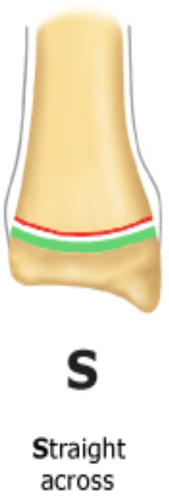|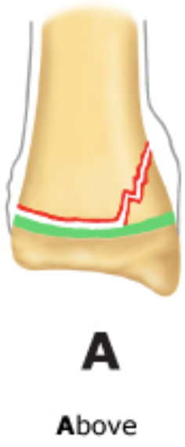|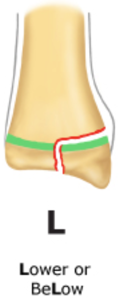|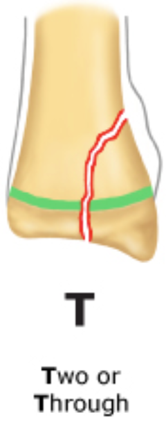|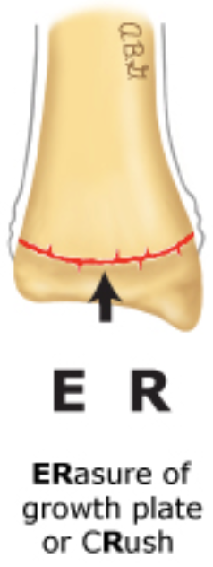|
|Details     |Often involves growth plate|**Most common!** Growth plate + metaphysis|Growth plate + epiphysis + joint space|Metaphysis + growth plate + epiphysis + joint space|Compression of growth plate|
|Implications|Good prognosis|Good prognosis|Threatens growth and articular integrity|Threatens growth and articular integrity|Very high risk for growth arrest|
|Management|- **Dx:** Usually clinical dx (XR negative unless displaced); contralateral XR may be useful   - Immobilization (cast vs. splint) for _>_ 3 wks|Immobilization (cast vs. splint) for _>_ 3 wks|- Immediate Ortho consult   - Likely reduction (anatomic vs. surgical)|- Immediate Ortho consult   - Likely reduction (anatomic vs. surgical)|- Immediate Ortho consult   - Likely reduction (anatomic vs. surgical)|

## Pre-Participation Physical

#### History
- **Goal:** Elucidate conditions that might preclude or limit sports participation
- Cardiac history 
- Dyspnea on exertion → consider exercise induced asthma or vocal cord dysfunction
- History of head trauma
- History of “burners” or “stingers” (from transient brachial plexus compression/stretching) → if recurrent, may need C-spine XR
- Disordered eating (esp/ in sports w/ weight requirements)
- Substance abuse
- **Family history:** Sudden death, congenital heart disease, arrhythmias, Marfan syndrome

#### Physical Exam
Special attention to **CV**, **resp**, and **MSK** (assess ROM, symmetry, stability)

#### Cardiac Testing
- e.g. EKG, echo, exercise testing
- ONLY if clinically indicated, though highly controversial and recommendations worldwide differ. Current AHA/AAP PPE guidelines currently **do not recommend** global EKG/echo.

#### Clearance
- Increased risk of injury?
- Would treatment make athlete safe to participate?
- Can limited participation be allowed while treatment is undergone?
- Limitations for some or all sports?

## Upper Extremity: Elbow, Forearm & Wrist

### Anatomy
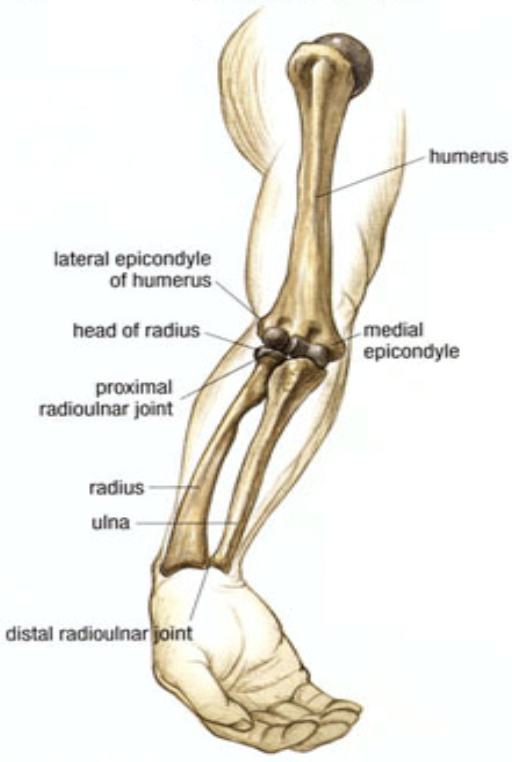

### Exam Pearls

- Rapid elbow/forearm neurovascular exam:
	- **Brachial artery:** Brachial + radial pulses, perfusion check
	- **Median nerve:** Sensation over palmar side of digits 1-3
	- **Anterior interosseous nerve** (motor-only branch of median nerve): “OK” sign 👌, grip strength
	- **Radial nerve:** Wrist extension, thumbs-up sign 👍
	- **Ulnar nerve:** Spread fingers against resistance

### Supracondylar Fracture

#### Description/Mechanism
Usually fall on outstretched hand (FOOSH) with elbow hyperextension

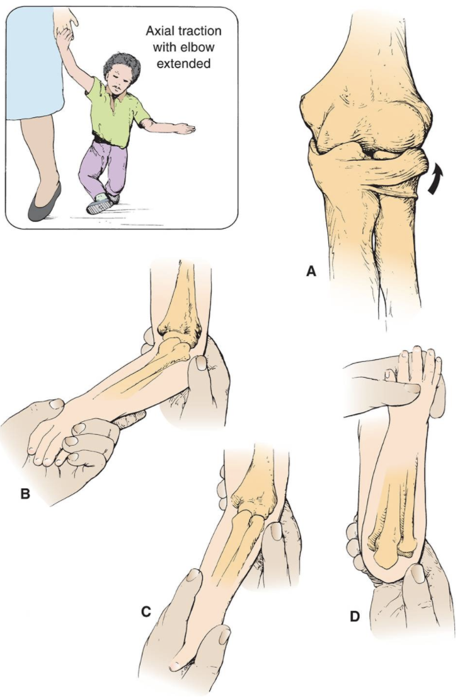

#### Diagnosis
- **Exam:** Gross deformity, limited active elbow motion
- **Imaging:** AP + lateral XR. Findings may be subtle (posterior fat pad sign on lateral film)

#### Management
- Ortho consult
- Usually surgical fixation for displaced fractures

### Nursemaid's Elbow (Subluxation of Radial Head)

#### Description/Mechanism
Traction on arm with extended elbow (e.g. swinging child through the air)

#### Diagnosis
- **Exam:** No deformity, elbow held in passive pronation with slight flexion, refusing to use arm
- **Imaging:** Unnecessary unless suspect fracture based on H&P, or if reduction unsuccessful

#### Management
Stabilize elbow w/ one hand → supinate forearm and flex elbow (will usually feel/hear click)

### Distal Radius Fracture

#### Description/Mechanism
- FOOSH
- **Most common pediatric fracture**

#### Diagnosis
- **Exam:** Pain, ecchymosis, swelling
- **Imaging:** AP + lateral XR of wrist and forearm; consider AP + lateral of elbow if tender or if diaphyseal fractures present

#### Management
- Ortho consult
- Depending on severity, may require anything from immobilization to ORIF

## Upper Extremity: Shoulder

### Anatomy
- **Rotator cuff** muscles (mnemonic: **SITS** → **AEEI**)
	- **S**upraspinatus → **A**bduction
	- **I**nfraspinatus and **T**eres Minor → **E**xternal rotation x2
	- **S**ubscapularis → **I**nternal rotation

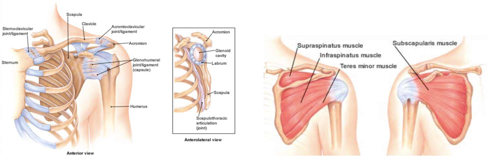

### Exam Pearls & Special Tests
- **Empty can test:** Strength in internal rotation/thumb down position. Tests **supraspinatus**.
- **Scarf test:** Pain w/ cross arm adduction. Tests **AC joint**.
- **Lift-off test:** Strength in lifting dorsum of hand off back. Tests **subscapularis**.
- **Impingement test:** Pain w/ passive internal rotation/forward flexion. Tests **subacromial impingement**.

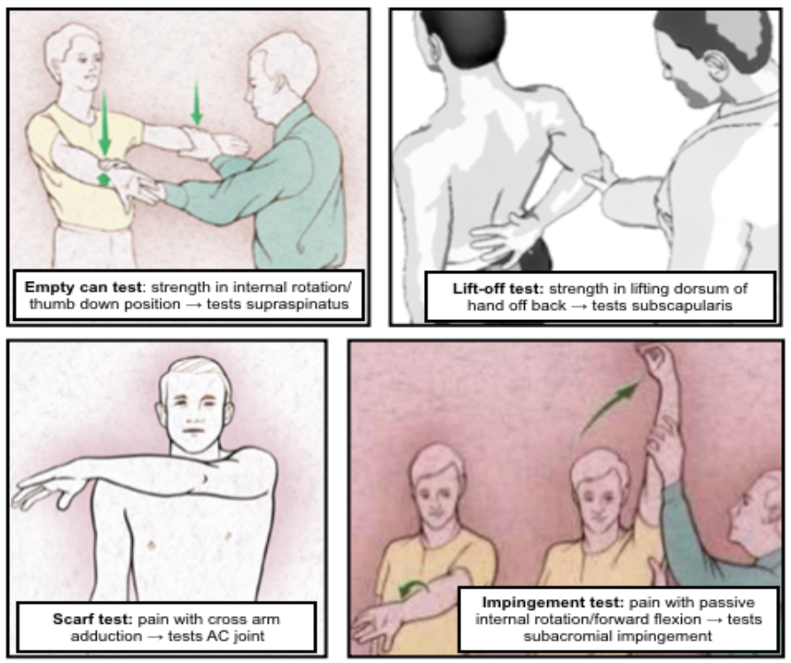

#### Common Associations
- **Scapular winging** i/s/o recent trauma or viral illness → likely serratus anterior or trapezius dysfunction
- Inability to passively/actively rotate affected arm externally s/p seizure → likely posterior shoulder dislocation
- **Supraspinatus/infraspinatus wasting** → likely rotator cuff tear or suprascapular nerve entrapment
- Decreased cervical ROM w/ pain radiating below elbow → likely cervical disc disease
- Shoulder pain in a throwing athlete w/ anterior glenohumeral joint pain/impingement → likely glenohumeral joint instability
- Pain or "clunking" sound w/ overhead motion → likely labral disorder

### Proximal Humeral Fracture

#### Description/Mechanism
- FOOSH
- Direct blow to lateral shoulder

#### Signs & Symptoms
History of trauma, severe shoulder pain, pain w/ arm movement

#### Diagnosis
- **Exam:** tenderness, swelling, shoulder asymmetry, arm shortened and held in extension
- **Imaging:** AP + axillary XR of humerus
	- Also get scapular “Y” view if concerned for shoulder injury
	- Suspect Salter-Harris I if negative XR + tenderness at physis

#### Management
- Immobilization
- Likely Ortho consult, esp. if more severe (a/w shoulder dislocation, neurovascular compromise, etc.)

### Dislocation

#### Description/Mechanism
- Majority of dislocations are **anterior**
- Blow to abducted/externally rotated/extended arm
- FOOSH
- Forceful forward swinging of arm

#### Diagnosis
- **Exam:** Arm abducted and externally rotated w/ resistance to all movement, loss of rounded appearance of shoulder. Evaluate for sensory loss over lateral deltoid (2/2 axillary nerve dysfunction).
- **Imaging:** AP + scapular “Y” + axillary XR to confirm dx and exclude fractures (can be repeated post-reduction if unsure of success)

#### Management
Reduction (variety of techniques exist) → immobilization and referral to Sports Med/Ortho for prevention of recurrent dislocation

### Rotator Cuff Injury

#### Description/Mechanism
- Includes **impingement** (inflammation & pinching of rotator cuff tendons) and rotator cuff **tears** 
	- Impingement very common, tears very uncommon in youth athletes
- Overuse or acute injury, usually involving throwing or overhead activities

#### Signs & Symptoms
Pain in upper arm, worse w/ overhead activity or lying on affected side

#### Diagnosis
- **Exam:** Pain/weakness w/ testing of rotator cuff muscles; positive empty can, lift off, Hawkins, and/or impingement tests (see above)
- **Imaging:** XR only if bony pathology suspected; MRI best

#### Management
- Can start w/ conservative management (NSAIDs, PT)
- Chronic, symptomatic tears → consider surgical intervention

### Little Leage Shoulder (Proximal Humeral Epiphysiolysis)

#### Description/Mechanism
- Overuse injury from throwing causing microfractures in humeral epiphysis
- Most common in **11-16yo** athletes

#### Signs & Symptoms
Progressive shoulder pain w/ throwing, localized to proximal humerus, usually lateral

#### Diagnosis
- **Exam:** TTP at proximal lateral humerus over deltoid
- **Imaging:** AP XR of both arms in external and internal rotation; can get MRI if dx unclear

#### Management
- Rest x3 mos (minimum) + PT, then gradual progression to throwing
- Can still bat and play positions that do not require a lot of throwing

### Acromioclavicular (AC) Joint Injury

#### Description/Mechanism
- Ranges from sprain of AC ligaments to full ligamentous rupture w/ clavicular displacement
- Usually fall onto or direct blow to shoulder

#### Diagnosis
- **Exam:** Tenderness, swelling, asymmetry at AC joint, prominent distal clavicle; + scarf test
- **Imaging:** XR (abnormal in more severe injury, may be normal if joint space not widened)

#### Management
- Less severe injury (no separation of joint capsule) → sling 1-2 wks, ice, NSAIDs → early motion as able, including flexion/extension at elbow
- More severe injury → likely surgical intervention

### Clavicular Fracture

#### Description/Mechanism
Classified by location: most common is **midshaft fracture** > distal third > proximal third

#### Diagnosis
- Exam: Arm held adducted close to body, often supported w/ opposite hand; point tenderness, crepitus
	- **Neurovascular** and **respiratory** exam **crucial** due to risk of brachial plexus and lung injury
- Imaging: XR

#### Management
- Most heal well w/ sling, but indications for surgery are controversial
- Any sign of neurovascular compromise → acute reduction needed

## Lower Extremity: Hip

### Anatomy
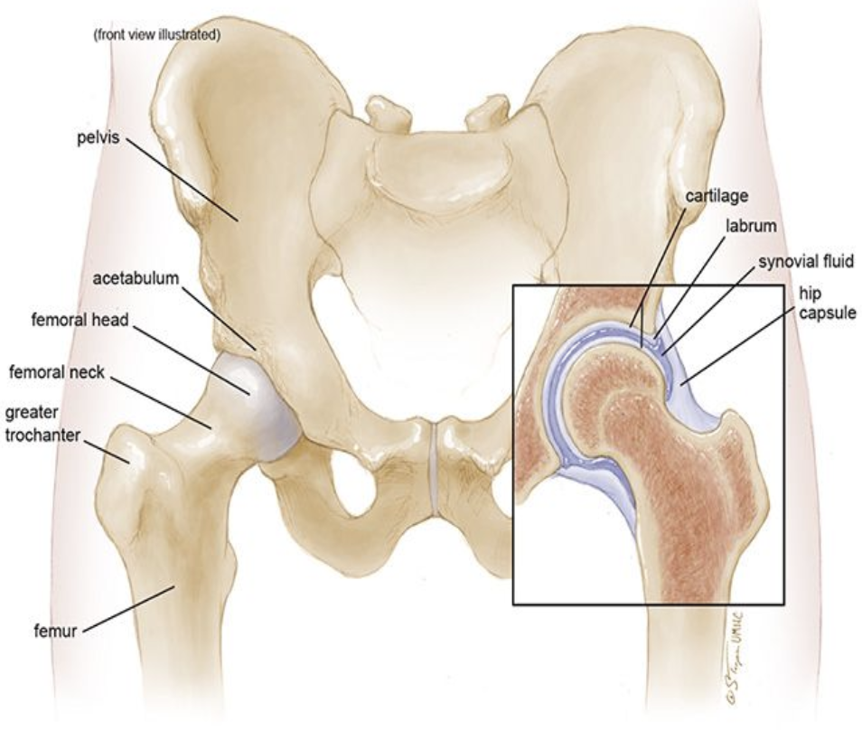

### Exam Pearls & Special Tests
- Hip pain can refer to groin, thigh, or knee, or can present as limp/refusal to walk w/o complaint of pain 
	- Pain from intra-articular pathology often localizes to groin
- **Barlow/Ortolani:** Remember to apply gentle anterior pressure to the trochanter during abduction (Ortolani test)
- **Trendelenburg test:** Positive when patient stands on one leg and the contralateral hip drops, indicative of gluteals/hip abductor weakness
- **FABER** (Flexion, Abduction, External Rotation): Test for hip or SI joint pathology
- **FADIR** (Flexion, Adduction, Internal Rotation): Test for hip impingement
- **Log roll test:** Patient on back w/ leg fully extended and relaxed, examiner passively rotates leg and hip internally and externally. Pain should yield high suspicion for intra-articular pathology.

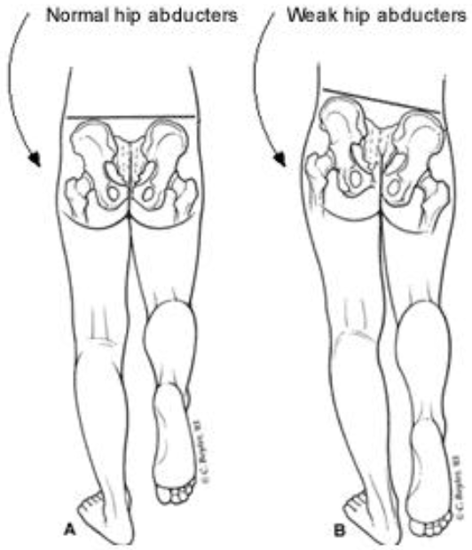

### Legg-Calve-Parthes Disease

#### Description/Mechanism
- Avascular necrosis (AVN) of the hip
- Most common age **5-7yo, M > F,** bilateral in 10-20%

#### Signs & Symptoms
Activity-related hip pain and/or limp (acute or chronic)

#### Diagnosis
- **Exam:** Trendelenburg gait, decreased hip abduction and internal rotation
- **Imaging:** XR often normal early in course, bone scan or MRI more suggestive of dx

#### Management
- Non-weight bearing and restoration of motion (crutches), NSAIDS, PT, aquatherapy
- Severe cases may require spica casting or surgery

### Slipped Capital Femoral Epiphysis (SCFE)

#### Description/Mechanism
- Displacement of the capital femoral epiphysis from the femoral neck through the physeal plate
- Commonly ages **10-16yo, M > F,** bilateral in 20-40%

#### Signs & Symptoms
Groin pain, knee pain, limp

#### Diagnosis
- **Exam:** Decreased hip ROM, hip externally rotated at rest, leg length discrepancy
- **Imaging:** AP + frog leg lateral hip XR. Look for “ice cream scoop falling off the cone, S-sign (frog leg) + Klein’s Line (AP) for subtle cases.

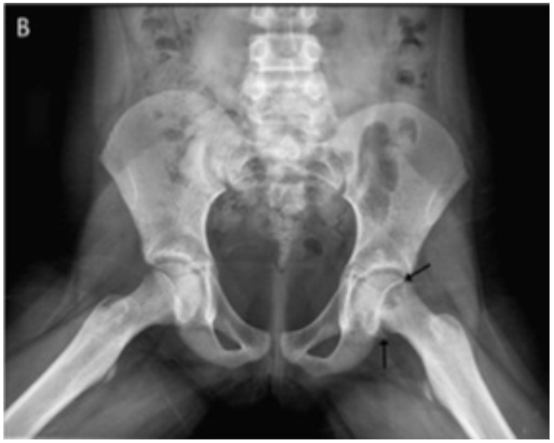

### Developmental Dysplasia of the Hip (DDH)

#### Description/Mechanism
- Abnormal development of shallow acetabulum causing hip joint instability
- **F > M**

#### Diagnosis
- **Exam:** Positive Barlow/Ortolani (only reliable in ages **<3mo**). Limitation of hip abduction or positive Galeazzi (asymmetric knee heights when hips & knees flexed) in ages **>3mo**.
- **Imaging:** US until age 4-6mos, AP XR pelvis w/ hip in 20-30 degree flexion after age 4-6mos

#### Management
- Ortho referral
- Depending on age at diagnosis/referral and severity, may be treated w/ anything from observation to harness to operative management

### Femoroacetabular Impingement (FAI)

#### Description/Mechanism
- Trapping of femoral neck against anterior acetabulum
- Acetabular overcoverage (Pincer impingement) vs decreased head-neck offset (CAM impingement) vs both
- Common in athletes
- Difficult to differentiate from hip flexor tendinitis

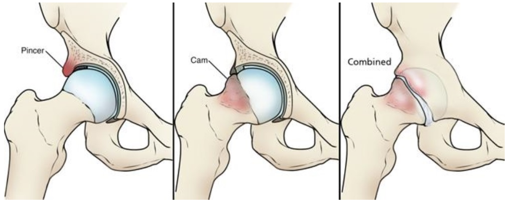

#### Diagnosis
- **Exam:** Pain on hip flexion passively or against resistance, impact/running, deep flexion; pain is usually anterior or into groin.
- **Imaging:** XR AP Pelvis and Dunn laterals bilaterally
	- Can have skeletal setup and still not be their pain cause

#### Management
Safe to start with PT unless having mechanical/catch/lock symptoms or difficulty weight bearing (in which case, refer to Sports Med/Ortho)

## Lower Extremity: Knee

### Anatomy
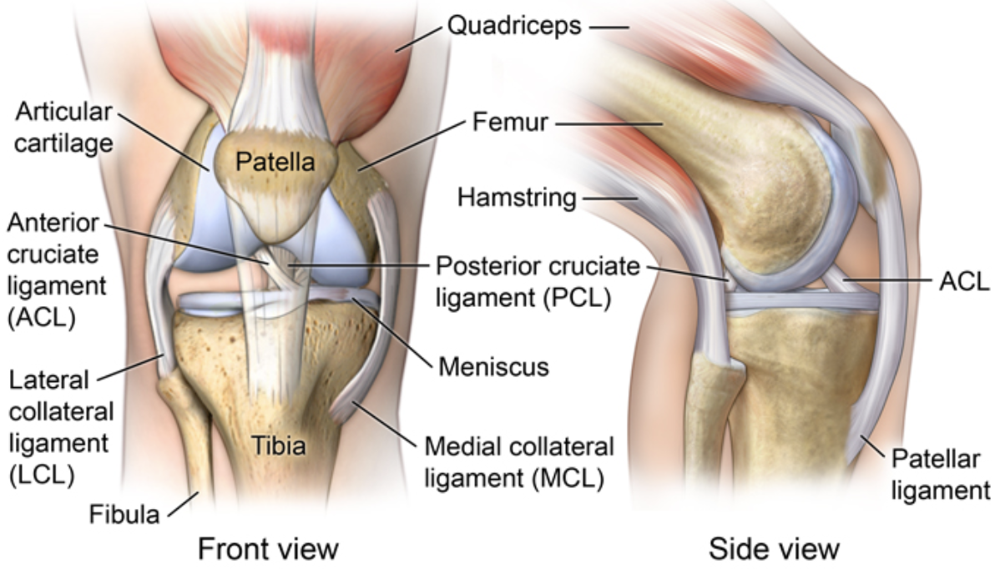

### Exam Pearls & Special Tests
- **Ober test:** Positive if superior leg doesn't drop towards table when released. Tests **IT band**.
- **Anterior drawer test:** Anterior translation (keep foot stabilized) compared to contralateral knee. Tests **ACL**.
- **Valgus/varus stress test:** Laxity/pain w/ valgus/varus at 0° and 30°. Tests **MCL/LCL** (respectively).
- **McMurray test:** Pain/click w/ knee extension w/ tibia internally/externally rotated. Tests **lateral/medial meniscus** (respectively).

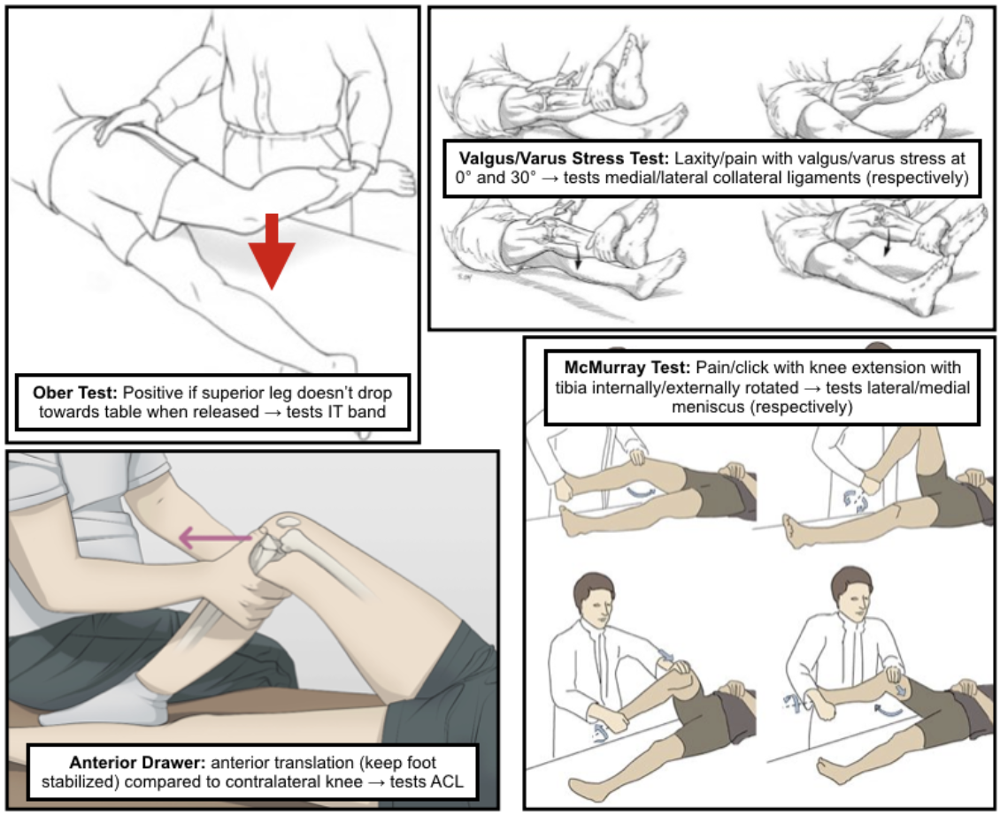

### Osgood-Schlatter Disease

#### Description/Mechanism
- Traction apophysitis of tibial tubercle at patellar tendon insertion
- Often children who play jumping sports and/or are undergoing rapid growth spurt
- Corollary process at inferior patellar pole = **Sinding-Larsen-Johansson Syndrome**

#### Signs & Symptoms
- Gradually worsening anterior knee pain, exacerbated by kneeling, jumping, stairs, walking uphill
- Can be asymmetric or bilateral
- Pain relieved by rest

#### Diagnosis
- **Exam:** Prominence of and TTP at the tibial tubercle, pain w/ resisted knee extension or squatting
- **Imaging:** Not routinely indicated unless to rule out other dx

#### Management
- Usually conservative: Pain management, PT for strengthening
- Continuation of activity, as long as not prolonged squatting/kneeling (e.g. playing)

### Patellofemoral Pain Syndrome (PFPS)

#### Description/Mechanism
Abnormal tracking of patella causes anterior knee pain w/o intra-articular pathology

#### Signs & Symptoms
- Anterior knee pain worsened w/ prolonged sitting (theater sign) or descending stairs
- Pain w/ running/impact activity (aka Runner’s knee)

#### Diagnosis
- **Exam:** Positive J-sign (lateral patellar tracking during terminal knee extension), positive patella mobility test (medial glide < ¼ or > ¾ patella width suggesting hypo- or hypermobility)
- **Imaging:** Not routinely indicated unless to exclude other dx

#### Management
- Conservative treatment, PT for strengthening
- Avoid long-term NSAID use

### Anterior Cruciate Ligament (ACL) Injuries

#### Description/Mechanism
- Cutting/pivoting motion causing valgus stress on knee, can be due to direct blow causing hyperextension/valgus deformation
- Medial meniscus and MCL often injured at same time (**Unhappy Triad**)

#### Signs & Symptoms
“Pop” at time of injury, swelling, feeling of knee “giving out”

#### Diagnosis
- **Exam:** Joint effusion, positive anterior drawer test
- **Imaging:** MRI > XR, but can get XR to evaluate for associated injury/fracture

#### Management
- Ortho/Sports Med referral
- Operative management in majority of cases, ideally w/ period of pre-operative rehabilitation to optimize outcomes

### Meniscus Injuries

#### Description/Mechanism
- Direction change w/ knee rotation, planted foot, and flexed knee
- Commonly in sports w/ lots of deceleration and direction change

#### Signs & Symptoms
- Often insidious onset of pain/swelling in 24h after injury
- Pain worse w/ twisting/pivoting
- Can have locking/popping/catching sensation

#### Diagnosis
- **Exam:** Joint line tenderness, inability to fully extend/squat/kneel, positive McMurray test
- **Imaging:** MRI > XR (plain films often negative)

#### Management
- Ortho/Sports Med referral 
- Management varies from conservative to operative (usually arthroscopic)

### Iliotibial (IT) Band Syndrome

#### Description/Mechanism
Tight IT band sliding over lateral femoral epicondyle

#### Signs & Symptoms
Diffuse lateral knee pain, worsened w/ activity or w/ prolonged sitting w/ knee in flexed position

#### Diagnosis
- **Exam:** TTP in lateral knee, positive Ober test
- **Imaging:** Not routinely indicated

#### Management
- Activity modification
- NSAIDs
- Stretching/strengthening regimen

### Osteochondritis Dissecans

#### Description/Mechanism
- Acquired subchondral bone lesion which can progress to involve cartilage causing separation from underlying bone; most common in knee
- Mechanism unknown; proposed to be due to repetitive trauma vs. inflammation
- Can lead to **osteoarthritis** if not recognized/treated

#### Signs & Symptoms
- May be incidental finding on imaging vs. non-specific activity related knee pain
- May have swelling or symptoms of catching/locking if lesions are unstable

#### Diagnosis
- **Exam:** No specific findings
- **Imaging:** 4-view XR (AP, lateral, sunrise, tunnel) of knee, MRI to further delineate known OCD lesion and determine management (or if XR negative but high clinical suspicion)

#### Management
- Referral to Ortho/Sports Med
- May be treated conservatively (non-weight-bearing or activity limitation) vs. operatively (if lesions are unstable or unresponsive to conservative treatment)

## Lower Extremity: Ankle/Foot

### Anatomy
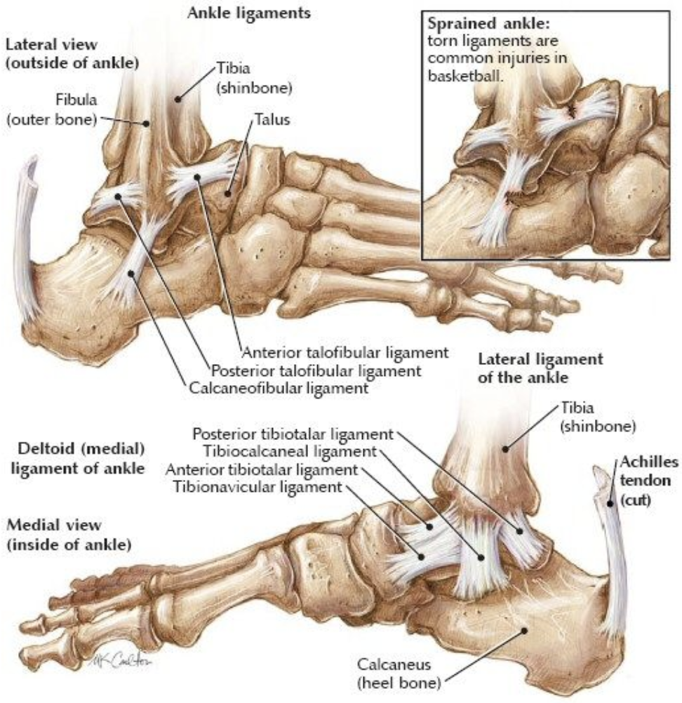

### Exam Pearls & Special Tests
- **Mid-calf squeeze:** Positive if generates pain in ankle. Tests **tibiofibular syndesmosis**.
- **Anterior drawer test:** Anterior translation comapred to contralateral ankle. Tests **ATFL**.
- **Talar tilt:** Range of inversion compared to contralateral ankle. Tests **CFL**.
- **Ottawa ankle rules** (when to get XR of ankle/foot, validated for >18yo):
	- **Ankle:** Pain in malleolar zone + EITHER of:
		- Bony tenderness at posterior edge of lateral/medial malleolus
		- Inability to bear weight both immediately after injury + at time of exam
	- **Foot:** Pain in midfoot zone + EITHER of:
		- Bony tenderness at base of 5th metatarsal or navicular bone
		- Inability to bear weight both immediately after injury + at time of exam

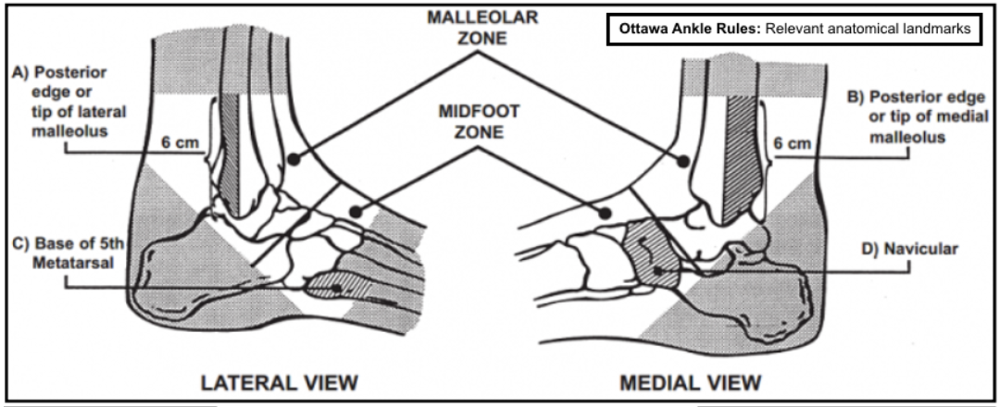
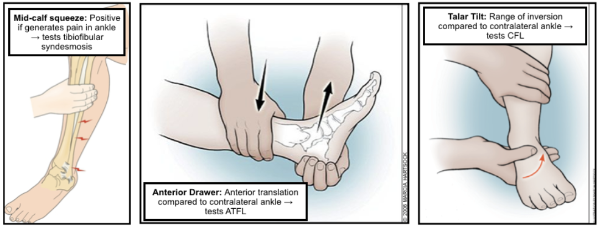

### Ankle Sprain

#### Description/Mechanism
- Ligamentous stretching/tearing
- **Lateral:** Inversion of plantar-flexed foot; injuries **ATFL** most commonly
- **Medial:** Eversion or abduction/ external

#### Signs & Symptoms
Pain, swelling (diffuse or localized), +/- inability to bear weight

#### Diagnosis
- **Exam:** Swelling, TTP, positive anterior drawer/talar tilt (lateral sprain), positive mid-calf squeeze (high sprain), squeeze test for syndesmotic injury
- **Imaging:** Not routinely indicated unless concern for fracture (see Ottawa rules above) or clinical uncertainty

#### Management
- Short period of complete immobilization (longer depending on severity), supportive device (lace-up brace or elastic bandage)
- ROM/strength exercises (can be w/ formal PT, esp. in case of recurrent ankle sprains) are critical to restoring function and proprioception
- For HIGH ankle sprains, consult Ortho/Sports Med (may need acute surgical stabilization if severe)

### Sever's Disease

#### Description/Mechanism
- Traction apophysitis of calcaneal growth plate at site of Achilles insertion; often children who play sports w/ jumping/heel striking and/or are undergoing rapid growth spurt
- Essentially Osgood-Schlatter at the calcaneus

#### Signs & Symptoms
Chronic heel pain w/ insidious onset, worse w/ activity or wearing non-supportive footwear

#### Diagnosis
- Exam: TTP at calcaneal apophysis or w/ “calcaneal compression test”
- Imaging: Not routinely indicated unless diagnosis unclear or to rule out fracture

#### Management
Painful activity → gradual return to play, use of heel cup for support, ice and stretching

### Spiral/Oblique Fracture

#### Description/Mechanism
- **“Toddler’s fracture”** in 9mo-3yo
- Rotation around fixed foot → distal tibial fracture; often minimal trauma in toddlers, higher impact injury in older children
- ~30% of tibial fractures have associated fibular fracture
- Spiral fractures in **NON-ambulatory** child → concern for **NAT**

#### Signs & Symptoms
Limp, refusal to bear weight

#### Diagnosis
- **Exam:** Point tenderness over distal ⅓ of tibia
- **Imaging:** AP + lateral XR of the tibia and fibula; fractures may be occult (not seen on imaging)

#### Management
- Immobilization in long leg posterior splint/cast
- Ortho referral

### Congenital Clubfoot

#### Description/Mechanism
- Idiopathic vs. due to intrinsic (e.g. neurologic) or extrinsic (e.g. fibroids) factors
- 1:1000 live births, **M > F**

#### Diagnosis
- **Exam:** Fixed (e.g. not correctable) deformity of the foot w/ plantar flexion and inversion + rotation, calf atrophy 
- **Imaging:** Usually dx on prenatal US, XR minimally useful initially

#### Management
- Ortho referral (usually done in nursery prior to d/c)
- Serial casting → Achilles tenotomy → bracing

## Spine

### Anatomy
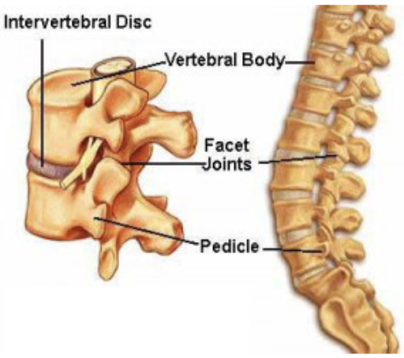

### Exam Pearls & Special Tests
- **Straight leg raise:** Patient lying supine → flex at hip w/ knee straight (best if cervical spine flexed and ankle dorsiflexed) → assess for sciatic pain (sign of herniated disc)

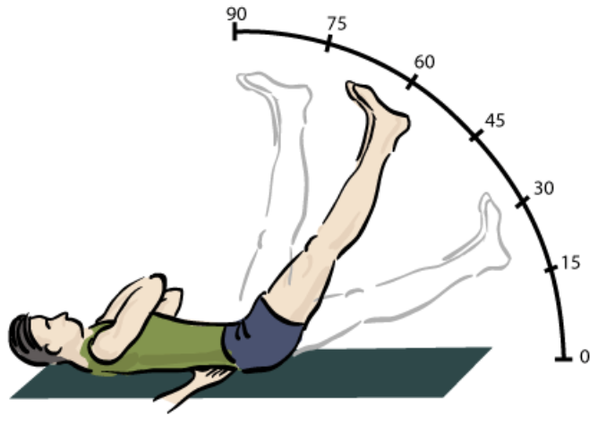

### Scoliosis

#### Description/Mechanism
- Lateral curvature of the spine _>_ 10°
- Idiopathic (80%) vs. congenital vs. neuromuscular

#### Diagnosis
- **Exam:** Adam’s forward bend test + inclinometer. Shoulder/torso asymmetry, rib prominence, paraspinal muscle prominence.
- **Imaging:** XR w/ Cobb Angle _>_ 10°

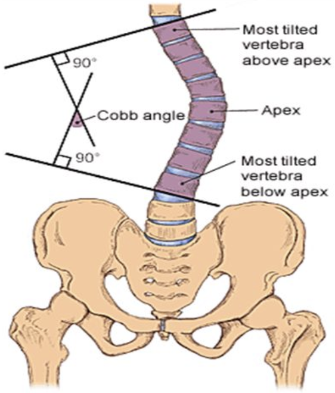

#### Management
- Less than 25° → observation
- 25-45° + skeletal immaturity → bracing
- Greater than 45° → consider surgical intervention

### Spondylolysis & Spondylolisthesis

#### Description/Mechanism
- **Spondylolysis:** Bony defect in pars interarticularis (usually L4 and L5)
- **Spondylolisthesis:** Displacement of vertebral body relative to inferior vertebral body
- Caused by repetitive microtrauma
- **Most common causes of back pain in children >10yo**; often in athletes engaged in sports w/ repetitive extension, flexion, and rotation

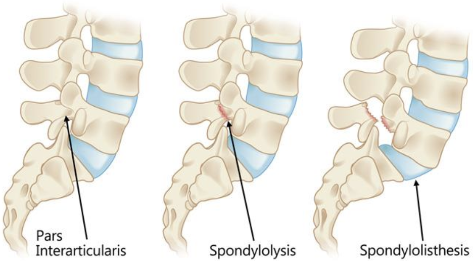

#### Signs & Symptoms
- Low back pain that worsens w/ activity, improves w/ rest
- **Spondylolisthesis:** May have radicular or cauda equina symptoms

#### Diagnosis
- **Imaging:**
	- MRI is now study of choice
	- XR: Poorly sensitive and do not assess acuity, but might be required prior to MRI
		- Standing AP, lateral, oblique views: Visualize defect
		- Flexion and extension views: Assess stability

#### Management
- **Spondylolysis** and **low-grade spondylolisthesis** → conservative (rest from sports for _>_ 3 mos, NSAIDs, PT, back bracing)
- **Higher-grade spondylolisthesis** (or failure of conservative management) → consider surgical intervention

### Spondyloarthropathies

#### Signs & Symptoms
- Insidious onset
- Often misdiagnosed w/ recurrent strains/sprains
- Pain worse at night, improves w/ activity

## Head

### Mild Traumatic Brain Injury (TBI) (Concussion)
Including Graduated Return-to-Sport Program

**See ED chapter** for [Mild TBI section](#mildTBI)
