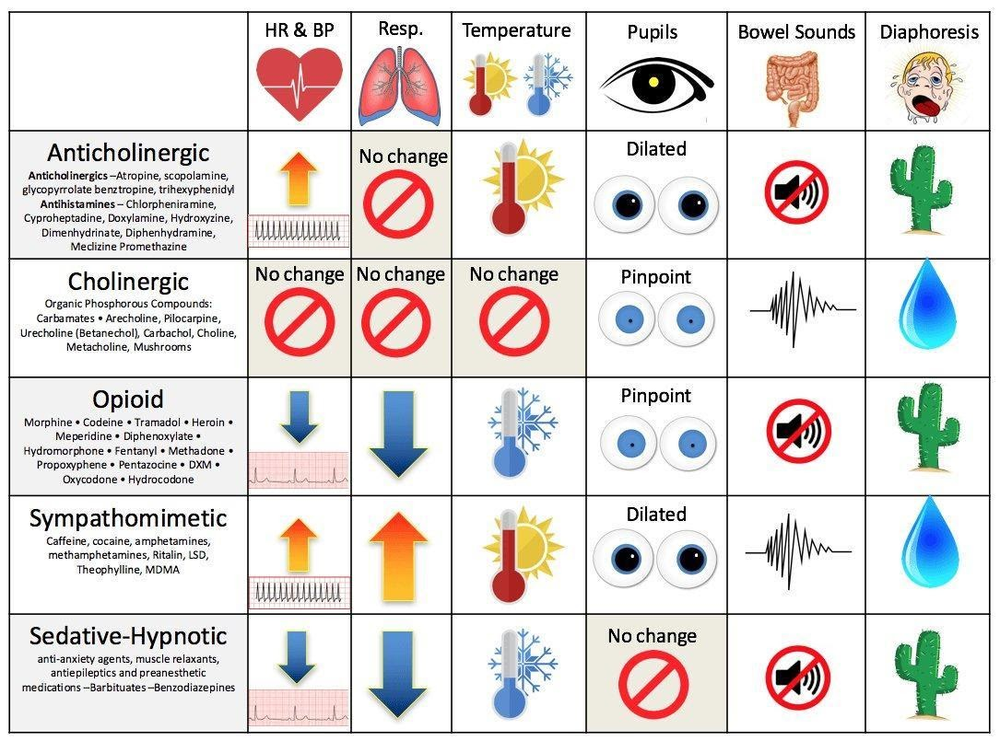

# Toxicology

## Key Resources

-   Poison Control: **1-800-222-1222**
-   BCH Toxicology Fellow/Attending (on call 24/7)
-   BCH Chemistry Fellow (daytime hours, can help interpret labs and
    select specialized testing)
-   Hazmat Team: Boston Fire Department
-   MSDS: Material Safety Data Sheets
-   www.maripoisoncenter.com
-   www.aapcc.org

## Approach to Poisoned Patient

### Stabilization

Airway, Breathing, Circulation, Disability, Drugs/D-Stick,
Decontamination

### Physical Exam

**Vital signs** **Neuro**: MS, tone, clonus, abnormal movements
**Eyes**: pupils, EOM, nystagmus **Mouth**: corrosive lesions, odors
**CV**: rate, rhythm, perfusion **Resp**: rate, depth of respirations,
air entry, wheeze **GI**: motility (?bowel sounds), corrosive effects
(i.e. vomiting) **Skin**: color, bullae, burn, sweat, track marks

### History

-   **AMPLE**: **A**llergies, **M**eds/Toxins (everyone in home),
    **P**ast medical history, **L**ast meal, **E**vents
-   **Known toxin**: amount, time since ingestion, early sx, home tx
-   **Concern for poisoning**: h/o pica or ingestions, meds in home,
    recent illnesses, visitors/events

### Basic Labs

Consider ABG, co-oximetry, CBC, D-stick, EKG, Chem, LFTs, serum OSM, UA,
urine/serum tox

### Tox Screens

-   Substances included, limits of detection vary hospital to hospital

-   Urine drug screens rarely inform acute management decisions

-   **Urine tox screens**: detect amphetamines, MDMA, barbiturates,
    benzos, cocaine, opioids, +/- THC

    -   Qualitative (+/-)
    -   Does not detect synthetic cathinones (i.e. "bath salts");
        false + and false - (esp benzos, synthetic opioids) common
    -   ADHD drugs: adderall → positive amphetamine

-   Urine THC - must order separately at BMC

-   Expanded opioid panel, urine (BMC): detects buprenorphine,
    oxycodone, methadone, fentanyl

-   **Extended tox screen**: GC/MS, urine better than serum, send out
    test

-   **Meconium tox**: amphetamines, THC, cocaine, opiates, PCP

-   **Serum tox**: APAP, ASA, EtOH (quantitative),TCAs (qualitative)
    **Specific drug levels**: can request agents not on tox screens
    (digoxin, lithium, AEDs, iron, etc.)

### Management

-   Can I decontaminate?
-   Can I enhance the elimination of the toxin?
    (www.extrip-workgroup.org)
-   Is there an antidote?
-   How can I provide the best, targeted supportive care?

## Toxidromes

## Differential Diagnosis (non-exhaustive)

### Temperature

**Hyperthermia: NASA** 
- NMS, nicotine 
- Antihistamines, alcohol withdrawal, anesthetics 
- Salicylates, sympathomimetics, serotonin syndrome 
- Anti: 
    -cholinergics, 
    -depressants, 
    -psychotics

**Hypothermia: COOLS** 
- Carbon monoxide 
- Opioids 
- Oral hypoglycemics
- Liquor 
- Sedative-hypnotics

### Heart Rate

**Tachycardia: FAST** 
- Free base or other forms of cocaine 
- Anticholinergics, antihistamines, antipsychotics, amphetamines 
- Sympathomimetics 
- Theophylline, TCAs, thyroid hormones

**Bradycardia: PACED** 

- Propranolol (beta-blockers), poppies (opioids), physostigmine 
- Anticholinesterase drugs, antiarrhythmics 
- Clonidine, calcium channel blockers
- Ethanol or other alcohols 
- Digoxin, digitalis

### Blood Pressure

**Hypertension: CT SCAN** 
- Cocaine 
- Thyroid supplements 
- Sympathomimetics 
- Caffeine 
- Anticholinergics, amphetamines 
- Nicotine

**Hypotension: CRASH** 
- Clonidine, calcium channel blockers 
- Rodenticides (containing arsenic, cyanide) 
- Antidepressants, aminophylline, antihypertensives 
- Sedative-hypnotics 
- Heroin (opioids)

### Respiratory Rate

**Tachypnea: PANT** 
- PCP 
- Aspirin and other salicylates, acute lung
injury (hydrocarbons, vaping) 
- Noncardiogenic pulmonary edema 
- Toxin-induced metabolic acidosis

**Hypopnea: SLOW** 
- Sedative
- hypnotics (benzodiazepines, barbiturates)
- Liquor 
- Opioids 
- Weed

### Blood Glucose

**Hyperglycemia: CAPT ABC** 
- Corticosteroids 
- Antibiotics (quinolones)
- Protease inhibitors 
- Thiazides 
- Atypical antipsychotics 
- Beta-agonists 
- Corticosteroids 

**Hypoglycemia: HOBBIES** 
- Hypoglycemics (oral) 
- Other (quinine, unripe ackee fruit) 
- Beta-blockers 
- Insulin 
- Ethanol 
- Salicylates (late)

## Acetaminophen Overdose

### Toxic Dose

200 mg/kg (7.5-10 g in older pts) as a single acute overdose

### Pathophysiology

Saturation of glucuronidation/sulfate conjugation pathway → ↑ metabolism
via P450 pathway and depletion of glutathione → build up of toxic NAPQI
→ hepatotoxicity +/- renal toxicity

### Symptoms

See chart below

### Evaluation

Acetaminophen levels (at ≥ 4 hours post-ingestion, LFTs, coags,
electrolytes, BUN/Cr, UA w/ tox screen (serum and urine), urine
pregnancy for females

### Management

-   Activated charcoal if w/i 1-2 hrs of ingestion and no
    contraindications (unprotected airway and decreased LOC)

-   Goal: Initiate NAC ≤ 8 hours of ingestion (or ASAP if \>8 hours
    post-ingestion)

-   APAP level → apply NOMOGRAM → estimate risk of hepatotoxicity

-   KEY POINT: NOMOGRAM can ONLY be used for: single acute ingestion,
    known time of ingestion, ingestion w/i 24hrs of presentation. Also,
    caution if coingestants that may affect GI motility

    -   Risk of hepatotoxicity → give N-acetylcysteine
    -   IV: loading dose of 150mg/kg over 1 hour, then 50 mg/kg over 4
        hours, then 100 mg/kg over 16 hours; check APAP levels, LFTs,
        coags 2 hours before 16h infusion is scheduled to end
    -   PO/NG: Loading dose 140mg/kg then 70mg/kg 14hrs x24 hours
    -   Guidelines for stopping NAC: clinically well, improving LFTs,
        normalizing coags, APAP level \<10 (if patient does not meet
        guidelines, continue NAC (100mg/kg IV over 16 hours) until they
        meet criteria.

-   King's College Criteria for Liver Transplant:

    -   pH \< 7.3 or

    -   INR \> 6.5 AND serum creatinine \> 3.4mg/dL AND grade III - IV
        encephalopathy

    -   West Haven Criteria for encephalopathy:

        -   I: Changes in behavior with minimal change in level of
            consciousness
        -   II: Gross disorientation, drowsiness, possible asterixis,
            behavior changes
        -   III: Marked confusion, incoherent speech, sleepy but
            arousable to voice
        -   IV: Comatose, unresponsive to pain, decorticate/decerebrate
            positioning

### Rule of 150

-   Potentially toxic dose: 150mg/kg
-   Treatment line: 150mcg/mL at 4 hours
-   Loading dose of NAC 150mg/kg over one hour

+------+------------------------------------------------+-------------+
| **A  | **Symptoms**                                   | **Labs**    |
| cute |                                                |             |
| APAP |                                                |             |
| To   |                                                |             |
| xici |                                                |             |
| ty** |                                                |             |
+======+================================================+=============+
| **S  | N/V, diaphoresis, malaise May be asymptomatic  | Labs, PE    |
| tage |                                                | generally   |
| 1**: |                                                | normal      |
| 0-24 |                                                |             |
| h    |                                                |             |
| ours |                                                |             |
+------+------------------------------------------------+-------------+
| **S  | Initial symptoms resolve RUQ pain, liver       | AST/ALT, ↑  |
| tage | enlargement/tenderness                         | PT/INR,     |
| 2**: |                                                | renal       |
| 2    |                                                | d           |
| 4-72 |                                                | ysfunction, |
| h    |                                                | ↑ amylase   |
| ours |                                                |             |
+------+------------------------------------------------+-------------+
| **S  | N/V, diaphoresis return - Jaundice, hepatic    | LFTs peak   |
| tage | encephalopathy, hyperammonemia, bleeding,      |             |
| 3**: | hypoglycemia, lactic acidosis - Renal failure, |             |
| 7    | multi organ failure, death                     |             |
| 2-96 |                                                |             |
| h    |                                                |             |
| ours |                                                |             |
+------+------------------------------------------------+-------------+
| **S  | Recovery phase Slow normalization of symptoms  | Slow        |
| tage | and lab values (Symptoms typically normalize   | no          |
| 4**: | well before transaminases do)                  | rmalization |
| 4-14 |                                                |             |
| days |                                                |             |
+------+------------------------------------------------+-------------+

## Aspirin Overdose

### Toxic Dose

150 mg/kg

### Pathophysiology

-   Stimulates medullary respiratory center → ↑RR, hyperpnea,
    respiratory alkalosis
-   Inhibits Kreb's cycle enzymes → lactic acidosis, ketoacidosis
-   Inhibits platelet function + vitamin-K dependent clotting factors →
    coagulopathy

### Symptoms

-   Mild toxicity: GI upset, tinnitus and tachypnea
-   Moderate toxicity: fever, diaphoresis, tachycardia, agitation,
    confusion
-   Severe toxicity: coma, pulmonary edema, seizures

### Evaluation

Serum salicylate level (normal \<30 mg/dL), ABG (primary respiratory
alkalosis, primary anion-gap met acidosis), glucose (elevated - early,
low - late), Electrolytes (hyper/hyponatremia, hypokalemia) +/- LFTs,
CBC, coags, UA, serum/urine tox screen. Resulting acidosis and
electrolyte changes MAY demonstrate EKG changes (ex. widened QRS, AV
block, arrhythmias)

### Management

-   GI decontamination: activated charcoal (consider repeat dose, prone
    to bezoar formation)
-   Aggressive fluid resuscitation (lots of insensible losses)
-   Urine alkalinization: goal URINE pH = 8, goal SERUM pH 7.45-7.55 to
    enhance ion trapping; can use D5 W150 mEq/L Na-bicarb
-   Potassium repletion
-   Follow salicylate levels q1-2 hours
-   Hemodialysis (ASA level \>90-100mg/dL (acute overdose), \>60 mg/dL
    (chronic overdose), severe acidosis or electrolyte disturbances,
    renal failure, pulm edema, neurologic symptoms, deterioration
    despite interventions)

## Beta-Blocker Overdose

### Toxic Dose

"One pill can kill" in toddlers

### Pathophysiology

adrenergic antagonist → ↓ sympathetic outflow

### Symptoms

Bradycardia, hypotension, bronchospasm, coma, seizures, hypoglycemia

### Evaluation

DS (hypoglycemia), EKG (brady, AV block, accelerated junctional rhythm),
serum/urine tox (in cases of suspected intentional ingestions)

### Management

-   GI decontamination: activated charcoal (consider whole bowel
    irrigation) if indicated and no contraindications
-   Glucagon bolus: 0.15 mg/kg then infusion of 0.05-0.1 mg/kg/hr (for
    symptomatic bradycardia)
-   Fluids +/- pressors for hypotension
-   Hyperinsulinemia/euglycemia (HIE) therapy: sometimes used in severe
    BB OD

## Calcium Channel Blocker Overdose

### Toxic Dose

"One pill can kill" in toddlers; individual drug selectivity for
cardioactive vs vasoactive effects lost in significant overdose

### Pathophysiology

Block L-type Ca channel blockers (affect myocyte contractility, SA nodal
AP initiation)

### Symptoms

Bradycardia, hypotension, coma, seizures, dihydropyridine CCBs
(amlodipine, nifedipine, etc) can present w/ TACHYcardia and relative
hypotension, HYPERglycemia

### Evaluation

DS (hyperglycemia), EKG (bradycardia, AV block, accelerated junctional
rhythm, wide QRS, ST changes), serum/urine tox (in cases of suspected
intentional ingestions)

### Management

-   GI decontamination: activated charcoal (consider whole bowel
    irrigation) if indicated and no contraindications
-   IV calcium chloride or calcium gluconate
-   HIE (hyperinsulinemia/euglycemia) therapy: 1 unit/kg bolus of
    regular insulin then 0.5-1+unit/kg/hr infusion
-   Intralipid 20%: 1.5ml/kg during 2-3 mins, followed by 0.25 ml/kg/min
    IV x 30-60 min (consult Tox)

## Antidepressants: SSRIs and SNRIs

### Toxicity

-   SSRIs: less toxic than MAOIs or TCAs; most fatalities due to
    co-ingestion
-   SNRIs: greater toxicity than SSRIs (but less than MAOIs or TCAs)

### Pathophysiology

Inhibit serotonin +/- norepinephrine reuptake (primarily in CNS)

### Symptoms

-   Vomiting, CNS depression, tachycardia
-   Serotonin syndrome: altered mental status, neuromuscular
    hyperexcitability (clonus, rigidity, hyperreflexia), autonomic
    instability (hyperthermia, tachy, HTN) → can lead to rhabdo,
    seizures, renal failure, DIC

### Evaluation

Electrolytes, serum/tox screen, EKG (↑QTc, rare ↑ QRS w/ some SNRIs);
levels not helpful

### Management

-   Decontamination and supportive care
-   Benzos and/or serotonin antagonists (cyproheptadine) for serotonin
    syndrome, consider cooling and paralysis for severe serotonin
    syndrome

## Antidepressants: TCAs

### Toxic Dose

"One pill can kill" in toddlers

### Pathophysiology

Peripheral and central anticholinergic, peripheral alpha-1 adrenergic
blockade, inhibits CNS NE and serotonin reuptake, blocks cardiac fast Na
channels, blocks GABA receptors

### Symptoms

-   Anticholinergic toxidrome (see toxidrome chart)
-   Neurotoxicity (seizures, coma)
-   Cardiovascular toxicity (arrhythmias, refractory hypotension,
    widened QRS)

### Evaluation

Electrolytes, CK, D-stick, urinalysis, tox screens, TCA level not useful
(other than to confirm ingestion), EKG (prolonged QRS (\>100ms a/w
seizure, dysrhythmias), sinus tach, vent arrhythmias, lead aVR prominent
R waves)

### Management

-   Gastric decontamination, close monitoring, EKGs
-   NaHCO3 titrated to serum pH 7.45-7.55 (indicated for QRS \> 100ms w/
    other signs of TCA toxicity, vent. arrhythmias, CV collapse,
    seizures). Mechanism: increase pH -\> increase non-ionized TCA =
    cannot bind sodium channels. Also increases gradient across cardiac
    cell membranes -\> attenuates TCA-induced blockade of rapid sodium
    channels.
-   Supportive care (treat refractory hypotension w/ alpha-agonist
    pressors)
-   For severe TCA overdoses, consider intralipid

## Antidepressants: Buproprion

### Toxic Dose

"One pill can kill" in toddlers

### Pathophysiology

Dopamine and NE reuptake inhibitor w/ some serotonin reuptake blockade;
contraindicated in eating disorder patients given ↑ seizures

### Symptoms

Seizures, agitation, HTN, tachycardia, arrhythmias

### Evaluation

Levels not helpful, electrolytes, EKG (QRS and QTc prolongation). May
cause +amphetamine screen

### Management

Supportive care, benzos for seizures, admit for \>24 hours to monitor
for late onset seizures if ingested Wellbutrin SR, ↑ QRS treated w/ IV
sodium bicarb (though may not be as effective)

## Iron

### Toxic Dose

-   Less than 20mg/kg **elemental iron** usually asymptomatic
-   20-60 mg/kg: variable response
-   Greater than 60 mg/kg: greatest risk of serious toxicity (death
    reported at 60-300+ mg/kg)

### Pathophysiology

Direct caustic effect on GI mucosa → hemorrhagic necrosis; multisystem
toxicity 2/2 mitochondrial poison; iron absorbed at duodenum/jejunum

### Symptoms

*If no significant GI symptoms w/i first 6 hrs after overdose, very low
likelihood of significant toxicity*

+--------+-------------------------------------------------------------+
| *      | **GI sx**: vomiting, diarrhea, GI bleeding                  |
| *Phase |                                                             |
| I      |                                                             |
| (30min |                                                             |
| --     |                                                             |
| 6h)**  |                                                             |
+========+=============================================================+
| *      | Latent period: apparent improvement                         |
| *Phase |                                                             |
| II (6h |                                                             |
| --     |                                                             |
| 24h)** |                                                             |
+--------+-------------------------------------------------------------+
| *      | **Hepatotoxicity**: hepatocellular injury, AG metabolic     |
| *Phase | acidosis (↑ lactic acid), coma, seizures, multi-organ       |
| III    | failure, shock **Labs**: ↑ bili, ↑ LFTs, ↑ glucose, ↑       |
| (4h-4d | PT/INR, ↑ BUN                                               |
| ays)** |                                                             |
+--------+-------------------------------------------------------------+
| *      | **Late effects**: possible bowel obstruction secondary to   |
| *Phase | strictures                                                  |
| IV     |                                                             |
| (2-8   |                                                             |
| wks)** |                                                             |
+--------+-------------------------------------------------------------+

### Evaluation

KUB (radio-opaque pills), Fe level, VBG/ABG, lytes, BUN/Cr, glucose,
LFTs, PT/INR, CK

### Management

Support ABC's, replace fluid/blood losses, GI decontamination, IV
deferoxamine (severe sx, iron level \> 500 mcg/d w/ clinical symptoms,
sig AG met acidosis)

## Lead

### Toxic Dose

No safe lead level exists

### Pathophysiology

Interferes w/ interactions of divalent cations and sulfhydryl groups
leading to widespread physiologic effects and clinical toxicity

### Symptoms

-   Lower levels: Abdominal pain, constipation, anorexia, vomiting,
    developmental delays, aggression, hyperactivity
-   Higher levels: drowsiness, clumsiness, ataxia
-   Severe levels: decreased consciousness, coma, seizures, death
    (usually 2/2 cerebral edema)

### Evaluation

Lead levels, CBC (microcytic anemia + basophilic stippling of RBC), FEP
(free erythrocyte protoporphyrin), BUN/Cr, AST/ALT, x-ray (radiopaque
flecks)

### Management

-   CDC Child Lead Poisoning Program:
    <https://www.cdc.gov/nceh/lead/default.htm>
-   See also BCH lead poisoning EBG
-   Prevention is key: screening and lead levels at WCC (9-12 mo, 2
    years)
-   Gastric decontamination: whole bowel irrigation
-   Chelation therapy (depending on lead levels)
-   **Seminal Article**: CDC. [Managing elevated blood lead levels among
    young children: Recommendations from the Advisory Committee on
    Childhood Lead Poisoning
    Prevention](https://www.cdc.gov/nceh/lead/casemanagement/managingEBLLs.pdf),
    Atlanta: CDC; 2002
-   BCH has a separate Environmental Health clinic and service that can
    assist w/ management

## Drugs of Abuse

### Ethanol

#### Hx/PE

Euphoria, loss of coordination, ataxia, slurred speech, nystagmus,
nausea, vomiting, hypoglycemia (especially in young children), seizures,
coma, respiratory depression

#### Dx

Blood ethanol level, D-stick

#### Management

Supportive; secure airway if unresponsive, no gag reflex

### Marijuana

#### Hx/PE

Pupils unchanged, injected conjunctiva, tachycardia, increased appetite,
euphoria, anxiety, time-space distortions, panic reaction, psychotic
reaction; can cause ataxia and significant sedation in toddlers. Ask
about routes of exposure (smoking, vaping, dabbing, edibles, etc.);
edibles particularly problematic in young children.

#### Dx

Urine drug screen (note, synthetic cannabinoids not detected on standard
urine toxicology screens

#### Management

Supportive care, can treat w/ anxiolytics if needed. Some young children
may require airway protection due to degree of sedation.

### Stimulants (Amphetamines, Cocaine, Ecstasy/MDMA, "Bath Salts")

#### Hx/PE

Tachycardia, hyperthermia, mydriasis, diaphoresis, restlessness,
tremors, panic, agitations, psychosis, seizures

#### Dx

Urine drug screen; EKG (cocaine may cause QRS widening); troponin if
chest pain; CK if concern for rhabdo; electrolytes (hyponatremia w/
MDMA)

#### Management

Supportive care including fluids, avoid beta blockers in HTN due to
unrestrained alpha-agonism, benzos for agitation, HTN, and tachycardia

### Opioids

#### Hx/PE

Respiratory depression (hallmark), miosis, CNS depression, hypotension,
hypothermia, pulmonary edema

#### Dx

Urine drug screen (extended screen available at BMC, typically done as
send-out at BCH); EKG (methadone can cause QTc prolongation)

#### Management

Naloxone for severe respiratory/CNS depression, titrate dosing to
severity of presentation (may precipitate withdrawal in chronic users);
otherwise supportive

#### Notes

Opioids are one of the "one pill can kill" medications in toddlers
