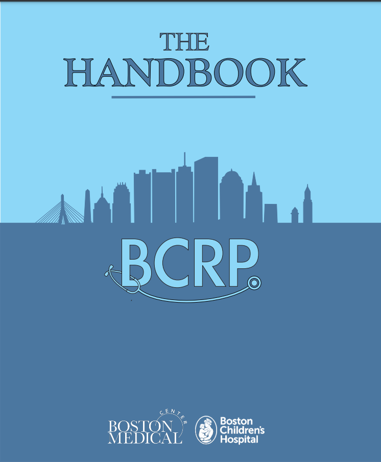

# Foreword

```{r setup, include=FALSE}
knitr::opts_chunk$set(echo = FALSE)

```

```{r cover, fig.align='center'}


```

```{r libraries, include=FALSE}
library(tidyverse)
library(usethis)
library(magrittr)
library(kableExtra)
library(tippy)
library(DT)
library(png)
library(readxl)

options(kableExtra.html.bsTable = T)
```

```{r include=FALSE}
# automatically create a bib database for R packages
knitr::write_bib(c(
  .packages(), 'bookdown', 'knitr', 'rmarkdown'), 'packages.bib')
```

Dear BCRP,

This is the fourth edition of the BCRP Handbook. It is based upon contributions from generations of residents past. It is intended to be an on-the-fly reference for residents that sharpens clinical knowledge, bolsters clinical efficiency, and ultimately improves patient care.

**ALL CLINICAL INFORMATION CONTAINED HEREIN IS SUBJECT TO CHANGE.** **Medication dosing, in particular, depends on indication and clinical situation.** Please double-check using evidence-based resources (i.e. clinical pathways, UpToDate, Lexicomp) before entering orders.

In addition to the resident authors of years past and the many resident and faculty reviewers listed in the Table of Contents, we would like to send an enormous thank you several other key members of our team:

-   Thank you to **Erin Elbel** and **Zach Winthrop**, the editors of the prior handbook iteration, for your invaluable insight and support throughout this process

-   Thank you to **Mara Alexeev**, who served as the primary tech support for the handbook, who immediately grasped the vision for the handbook and brought the e-book version to life

-   Thank you to **Mohsin Ali**, **Patrick Asselin**, **Michael Duyzend**, **Colby Chiang**, and **Joshua Mayourian**, our incredibly talented resident tech advising team

-   Thank you to **Ted** & **Kate**, who supported the production of this handbook and encouraged us to dream big, and to our faculty advisor, **Carolyn Marcus**

-   Thank you to the many resident reviewers who provided fantastic suggestions and feedback

We hope you enjoy using this book and that it lives on as a helpful resource for many generations of residents to come!

Sincerely,

Emily Harris & Delia O'Shea

Co-Editors-in-Chief, BCRP Handbook 4.0

Spring 2021


```{r}

author_list <- read_excel("data/author_list.xlsx", 
    sheet = "chapter_authors_2021")

author_list %>% kable() %>% kable_styling(bootstrap_options = c("striped", "hover", "condensed", "responsive"))
```
